# Bioinformatics Algorithms Molecular biology - a quick (and not so accurate) introduction

Rosario M. Piro

Dipartimento di Elettronica, Informazione e Bioingegneria (DEIB Politecnico di Milano

Bioinformatics

=

Bio(logy)

+

Informatics

- Important: information science ≠ computer sciene!

- Bioinformatics includes notions of computer science, but also chemistry, physics information science/engineering, mathematics and statistics ...

- Information science is a field primarily concerned with the

analysis (encoding and decoding),

classification,

manipulation,

storage,

▶ retrieval,

transmission,

of information! (Adapted from Wikipedia)

Here: biological information stored in living cells!

- Used for "in silico" analyses of biological data (from "in vivo" or "in vitro" sources)

## Possible definitions of bioinformatics

Oxford English Dictionary:

"The science of information and information flow in biological systems, especially of the use of computational methods in genetics and genomics."

Fredj Tekaia (Institut Pasteur, Paris):

"The mathematical, statistical and computing methods that aim to solve biological problems using DNA and amino acid sequences and related information."

## Wikipedia:

"... an interdisciplinary field that develops methods and software tools for understanding biological data, in particular when the data sets are large and complex. As an interdisciplinary field that develops methods and software tools for understanding biological data, in particular computer science, biology, physics, computer science, information engineering, mathematics and statistics to analyze and interpret the biological data."

Bioinformatics is not biologically-inspired computation, e.g., genetic algorithms and neural networks, but it can use such methods to solve biological problems!

"Computational biology": application of computing to biology (broad definition)

## Animal, plant and bacteria cells

Some typical cells

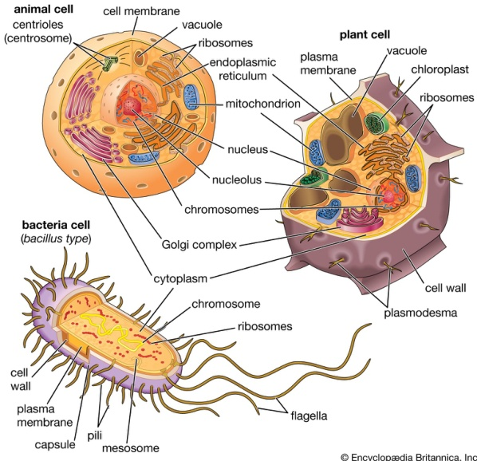

## Animal cells

Animal cell

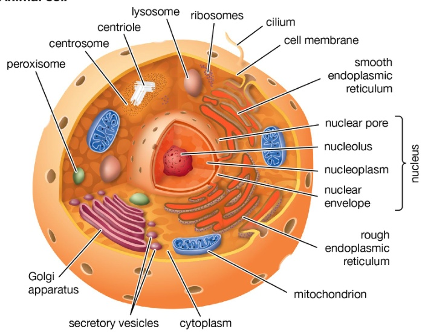

© Encyclopædia Britannica, Inc.

## Molecules

## Small molecules

Sources of energy; "signaling molecules" for signal transmission building blocks of macromolcules

★ Water, fatty acids, sugars, nucleotides, amino acids, ...

## Proteins

Building blocks of the cell (and the organelles); functional molecules for biological processes (e.g., by catalyzing chemical reactions); signal transduction

★ Structural proteins; enzymes; "receptors" on cell membranes, "transcription factors" which regulate gene expression

Often collaborate in "protein complexes" or have otherwise physical "protein-protein interactions"

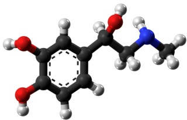

(adrenaline; from: Wikimedia Commons, author: Jynto

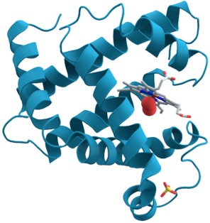

## Molecules

Example for protein complexes

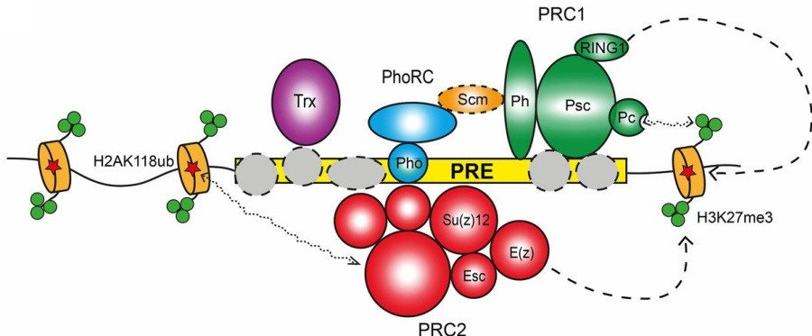

Polycomb complexes PRC1 and PRC2, and the PhoRC complex, interacting with a certain functional element in the genome, called a Polycomb response element (PRE)

## Molecules

DNA (deoxyribonucleic acid)

Storage and reproduction of information

★ Contains genes, regulatory elements (e.g., "transcription factor binding elements") and "junk DNA" (regions without known function)

★ Double-stranded ("double helix")

## RNA (ribonucleic acid)

Key role in transformation of genetic information to function

★ E.g., helps in constructing proteins (amino acid polymers) from genomic information stored in DNA

★ Single-stranded

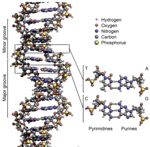

(from: Wikipedia, authors: Zephyris, JeffyP

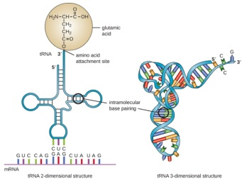

(tRNA; from: https://courses.lumenlearning.com

# THE CHEMICAL STRUCTURE OF DNA

## THE SUGAR PHOSPHATE 'BACKBONE'

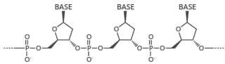

DNA is a polymer made up of unlinked nucleotides. The nucleotides are made of three different sugar groups, a phosphate and a phosphate group, a phosphate group, a phosphate, and a phosphate.

## ADENINE

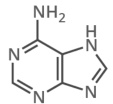

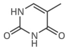

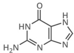

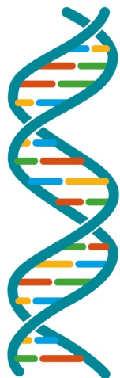

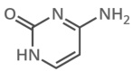

## WHAT HOLDS DNA STRANDS TOGETHER?

DNA strands are held together by hydrogen bonds between bases on adjacent adenine and adenine. Adrenergic residues (A) always have a phosphate group.

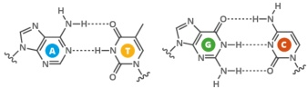

## FROM DNA TO PROTEINS

The bases on a single strand of DNA act as a code. The letters form three letter codons, which code for codons, which code for amino acids, the building blocks of proteins.

An enzyme, polymerase, polymerase, transcribe DNA into mRNA (messenger ribonucleotide) acid. It splits apart the two strands that form the double helix, and reads a similar sequence (T) between a pair of nucleotides in a similar sequence. The second strand is used in the same way as in the first step. The second step.

## DNA SEQUENCE

T T C T G A T C T G A A C T G A A C C G T A C C G T A T A C G T A A T A

mRNA SEQUENCE

In multicellular organisms, the mRNA is a genetic code out of the cell nucleus, the cytoplasm. Here, protein synthesis takes place. Translation is the process of translating the mRNA into proteins. The mRNA is converted into proteins.

## Nucleotides

DNA and RNA is made of nucleotides

Each nucleotide (Fig. a): one or more phosphate groups, a pentose sugar (c), and a nitrogen-containing base (b)

- DNA bases: adenine (A), cytosine (C), guanine (G), thymine (T)

- RNA: like DNA, but ribose instead of deoxyribose and uracil (U) replaces T!

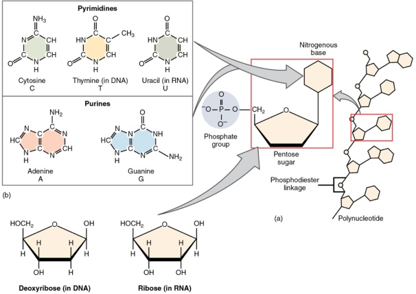

## DNA molecules

- DNA is a polymer (composed of monomers, the nucleotides)

- The phosphate group and the sugar constitute the "backbone" of the molecule (bases are attached to it)

- Thus, the genetic information contained in the DNA is codified by a four-letter alphabet (A,C,G,T)!

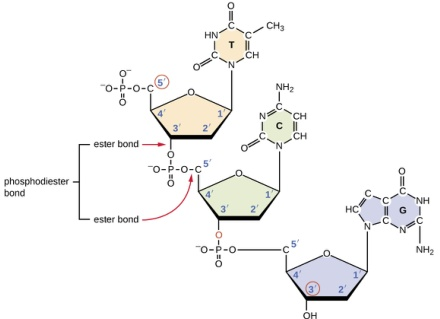

(from: Parker et al., 2021

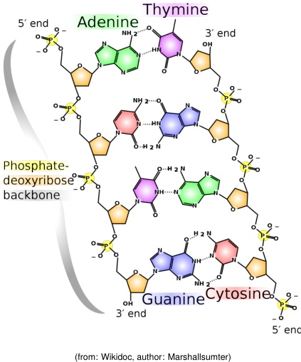

## DNA molecules

- Backbone formed by covalent bonds: The phosphate group attached to the $5^{\prime}$

- Single strand: read from $5^{\prime} \mathrm{~}$ to $3^{\prime}$

- Double helix: the two strands have the opposite orientation ( $\downarrow$ !

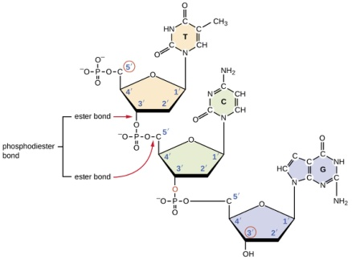

(from: Parker et al., 2021

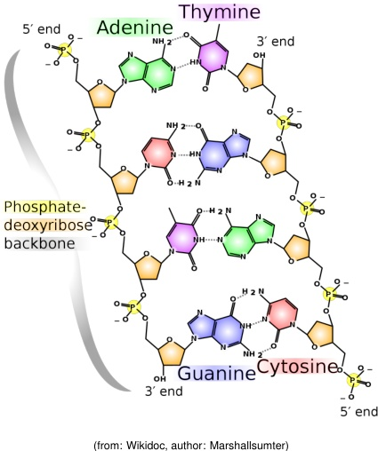

- Double helix: A pairs with T and C pairs with G ("base pairs", bp)!

## Chromosomes

## DNA is organized into chromosomes (with exceptions: prokaryotes usually have a single circular genome)

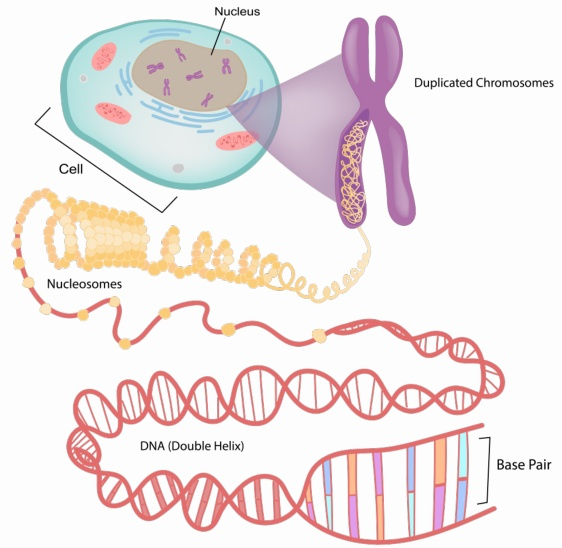

## Genome size

Diploid numbers (# of chromosomes) and genome sizes differ widely between species

<table><thead><tr><th>Species</th><th>Species</th><th>Paracaris equorum</th><th>Oryza sativa</th><th>Homo saplen</th><th>Homo saplen</th><th>Homo saplen</th><th>Pan troglodytes</th></tr></thead><tbody><tr><td>Chromosome #</td><td></tr></tbody></table>

Human: 23 chromosome pairs (1...2222222, XX or XY) → diploid number 46

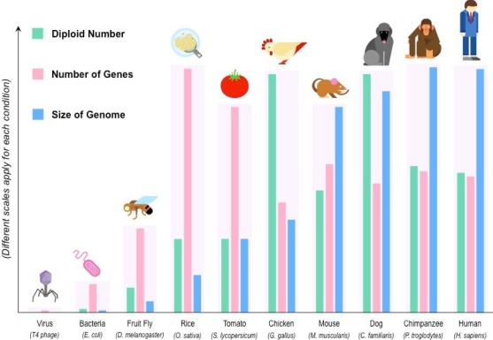

Human: ~3.1 billion bp

## Reverse complement

## Positive 5' AGTCAGTTACTAG3'

Negative $3^{\prime} \mathrm {3}^{\prime}$

Complementary to positive strand

$^{5^{\prime} \mathrm { C T A G T T T A T T A C T G A C T G A C T ^ {3}$ Reverse complementary to positive strand

Complement: replace A by T, C by G, G by C, and T by A

2 Reverse complement: complement and reversed order!

If on one DNA strand you have the sequence "AGTCAGTAACTAGTACTACTAG", the opposite strand has the sequence "CTAGTTACTGACTAG" (reverse complement!)

## DNA replication

DNA replication (for cell division, etc.) is done by reconstructing the opposite strand for each of the two separated original DNA strands!

- Biochemical extension of DNA molecules by the DNA polymerase always from $5^{\prime}$ to $3^{\prime}$

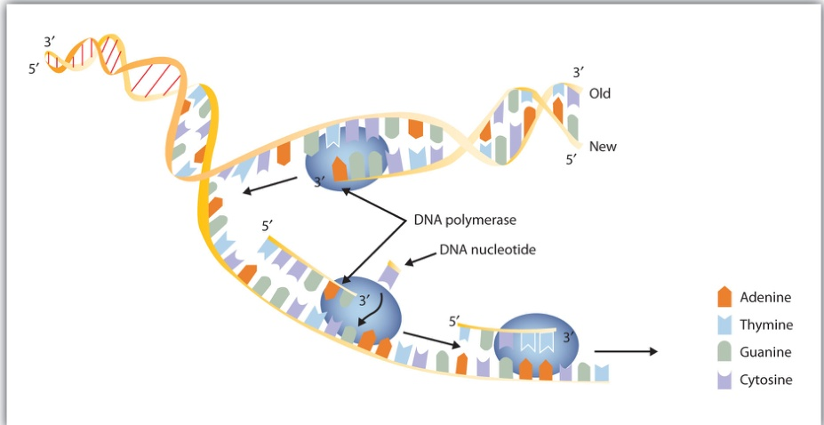

## RNA molecules

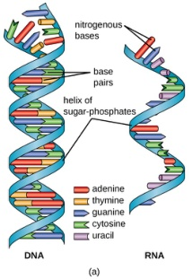

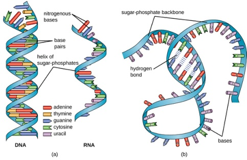

(from: Parker et al., 201, 201)

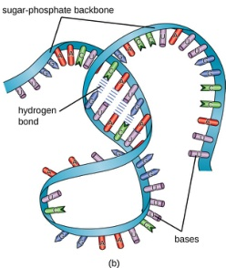

- RNA nucleotides: like DNA, but ribose instead of deoxyribose and uracil (U) replaces T!

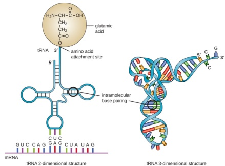

- RNA molecules are single-stranded!

- Base pairing is still possible $\rightarrow$ secondary structure!

(tRNA; from: https://courses.lumenlearning.com

- Transfer RNA (tRNA)

- Ribosomal RNA (rRNA)

- Messenger RNA (mRNA)

- MircoRNA (miRNA)

- Long non-coding RNA (IncRNA)

- Small nuclear RNA (snRNA)

- Small nucleolar RNA (snoRNA)

## Encoding and decoding life

- Every living organism is encoded by one or more DNA molecules, that are continuously read and interpreted by its cells

- Questions:

Where is the DNA located in the cell?

★ Prokaryotes (bacteria, cyanobacteria): "free-floating" in the cytoplasm

★ Eukaryotes (animals, plants, fungi): in the cell nucleus, "packaged" into chromosomes

How much and what kind of information contains a living cell?

How is that information encoded, stored, transmitted and decoded by DNA?

INSIDE THE CELL

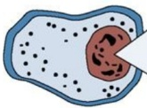

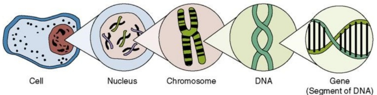

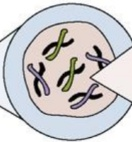

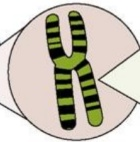

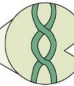

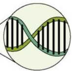

## The "Central Dogma" of molecular biology

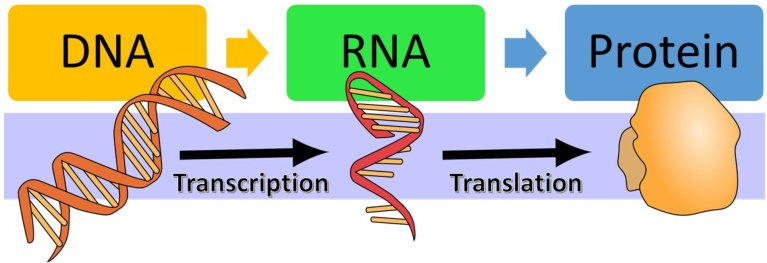

(from: Bierema, 2021

- DNA stores the information that determines a protein's structure

- DNA is "transcribed" (i.e., copied) into RNA

- RNA mediates the transformation of genetic information into functional molecules "Messenger RNA" (mRNA) is "translated" into a protein

- Proteins exert a biological function (depends on structure & chemical properties)

- Note: this holds only for protein-coding genes

Non-coding RNAs are functional molecules which need not be translated

- Note: this is a very simplified view

E. g., one protein-coding gene can "code for" multiple proteins

## Proteins

- Proteins are polypeptides (chains of individual amino acids)

- Basic amino acid structure:

amino group $\left(-\mathrm{N H_{3}^{+}\mathrm{H}_{3}^{+}$ $\mathrm {+}$ $R$ group (carbon with side chain R) $carboxyl group$ (-\mathrm{CO}_{2}^{-}$

- Orientation of an amino acid chain from "N-terminus" to "C-terminus"

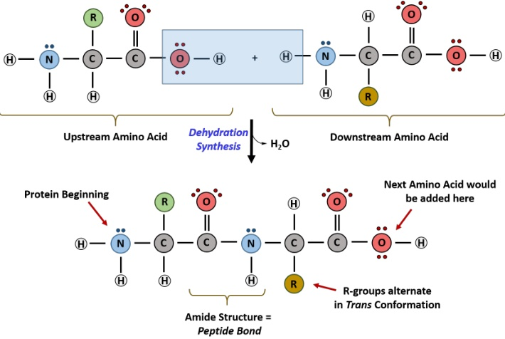

## A GUIDE TO THE TWENTY COMMON AMINO ACIDS

AMINO ACIDS ARE THE BUILDING BLOCKS OF PROTEINS IN LIVING ORGANISM ORGANS. THERE ARE OVER 500 AMINO ACIDS IN NATURES AND HOW THE HUMAN ACIDS CAN BE SYNTHETIC ANTIBODYTES IN THE MEMBRIDES IN THE MEMBRIDES IN THE MEMBRIDES

Chart Key:

ALIPHATIC

AROMATIC

ACIDIC

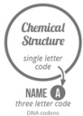

BASIC

GCT, GCC, GCA, GCG

HYDROXYLIC

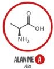

SULFUR-CONTAINING

GGT, GGC, GGA, GGG

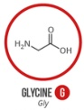

AMIDIC

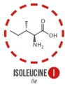

ATT, ATC, ATA

CTT, CTC, CTA, CTG, TTA, CTG, TTA, TTG

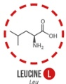

CCT, CCC, CCA, CCG

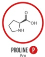

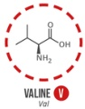

GTT, GTC,GTA,GTGTC

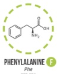

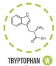

Trp

TGG

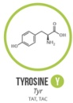

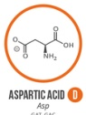

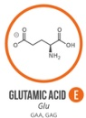

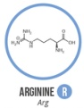

Arg

CGT, CGC, CGA, CGG, AGA, AGG

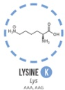

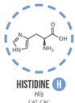

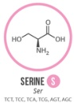

ACT, ACC, ACA, ACG

TGT, TGC

Met ATG

AAT, AAC

**Note:** This chart only shows the amino acids that the human genetic code directly codes for the amino acid codes for selenium and glutamine and glutamide. In some cases, distinguishing between aspartate and glutamic acid codes are used in special cases.

Three-letter code: e.g., "Gly" for glycine; example sequence: Gly-Ser-Tyr...

One-letter code: e.g., "G" for glycine; example sequence: GSY...

## Protein structure

Quaternary structure complex of protein molecules

## Protein functions

Proteins are involved in most of the tasks essential for life:

- Structural proteins

basic building blocks of cells

- Receptor and channel proteins

transmembrane proteins which can relay signals into the cell or shuttle substances between compartments of the cell and the extracellular environment

- Signaling proteins

relay signals within the cell

- Enzymes

catalyze chemical reactions necessary for the energy metabolism

- Transcription factors

bind to DNA to control gene transcription (e.g., gene expression levels)

## Transcription

- One strand of DNA is copied into a (reverse) complementary RNA molecule

In prokaryotes (without nucleus): messenger RNA (mRNA)

- In eukaryotes (with nucleus): pre-mRNA (produced in the nucleus)

(from: Cotner and Wassenberg, 2020)

## Transcription

- DNA is copied into RNA by an RNA polymerase (usually RNA polymerase II)

- Transcription start is aided by transcription factors (TFs) bound on the "promoter" of the gene (around the "transcription start site"; TSS)

Transcription start can be aided by TFs bound to a distant "enhancer"

(from: Boundless, 2020)

## RNA splicing

- In eukaryotic cells, transcribed RNA is often spliced before it is exported from the nucleus to the cytoplasm!

> "Introns" (grey) are "spliced out" (biochemically removed)

> "Exons" (green and red) remain to form the mature mRNA

★ A protein-coding RNA begins (5' ) and ends (3') with "untranslated regions" (UTRs)

★ Attention; often claimed, but wrong: exons ≡ coding (translated) regions

A $5^{\prime}$ - cap and a $3^{\prime} \mathrm{~ }$ poly-A tail are often added to the transcript

Pre-mRNA

(from: Wikipedia; users: Nastypatty, Smartse, Manudouz

## Alternative splicing

- Alternative splicing of transcripts allows to produce different gene products (e.g., proteins) from the same gene!

A Exon skipping

B Alternative 5' SS usage

c Alternative 3' SS usage

D Intron retention

E Mutually exclusive exons

(from: Sunné-Pou et al., 201, 2020; but corrected)

## Translation (protein synthesis)

- mRNA transcripts are "translated" into proteins by the ribosome

## Translation (protein synthesis)

- The genetic code: "codons" (nucleotide triplets) encode amino acids

- Translation starts at an AUG and ends at the first UAA, UAG or UGA!

second letter

<table border="1"><tr><td></td><strong>U</td><strong>U</strong></td><td>U</td><td>C</td><td>A</td><td>A</td><td>G</td><td>A</td><td>G</td><td>G</td></tr><td>UUUUU</td><td>Phe</td><td>UC</td><td>UC</td><td>UC</td></tr><tr><td></td><td></td><td></td><td></td><td></td><td>Tyr</td><td>AG stop</td></tr><tr><td></td><td></td><td></td><td></td><td></td><td></td><td></td><td></td></tr><tr><td>CU</td><td>GUC</td><td>GUC</td><td>GAC</td><td>His</td></tr><td></td><td></td><td></td><td></td><td></td><td></td></tr><td></td><td></td><td></td><td></td><td></td></tr><tr><td></td><td></td><td></td><td></td><td></td><td></td></tr><td></td><td></td><td></td><td></td><td></td><td></td><td></td></tr><td></td><td></td><td></td><td></td><td></td></tr><td></td><td></td><td></td><td></td></tr><td></td><td></td><td></td><td></td></tr><td></td><td></td><td></td><td></td><td></td><td></td></tr><td></td><td></td><td></td><td></td></tr><td></td><td></td><td></td><td></td></tr><td></td><td></td><td></td><td></td></tr><td></td><td></td><td></td></tr><td></td><td></td><td></td><td></td></tr><td></td><td></td><td></td><td></td></tr><td></td><td></td><td></td></tr><td></td><td></td><td></td></tr><td></td><td></td><td></td><td></td></tr><td></td><td></td><td></td></tr><td></td><td></td><td></td><td></td></tr><td></td><td></td><td></td><td></td></tr><td></td><td></td><td></td><td></td></tr><td></td><td></td><td></td><td></td><td></td><td></td><td></td></tr><td></td><td></td><td></td><td></td><td></td><td></td><td></td><td></td></tr><td></td><td></td><td></td><td></td></tr><td></td><td></td><td></td><td></td><td></td><td></td><td></td></tr><td></td><td></td><td></td><td></td><td></td><td></td><td></td><td></td></tr><td></td><td></td

first letter

third letter

(from: https://courses.lumenlearn.com/courses.lumenlearning.com/microbiology/)

## Translation (protein synthesis)

- Each codon is recognized by a tRNA which carries the correct amino acid

## Prokaryotes vs. eukaryotes

- In eukaryotes: transcription and translation in different compartments allows for alternative splicing!

prokaryote

(a) 

(b) 

(tRNA; from: https://courses.lumenlearning.com/microbiology/)

## And viruses?

- Viruses: "organisms at the edge of life"; exploit the host cell for replication!

- The genetic material may be DNA or RNA, single-stranded or double-stranded, linear or circular; some viruses integrate genetic material into the host genome

- The virus envelope/capsule may contain additional viral proteins (e.g., reverse transcriptase, integrase)

- Example: bacteriophage lambda (infects bacteria)

Attachment

The phage attaches to the surface of the host.

Entry The viral DNA enters the host cell.

## Replication

Phage DNA replicates and phage proteins are made.

Assembly New phage particles are assembled.

## Release

The cell lyses, releasing the newly made phages.

(from: https://courses.lumenearning.com/ivytech-bio1-1/ivytech-bio1-1/and http://evilutionarybiologist.blogspot.com/)

## Cellular signaling

A hypothetical, simple signaling pathway:

http://www.informatik.uni-rostock.de/~lin/GC/Slides/Wolkenhauer.pdf

## Cellular signaling

## A little more realistic (but still simplified!):

Major signal transduction pathways in mammals

(from: Wikipedia, user: Cybertory)

## Cellular signaling

## A little more realistic (but still simplified!):

Signaling pathways that regulate cancer metabolism

## Metabolic processes

- Catabolic: break down components, e.g., glucose to pyruvate

- Anabolic: synthesize new components, e.g., carbohydrates, nucleic acids, ...

- Example: tricarboxylic acid (TCA) cycle

(from: https://en.wikipedia.org/wiki/Citric_acid_cycle)

## Metabolic processes

## The cellular metabolism (simplified):

(from: https://en.wikipedia.org/wiki/Metabolic_pathway)

## Metabolic processes

# The cellular metabolism:

(Interactive version: http://biochemical-pathways.com/#/map/1

## How does the cellular system work?

The cellular system is extremely complex ...

If we want to know, how the system works,we need to know: everything

- How does gene transcription work?

- When are genes transcribed and at what level? (regulatory mechanisms) When are transcripts degraded?

- How does protein synthesis work? What quantities of proteins are produced?

- How do specific molecules work (proteins, non-coding RNAs, ...)?

- How do specific molecules interact to exert a specific function?

- How are cellular processes intertwined and support or inhibit each other?

- How does the system dynamically change over time?

- How does the system change under certain conditions?

- How is it affected by disease (viruses, cancer, hereditary disorders, ...)?

## "-omes" and "-omics"

The Central Dogma revisited:

replication

## "...ome": the complete set of ...

genome: genes / genetic material

transcriptome: transcripts (state of the system in terms of gene expression)

▶ proteome: proteins

interactome: molecular interactions

metabolome: chemicals involved in metabolic reactions

...

## "...omics": the study of ...

(see above)

... by means of high-throughput methods!

## Fred Sanger: $1 \frac{1}{4}$ Nobel prizes

1958 Nobel prize in chemistry "for work on structure of proteins especially that of insulin"

- 1980: Shared half of the Nobel prize in chemistry with Walter Gilbert "for determination of base sequences in nucleic acids"

- The major method of sequencing nucleic acids until recently

- Still used for confirming mutations from high-throuput sequencing data

1918-201918-2013

British biochemist

## Sanger sequencing

- Sequencing by synthesis (of the complementary strand)

Basic idea: start from single-stranded DNA, reconstruct the reverse strand (similar to DNA replication) and check which bases you have to add to reconstruct it!

- Classical chain-termination method

- Ingredients:

Ingredients:

1 single-stranded DNA template

2 DNA primer

3 DNA polymerase

normal deoxynucleotide triphosphates (dNTPs)

5 "chain-terminating", dideoxy NTPs (ddNTPs)

Add dNTPs and Polymerase

b. 

## DNA synthesis: chain extension

- Recall that DNA is extended from 5' to 3'

## Key idea of Sanger sequencing: dideoxy nucleotides

Example: deoxycytoseine (dCTP)

dideoxycytosine (ddCTP)

- A dideoxy nucleotide (ddNTP) stops DNA synthesis at specific nucleotides.

- For example, if the ddCTP to the right is incorporated into a growing strand of DNA, the lack of a free OH group at the 3' carbon would prevent the next nucleotide from being added and thereby terminate the chain extension!

## Sanger sequencing: radioactive

- Initially done with radioactively marked terminating nucleotides, e.g., ddATP $\mathrm{-}[\alpha^{-3 33 P]$

- Labeled primers, four reactions, each with a different ddNTP

- Electrophoresis: use an electric field to attract molecules across a gel; larger molecules (here: longer sequences!) will be slower!

gel with four lanes having electrophoresed DNA samples

## Sanger sequencing: fluorescent

- Dye-terminator sequencing

- Label each of the 4 ddNTPs with different fluorescent dye (different wavelength)

- Conventional colors: A, T, C, G

- Allows one reaction, rather than four reactions as in the labeled primer method.

- Plot intensity of each wavelength against electrophoresis time ("chromatogram")

## Sanger sequencing: fluorescent

- Sanger sequencing powered the characterization of the human genome

- But: still extremely limited in throughput

- Very accurate determination of a sequence

- At height of Sanger era, 400 kb (kilobases) per machine per day

- about 45 thousand runs needed for one human genome at 6-fold coverage if everything works perfectly...

International Human Genome Sequencing

Consortium (Lander et al., 201, 2001) Initial sequencing and analysis of the human genome.

Nature 409:860-921

## Next-generation sequencing (NGS)

- NGS: refers to one of a number of technologies that enable a massive parallelization of DNA sequencing

## Next-generation sequencing (NGS)

Due to fast technological advances, the cost of whole-genome sequencing (WGS) has dropped significantly!

Implication: we're producing huge amounts of sequencing data!

## Next-generation sequencing (NGS)

- NCBI GenBank: Oct. 2005 about 50105 about 50 gibabases) sequence data

- Illumina GA at 1000000000 Genomes project in year 208 - 2,50000000000

- "Each week in Sept-Oct of 208 the 1008, the 100 Genomes Project created the equivalent of all the data in GenBank"

- 100000000000000 Genomes project in the UK (10000000000

- Currently in the EU: 1+ Million Genomes (1+MG) initiative and Beyond 1 Million Genomes (B1MG) project

## Illumina sequencing

- There have been several competing NGS technologies

- At present, the technology of Illumina seems to be superior for most applications

At least for "next-generation" sequencing; for "third-generation" sequencing, or long-read sequencing, other technologoies are used

- Four Basic Steps:

<table border="1"><tr><td>1. DNA & library preparation</td> Make random DNA fragments, append adapters</td></tr><tr><td>Chip/flowcell prep</td></tr><tr><td>Attach fragments to surface and amplify</td></tr><tr><td>Chip/flowcell prep</td></tr><td>Sequence</td><td></td></tr><tr><td>Sequence</td><td></td></tr><td></td><td></td></tr><td>Sequence</td><td></td></tr><td></td><td></td></tr><td></td><td></td></tr><td></td></tr><td></td><td></td></tr><tr><td></td><td></td></tr><td></td><td></td></tr><td></td></tr><tr><td></td></

- Understanding 1.-3. is essential for 4. [but not relevant for our exam ...]

To be able to process error-prone biological data, it is important to know how such data is experimentally produced!

(But for the algorithms we will see in this course, this is less important; we'll mostly assume the data is error-free ...)

Purpose of library prep: create collection ("library") of random DNA fragments ready to be sequenced!

- Four major substeps for library prep (about 6 hours of lab work)

Fragment the genomic DNA (after having extracted it from cells)

2 Repair ends and add an A overhang

3 Ligate adapters to DNA fragments

Select ligated DNA (not all fragments will have adapters after this procedure; we need to remove those who don't)

## Library prep (1): fragmentation

- Most Illumina protocols require that DNA is fragmented to less than 800 nt

- Ideally, fragments should have uniform size (in reality: fragment size follows a hopefully narrow distribution)

- Fragmentation, for example, by

Sonication: uses ultrasound waves in solution to shear DNA

Nebulization: forcing solution of genomic DNA to pass as a fine mist through a small hole in the nebulizer; repeatedly done

(from: Bioruptor, http://www.diagenode/left/right) DNA Fragmentation Kit, http://www.biooscientific.com/)

## Library prep (2): end repair

Purpose of end repair: downstream enzymatic steps won't work unless the DNA fragments are nice!

- After fragmentation, DNA fragments can have $5^{\prime}$ or $3^{\prime}$ - or $3^{\prime}$

Reconstruct reverse strand at $5^{\prime}$ or $5^{\prime}$ or $ $ overhangs $DNA polymerase)$

- Cleave away $3^{\prime} \mathrm{~} 3^{\prime}$ or $overhangs$ or $3^{\prime}$ or $ $ overhangs $ $ $3^{\prime}$ or $\mathrm {overhangs$ (exonuclease) $

- Need also to be sure that the phosphate (P) group isn't missing at the 5' ends

- Moreover: A-tails (single adenine) are added for downstream steps

- Purpose: keep DNA fragments from ligating with each other & enable ligation to adaptors (which cleverly are designed to have a 'T'- base overhang)

## Library prep (3): adapter ligation

Purpose of adapter ligation: adaptors get attached (ligated) to the end-repaired DNA fragments. This enables three things:

The adaptors will later bind to complementary oligonucleotides on the flowcell

Allow PCR enrichment (amplification) of adapter-ligated DNA fragments only; not shown here ... (PCR = polymerase chain reaction)

Allow for indexing or "barcoding" of samples (barcode shown as NNNNNN below)

TruSeq Universal Adapter (P5)

5 AATGATACGGCGACCACCGAGATCTTCCCTTTCGATCTTCCCTTCCCTTCCCTTCCGATCAGATCTTCCGATCTTCCGATCTTCCGATCTTCCGATC

## Flow-cell prep

## Purpose of flowcell prep:

- Bind ligated DNA fragments to flow cell

- Perform in site amplification of individual molecules (creating clusters or colonies) to boost signal strength later during sequencing

## Illumina flow cell: hollow glass slide with eight channels ("lanes")

B

## Flow-cell prep (1): library deposition

- The double-stranded adapter-ligated DNA fragments are denatured with NaOH

- The single stranded DNA molecules are then transferred to the flowcell

- Here, they bind to oligonucleotides ("oligos") attached to the flow cell surface; these oligos are designed to sequences in the adapters

## Flow-cell prep (1): library deposition

- Extension mix (buffer, dNTP's, Taq polymerase) is pumped into a channel

- The oligos on the flowcell are elongated using the ligated DNA fragments as a templates (reconstruction of the reverse strand of the DNA fragments to be sequenced)

## Flow-cell prep (1): library deposition

- We now get a double-stranded molecule

## Flow-cell prep (1): library deposition

- Formamide is added to denature these products, and the original fragment (which is not covalently attached to the flowcell) is washed away

- The reconstructed reverse complement remains covalently fixed to the flowcell!

## Flow-cell prep (2): bridge amplification

Purpose: amplify single molecules attached to flowcell as described above by factor of 10000000001000 to generate more signal in the following sequencing steps

Single-stranded DNA molecule (1) bends and hybridizes to a second oligo on the flowcell surface (2)

- Extension (reconstruction of reverse complementary strand) is performed all the way back to the other oligo: a "bridge" of double-stranded DNA (3)

- Each strand of the bridge is covalently attached to a different oligo! (3)

- Denaturation seperates the two strands, so that they again can bend and hybridize to another oligo (repeat from step 1, now with twice as many fragments!)

- This is repeated several times to create a cluster of copies of the original DNA fragment!

- Finally: both strands are present; keep only fragments from one of the two strands, those of the reverse strand are cleaved away

## Sequencing by synthesis

- Sequencing by synthesis (SBS) is relatively simple to understand after all of the prep steps

- Basic idea: reconstruct the reverse strand, but in each "cycle" add only one nucleotide and identify it (A, C, G or T?)

Incorporate one base at a time using four differently marked ddNTPs (fluorescent dyes of different colors)

★ Difference to Sanger sequence: the ddNTPs have reversible terminators (reversible block of the 3' OH group)

2 Contemporaneously identify which base was incorporated in each DNA fragment cluster by measuring the wavelength of the incorporated ddNTP

Unblock the ddNTP (remove the terminator such that the sequence can be extended in the next cycle) and repeat!

## Sequencing by synthesis

## Image of first chemistry cycle

After laser excitation, capture the image of emitted fluorescence from each cluster on the flow cell. Record the identity of the first base for each cluster.

## Before initiating the next chemistry cycle

The blocked 3' terminus and the fluorophore from each incorporated base are removed.

## Sequence read over multiple chemistry cycles

Repeat cycles of sequencing to determine the sequence of bases in a given fragment a single base at a time.

Mardis E (2008) Annu Rev Genomics Hum Genet 9:387-4028

## Sequencing by synthesis

- An imaging step follows each base incorporation step (we speak of one "cycle")

- After each imaging step, the $3^{\prime}$ the $3^{\prime}$ block group is chemically removed and the cycle is repeated.

- After having completed all cycles:

A "base-calling" algorithm assigns sequences and associated quality values ("base qualities") to each "read"

> Read = the sequence of bases called from the colored images for one specific spot of the flow cell, corresponding to one specific DNA fragment!

A quality checking pipeline removes poor-quality sequences

## Nanopore sequencing

- A nanopore: A hole of $\sim 1 \mathrm{~}$ nm in diameter

- Apply voltage across pore and observe current due to conduction of ions through the nanopore

- The different bases of DNA block the hole to different extents and change the current in a characteristic way

## Nanopore sequencing

- By following changes of current over time, we can determine the sequence

- True single-molecule sequencing!

- Advantages: 1) Long reads (>10,00000000000000000 nt); 2) cheap (!)

- Major disadvantage: higher error rates due to signal-to-noise issues inherent in the technology

## Do we sequence only the genome?

Beyond DNA-seq:

(from: Shyr and Liu, 2013)

Data: only sequences?

## Annual Sequence Data Generation

Original Data Generation from Annual Sequencing Data Expansion from Interpretation & Analysis

105 PetaBytes

2014

2014

3080 PetaBytes

2015

2016

6. 2 ExaBytes

2018

2019

## Data analysis?

"Biology easily has 500 years of exciting problems to work on." Donald Knuth

## References I

Alberts B, et al. (202) Molecular Biology of the Cell (4th edition).

Bartee L, et al. (2021) Principles of Biology Freely available at https://openoregon.pressbooks.pub/mhccmajobs/bio/

Bennett D. (2016) General, Organic and Biochemistry. Freely available at: https://chem.libretexts.org/Courses/ Sacramento_City_College/SCC%3A_Chem_309-General_Organic_and_Biochemistry_(Bennett)/Text

Bierema A. (2021 An Interactive Introduction to Organismal and Molecular Biology (2nd edition) Freely available at https://openbooks.lib.msu.edu/isb20201

Boundless (2021

Cancer and Transcriptional Control.

Freely available at: https://bio.libretexts.org/go/page/13379

## References II

Cotner S., Wassenberg D. (2020) The Evolution and Biology of Sex. Freely available at https://open.lib.umn.edu/evolutionbiology/

Deberardinis R.J., Chandel N.S. (2016) Fundamentals of cancer metabolism Science Advances 2(5):e16020000000000

Jakubowski H. (2021)

The Structure of Proteins - An Overview.

College of St. John's University https://bio.libretexts.org/go/page/14930

Lander S., et al. (2001 Initial sequencing and analysis of the human genome. Nature 4098609:860-921

Mardis E.R. (208) Next-Generation DNA Sequencing Methods Ann Rev Genomics Human Genet 9:387-40201

## References III

Parker N., et al. (2021

Book: Microbiology.

Freely available at

https://openstax.org/details/books/microbiology

Schwartz Y.B., Cavalli G. (2017) Three-Dimensional Genome Organization and Function in Drosophila. Genetics 205(1):5-24.

Shyr D., Liu W. (2013) Next generation sequencing in cancer research and clinical application Biological Procedures Online 15(1):4.

Stratton M.R., Campbell P.J., Futreal P.W. (209) The cancer genome. Nature 4587198:719-72458.

Suñé-Pou M., et al. (2020) Innovative Therapeutic and Delivery Approaches Using Nanotechnology to Correct Splicing Defects Underlying Disease Frontiers in Genetics 11:7311:7311:731:731:311:31

## Some introductory texts and text books I

Bruce Alberts et al. (to be released in July 20222

Molecular Biology for the Cell (7th edition)

Publisher: W.W. Norton & Company (previously: Garland Science)

Bruce Alberts et al. (to be released in May 2022)

Essential Cell Biology (5th edition)

Publisher: W.W. Norton & Company (previously: Garland Science)

Lawrence Hunter

Molecular Biology for Computer Scientists

https://tandy.cs.illinois.edu/Hunter_MolecularBiology.pdf

## Some videos I

MITx Bio - The Structure of DNA https://www.youtube.com/watch?v=o_-6JXLYS-k

yourgenome - From DNA to protein https://www.youtube.com/watch?v=gG7uCskUOrA

yourgenome - DNA replication https://www.youtube.com/watch?v=TNKWgcFPHqw