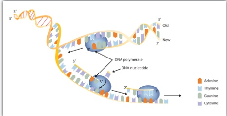
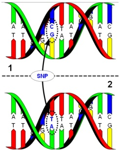
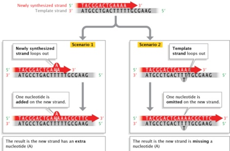
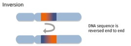
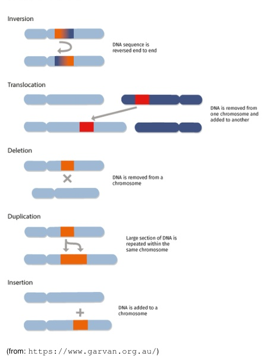
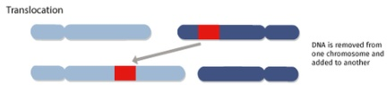
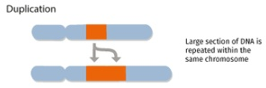
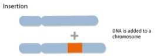

POLITECNICO

MILIANO 1863

# Bioinformatics Algorithms Sequences and sequence alignment (part 1)

Rosario M. Piro (based on slides by Giulio Pavesi

Dipartimento di Elettronica, Informazione e Bioingegneria (DEIB Politecnico di Milano

## Sequences

- Information is encoded in living cells (mostly) in the form of "sequences":

DNA sequences (nucleotide sequences; nucleic acids; double-stranded; ACGT)

RNA sequences (nucleotide sequences; nucleic acids; single-stranded; ACGU)

protein sequences (amino acid sequences; polypeptides; 20 "letters")

- This is one of the main reasons of the success of applying information science to the study of biological molecules

- Biological function largely depends on the 3D structure of large molecules (e.g., protein-protein interactions, DNA binding of transcription factors, etc.), but many characteristics or functions can also be inferred from the 1D structure (the sequences)

Gene activity (gene "expression") can be measured by sequencing RNA molecules

Alternative splicing can be identified by sequencing RNA molecules

3D structure can (often) be predicted from the sequence (proteins, RNA molecules)

The genome sequence can be searched for sequence patterns to identify new genes

...

## Alphabets and strings

- Let $\Sigma$ be a finite set of symbols (=characters), called the alphabet. No assumption is made about the nature of the symbols.

E. g., for DNA sequences, we usually consider $\Sigma = \{A,C,G,T}$ (and for RNA instead of T), but there may actually be additional symbols (e.g. $\mathrm {A},$ or $\mathrm {T}$ ... $

- A string (or word) over $\Sigma$ is any finite sequence of symbols from $\Sigma$ is any finite sequence of symbols from $\Sigma$. For example, if $\Sigma = \{0, 1, 2, 1, 3, 4, 5, 6, 7, 8, 9, 11, 1, 1, 2, 4, 3, 1, 2, 1, 4, 3, 5, 6, 7, 1, 2, 1, 3, 4, 5, 1, 2, 1, 3, 4, 2, 1, 1, 1, 2, 4, 3, 4, 5, 1, 2, 4, 3, 4, 5, 4, 1, 1, 2, 4, 3, 4, 5, 4, 1, 4, 1, 4, 1, 4, 1, 4, 1, 4, 1, 4, 1, 4, 1, 4, 1, 4, 1, 4, 1, 4, 1, 4, 1, 4, 1, 4, 1, 4, 1, 4, 1, 4, 1, 4, 1, 1, 1, 1

- Sequence: a set of elements ordered so that they can be labeled/enumerated with positive integers; repetitions are allowed

★ $S=s_{1} s_{2} s_{3}\dots s_{n}$

★ In biology: usually 1-based numbering (i.e., starting from 1, not from 0)

- Orientation of DNA/RNA sequences: from 5' to 3' (see first lecture)

★ Orientation of protein sequences: from N-terminus to C-terminus (see first lecture)

★ Double-stranded DNA is usually represented by a single strand (the other strand is its "reverse complement")

- The length of a string S is the number of symbols in S (the length of the sequence) and can be any non-negative integer; it is often denoted as $|S|$

- The empty string is the unique string over $\Sigma$ of length 0, and is denoted $\varepsilon$

## Protein sequences

- Protein sequences are usually represented by strings over a 20-letter alphabet: $ \Sigma = \{A,C,D,E,F,G,H,I,K,L,N,P,Q,R,S,T,V,W,Y}

- These 20 letters are usually sufficient, but:

The "mysterious" 21st amino acid (selenocysteine) is denoted by "U"

> "Unknown" amino acids in a sequence are denoted by X

## Orientation of protein sequences: from N-terminus to C-terminus

A protein sequence always starts with an "M" (methionine; encoded by the start codon "AUG")

The stop codons ("UAA", "UAG" and "UGA") do not encode for any amino acid but terminate translation (sometimes they are represented as translating to "*", but the asterisk is not considered as part of the protein molecule)

## More about strings

- The set of all possible strings over $\Sigma$ of length $n$ is denoted $\Sigma^n$

- For $\Sigma = \{0, 1, 2, 3, 4, 5, 6, 7, 8, 9, 10, 11, 1, 1, 2, 3, 4, 5, 1, 1, 2, 3, 4, 5, 4, 1, 2, 3, 2, 3, 4, 3, 2, 1, 4, 3, 4, 5, 1, 1, 2, 3, 4, 3, 4, 5, 4, 3, 4, 3, 4, 5, 4, 5, 4, 3, 4, 4, 4, 5, 4, 4, 4, 4

- Note that $\Sigma^{0} = \{\varepsilon\}$ for any alphabet $\Sigma$

- The (infinite) set of all strings over $\Sigma$ of any length is the Kleene closure of $\Sigma$ of any length is the Kleene closure of $\Sigma$ and is denoted by $\Sigma^{*}$" $"$ $ $ is the Kleene closure of arbitrary elements of $\Sigma$ "zero or more repetitions" $ $ $"$ $ $ "$ $ "$ $ "$ $ "$ $ "$"$ "$ "

$$
\Sigma^ {*} = \bigcup_ {n \in \mathbb {N} \cup \{0 \}
$$

For $\Sigma = \{0,1\}$ we have $ $\Sigma^{*} = \{\varepsilon , 0,1,0,1,0,0,1,0,0,1,0,0,1,1,0,0,1,0,0,1,0,0,1,1,0,1,0,1,0,1,0,1,0,1,1,0,1,1,0,0,0,0,0,1,0,0,0,1,1,0,0,1,0,0,1,0,0,1,1,0,0,0,0,0,0,0,1,0,0,1,0,0,1,1,0,0,1,1,0,0,0,0,0,1,0,0,0,1,0,0,1,1,1,1,1

The (infinite) set of all non-empty strings over $\Sigma$ is denoted as $\Sigma^{+}$

## Concatenations and substrings

- For any two strings s and t in $\Sigma^{*}$ their concatenation is defined as the sequence of symbols in $s$ t $,$ \mathrm{t $is denoted$ st $

- Let $\Sigma = \{a,b,\dots,z\}$ , $s="honey", t="bee"

- Then,$ st="honeybee"

- For any string $s we have$\varepsilon=s \varepsilon $Wait, the "$\varepsilon $is a subscript$ \varepsilon $- Let$\Sigma = \{a,b,...,z $.

- Let's look at the image again. It's$ \Sigma = \{a,b,...,z $.

- Let$\Sigma = \{a,b,...,z $.

- Let$\Sigma = \{a,b,...,z\}$- Let$\Sigma = \{a,b,...,ts $.

- Let$\Sigma = \{a,b,...,z $.

- Let$\Sigma = \{a,b,...,z $.

- Let$\Sigma = \{a,b,...,z $.

- Let$\Sigma = \{a,b,...,z $.

- Let$\Sigma = \{a,b,...,d

- A string s is a substring (or factor) of t if there exist (possibly empty) strings u and v such that $t = usv

Special cases:

- Prefix:$ u = \varepsilon $, i.e.,$ t = sv$

$\star $Proper prefix:$ u = \varepsilon $but$ v \neq \varepsilon$

$\star $Proper prefix:$ u = \varepsilon$

$\star$ $u = \varepsilon$

$\star $Proper prefix:$ u = \varepsilon$ $u = \varepsilon$ $u = \varepsilon$ $u = \varepsilon$ $u = \varepsilon$ $u = \varepsilon$ $u = \varepsilon$ $u = \varepsilon$ $u = \varepsilon$ $u = \varepsilon$ $u = \varepsilon$ $u = \varepsilon$ $u = \varepsilon$ $u = \varepsilon$ $u = \varepsilon$ $u = \varepsilon$ $u = \varepsilon$ $u = \varepsilon$ $u = \varepsilon$ $u = \varepsilon$ $u = \varepsilon$ $u = \varepsilon$ $u = \varepsilon$ $u = \varepsilon$ $u = \varepsilon$ $u = \varepsilon$ $u = \varepsilon$ $u = \varepsilon$ $u = \varepsilon$ $u = \varepsilon$ $u = \varepsilon$ $u = \varepsilon$ $u = \varepsilon$ $u = \varepsilon$ $u = \varepsilon$ $u = \varepsilon$ $u = \varepsilon$ $u = \varepsilon$ $u = \varepsilon$ $u = \varepsilon$ $u = \varepsilon$ $u = \varepsilon$ $u = \varepsilon$ $u = \varepsilon$ $u = \varepsilon$ $u = \varepsilon$ $u = \varepsilon$ $u = \varepsilon$ $u = \varepsilon$ $u = \varepsilon$ $u = \varepsilon$ $u = \varepsilon$ $u = \varepsilon$ $u = \varepsilon$ $u = \varepsilon$ $u = \varepsilon$ $u = \varepsilon$ $u = \varepsilon$ $u = \varepsilon$ $u = \varepsilon$ $u = \varepsilon$ $u = \varepsilon$ $u = \varepsilon$ $u = \text{substring}$

$

$$
1 + \sum_ {i = 1 ^ {n} i = 1 + \frac {n}{i = 1} = 1 + \frac {n}{2}
$$

## Reverse strings, palindromes and rotations

- The reverse of a string is a string with the same symbols but in reverse order

For example, if $s = "abc" (with a,b,c in$\Sigma $,$ \mathrm {a,b,c\in\mathbb{C}$

- A string that is the reverse of itself (e.g., $ s = "omordotuanuoraoarounautodromo") is called a palindrome

The empty string and all strings of length 1 are palindromes

Note: while some wordplays consider spaces as "moveable" because they aren't spoken, we consider as palindromes only strings where the order of all symbols (including spaces) is precisely reversed, e.g., we would consider stressed desserts to be a palindrome, but not a nut for a jar of tuna)

Difference for DNA/RNA: a palindromic DNA/RNA sequence is identical to its reverse complement (reading both strands 5' $\rightarrow3'$ )!$

Example: "GATC" is palindromic "CAAC" is not!

- A string $s = uv$ (with $u,v \in \Sigma^{*}$ is said to be a rotation of $t = vu$

For example, if $\Sigma = \{0,1\}$ the string 0010101010101010101010101 $is a rotation of 01010$ is a rotation of 01010101011010101010101010101010010000000000

As another example, the string "abc" has three different rotations:

★ itself (with $u="abc", v=\varepsilon$

★ bca (with $ u="bc" "bc", v="a") , and

★ cab (with $u="c$ "c $" c$ v="ab"$

The number of possible rotations of a string is equal to its length!

## Comparison of biological sequences

- An important goal is to define suitable methods for the comparison of sequences:

To assess or quantify "how different" or "how different" or "how similar" two or more sequences are

To identify similar sequences (with similar functions?) in databases

To identify the genomic locations of NGS reads

...

- We need to define suitable measures of distance or similarity, as well as efficient algorithms to compute them

- The measures should reflect as much as possible the different ways in which the sequences can be similar or different, and the processes or factors underlying the similarities and differences, for example:

Evolution of the sequences: what does it mean that we "share 50% of our genes with bananas"? More here:

https://medium.com/emergent-phenomenawe-share-50-of-genes-with-bananas-and 501-parent-is-one-of-ourparents-a-banana-495580649580458640586495801

Errors in data production (e.g., sequencing errors)

- Errors made my the cells, e.g., during DNA replication; more here: https://www.nature.com/scitable/topicpage/dna-replication-and-causes-of-mutation-409/

## Technical errors in biological sequences

- Sequencing error: the sequencing machine identifies a wrong base/nucleotide in a sequence (e.g., "ACGCGGTGAACGTTGAAC" instead of "ACGCGTTTGAAC"

- Error rates change according to the sequencing platform: for Illumina sequencers (most widely used) <0.1%

That is, less than one sequencing error every 10000 base pairs

But: in 100 million reads of 200 bp length each you would still find up to 20 million sequencing errors ...

- Such errors cannot be ignored by algorithms employed in the analysis of the data

## Biological errors in biological sequences



- Living cells replicate their DNA and replication errors are naturally part of this process

- Although cells possess very efficient (and beautiful!) error-correcting mechanisms acting at different points of DNA replication, some errors escape ("mutations") and are inherited by daughter cells

The "error rate" changes according to the organism and the different parts of the genome, roughly ranging from one every 100 million base pairs to (in some cases) one every thousands of base pairs

- What types of error does the cell make in replicating its DNA?

## Biological errors in biological sequences





- Base substitutions ("single nucleotide polymorphisms/variants"; SNPs, SNVs)

Like for sequencing errors, the original base pair is erroneously replaced by another one. Depending on which base is altered/mutated, this may lead to disease

- Difference to sequencing errors: the latter affects only one read; mutations affect many (or all) reads which cover the mutated genomic location

- Insertions/deletions of small DNA fragments ("indels") (even of a single base pair)

## Biological errors in biological sequences












## Structural variants

Involve regions of DNA of about 1 kb and larger in size

Mentioned here for completeness (less important for the algorithms we discuss in this course)

Inversion of a genomic region (orientation inverted)

Translocation of a genomic region

★ "inter-chromosomal": from one chromosome to another

★ "intra-chromosomal": within a chromosome

- (Large-scale) insertions/deletions (as opposed to indels)

Duplications

★ "tandem duplication": adjacent to original sequence

★ or region duplicated elsewhere

## Comparing strings: Hamming distance

- The Hamming distance between two strings of equal length is the number of positions at which the corresponding symbols are different

- The Hamming distance between ...

> "karolin" and "kathrin" is 3

- "karolin" and "kerstin" is 3

101111111101 and 1011010101 and 10100101010101 is 2

2173896 and 23796 is 3

Problem: what about the following two 8 bp sequences:

ACGTACGT

CGTACGTA

Their Hamming distance is 8 (symbols are different in all positions); but are these sequences really so dissimilar???

- With the Hamming distance we can formalize "substitutions" in otherwise identical biological sequences - or simply sequencing errors in which the wrong base pairs were identified

Not a good measure for (dis)similarity in general!

## Comparing strings: the edit distance

- The edit distance is a way of quantifying how dissimilar two strings (also of different length) are to one another by counting the minimum number of operations required to transform one string into the other

- Different definitions of an edit distance use different sets of string operations. In the Levenshtein distance the allowed operations are

removal

insertion

substitution

of a character in the string. Being the most common metric, the term "Levenshtein distance is often used interchangeably with edit distance as we will also do in this course)

- The edit distance was invented before bioinformatics but captures nicely "biological errors" in sequences

substition, insertion or deletion of a nucleotide

- Interesting also for other purposes, e.g., for spelling correction:

A user erroneously typed "graffe"; what did the user most likely mean? "graff" or "giraffe"?

## Comparing strings: the edit distance

Possible mathematical definition (https://en.wikipedia.org/wiki/Levenshtein_distance

$$
\operatorname {l e v} (a, b) = \left\{ \begin{array}{l l} & \mid a | | a | \\ | b | \quad \mathrm {i f} | a | \quad \mathrm {if} | b | = 0, \\ | b | = 0, \\ | b | = 0, \\ \mid a | b | = 0, \\ \mid a | b | = 0, \\ 1, \mathrm {a}, \\ \mathrm {a}, \\ \mathrm {a}, \\ \mathrm {a}, \\ \mathrm {a}, \\ \end{array}
$$

(Note: we will see an alternative definition later!)

## Recursive definition, where

- tail(x) is the string x without its first character

- $x[n]$ is the $n$-th character of string $x$ (here: 0-based)

- In the minimum term, assuming we want to convert $a$ into $b$

First element corresponds to a deletion/removal $^{1}$ of a character from $a$

- Second element corresponds to an insertion $^{1}$ of a character into $a$

Third element correpsonds to a replacement/substitution

- Example: the Levenshtein distance between "kitten" and "sitting" is 3; there is no way to do it with fewer than 3 edits:

1 kitten $\rightarrow$ sitten (substitution of "s"s" for "k")

2 sitten $\rightarrow$ sittin $\rightarrow$ sittin $(substitution of "i"$ for "e" $

sittin $\rightarrow$ sitting (insertion of "g" at the end)

$^{1}$ For instead covering $b$ into $a$, the 1st element is an insertion into $b$ and the 2nd removal from $b!$

## Comparing strings: the edit distance

- From the mathematical definition, it is evident that computing the edit (Levenshtein distance between two strings implies solving a minimization problem: find among all the possible alternatives, the one that requires the minimum number of operations

The number of solutions (sequences of edit operations) is infinite

In practice, we would not need to test all of them because any solution with more than $max(|a|, |b|$ edit operations can be excluded; so we could discard partial solutions as soon as we exceed this number of operations

- Representing operations:

  "INTENTION" vs. "EXECUTION"

- Operations:

  INTENTION

INTENTION

INTENTION

INTENTION

ETENTION

EXECTION

EXECUTION

EXECUTION

(where I is a deletion, E is a deletion, E an insertion, and U an insertion)

- Compact representation:

INTEN-TION

-EXECUTION

- This is a sequence alignment $^{2}$

- Write the two strings one below the other and highlight where edit operations took place

★ gaps ("-") to indicate deletions / insertions (symmetry: insertion in string A = deletion in string B)

Intuitive overview of differences

## Alignment for minimum edit distance

Can we exploit the edit distance to fully "align" two sequences with respect to their similarities and differences, i.e., to determine their best alignment"? $^{3}$

- Denote as $E ( a, b )$ the edit distance between two strings a and b $

- For every string $a$ we have $E ( a, \varepsilon)=|a|$

The edit distance between a and the empty string quals the length of a

Also: $E (\varepsilon , \varepsilon , \varepsilon) = 0$

- Let $a=a_{1}a_{1}a_{2}\dots a_{n}$ is written as $a_{2}\dots b_{m}$. No, it's $a_{1},$ and $a_{2}\dots b_{n}$ is written as $a_{1},$ or $a_{2},$ or $a_{1},$ or $ a_{2

We denote as $a(i)$ the prefix of length $i \leq n$ of string $a: a(i) = a_1a_2\dots a_i$

Likewise, $b(j)$ is the prefix of length $j \leq m$ of string $b: b(j) = b_1b_2\dots b_j$

- To compute the edit distance $E ( a,b )$ between $a$ and $b$ let's first assume that for given i and $j$ we (somehow) already computed

$E \left( a ( i - 1) b ( j - 1 ) =$ edit dist. for the prefixes of $a(i)$ and $b(j)$ both with length-1$

$\triangleright E\left(a(i), b(j-1) = \mathrm{edit} dist. for a(i) and the prefix of b(j) with length - 1$

$\triangleright E\left(a(i-1), b(j)) = edit dist. for b(j) and the prefix of a(i) with length - 1$

- Dynamic programming: solve a complex problem by breaking it down into simpler sub-problems in a recursive manner

## Alignment for minimum edit distance

- To compute the edit distance $E ( a,b )$ between $a$ and $b$ let's first assume that for given i and $j$ we (somehow) already computed

$\triangleright E\left(a(i-1) , b(j-1)$ and $b(j)$ with length - 1$

$\triangleright E(a(i), b(j-1) = \mathrm{edit} dist. for a(i)$ and the prefix of $b(j)$ with length - 1

$\triangleright E\left(a(i-1), b(j)) = \mathrm{edit dist. for } b(j)$ and the prefix of a(i)$ with length - 1

- Then, it can be proven that the following is true:

$$
E \left(a (i), b (j)\right) = \min \left\{ \begin{array}{l} \left\{ \begin{array}{l l} 1 + E \left(a (i), b (j)\right) = \min \left\{ \right. \\ 1 + E \left(a (i), b (j)\right) = \min \left\{a (i), b (j)\right) = \min \left\{ \right\rangle\right\rangle\leftarrow a _ {i} \right\rangle \leftarrow a _ {i} \neq b _ {j} \right\rangle \leftarrow a _ {i} \rightarrow a _ {i} \right\rangle \rightarrow a _ {i} \rightarrow a _ {i} \rightarrow a _ {i} \rightarrow a _ {i} \rightarrow a _ {i} \rightarrow a _ {i} \rightarrow a _ {i} \rightarrow a _ {i} \rightarrow a _ {i} \rightarrow a _ {i} \rightarrow a _ {i} \rightarrow a _ {i} \rightarrow a _ {i} \rightarrow a _ {i} \rightarrow a _ {i} \rightarrow a _ {i} \rightarrow a _ {i} \rightarrow a _ {i} \rightarrow a _ {i} \rightarrow a _ {i} \rightarrow a _ {i} \rightarrow a _ {i} \rightarrow a _ {i} \rightarrow a _ {i} \rightarrow a _ {i} \rightarrow a _ {i} \rightarrow a _ {i} \rightarrow a _ {i} \rightarrow a _ {i} \rightarrow a _ {i} \rightarrow a _ {i} \rightarrow a _ {i} \rightarrow a _ {i} \rightarrow a _ {i} \rightarrow a _ {i} \rightarrow a _ {i} \rightarrow a _ {i} \rightarrow a _ {i} \rightarrow a _ {i} \rightarrow a _ {i} \rightarrow a _ {i} \rightarrow a _ {i} \rightarrow a _ {i} \rightarrow a _ {i} \rightarrow a _ {i} \rightarrow a _ {i} \rightarrow a _ {i} \rightarrow a _ {i} \rightarrow a _ {i} \rightarrow a _ {i} \rightarrow a _ {i} \rightarrow a _ {i} \rightarrow a _ {j} \tag {1} \tag {1}
$$

- Recursive definition; we can initially set $i=n$ and $j=m$, using the full strings!

- Thus, to compute $E ( a,b)$ we can start with

$$
E \left(a (1), \varepsilon\right) = 1 \quad E \left(\varepsilon , b (1)\right) = 1 \quad E \left(\varepsilon , b (1)\right) = 1 \quad E \left(a (1), b (1), \tag {1}\right) = 1
$$

## Alignment for minimum edit distance

<table border="1"><tr><td>b→a↓</td><td>0-</td><td>1S</td><td>2U</td><td></td><td></td><td>3N</td><td>4D</td><td>5A</td><td>6Y</td></tr><tr><td></td><td></td><td></td></tr><tr><td></td><td></td><td></td><td></td></tr><tr><td></td><td></td><td></td><td></td></tr><tr><td></td><td></td><td></td><td></td><td></td></tr><tr><td></td><td></td><td></td><td></td><td></td><td></td><td></td><td></td></tr><tr><td></td><td></td><td></td><td></td></tr><tr><td></td><td></td><td></td><td></td></tr><td></td><td></td></tr><td></td><td></td><td></td></tr><tr><td></td><td></td><td></td><td></td></tr><td></td><td></td></tr><td></td><td></td><td></td></tr><td></td><td></td><td></td></tr><td></td><td></td><td></td><td></td></tr><td></td><td></td></tr><td></td><td></td><td></td></tr><td></td><td></td><td></td></tr><td></td><td></td><td></td><td></td></tr><td></td><td></td><td></td><td></td></tr><td></td><td></td><td></td><td></td></tr><td></td><td></td><td></td><td></td></tr><td></td><td></td><td></td><td></td></tr><td></td><td></td><td></td></tr><td></td><td></td><td></td></tr><td></td><td></td><td></td><td></td></tr><td></td><td></td><td></td></tr><td></td><td></td><td></td><td></td></tr><td></td><td></td><td></td></tr><td></td><td></td><td></td><td></td></tr><td></td><td></td><td></td><td></td></tr><td></td><td></td><td></td></tr><td></td><td></td><td></td><td></td></tr><td></td><td></td><td></td><td></td></tr><td></td><td></td><td></td></tr><td></td><td></td><td></td><td></td><td></td><td></td></tr><td></td><td></td><td></td><td></td></tr><td></td><td></td><td></td><td></td></tr><td></td><td></td><td></td><td></td><td></td><td></td></tr><td></td><td></td><td></td><td></td><td></td><td></td><td></td><td></td><td></td></tr><td></td><td></td><td></td><td></td><td></td><td></td><td></td><td></td><td></td><td></td></tr><td></td><td></td><td></td><td></td><td></td><td></td><td></td><td></td><td></td><td></td><td></td><td></td></tr><td></td><td></td><td></td><td></td><td></td><td></td><td></td><td></td><td></td><td></td><td></td><td></td><td></td><td></td></tr><td></td><td></td

- We can prepare a matrix with $|a|+1$ rows and $|b|+1$ columns

- Each row and column is labeled with one character of a and b, respectively

- Exception: first row and column are labeled with “-” (=gap/empty)

- Using 0-based indexing, the cell $(n,m)$ is the one in the bottom right corner

## Alignment for minimum edit distance

<table border="1"><tr><td>b→a↓</td><td>0-</td><td>1S</td><td>2U</td><td></td><td></td><td>3N</td><td></td><td></td><td>4D</td><td>5A</td><td></td><td></td><td></td><td></td><td></td></tr><tr><td>0</td><td></td><td></td><td></td><td></td><td></td></tr><td></td><td></td><td></td><td></td><td></td></tr><tr><td></td><td></td><td></td><td></td><td></td><td></td></tr><tr><td></td><td></td><td></td><td></td><td></td><td></td></tr><tr><td></td><td></td><td></td><td></td></tr><tr><td></td><td></td><td></td><td></td><td></td></tr><tr><td></td><td></td><td></td><td></td><td></td></tr><tr><td></td><td></td><td></td><td></td></tr><td></td><td></td><td></td><td></td></tr><td></td><td></td><td></td><td></td></tr><td></td><td></td><td></td><td></td></tr><tr><td></td><td></td><td></td><td></td></tr><td></td><td></td><td></td><td></td><td></td><td></td></tr><td></td><td></td><td></td><td></td><td></td></tr><td></td><td></td><td></td></tr><td></td><td></td><td></td></tr><td></td><td></td><td></td><td></td></tr><td></td><td></td><td></td><td></td></tr><td></td><td></td><td></td></tr><td></td><td></td><td></td><td></td></tr><td></td><td></td><td></td><td></td></tr><td></td><td></td><td></td></tr><td></td><td></td><td></td><td></td></tr><td></td><td></td><td></td><td></td></tr><td></td><td></td><td></td><td></td><td></td><td></td></tr><td></td><td></td><td></td><td></td><td></td><td></td><td></td></tr><td></td><td></td><td></td><td></td><td></td><td></td></tr><td></td><td></td><td></td><td></td><td></td><td></td><td></td><td></td></tr><td></td><td></td><td></td><td></td><td></td><td></td><td></td><td></td><td></td><td></td><td></td><td></td><td></td></tr><td></td><td></td><td></td><td></td><td></td><td></td><td></td><td></td><td></td><td></td><td></td><td></td><td></td><td></td><td></td></tr><td></td><td></td

- We use this table to compute, for each i and j, the edit distance for the prefixes a(i) and b(j)

Cell $( i,j )$ will contain the edit distance for a(i) and $b(j)$

Row 0 ("-": edit distances between $a(0) = \varepsilon$ and $b(j)$

Column 0 ("-") : edit distances between $a(i)$ b(0)=\varepsilon$

Most important: cell (n,m) will contain the value of the edit distance between a = a(n) and b = b(m)!

## Alignment for minimum edit distance

<table border="1"><tr><td>b→a↓</td><td>0-</td><td>1</td><td>1</td><td>2</td><td></td><td>2</td><td>3</td><td>4</td><td>5</td><td>5</td><td>6</td></tr><tr><td></td><td></td><td></td><td></td><td></td><td></td><td></td></tr><tr><td></td><td></td><td></td><td></td></tr><tr><td></td><td></td><td></td><td></td><td></td><td></td><td></td></tr><tr><td></td><td></td><td></td><td></td><td></td><td></td><td></td></tr><tr><td></td><td></td><td></td><td></td><td></td></tr><tr><td></td><td></td><td></td><td></td><td></td></tr><tr><td></td><td></td><td></td><td></td></tr><td></td><td></td><td></td></tr><td></td><td></td><td></td><td></td></tr><td></td><td></td></tr><td></td><td></td><td></td></tr><td></td><td></td><td></td><td></td></tr><td></td><td></td><td></td></tr><td></td><td></td><td></td><td></td></tr><td></td><td></td><td></td><td></td><td></td></tr><td></td><td></td><td></td><td></td><td></td></tr><td></td><td></td><td></td><td></td></tr><td></td><td></td><td></td><td></td></tr><td></td><td></td><td></td><td></td></tr><td></td><td></td><td></td><td></td></tr><td></td><td></td><td></td><td></td></tr><td></td><td></td><td></td><td></td><td></td></tr><td></td><td></td><td></td><td></td><td></td><td></td></tr><td></td><td></td><td></td><td></td><td></td><td></td><td></td><td></td></tr><td></td><td></td><td></td><td></td><td></td><td></td><td></td><td></td><td></td><td></td><td></td><td></td><td></td></tr><td></td><td></td><td></td><td></td><td></td><td></td><td></td><td></td><td></td><td></td><td></td><td></td><td></td><td></td></tr><td></td><td></td

- Row 0 ("-"): edit distances between $a(0) = \varepsilon$ and $b(j)$

Since $E (\varepsilon , x) = | x|,$ we have $E(\varepsilon,b(j))=j!$

- Column 0 ("-"): edit distances between $a(i)$ a(i)$and$ b(0)=\varepsilon$

Since $E ( x, \varepsilon)=|x |,$ we have $E ( a ( i ),$ \varepsilon)=i! $

## Alignment for minimum edit distance

<table border="1"><tr><td>b→a↓</td><td>0-</td><td>1S</td><td>2</td><td></td><td>

- Let's take a look at cell (1, 1), which is supposed to be $E(a(1), b(1))$

Remember:

$$
E \left(a (i), b (j)\right) = \min \left\{ \begin{array}{l} \left\{ \begin{array}{l} 1 + E \left(a (i), b (j)\right) = \min \left\{ \right\rangle\right) \\ 1 + E \left(a (i), b (j)\right) \\ \left. \right\rangle\leftarrow \left[ \begin{array}{l} \\ \left. \right] \end{array} \left. \right\rangle
$$

We already have $E (\varepsilon , \varepsilon , \varepsilon), E (\varepsilon , b (1),$ E (\varepsilon , b (1), $

## Alignment for minimum edit distance

<table border="1"><tr><td>b→a↓</td><td>0-</td><td>1S</td><td>2U</td><td></td><td>

- Let's take a look at cell (1, 1), which is supposed to be $E(a(1), b(1))$

Remember:

$$
E \left(a (i), b (j)\right) = \min \left\{ \begin{array}{l} \left| \begin{array}{l} 1 + 1 \quad \mathrm {f} \\ 1 + 1 \quad \mathrm {f} \\ \left. \right\rangle \quad 0 \quad 0 \quad \mathrm {f} \\ \end{array}
$$

Thus $E ( a ( 1 ) , b ( 1 ) = 0$ ( \mathrm { min u m i n f o r t h e d i n c l o w i n g ) $

## Alignment for minimum edit distance

<table border="1"><tr><td>b→a↓</td><td>0-</td><td>1S</td><td>2U</td><td>3</td><td></td><td></td><td></td><td></td><td></td><td></td><td></td><td></td><td></td><td></td><td></td><td></td><td></td><td></td><td></td><td></td></tr><tr><td>0</td><td>T</td><td></td><td></td><td></td><td></td><td></td><td></td></tr><tr><td></td><td></td><td></td><td></td><td></td><td></td><td></td><td></td><td></td><td></td></tr><tr><td></td><td></td><td></td><td></td><td></td><td></td><td></td></tr><tr><td></td><td></td><td></td><td></td><td></td><td></td><td></td></tr><tr><td></td><td></td><td></td><td></td><td></td></tr><tr><td></td><td></td><td></td><td></td><td></td><td></td></tr><tr><td></td><td></td><td></td><td></td><td></td><td></td></tr><tr><td></td><td></td><td></td><td></td><td></td><td></td><td></td></td></tr><td></td><td></td><td></td><td></td><td></td><td></td></tr><tr><td></td><td></td><td></td><td></td><td></td><td></td><td></td><td></td></tr><td></td><td></td><td></td><td></td><td></td></tr><td></td><td></td><td></td><td></td><td></td><td></td></tr><td></td><td></td><td></td><td></td><td></td><td></td><td></td></tr><td></td><td></td><td></td><td></td><td></td><td></td><td></td></tr><td></td><td></td><td></td><td></td><td></td><td></td></tr><td></td><td></td><td></td><td></td><td></td><td></td><td></td></tr><td></td><td></td><td></td><td></td><td></td><td></td><td></td><td></td><td></td><td></td><td></td><td></td><td></td></tr><td></td><td></td

- Now, we can apply the same rules for cells (1,2) and (2,1)

- For each cell $(i,j)$, take the minimum of:

Cell to the left +1

Cell to the top + 1

If $a(i) = b(j)$: diagonal cell to the top left + 0$

(insertion of a gap in $a$

If $a ( i ) \neq b ( j ):$ diagonal cell to the top left + 1 $

(insertion of a gap in b)

(same symbol in both strings)

(different symbols)

## Alignment for minimum edit distance

<table border="1"><tr><td>b→a↓</td><td>0-</td><td>1</td><td>2</td><td>1</td><td>2</td><td>3</td><td>4</td><td>3</td><td>4</td><td>5</td><td>4</td><td>3</td><td>4</td><td>3</td></tr><td>0</td><td>4</td></tr><td>0</td><td>4</td></tr><tr><td></td><td></td><td></td><td></td></tr><tr><td></td><td></td><td></td></tr><td></td><td></td><td></td><td></td><td></td></tr><td></td><td></td><td></td></tr><tr><td></td><td></td><td></td><td></td><td></td></tr><td></td><td></td><td></td><td></td></tr><tr><td></td><td></td><td></td><td></td></tr><td></td><td></td><td></td><td></td></tr><td></td><td></td><td></td></tr><td></td><td></td><td></td><td></td></tr><td></td><td></td><td></td></tr><td></td><td></td></tr><td></td><td></td><td></td></tr><td></td><td></td><td></td><td></td></tr><td></td><td></td><td></td><td></td></tr><td></td><td></td><td></td></tr><td></td><td></td><td></td><td></td></tr><td></td><td></td><td></td><td></td></tr><td></td><td></td><td></td></tr><td></td><td></td><td></td><td></td></tr><td></td><td></td><td></td></tr><td></td><td></td><td></td><td></td></tr><td></td><td></td><td></td></tr><td></td><td></td><td></td><td></td></tr><td></td><td></td><td></td><td></td></tr><td></td><td></td><td></td></tr><td></td><td></td><td></td><td></td><td></td><td></td><td></td></tr><td></td><td></td><td></td><td></td></tr><td></td><td></td><td></td><td></td><td></td><td></td><td></td><td></td></tr><td></td><td></td><td></td><td></td></tr><td></td><td></td><td></td><td></td><td></td><td></td><td></td></tr><td></td><td></td><td></td><td></td><td></td><td></td></tr><td></td><td></td><td></td><td></td><td></td><td></td><td></td><td></td><td></td><td></td><td></td><td></td><td></td><td></td><td></td></tr><td></td><td></td><td></td><td></td><td></td><td></td><td></td><td></td><td></td><td></td><td></td><td></td><td></td><td></td><td></td></tr><td></td><td></td><td></td><td></td><td></td><td></td><td></td><td></td><td></td><td></td><td></td><td></td><td></td><td></td></tr><td></td><td></td

- For each cell $(i,j)$ take the minimum of:

Cell to the left +1

Cell to the top + 1

(insertion of a gap in $a$

If $a(i) = b(j)$: diagonal cell to the top left + 0$

(insertion of a gap in b)

If $a ( i ) \neq b ( j ) :$

(same symbol in both strings)

(different symbols)

- We can fill the cells in any order (e.g., row by row, column by column)!

Let's first complete row 1 ... then row 2 ... then row 3 ... then the rest ... $ E(a,b) = 3!

## Alignment for minimum edit distance

<table border="1"><tr><td>b→a↓</td><td>0-</td><td>1</td><td>2</td><td>1</td><td>2</td><td>3</td><td>4</td><td>5</td><td>4</td><td>3</td><td>4</td><td>5</td><td>4</td></tr><td></tr><tr><td>0</td><td></td><td></tr><td></td><td></td><td></td><td></td><td></td><td></td><td></td><td></td></tr><tr><td></td><td></td><td></td><td></td><td></td><td></td><td></td></tr><td></td><td></td><td></td><td></td></tr><tr><td></td><td></td><td></td><td></td><td></td></tr><tr><td></td><td></td><td></td><td></td></tr><td></td><td></td><td></td><td></td><td></td></tr><tr><td></td><td></td><td></td><td></td></td></tr><td></td><td></td><td></td><td></td></tr><td></td><td></td><td></td><td></td></tr><td></td><td></td><td></td></tr><td></td><td></td><td></td></tr><td></td><td></td><td></td><td></td></tr><td></td><td></td><td></td><td></td></tr><td></td><td></td><td></td><td></td></tr><td></td><td></td><td></td></tr><td></td><td></td><td></td><td></td></tr><td></td><td></td><td></td></tr><td></td><td></td><td></td><td></td></tr><td></td><td></td><td></td><td></td></tr><td></td><td></td><td></td></tr><td></td><td></td><td></td><td></td></tr><td></td><td></td><td></td></tr><td></td><td></td><td></td><td></td></tr><td></td><td></td><td></td><td></td></tr><td></td><td></td><td></td></tr><td></td><td></td><td></td><td></td><td></td><td></td><td></td></tr><td></td><td></td><td></td><td></td></tr><td></td><td></td><td></td><td></td><td></td><td></td><td></td><td></td></tr><td></td><td></td><td></td><td></td></tr><td></td><td></td><td></td><td></td><td></td><td></td><td></td><td></td><td></td><td></td></tr><td></td><td></td

- We have computed the edit distance, but what is the optimal series of operations transforming one string into the other (i.e., what is the best alignment)?

The matrix just tells us that we need 3 operations (substitution, insertion or deletion of a symbol), but what operations do we need to make and where?

- Each time we fill a cell, we look up three neighbors and choose the one which gives the minimum value

Idea: keep track of the cells/values we used!

## Alignment for minimum edit distance

<table border="1"><tr><td>b→a↓</td><td>0-</td><td>1</td><td>2</td><td>1</td><td>2</td><td>2</td><td>3</td><td>4</td><td>5</td><td>4</td><td>3</td><td>4</td><td>4</td><td>5</td></tr><tr><td>0</td><td>4</td></tr><tr><td>0</td><td>1</td><td>6</td><td>5</td></tr><tr><td>7</td><td>8</td></tr><td></td><td></td><td></td><td></td></tr><tr><td></td><td></td><td></td><td></td><td></td></tr><tr><td></td><td></td><td></td><td></td><td></td><td></td></tr><tr><td></td><td></td><td></td><td></td><td></td><td></td></tr><tr><td></td><td></td><td></td><td></td><td></td></tr><td></td><td></td><td></td></tr><td></td><td></td><td></td><td></td></tr><td></td><td></td><td></td><td></td></tr><td></td><td></td><td></td></tr><td></td><td></td></tr><td></td><td></td><td></td></tr><td></td><td></td><td></td><td></td></tr><td></td><td></td><td></td></tr><td></td><td></td></tr><td></td><td></td><td></td><td></td></tr><td></td><td></td><td></td></tr><td></td><td></td></tr><td></td><td></td><td></td><td></td></tr><td></td><td></td><td></td></tr><td></td><td></td><td></td></tr><td></td><td></td><td></td></tr><td></td><td></td><td></td></tr><td></td><td></td><td></td></tr><td></td><td></td><td></td><td></td></tr><td></td><td></td><td></td><td></td></tr><td></td><td></td><td></td><td></td></tr><td></td><td></td><td></td><td></td></tr><td></td><td></td><td></td><td></td><td></td></tr><td></td><td></td><td></td><td></td><td></td></tr><td></td><td></td><td></td><td></td><td></td></tr><td></td><td></td><td></td><td></td><td></td></tr><td></td><td></td><td></td><td></td><td></td><td></td></tr><td></td><td></td><td></td><td></td><td></td><td></td><td></td><td></td><td></td></tr><td></td><td></td><td></td><td></td><td></td><td></td><td></td><td></td><td></td><td></td><td></td><td></td></tr><td></td><td></td><td></td><td></td><td></td><td></td><td></td><td></td><td></td><td></td><td></td><td></td><td></td><td></td></tr><td></td><td></td><td></td><td></td><td></td><td></td><td></td><td></td><td></td><td></td><td></td><td></td><td></td><td></td></tr><td></td><td></td><td></td><td></td><td></td><td></td><td></td><td></td><td></td><td></td><td></td><td></td><td></td><td></td></tr><tr><td></td><td></td

- Let's start from cell (8,6) (solution) to perform "backtracking"

For cell (8, 6), the three choices where: 4+1 (left), 4+1 (top) and 3+0 (diagonal)

For cell (7,5), the three choices where: 4+1 (left), 4+1 (top) and 3+0 (diagonal)

For cell (6,4), the three choices where: 4+1 (left), 4+1 (top) and 3+0 (diagonal)

For cell (5,3), the three choices where: 3+1 (left), 3+1(top) and 2+1 (diagonal Important: we moved diagonal by one → wrong symbol

For cell (4,2), the three choices where: 3+1 (left), 2+1(top) and 2+0 (diagonal)

For cell (3,1)?

## Alignment for minimum edit distance

<table border="1"><tr><td>b→a↓</td><td>0-</td><td>1</td><td>1</td><td>2</td><td>3</td><td>2</td><td>3</td><td>4</td><td>3</td><td>4</td><td>5</td><td>4</td><td>4</td><td>5</td></tr><tr><td>0</td><td>4</td><td>5</td></tr><td></tr><tr><td></td><td></td><td></td><td></td><td></td></tr><tr><td></td><td></td><td></td><td></td><td></td></tr><tr><td></td><td></td><td></td><td></td><td></td></tr><tr><td></td><td></td><td></td><td></td></tr><tr><td></td><td></td><td></td><td></td></tr><td></td><td></td><td></td><td></td></tr><td></td><td></td><td></td><td></td></tr><td></td><td></td><td></td></tr><td></td><td></td></tr><td></td><td></td><td></td></tr><td></td><td></td></tr><td></td><td></td><td></td></tr><td></td><td></td></tr><td></td><td></td><td></td></tr><td></td><td></td></tr><td></td><td></td><td></td></tr><td></td><td></td></tr><td></td><td></td><td></td></tr><td></td><td></td></tr><td></td><td></td><td></td></tr><td></td><td></td><td></td></tr><td></td><td></td></tr><td></td><td></td><td></td></tr><td></td><td></td></tr><td></td><td></td><td></td></tr><td></td><td></td></tr><td></td><td></td></tr><td></td><td></td><td></td></tr><td></td><td></td></tr><td></td><td></td><td></td></tr><td></td><td></td></tr><td></td><td></td><td></td></tr><td></td><td></td></tr><td></td><td></td><td></td></tr><td></td><td></td><td></td><td></td></tr><td></td><td></td><td></td></tr><td></td><td></td></tr><td></td><td></td><td></td><td></td></tr><td></td><td></td><td></td></tr><td></td><td></td><td></td></tr><td></td><td></td><td></td></tr><td></td><td></td><td></td></tr><td></td><td></td><td></td><td></td><td></td></tr><td></td><td></td><td></td><td></td><td></td><td></td><td></td><td></td><td></td></tr><td></td><td></td><td></td><td></td><td></td><td></td></tr><td></td><td></td><td></td><td></td><td></td><td></td><td></td><td></td><td></td><td></td><td></td><td></td></tr><td></td><td></td

- Let's start from cell (8,6) (solution) to perform "backtracking"

For cell (3,1), the three choices where: 3+1 (left), 1+1(top) and 2+1 (top) and 1 (diagonal) This means, we advanced in string a but not in string b!

For cell (2,1), the three choices where: 2+1 (left), 0+1 (top) and 1 (diagonal) Another gap in string b!

For cell (1, 1), the three choices where: 1+1 (left), 1+1(top) and 0+0 (diagonal) We're back at cell (1,0) (start)

## Alignment for minimum edit distance

<table border="1"><tr><td>b→a↓</td><td>0-</td><td>1S</td><td>2</td><td>1</td><td>2</td><td>3</td><td>4</td><td>3</td><td>4</td><td>5</td><td>4</td><td>4</td><td>5</td></tr><tr><td>0</td><td>1</td><td>4</td></tr><td>5</td><td>4</td></tr><tr><td></td><td></td><td></tr><td></td><td></td><td></td><td></td></tr><td></td><td></td><td></td><td></td></tr><td></td><td></td><td></td><td></td></tr><td></td><td></td><td></td></tr><td></td><td></td><td></td><td></td></tr><td></td><td></td><td></td></tr><td></td><td></td><td></td><td></td></tr><td></td><td></td><td></td></tr><td></td><td></td></tr><td></td><td></td><td></td><td></td></tr><td></td><td></td><td></td></tr><td></td><td></td></tr><td></td><td></td><td></td></tr><td></td><td></td><td></td><td></td></tr><td></td><td></td><td></td></tr><td></td><td></td></tr><td></td><td></td><td></td></tr><td></td><td></td><td></td><td></td></td></tr><td></td><td></td><td></td></tr><td></td><td></td><td></td><td></td></tr><td></td><td></td></tr><td></td><td></td><td></td></tr><td></td><td></td><td></td><td></td></tr><td></td><td></td><td></td></tr><td></td><td></td></tr><td></td><td></td><td></td></tr><td></td><td></td><td></td><td></td></tr><td></td><td></td><td></td></tr><td></td><td></td><td></td><td></td></tr><td></td><td></td><td></td><td></td></tr><td></td><td></td><td></td></tr><td></td><td></td><td></td><td></td></tr><td></td><td></td><td></td></tr><td></td><td></td><td></td><td></td></tr><td></td><td></td><td></td><td></td></tr><td></td><td></td><td></td></tr><td></td><td></td><td></td><td></td></tr><td></td><td></td><td></td><td></td></tr><td></td><td></td><td></td><td></td><td></td><td></td><td></td></tr><td></td><td></td><td></td><td></td><td></td><td></td><td></td><td></td></tr><td></td><td></td><td></td><td></td><td></td><td></td><td></td><td></td><td></td><td></td><td></td><td></td></tr><td></td><td></td><td></td><td></td><td></td><td></td><td></td></tr><td></td><td></td><td></td><td></td><td></td><td></td><td></td><td></td></tr><td></td><td></td

- How does this translate into an alignment?

$$
\begin{array}{l} S A T U R D A Y \\ S - - U N D A Y \\ \mathrm {N} \\ \end{array}
$$

We start at cell $(n,m)$: both strings have $\mathbb{Y}$ here!

For diagonal movement, we have symbols in both strings:

a match (same edit score) or a mismatch/substitution (increased score)

For left or up movement, we have to insert a gap (symbol in only one string)

## Alignment for minimum edit distance

<table border="1"><tr><td>b→a↓</td><td>0-</td><td>1S</td><td>2</td><td>1</td><td>2</td><td>3</td><td>4</td><td>3</td><td>5</td><td>4</td><td>3</td><td>4</td><td>4</td><td>5</td></tr><tr><td></tr><td>0</td><td></td><td></tr><td></td><td></td><td></td><td></td><td></td><td></td></tr><tr><td></td><td></td><td></td><td></td></tr><tr><td></td><td></td><td></td><td></td></tr><td></td><td></td><td></td><td></td></tr><td></td><td></td><td></td><td></td></tr><td></td><td></td><td></td><td></td></tr><td></td><td></td><td></td></tr><td></td><td></td><td></td><td></td></tr><td></td><td></td><td></td></tr><td></td><td></td></tr><td></td><td></td><td></td></tr><td></td><td></td></tr><td></td><td></td><td></td></tr><td></td><td></td><td></td><td></td></tr><td></td><td></td><td></td></tr><td></td><td></td><td></td><td></td></tr><td></td><td></td></tr><td></td><td></td><td></td></tr><td></td><td></td><td></td></tr><td></td><td></td><td></td></tr><td></td><td></td></tr><td></td><td></td><td></td></tr><td></td><td></td></tr><td></td><td></td><td></td></tr><td></td><td></td></tr><td></td><td></td></tr><td></td><td></td><td></td></tr><td></td><td></td></tr><td></td><td></td><td></td></tr><td></td><td></td></tr><td></td><td></td><td></td></tr><td></td><td></td></tr><td></td><td></td><td></td></tr><td></td><td></td><td></td><td></td></tr><td></td><td></td><td></td></tr><td></td><td></td><td></td></tr><td></td><td></td></tr><td></td><td></td><td></td></tr><td></td><td></td><td></td><td></td></tr><td></td><td></td><td></td></tr><td></td><td></td><td></td><td></td></tr><td></td><td></td><td></td><td></td><td></td></tr><td></td><td></td><td></td><td></td><td></td></tr><td></td><td></td><td></td><td></td><td></td><td></td><td></td><td></td><td></td><td></td></tr><td></td><td></td

- To summarize the backtracking:

Given strings $a=a_{1}a_{1}a_{2}\dots a_{n}$ and $b_{2}\dots b_{m}$ (columns):

Diagonal move from cell $(i,j)$ to cell $(i,j)$ to cell $(i-1,j-1,j-1)$: align $a_{i}$

Vertical move from cell $(i,j)$ to cell $(i, j)$ to cell $(i-1, j)$: align $a_{i}$ with - (gap) $

Horizontal move from cell $(i,j)$ to cell $(i,j-1)$: align $b_{j}$ with - (gap) $

## Alignment for minimum edit distance

<table border="1"><tr><td>b→a↓</td><td>0-</td><td>1S</td><td>2</td><td>1</td><td>2</td><td>3</td><td>4</td><td>3</td><td>5</td><td>4</td><td>3</td><td>4</td><td>4</td><td>5</td></tr><tr><td></tr><td>0</td><td></td><td></tr><td></td><td></td><td></td><td></td><td></td><td></td></tr><tr><td></td><td></td><td></td><td></td></tr><tr><td></td><td></td><td></td><td></td></tr><td></td><td></td><td></td><td></td></tr><td></td><td></td><td></td><td></td></tr><td></td><td></td><td></td><td></td></tr><td></td><td></td><td></td></tr><td></td><td></td><td></td><td></td></tr><td></td><td></td><td></td></tr><td></td><td></td></tr><td></td><td></td><td></td></tr><td></td><td></td></tr><td></td><td></td><td></td></tr><td></td><td></td><td></td><td></td></tr><td></td><td></td><td></td></tr><td></td><td></td><td></td><td></td></tr><td></td><td></td></tr><td></td><td></td><td></td></tr><td></td><td></td><td></td><td></td></tr><td></td><td></td><td></td></tr><td></td><td></td></tr><td></td><td></td></tr><td></td><td></td><td></td></tr><td></td><td></td><td></td><td></td></tr><td></td><td></td></tr><td></td><td></td></tr><td></td><td></td></tr><td></td><td></td><td></td></tr><td></td><td></td><td></td></tr><td></td><td></td><td></td></tr><td></td><td></td></tr><td></td><td></td><td></td><td></td></tr><td></td><td></td><td></td><td></td><td></td></tr><td></td><td></td><td></td><td></td><td></td></tr><td></td><td></td><td></td></tr><td></td><td></td><td></td></tr><td></td><td></td><td></td><td></td><td></td></tr><td></td><td></td><td></td></tr><td></td><td></td><td></td><td></td><td></td></tr><td></td><td></td><td></td><td></td><td></td><td></td><td></td><td></td><td></td><td></td></tr><td></td><td></td

- A note on terminology:

- "Gap": insertion of a gap in a or b

- "Alignment match": $a_{i}$ aligned with $b_{j}$

★ "Sequence match": $a_{i} = b_{j}$

★ "Sequence mismatch": $a_{i} and b_{j} \textbf{ are aligned}(!), but$ a_{i} \neq b_{j}$

Often simplified as "match", "mismatch" and "gap"

## Alignment for minimum edit distance

<table border="1"><tr><td>b→a↓</td><td>0-</td><td>1</td><td>2</td><td>1</td><td>2</td><td>3</td><td>4</td><td>5</td><td>4</td><td>3</td><td>4</td><td>5</td><td>4</td></tr><tr><td>0</td><td>1</td><td>2</td><td>4</td><td>5</td></tr><td></tr><td></td><td></td><td></td><td></td></tr><tr><td></td><td></td><td></td><td></td><td></td></tr><tr><td></td><td></td><td></td><td></td></tr><tr><td></td><td></td><td></td><td></td></tr><tr><td></td><td></td><td></td><td></td><td></td></tr><td></td><td></td><td></td><td></td></td></tr><td></td><td></td><td></td><td></td></tr><td></td><td></td><td></td><td></td></tr><td></td><td></td></tr><td></td><td></td><td></td></tr><td></td><td></td><td></td></tr><td></td><td></td><td></td></tr><td></td><td></td><td></td></tr><td></td><td></td><td></td></tr><td></td><td></td><td></td></tr><td></td><td></td><td></td></tr><td></td><td></td><td></td></tr><td></td><td></td><td></td><td></td></tr><td></td><td></td></tr><td></td><td></td><td></td></tr><td></td><td></td><td></td><td></td></tr><td></td><td></td><td></td></tr><td></td><td></td><td></td><td></td></tr><td></td><td></td><td></td></tr><td></td><td></td></tr><td></td><td></td><td></td><td></td></tr><td></td><td></td><td></td></tr><td></td><td></td><td></td><td></td></tr><td></td><td></td><td></td><td></td><td></td></tr><td></td><td></td><td></td><td></td></tr><td></td><td></td><td></td><td></td></tr><td></td><td></td><td></td><td></td></tr><td></td><td></td><td></td><td></td></tr><td></td><td></td><td></td><td></td></tr><td></td><td></td><td></td><td></td><td></td></tr><td></td><td></td><td></td><td></td><td></td></tr><td></td><td></td><td></td><td></td><td></td><td></td><td></td><td></td><td></td><td></td></tr><td></td><td></td

## Efficient backtracking:

No need to perform all calculations again; we just need to keep track of what choice we made every time we fill a cell in the original computation!

Every cell will have a "pointer" to the previous cell which gave it the best solution

Note that from every cell there is a path leading to (0, 0)

This way, backtracking will just be a walk from cell (n,m) to cell (0,0), following the pointers

## Alignment for minimum edit distance

<table border="1"><tr><td>b→a↓</td><td>0-</td><td>1</td><td>2</td><td>1</td><td>2</td><td>3</td><td>4</td><td>3</td><td>5</td><td>4</td><td>3</td><td>4</td><td>5</td><td>4</td></tr><tr><td>0</td><td>2</td><td>4</td></tr><td>0</td><td>3</td><td>4</td></tr><tr><td></td><td></td><td></td></tr><tr><td></td><td></td><td></td><td></td><td></td><td></td></tr><tr><td></td><td></td><td></td><td></td></tr><tr><td></td><td></td><td></td><td></td><td></td></tr><tr><td></td><td></td><td></td><td></td></tr><td></td><td></td><td></td><td></td></td></tr><tr><td></td><td></td><td></td><td></td></tr><td></td><td></td><td></td></tr><td></td><td></td></tr><td></td><td></td><td></td><td></td></tr><td></td><td></td><td></td></tr><td></td><td></td></tr><td></td><td></td><td></td><td></td></td></tr><td></td><td></td><td></td></tr><td></td><td></td><td></td></tr><td></td><td></td></tr><td></td><td></td><td></td><td></td></tr><td></td><td></td><td></td></tr><td></td><td></td></tr><td></td><td></td><td></td><td></td></td></tr><td></td><td></td><td></td></tr><td></td><td></td><td></td></tr><td></td><td></td><td></td></tr><td></td><td></td></tr><td></td><td></td><td></td></tr><td></td><td></td><td></td></tr><td></td><td></td><td></td></tr><td></td><td></td><td></td><td></td></tr><td></td><td></td><td></td><td></td></tr><td></td><td></td><td></td></tr><td></td><td></td><td></td><td></td></tr><td></td><td></td><td></td></tr><td></td><td></td><td></td><td></td></tr><td></td><td></td><td></td></tr><td></td><td></td><td></td><td></td></tr><td></td><td></td><td></td><td></td></tr><td></td><td></td><td></td></tr><td></td><td></td><td></td><td></td></tr><td></td><td></td><td></td><td></td><td></td><td></td><td></td><td></td><td></td><td></td></tr><td></td><td></td><td></td><td></td><td></td><td></td><td></td><td></td><td></td><td></td><td></td><td></td><td></td><td></td></tr><td></td><td></td><td></td><td></td><td></td><td></td><td></td><td></td><td></td><td></td><td></td><td></td></tr><td></td><td></td

## Efficient backtracking:

Note: for some cells (e.g., the cell highlighted in light blue) there are multiple neighboring cells which give the same minimum value here: horizontal and diagonal, both give 2+1=3

- The choice is usually arbitrary (multiple paths with the same overall edit distance lead to this cell)

In the next example, we will see how this impacts the result

## Alignment for minimum edit distance

- What is the time complexity of backtracking (worst case)?

The number of backtracking steps is equal to the length of the final alignment (=number of columns in the alignment

SUNDAY

SATURDAY

Each step takes constant time (follow the pointer; read the needed symbols)

In the worst case there is no overlap (common symbol) between the two sequences and the alignment can have a maximum length of $|a|+|b| = n + m$

- Thus, the time complexity of backtracking is $O(n+m)$ , linear in the length of input sequences

The overall complexity is determined mostly by the iterative computation of the edit distance, i.e., the construction of the table: $O(nm)$

## Alignment for minimum edit distance

<table border="1"><tr><td>b→a↓</td><td>0-</td><td>1</td><td>2</td><td>1</td><td>2</td><td>3</td><td>4</td><td>3</td><td>5</td><td>4</td><td>3</td><td>4</td><td>5</td><td>4</td></tr><tr><td>0</td><td>2</td><td>4</td></tr><td>0</td><td>3</td><td>4</td></tr><tr><td></td><td></td><td></td></tr><tr><td></td><td></td><td></td><td></td><td></td><td></td></tr><tr><td></td><td></td><td></td><td></td></tr><tr><td></td><td></td><td></td><td></td><td></td></tr><tr><td></td><td></td><td></td><td></td></tr><tr><td></td><td></td><td></td><td></td></tr><td></td><td></td><td></td><td></td></tr><td></td><td></td><td></td></tr><td></td><td></td></tr><td></td><td></td><td></td><td></td></tr><td></td><td></td><td></td></tr><td></td><td></td><td></td></tr><td></td><td></td><td></td><td></td></tr><td></td><td></td></td></tr><td></td><td></td></tr><td></td><td></td><td></td></tr><td></td><td></td><td></td></tr><td></td><td></td><td></td></tr><td></td><td></td></tr><td></td><td></td></tr><td></td><td></td><td></td></tr><td></td><td></td><td></td></tr><td></td><td></td></tr><td></td><td></td></tr><td></td><td></td><td></td></tr><td></td><td></td></tr><td></td><td></td><td></td></tr><td></td><td></td></tr><td></td><td></td><td></td></tr><td></td><td></td><td></td></tr><td></td><td></td></tr><td></td><td></td><td></td><td></td></tr><td></td><td></td><td></td></tr><td></td><td></td><td></td></tr><td></td><td></td></tr><td></td><td></td><td></td></tr><td></td><td></td></tr><td></td><td></td></tr><td></td><td></td><td></td></tr><td></td><td></td></tr><td></td><td></td><td></td></tr><td></td><td></td><td></td></tr><td></tr><td></td><td></td><td></td><td></td></tr><td></td><td></td><td></td></tr><td></td><td></td><td></td><td></td><td></td></tr><td></td><td></td><td></td><td></td><td></td><td></td><td></td><td></td><td></td><td></td></tr><td></td><td></td><td></td><td></td><td></td><td></td><td></td><td></td><td></td></tr><td></td><td></td

- Partial alignments for prefixes $a(i)$ and $b(j)$: $E(a(i), b(j))$

Example: partial alignment for a(2) = "SA" and b(4) = "SUND"

Start at cell (2,4), highlighted in light blue, and proceed normally:

SUND SA--

Alignment for minimum edit distance

<table border="1"><tr><td></td><td>-</td><td>-</td><td>S</td><td>U</td><td>2</td><td>3</td><td>2</td><td>1</td><td>2</td><td>1</td><td>2</td><td>1</td><td>2</td><td>1</td><td>2</td><td>1</td><td>2</td><td>1</td><td>2</td><td>3</td><td>3</td></tr><tr><td></td><td></td><td></tr><tr><td></td><td></td><td></td><td></td><td></td><td></td></tr><tr><td></td><td></td><td></td><td></td></tr><tr><td></td><td></td><td></td><td></td><td></td></tr><tr><td></td><td></td><td></td><td></td></tr><tr><td></td><td></td><td></td><td></td><td></td></tr><tr><td></td><td></td><td></td><td></td></tr><td></td><td></td><td></td><td></td></tr><tr><td></td><td></td><td></td><td></td></tr><td></td><td></td><td></td><td></td></tr><td></td><td></td></tr><tr><td></td><td></td><td></td><td></td></tr><td></td><td></td><td></td></tr><td></td><td></td><td></td><td></td></tr><td></td><td></td><td></td></tr><td></td><td></td><td></td><td></td></tr><td></td><td></td><td></td><td></td></tr><td></td><td></td><td></td></tr><td></td><td></td><td></td><td></td></tr><td></td><td></td><td></td></tr><td></td><td></td><td></td><td></td></tr><td></td><td></td><td></td><td></td></tr><td></td><td></td><td></td></tr><td></td><td></td><td></td><td></td></tr><td></td><td></td><td></td><td></td><td></td><td></td><td></td></tr><td></td><td></td><td></td><td></td><td></td><td></td><td></td><td></td></tr><td></td><td></td><td></td><td></td><td></td><td></td><td></td><td></td><td></td><td></td><td></td><td></td></tr><td></td><td></td><td></td><td></td><td></td><td></td><td></td><td></td><td></td><td></td><td></td><td></td><td></td><td></td><td></td></tr><td></td><td></td

- Another example: a="SUGAR" and b="SUCRE"

Edit distance $E ( a,b ) = 3$

We have two possibilities for obtaining 3 in the final cell

Hence, we have two possibilities for backtracking!

★ The overall edit distance is always 3, independent of the path we chose!

★ BUT: the two alignments will be different!

Alignment for minimum edit distance

<table border="1"><tr><td></td><td>-</td><td>S</td><td>U</td><td>1</td><td>2</td><td>3</td><td>2</td><td>1</td><td>2</td><td>1</td><td>2</td><td>1</td><td>2</td><td>3</td><td>2</td><td>3</td><td>2</td><td>4</td></tr><tr><td></td><td></td><td></tr><td></td><td></td><td></td><td></td><td></td></tr><tr><td></td><td></td><td></td><td></td></tr><tr><td></td><td></td><td></td><td></td></tr><tr><td></td><td></td><td></td></tr><tr><td></td><td></td><td></td><td></td></tr><tr><td></td><td></td><td></td><td></td></tr><tr><td></td><td></td><td></td><td></td></tr><tr><td></td><td></td><td></td></tr><td></td><td></td><td></td><td></td></tr><td></td><td></td><td></td></tr><td></td><td></td></tr><tr><td></td><td></td><td></td></tr><td></td><td></td><td></td></tr><td></td><td></td></tr><td></td><td></td><td></td></tr><td></td><td></td></tr><td></td><td></td></tr><td></td><td></td><td></td></tr><td></td><td></td></tr><td></td><td></td><td></td></tr><td></td><td></td></tr><td></td><td></td><td></td></tr><td></td><td></td></tr><td></td><td></td><td></td></tr><td></td><td></td><td></td></tr><td></td><td></td></tr><td></td><td></td><td></td></tr><td></td><td></td></tr><td></td><td></td><td></td></tr><td></td><td></td><td></td><td></td></tr><td></td><td></td><td></td><td></td></tr><td></td><td></td><td></td></tr><td></td><td></td><td></td><td></td><td></td><td></td><td></td><td></td></tr><td></td><td></td><td></td><td></td><td></td></tr><td></td><td></td><td></td><td></td><td></td><td></td><td></td><td></td><td></td><td></td><td></td><td></td><td></td><td></td></tr><td></td><td></td

- Another example: a="SUGAR" and b="SUCRE"

Edit distance $E ( a,b ) = 3$

Choice 1: using the diagonal move for the last cell

Alignment:

SUGAR SUCRE

## Alignment for minimum edit distance

<table border="1"><tr><td></td><td>-</td><td>S</td><td>U</td><td>1</td><td>2</td><td>3</td><td>2</td><td>1</td><td>2</td><td>1</td><td>2</td><td>1</td><td>2</td><td>3</td><td>2</td><td>3</td><td>2</td><td>3</td><td>4</td></tr><tr><td></td><td></td><td></tr><tr><td></td><td></td><td></td><td></td><td></td><td></td></tr><tr><td></td><td></td><td></td><td></td></tr><tr><td></td><td></td><td></td><td></td></tr><tr><td></td><td></td><td></td></tr><tr><td></td><td></td><td></td><td></td></tr></table>

- Another example: a="SUGAR" and b="SUCRE"

Edit distance $E ( a,b ) = 3$

Choice 2: using the horizontal move for the last cell

Alignment:

SUGAR-

SUC-RE

## Alignment for minimum edit distance

<table border="1"><tr><td></td><td>-</td><td>S</td><td>U</td><td>1</td><td>2</td><td>1</td><td>2</td><td>3</td><td>2</td><td>2</td><td>3</td><td>2</td><td>3</td><td>2</td><td>3</td></tr><tr><td>-</td><td>4</td><td>5</td></tr><tr><td></td><td></td><td></tr><tr><td></td><td></td><td></td><td></td><td></td></tr><tr><td></td><td></td><td></td><td></td><td></td></tr><tr><td></td><td></td><td></td><td></td></tr><tr><td></td><td></td><td></td></tr><tr><td></td><td></td><td></td><td></td></tr></table>

- Another example: a="SUGAR" and b="SUCRE"

Edit distance $E ( a,b ) = 3$

Choice 3: using the horizontal move for the last cell

Alignment:

SUGAR-

SU-CRE

## Alignment for minimum edit distance

<table><tr><td></td><td>-</td><td>-</td><td>-</td><td>S</td><td>1</td><td>U</td><td>2</td><td>U</td><td>1</td><td>2</td><td>3</td><td>4</td><td>3</td><td>2</td><td>3</td><td>4</td><td>3</td><td>2</td><td>3</td></tr><td>-</td><td>4</td></tr><td>-</td><td></td><td></tr><td>-</td><td></td><td></td><td></td><td></td></tr><td>-</td><td></td><td></td><td></td></tr><td></td><td></td><td></td><td></td></tr><td>-</td><td></td><td></td><td></td></tr><td></td><td></td><td></td><td></td><td></td></tr><td></td><td></td><td></td><td></td><td></td></tr><td></td><td></td><td></td><td></td></tr><td></td><td></td><td></td><td></td><td></td></tr><td></td><td></td><td></td><td></td><td></td></tr><td></td><td></td><td></td><td></td><td></td></tr><td></td><td></td><td></td><td></td></tr><td></td><td></td><td></td><td></td><td></td></tr><td></td><td></td><td></td><td></td><td></td></tr><td></td><td></td><td></td><td></td></tr><td></td><td></td><td></td><td></td></tr><td></td><td></td><td></td><td></td><td></td><td></td></tr><td></td><td></td><td></td><td></td></tr><td></td><td></td><td></td><td></td></tr><td></td><td></td><td></td><td></td></tr><td></td><td></td><td></td></tr><td></td><td></td><td></td><td></td></tr><td></td><td></td><td></td><td></td><td></td><td></td></tr><td></td><td></td><td></td><td></td></tr><td></td><td></td><td></td><td></td></tr><td></td><td></td><td></td><td></td></tr><td></td><td></td><td></td><td></td><td></td><td></td><td></td><td></td></tr><td></td><td></td><td></td><td></td><td></td><td></td><td></td></tr><td></td><td></td><td></td><td></td><td></td><td></td><td></td><td></td><td></td><td></td><td></td><td></td></tr><td></td><td></td><td></td><td></td><td></td><td></td><td></td><td></td><td></td><td></td><td></td><td></td><td></td><td></td><td></td></tr><td></tr><td></tr><td></tr><td></tr><td></tr><td></tr><td></tr><td></tr><td></tr><td></tr><td></td><td></td

<table><tr><td></td><td>-</td><td>-</td><td>0</td><td>1</td><td>S</td><td>1</td><td>U</td><td>2</td><td>3</td><td>4</td><td>1</td><td>2</td><td>3</td><td>1</td><td>1</td><td>2</td><td>1</td><td>1</td><td>1</td><td>2</td><td>3</td><td>2</td><td>3</td></tr><td>-</td><td>1</td><td>2</td></tr><td>-</td><td>1</td></tr><td>-</td><td></td><td></tr><td></td><td></td><td></td><td></td></tr><td></td><td></td><td></td><td></td></tr><td></td><td></td><td></td><td></td><td></td><td></td></tr><td></td><td></td><td></td><td></td><td></td></tr><td></td><td></td><td></td><td></td><td></td><td></td></tr><td></td><td></td><td></td><td></td><td></td><td></td><td></td><td></td></tr><td></td><td></td><td></td><td></td><td></td><td></td><td></td></tr><td></td><td></td><td></td><td></td><td></td><td></td><td></td></tr><td></td><td></td><td></td><td></td><td></td></tr><td></td><td></td><td></td><td></td><td></td><td></td><td></td></tr><td></td><td></td><td></td><td></td><td></td><td></td><td></td></tr><td></td><td></td><td></td><td></td><td></td><td></td><td></td><td></td></tr><td></td><td></td><td></td><td></td><td></td></tr><td></td><td></td><td></td><td></td><td></td><td></td></tr><td></td><td></td><td></td><td></td><td></td><td></td><td></td></tr><td></td><td></td><td></td><td></td><td></td><td></td><td></td></tr><td></td><td></td><td></td><td></td><td></td><td></td><td></td><td></td></tr><td></td><td></td><td></td><td></td><td></td><td></td><td></td><td></td><td></td><td></td><td></td></tr><td></td><td></td><td></td><td></td><td></td><td></td><td></td><td></td></tr><td></td><td></td><td></td><td></td><td></td><td></td><td></td><td></td><td></td><td></td><td></td><td></td><td></td><td></td><td></td><td></td></tr><td></td><td></td

<table><tr><td></td><td>-</td><td>-</td><td>S</td><td>1</td><td>U</td><td>2</td><td>3</td><td>1</td><td>2</td><td>3</td><td>4</td><td>1</td><td>2</td><td>3</td><td>3</td><td>1</td><td>2</td><td>3</td><td>1</td><td>1</td><td>2</td><td>1</td><td>1</td><td>1</td><td>2</td><td>1</td><td>1</td><td>1</td><td>2</td><td>1</td><td>1</td><td>1</td><td>1</td></tr><td></tr><td></tr><td></tr><td>-</td><td></tr><td>-</td><td></td><td></td><td></td><td></td><td></td><td></td><td></td><td></td><td></td></tr><td></td><td></td><td></td><td></td><td></td><td></td><td></td><td></td><td></td><td></td></tr><td></td><td></td><td></td><td></td><td></td><td></td><td></td><td></td><td></td><td></td></tr><tr><td></td><td></td><td></td><td></td><td></td><td></td><td></td><td></td><td></td><td></td><td></td><td></td><td></td></tr><td></td><td></td><td></td><td></td><td></td><td></td><td></td><td></td></tr><td></td><td></td><td></td><td></td><td></td><td></td><td></td><td></td><td></td><td></td><td></td><td></td><td></td><td></td><td></td></tr><td></td><td></td><td></td><td></td><td></td><td></td><td></td><td></td><td></td><td></td><td></td><td></td></tr><td></td><td></td><td></td><td></td><td></td><td></td><td></td><td></td><td></td></tr><td></td><td></td><td></td><td></td><td></td><td></td></tr><td></td><td></td><td></td><td></td><td></td><td></td><td></td><td></td><td></td><td></td><td></td><td></td></tr><td></td><td></td><td></td><td></td><td></td><td></td><td></td><td></td><td></td><td></td><td></td><td></td><td></td><td></td><td></td></tr><td></td><td></td><td></td><td></td><td></td><td></td><td></td><td></td><td></td><td></td><td></td><td></td></tr><td></td><td></td><td></td><td></td><td></td><td></td><td></td><td></td><td></td><td></td><td></td><td></td><td></td><td></td><td></td></tr><td></td><td></td

- Another example: a="SUGAR" and b="SUCRE"

SUGAR SUCRE

Same edit distance, but three different solutions!

SUGAR-

SUC-RE

SUGAR-

SU-CRE

- From an algorithmic point of view, these solutions are equivalent! There is no automatic criterion that can be applied

- Which solution is best depends on the (biological) problem we try to model/solve!

- We might prefer aligning C with G (solution 2) because they sound similar

- We might prefer solution 1 in a context where gaps are unlikely and should be penalized

...

- Idea: maybe treating all edit operations as "the same" (equivalent), regardless of the operations and the letters/symbols involved, is not accurate enough?

## Alignment for minimum edit distance

## "Weighted" edit distance

- Reformulation of the minimization problem:

Given two strings a and b on an alphabet $\Sigma$ E(a,b) can also be defined as the minimum-weight series of edit operations that transforms into $b$

The three operations by Levenshtein in 196 (insertion, deletion or substitution of a symbol) are the same

But: instead of counting "1" for each operation, we can assign a different value (weight) to each of them!

$$
E \left(a (i), b (j)\right) = \min \left\{ \begin{array}{l} \left\{ \begin{array}{l} \mathbf {w} _ {\mathrm {i}, b (j)\right) = \min } \left. \right\rangle\right) = \min \left\{ \begin{array}{l} \\ w _ {i}\left. \right\rangle\leftarrow \left.\left. \begin{array}{l} \\ w _ {i} \\ w _ {i} \\ w _ {i} \\ w _ {i} \\ w _ {i} \rightarrow b \\ w _ {i} \\ w _ {i} \rightarrow b j \rightarrow b j\right) \rightarrow b j) \rightarrow b j) \quad E \left(a i - 1\right) \quad a (i - 1) \quad a (i - 1) \quad a (i - 1) \quad a (i - 1) \quad a (i - 1) \quad a (i - 1) \quad a (i - 1) \quad a (i - 1) \quad a (i - 1) \quad a (i - 1) \quad a (i - 1) \quad a (i - 1) \quad a (i - 1) \quad a (i - 1) \quad a (i - 1) \quad a (i - 1) \quad a (i - 1) \quad a (i - 1) \quad a (i - 1) \quad a (i - 1) \quad a (i - 1) \quad a (i - 1) \quad a (i - 1) \quad a (i - 1) \quad a (i - 1) \quad a (i - 1) \quad a (i - 1) \quad a (i - 1) \quad a (i - 1) \quad a (i - 1) \quad a (i - 1) \quad a (i - 1) \quad a (i - 1) \quad a (i - 1) \quad a (i - 1) \quad a (i - 1) \quad a (i - 1) \quad a (i - 1) \quad a (i - 1) \quad a (i - 1) \quad a (i - 1) \quad a (i - 1) \quad a (i - 1) \quad a (i - 1) \quad a (i - 1) \quad a (i - 1) \quad a (i - 1) \quad a (i - 1) \quad a (i - 1) \quad a (i - 1) \quad a (i - 1) \quad a (i - 1) \quad a (i - 1) \quad a (i - 1) \quad a (i - 1) \quad a (i - 1) \quad a (i - 1) \quad a (i - 1) \quad a (i - 1) \quad a (i - 1) \quad a (i - 1) \quad a (i - 1) \quad a (i - 1) \quad a (i - 1) \quad a (i - 1) \quad a (i - 1) \quad a (i - 1) \quad a (i - 1) \quad a (i - 1) \quad a (i - 1) \end{array}$
$$

We can use the same weight $w_{id}$ for insertions and deletions

For substitutions the weight $w \left( a_{i}, b_{j}$ depends on the symbols from $\Sigma$

Weights are positive; high weight = strong penalization of the edit operation!

## Alignment for minimum edit distance

How to define/determine a weight matrix?

- Example: misspellings in the English language

sub[X, Y] = Substitution of X (incorrect) for Y (correct)

<table border="1"><thead><tr><th>X</th><th></th><th>a</th><th>a</th><th>b</th><th>b</th><th>a</th><th>0</th><th>0</th><th>1</th><th>1</th><td>8</th><td>7</th><td>1

- Note: these are not edit weights; these are frequencies with which different substitutions/misspellings can be observed in English language texts

- Edit weights can be computed from observed frequencies

Example: “e” $\rightarrow$ "a" is frequent and should have a low edit weight

Example: “y” $\rightarrow$ "m"$ is very rare and should be penalized (high edit weight)

In biology: base substitution frequencies in "homologous" sequences during evolution; chemical properties and substitution frequencies of amino acids; ...

## Measuring sequence similarity

## Measuring similarity instead of distance

- Instead of measuring the distance between strings, evaluate their similarity

- Requires the definition and computation of measures of similarity

## "Percent identity"

- After alignment: determine percentage (fraction of positions) of the alignment which does not indicate and edit operation (e.g., no substitution or gap)

Example: percent identity = 5/8 = 62.5%

S--UNDAY | | . | | | . | . | | | | | | | |

SATURDAY

Problem:

$$
\begin{array}{c c c c c
$$

The percent identity may differ between different alignments even when they have the same edit distance!

## Measuring sequence similarity

Better: "longest common subsequence"

- Subsequence: derived by deleting some, all or no characters; the order of the remaining elements remains unchanged

The remaining symbols need not be consecutive, e.g., "SUDAY" is a valid subsequence of "SATURDAY"

For each string a, both a itself and the empty string $\varepsilon$ are valid subsequences

Longest common subsequence (LCS) problem

- Note the difference between subsequence and substring (not: longest common substring problem)!

Substrings are consecutive letters from the original string

A string a of length n = |a| has 1 + $\sum_{i=1^{n} i = 1 + \frac{n+1$ substrings

How about the number of subsequences?

- Idea: a subsequence of $a$ can be described by a binary string $B$ of $n$ elements, telling us for each position $i$ if the corresponding character of $a$ is kept in the subsequence (1) or deleted (0). Example: $a=apple, B=1110111010 \rightarrow$

> Thus, the maximum number of possible subsequences of length n is the same as the number of binary strings of that length: $ 2^{n}

## The LCS algorithm

- Let a and b be two strings with $|a| = n$ and $|b|=m$

Let a(i) and b(j) be prefixes of length 0 $\leq i \leq n$ and $0 \leq j \leq m$

- Let $L C S ( a, b )$ be the length of the longest common subsequence

Of course, we have $L C S ( a,\varepsilon)=0$

- We can compute $L C S ( a, b )$ using

$$
L C S \left(a (i), b (j)\right) = \max \left\{ \begin{array}{l} \left\{ \begin{array}{l l} 0 + L C S \left(a (i), b (j)\right) = \max \left. \right\rangle\right) = \max \left\{ \right.\left\{ \begin{array}{l} \\ 0 + L C S \left(a (i), b (j - 1\right) \rightarrow a _ {i} \\ \left. \right\rangle \quad \mathrm {a _ {i} \neq b _ {i} \right\rangle \right\rangle \right\rangle \leftarrow a _ {i} \right\rangle \rightarrow a _ {i} \rightarrow a _ {i} \rightarrow a _ {i} \rightarrow a _ {i} \rightarrow a _ {i} \rightarrow a _ {i} \rightarrow a _ {i} \rightarrow a _ {i} \rightarrow a _ {i} \rightarrow a _ {i} \rightarrow a _ {i} \rightarrow a _ {i} \rightarrow a _ {i} \rightarrow a _ {i} \rightarrow a _ {i} \rightarrow a _ {i} \rightarrow a _ {i} \rightarrow a _ {i} \rightarrow a _ {i} \rightarrow a _ {i} \rightarrow a _ {i} \rightarrow a _ {i} \rightarrow a _ {i} \rightarrow a _ {i} \rightarrow a _ {i} \rightarrow a _ {i} \rightarrow a _ {i} \rightarrow a _ {i} \rightarrow a _ {i} \rightarrow a _ {i} \rightarrow a _ {i} \rightarrow a _ {i} \rightarrow a _ {i} \rightarrow a _ {i} \rightarrow a _ {i} \rightarrow a _ {i} \rightarrow a _ {i} \rightarrow a _ {i} \rightarrow a _ {i} \rightarrow a _ {i} \rightarrow a _ {i} \rightarrow a _ {i} \rightarrow a _ {i} \rightarrow a _ {i} \rightarrow a _ {i} \rightarrow a _ {i} \rightarrow a _ {i} \rightarrow a _ {i} \rightarrow a _ {i} \rightarrow a _ {i} \rightarrow a _ {j} \rightarrow a j} \tag {1} \tag {1}
$$

This is similar to computing the edit distance $E ( a,b)$ . $

Maximum instead of minimum!

- Increase the score by 1 for $a_{i}=b_{j}$, no increase for all edit operations (insertion, deletion, change of symbol)

> Thus, LCS will be the maximum number of matching symbols without changing the order (minimum number of gaps and mismatches)

As for the edit distance, we can use pointers to keep track of the choices

## The LCS algorithm

<table border="1"><tr><td></td><td>-</td><td>-</td><td>S</td><td>0</td><td>0</td><td>0</td><td>0</td><td>1</td><td>2</td><td>2</td><td>2</td><td>2</td><td>2</td><td>2</td><td>2</td><td>2</td><td>3</td><td>3</td></tr><tr><td></tr><td></td><td></tr><td></td><td></td><td></td><td></td><td></td><td></td><td></td></tr><tr><td></td><td></td><td></td><td></td><td></td><td></td><td></td><td></td></tr><tr><td></td><td></td><td></td><td></td></tr><tr><td></td><td></td><td></td><td></td><td></td></tr><tr><td></td><td></td><td></td><td></td></tr><tr><td></td><td></td><td></td><td></td></tr><tr><td></td><td></td><td></td><td></td><td></td></tr><td></td><td></td><td></td></tr><td></td><td></td></tr><tr><td></td><td></td><td></td><td></td></tr><td></td><td></td><td></td></tr><td></td></tr><td></td><td></td><td></td><td></td></tr><td></td></tr><td></td><td></td><td></td><td></td></tr><td></td><td></td><td></td></tr><td></td><td></td></tr><td></td><td></td><td></td></tr><td></td><td></td><td></td></tr><td></td><td></td></tr><td></td><td></td><td></td></tr><td></td><td></td><td></td></tr><td></td></tr><td></td><td></td><td></td></tr><td></td><td></td><td></td></tr><td></td><td></td></tr><td></td><td></td><td></td><td></td></tr><td></td><td></td><td></td></tr><td></td><td></td></tr><td></td><td></td><td></td></tr><td></td><td></td><td></td><td></td></tr><td></td><td></td><td></td><td></td></tr><td></td><td></td><td></td></tr><td></td><td></td><td></td><td></td><td></td><td></td><td></td></tr><td></td><td></td><td></td><td></td><td></td><td></td><td></td><td></td></tr><td></td><td></td><td></td><td></td><td></td><td></td><td></td><td></td><td></td><td></td><td></td><td></td></tr><td></td><td></td

Example: LCS of "SUGAR" and "SUCRE"

- We set up the same table as for the edit distance, but set the first row and column to 0, because $L C S \left( a (i),\varepsilon , b (j) = 0 \forall i$

- Fill the cells progressively: cell $(i,j)$ will contain $L C S \left( a(i), b(j)$ Take the best preceeding cell (horizontal, vertical or diagonal), but adding 1 for a diagonal move with $a_{i} = b_{j}$

Wait, the $b_{j}$ is $a_{i}$ No, it's $a_{i}, b_{j}$

Actually, it looks like $a_{i}$, $a_{i}, b_{j}$

Okay, I'll just write it out as $a_{i}, b_{j}$

One more look at the image. It's $a_{i}, b_{j}$

Actually, the $a_{i},$.

Let's re-read the text carefully.

The first line:

$-Fill the cells progressively: cell processively: cell$ cells progressively: cell (i), horizontally, then vertical, horizontal, then $a_{i}, vertical, then$ a_{i}, b(j)$

$a_{i}, b_{j}$Wait, the$ a_{i},$Actually, the$ a_{i},$Actually, the$ a_{i},$is$ a_{i},$Actually, the$ a_{i},$is$ a_{i},$is$ a_{i},$Wait, the$ a_{i},$is$ a_{i},$, then$ a_{i},$Actually, the$ a_{i},$, then$ a_{i},$Actually, the$ a_{i},$I'll just put them in separate lines.

Line 1:$ fill the cells progressively: cell cells progressively: cell cells progressively: cell cells, then horizontally: cell cells, then horizontally, then horizontally, then horizontally, then horizontally, then horizontally, then horizontally, then horizontally, then horizontally, then horizontally, then vertically, then horizontally, then horizontally, then vertically, then horizontally, then horizontally, then vertic

- We find that the longest common subsequence (LCS) has 3 symbols

## The LCS algorithm

<table border="1"><tr><td></td><td>-</td><td>-</td><td>S</td><td>0</td><td>0</td><td>1</td><td>2</td><td>2</td><td>2</td><td>U</td><td>2</td><td>C</td><td>2</td><td>R</td><td>3</td></tr><tr><td>-</td><td>0</td><td>2</td></tr><td></tr><tr><td></td><td></td><td></td><td></td><td></td></tr><tr><td></td><td></td><td></td><td></td><td></td></tr><tr><td></td><td></td><td></td><td></td></tr><tr><td></td><td></td><td></td></tr><tr><td></td><td></td><td></td><td></td></tr></table>

Example: LCS of "SUGAR" and "SUCRE"

- We can trace back the path to rebuild the solution string (LCS)

- We find a character/symbol belonging to the solution every time we made a diagonal move with a score increased by 1 (here: from blue cell to yellow cell)!

- Increase 2 $\rightarrow$ 3 $for "R"

- Increase 1$ to $2$ for "$U"$"

- Increase 0 $to$ 1 $and$ 2 $for "$ U"

- Increase 0 $to$ 1 $"

- Increase 0 to$ 1 $for "$ S"$- Increase 2$"

- Increase 2 $"

- Increase 2 to 3 for "R"

- Increase 2$"

- Increase 2 to 3 for "R"

- Increase 2 $"

- Increase 2$"

- Increase 2 to 3 for "R"

- Increase 2 $"

- Increase 2 to 3 for "R"

- Increase 2$"

- Increase 2 $"

- Increase 2$"

- Increase 2 $"

- Increase 2$"

- Increase 2 $"

- Increase 2$"

- Increase 2 $"

- Increase 2$"

- Increase 2 $"

- Increase 2$"

- Increase 2 $"

- Increase 2$"

- Increase 2 $"

- Increase 2$"

- Increase 2 $"

- Increase 2$"

- Increase 2 $"

- Increase 2$"

- Increase 2 $"

- Increase 2$"

"

- Increase 3 $"

- Increase 3$"

$$

```markdown

```text

Increase 2 $"

```markdown

```markdown

```json

```json

```json

{

    "Increase 2$"

```json

    {

        "Increase 2 $"

    "Increase 2$"

    "Increase 2 $"

    "Increase 2$"

}

```

- Different paths regard cells with equal score contribution; LCS doesn't change!

## Combining distance and similarity

- We have seen two symmetrical approaches for comparing sequences/strings

Edit distance measures the number of differences between two strings, where the edit operations used reproduce what makes sequences different (e.g., difference in nucleotide sequences due to evolution)

> Longest common subsequence: measures the number of characters in the strings which have been "conserved", that is, unchanged from an evolutionary point of view

- Idea: combine the two approaches into a single one!

Define a similarity measure for two strings a and b such that

> "differences" have a negative effect: negative weight for gap (insertion, deletion) and mismatch (substitution); often called "penalty"

> "conserved letters" have a positive effect: positive weight for match

## Combining distance and similarity

We can combine the distance measure with the similarity measure as follows:

$$
E \left(a (i), b (j)\right) = \max \left\{ \begin{array}{l} \left\{ \begin{array}{l} w _ {\mathrm {d} + E \left(a (i), b (j)\right) = \max \left\{a (i), b (j)\right) \\ \left. \right\rangle \left. \right\rangle \left. \right\rangle \left. \right\rangle \left. \right\rangle\right\rangle_ {i} \left. \right\rangle \leftarrow \left. \left. \left. \left. \left. \right\rangle\right\rangle\right\rangle\right\rangle\right\rangle\right\rangle\right\rangle\rightarrow\left| a _ {i} \neq b _ {i} \right\rangle\right\rangle\right\rangle\rightarrow a _ {i} \left. \left. \left. \right\rangle\right\rangle\right\rangle\rightarrow a _ {i} \tag {1}
$$

- $\mathbf{w}_d < 0$ negative $gap penalty$ for insertions/deletions

- $w_{s} < 0$ negative mismatch penalty for substitutions

- $w_{m} > 0$ positive match score for the same symbol

Goal: find the alignment which maximizes this score using dynamic programming

Example:

- $w_{s}=-1$ (mismatch / substitution) $

- $w_{d} = - 2$ (gap / insertion or deletion) $

- $w_{m}=+1$ (match / equal character) $

## Combining distance and similarity

<table border="1"><tr><td></td><td>-</td><td>-</td><td>C</td><td>A</td><td>A</td><td>A</td><td>B</td><td>-</td><td>-</td><td>-</td><td>-</td><td>-</td><td>-</td><td>A</td><td>-</td><td>A</td><td>B</td><td>A</td><td>C</td><td>A</td><td>B</td><td>-</td><td>-</td><td>-</td><td>-</td><td>-</td><td>-</td><td>-</td><td>A</td><td>B</td><td>C</td></tr><tr><td></tr><tr><td></tr><tr><td></tr><td></tr><td></tr><td></tr><td></tr><td></td><td></td

Example: "CAAGAC" and "GAAC" with $w_{s}=-1$ (mismatch); $w_{d} = - 2$

- Prepare a matrix as for edit distance and LCS

Set cell (0, 0) = 0

Initialize cells $( i, 0)$ of the first column with $i \times w_{d}$

$\triangleright$ Initialize cells (0,j)$of the first row with$ j\times w_{d} $

- Cell (1, 1): choices are -2-2=-4 (horizontal), -2-2=-4 (vertical), -2-4 (horizontal), 0-1 (-diagonal)

- Final alignment score: -2

- Traceback; final alignment:

CAAGAC

GAA--C

(Note: some possible traceback pointers are missing! There are other solutions; can you find them?)

## From alignment to score

- If we know the weights used when applying the algorithm (here: $w_{d}=-2, w_{s}=-1$ and $w_{m}=+1)$ we can determine the final score of an alignment directly from the alignment itself

Each column of the alignment represents a match or an edit operation

Associate with each column its score and sum over all individual scores:

$$
\begin{array}{c c c c c c c c c c \\ G A A - - - C \\ - 1 + 1 + 1 + 1 - 2 - 1 = - 2 \\ \end{array}
$$

## Biological sequence alignment

- The algorithm we have just developed is not restricted to biological sequence alignment, but very frequently used for this purpose!

- Introduced in 1970 by Saul B. Needleman and Christian D. Wunsch (Needleman-Wunsch algorithm"; Needleman-Wunsch algorithm"; Needleman & Wunsch, 1970000000000

Initially introduced for protein (amino acid) sequences

- The algorithm is used for (and sometimes also called) "global sequence alignment"

As opposed to "local sequence alignment", which we will see shortly!

- Once finished, we keep only the alignment and the alignment score (the table can be discarded)

## Online version for testing:

https://blievrouw.github.io/needleman-wunsch/

(Attention: the alignment reported here is reversed, i.e., reported from end to start)

## Example: protein sequences

Alignment example, split over multiple lines:

<table><tr><td>SSH_UOMO</td><br>SSH_TOPO</td><td>-MLLLLARCLLLIVLVSSLVVLVSLLVCSLGSLVVLVCGLACGPGRGFGKRGFRGKRHKPFLTPLPNYMNPDTAPFRLWYVLNGRDFDVLISLTVIHQKGFPAGAFRPLATFPRERLTKKDGGRFKDHLMNPD</td></tr><tr><td>MGDGDRSKYGDGDRKDKEAID</td></tr><tr><td>TELFRAF</td></tr><td>TMRDGKDDLKKDRLKLNPAST</td></tr><td>TFLPRERLKD</td></tr><tr><td>TFLPRERLKPGGRFGGDRSKYMGDR</td></tr><tr><td>TGGRGDR</td></tr><td>TFLR</td></tr><td>TGGRGDR</td></tr><td>TGGR</td></tr><td>TELKD</td></tr><td>TKD</td></tr><td>TKD</td></tr><td>TKD</td></tr><td>TKD</td></tr><td>TKD</td></tr><td>TKD</td></tr><td>TKKD</td></tr><td>TKD</td></tr><td>TKD</td><td>TKD</td><td>TKD</td><td>TKD</td><td>TKKD</td><td>TKD</td><td>TK</td><td>TK</td><td>TK</td><td>TK</td><td>T</td><td>T</td></tr><td>T</td><td>T</td></tr><td>T</td></tr><td>T</td><td>T</td></tr><td>T</td><td>T</td><td>T</td></tr><td>T</td><td>T</td><td>T</td></tr><td>T</td><td>T</td><td>T</td></tr><td>T</td><td>T</td><td>T</td><td>T</td><td>T</td></tr><td>T</td><td>T</td><td>T</td></tr><td>T</td

Proteins encoded by the human SHH gene (top) and the mouse SHH gene (bottom)

SSH = sonic hedgehog signaling molecule

## Example: protein sequences

Another alignment example, split over multiple lines:

<table border="1"><thead><tr><th>Score</th><th></th><th>248 bits(633</th><th></th><th></th><th></th><th></th><th></th><th></th><th></th><th></th><th></th><th></th><th></th><th></th><td>Expect</th><th></th><td>Method</th><th></th><td></th><td></th><td>Identities</th><td>Positives</th><td>Positives</th><td>Identities</th><td>Positives</th><td>Positives</th><td>Identities</th><td>Positives</th><td>Positives</th><td>Identities</th><td>Positives</th><td>Positives</th><td>Positives</th><td></tr><tr><td></tr><tr><td></tr><tr><td>Query</td><td></tr><tr><td></td><td></td><td></td><td></td><td></td><td></td><td></td><td></td><td></td><td></td><td></td><td></td><td></td><td></td><td></td><td></tr><tr><td></td><td></td

Proteins encoded by the human histone 3 (H3) gene (top) and the homologous gene of S. cerevisiae (yeast; bottom)

## A note on gap penalties

- There are actually different models of gap penalties:

> Linear gap penalty: gap penalty: gap penalty for a single symbol is multiplied by the total length of a gap (this is what we implicitly used so far), e.g., "---" counts the same as 3 $\times$ - $^ {3}$ \times $-$ - $

- Constant gap penalty: fixed negative score for the entire gap, regardless of its length also when the gap covers multiple symbols of the other sequence) e.g. "- -" counts the same as an individual "- " -"

★ Used if fewer, larger, gaps are preferred, thus leaving larger contiguous sections

- Affine gap penalty (most widely used): combines the constant and linear gap penalty by defining:

1 Constant gap opening penalty: penalty for opening a gap (first “-”

2 Linear gap extension penalty: penalty for extending the length of an existing gap by 1 " -"

★ Usually: gap opening penalty > gap extension penalty; i.e., it's easier to extend an existing gap then to open a new one

★ Purpose: prefer not to have gaps, but if they are necessary prefer fewer large ones


## Needleman S.B. & Wunsch C.D. (1970

A general method applicable to the search for similarities in the amino acid sequence of two proteins

Journal of Molecular Biology 48(3):4443-4443