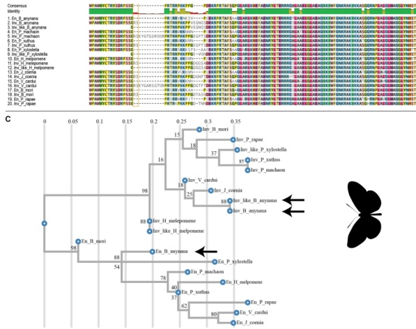
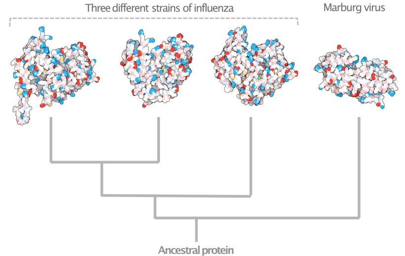
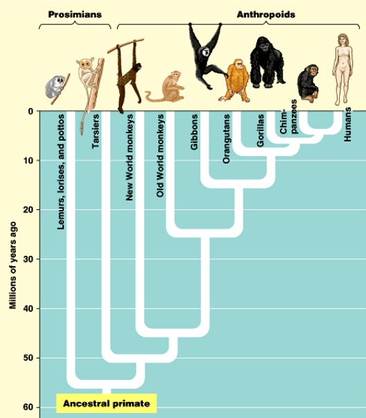
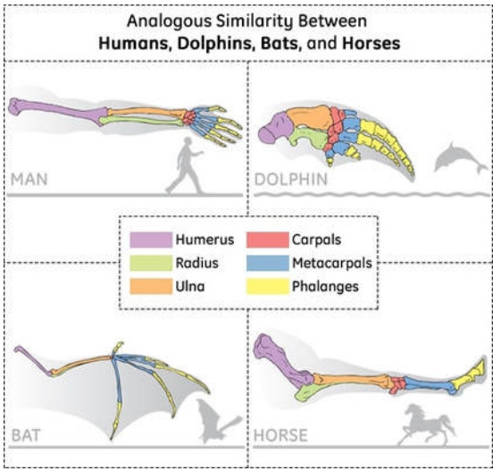
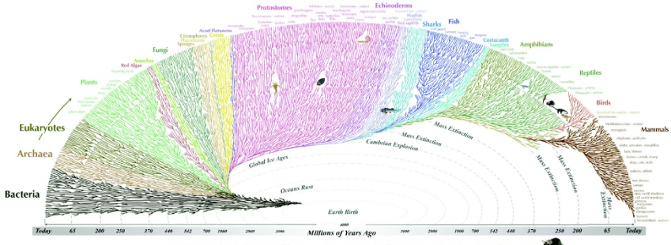
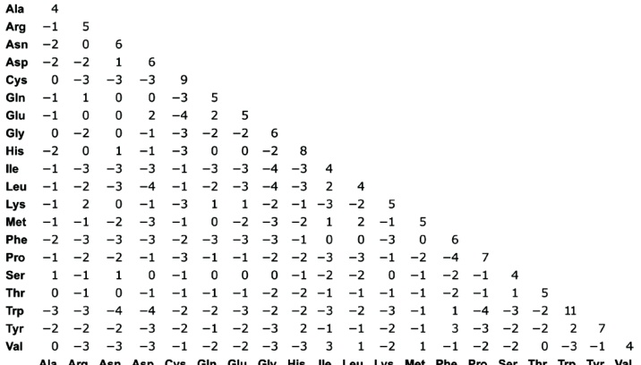
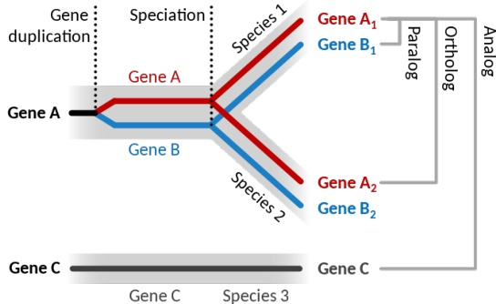

POLITECNICO

MILIANO 1863

# Bioinformatics Algorithms Sequences and sequence alignment (part 2)

Rosario M. Piro (based on slides by Giulio Pavesi

Dipartimento di Elettronica, Informazione e Bioingegneria (DEIB Politecnico di Milano

## Comparing words

- If two words are similar, we can often infer the meaning of the other

Usually, two words are similar when they share a common history in the evolution of languages

- Example: a="SUGAR" and b="SUCRE"

SUGAR SUCRE

SUGAR-

SUC-RE

SUGAR-

SU-CRE

Europe, AD 700

- The words denoting "sugar" of all modern European languages are descendants of a common ancestral word ("sukkar";arabic)

For some of the words, we also know "closer" (more recent) ancestors; e.g., the medieval French word "zuckar") is the ancestor of modern French "sucre" is the ancestor of modern French word "zukkar") is the ancestor of modern French word "zuckaroo" is the ancestor of modern French word "zuckarooo" is the ancestor of modern French word "zuckaroo" is the ancestor of modern French word "zuckkaroo" is the ancestor of modern French word "zuckarooo

## Comparing biological sequences

- If two sequences are similar, we can often infer the function of one from the biological function of the other

Usually, two sequences are similar when they share a common evolutionary history close in the evolutionary tree

(from Banerjee et al., 2020)

## Protein evolution

## Nucleoprotein from:

(from https://sitn.hms.harms.harvard.edu/flash/202020201/what-can-evolution-teach-us-about-the-viruses-of-the-future/)

## Primate evolution

Copyright © Pearson Education, Inc., publishing as Benjamin Cummings.

## Limb evolution

(from BiologyWise)

## Tree of life

All the major and many of the minor living branches of life are shown on this diagram, but only a few of those that have gone extinct.

(from: https://www.evogeneao.com/en/explore/tree-of-life-explorer;see there for an interactive version!)

- Hypothesis: all species have a common evolutionary history (common origin!)

During evolution, new species are derived from existing ones ("speciation")

If so, we should be able to find traces of evolution within the DNA; the DNA of two species should be somewhat similar (same for genes and proteins they encode)!

The more recent the divergence, the more similar the DNA/genes/proteins should be

This explains why we share some essential genes and proteins even with bacteria ...

> By comparing sequences we should be able to reconstruct the "genomic history" of the species we can observe today

Powerful tool for comparing sequences: the alignment!

## Example: protein sequences

Alignment example, split over multiple lines:

<table><tr><td>SSH_UOMO</td> SSH_TOPO</td><td>-MLLLLARCLLLIVLVSSLVVLVSLLVCSLGSLVVLVCGLACGPGRGFGKRGFRGKRHKPFLTPLPNYMNPDTAPFRLWYVLNGRDFDVLISLTVIHQKGFPAGAFRPLATFPRERLTKLPGPGRFKDHLMNPD</td></tr><tr><td>MGDGDRSKYGDGDRKDKEAID</td></tr><tr><td>MALFAST</td></tr><td>MGD</td></tr><tr><td>MGFR</td></tr><td>MGD</td></tr><td>MG</td></tr><td>MG</td></tr><td>M

Proteins encoded by the human SHH gene (top) and the mouse SHH gene (bottom)

SSH = sonic hedgehog signaling molecule

## Example: protein sequences

Another alignment example, split over multiple lines:

<table border="1"><thead><tr><th>Score</th><th></th><th>248 bits(633</th><th></th><th></th><th></th><th></th><th></th><th></th><th></th><th></th><th></th><th></th><th></th><th></th><td>Expect</th><th></th><td>Method</th><th></th><th></th><th></th><td>Identities</th><th>Positives</th><th>Positives</th><th>Identities</th><th>Positives</th><th>Positives</th><th>Positives</th><th>Positives</th><th>Positives</th><th>Positives</th><th>Positives</th><th>Positives</th><th>Positives</th><th>Positives</th></tr><tr><th>Score</th><th>%</th><th>Score</th></tr><tr><td>Query</th><th>Score</th><th></th><th></th><th></th><th>Positives</th><th>Positives</th><th>Positives</th><th>Positives</th></tr><tr><td>Score</th><th></th><th></th><th></th><th>Positives</th><th>Positives</th><th>Positives</th></tr><tr><td>Query</th><th>Score</th><th>Score</th></tr><tr><td>Query</th><th>Score</th><th>Score</th></tr><tr><td>Score</td></tr><tr><td>Score</td></tr><tr><td>Query</td><td></td></tr><tr><td></td><td></td></tr><td></td><td></td></tr><tr><td></td></tr></table>

Proteins encoded by the human histone 3 (H3) gene (top) and the homologous gene of S. cerevisiae (yeast; bottom)

## Alignment recap

- Let a and b be two sequences we want to compare, with $|a| = n$ and $|b|=m$

- We use a measure which considers both similarities (equal characters) and differences (substitutions, insertions, deletions)

Similarities: positive score

Differences: negative score

$$
\begin{array}{c c c c c c c c c c c c c c} C A A G A C \\ G A A - - C \\ - 1 + 1 + 1 - 2 - 1 + 1 + 1 - 2 - 1 - 2 - 1 = - 2 - 1 - 2 - 1 = - 2 - 1 - 2 - 1 = - 2 - 2 1 = - 2 3
$$

Recursive computation of alignment scores

$$
A \left(a (i), b (j)\right) = \max \left\{ \begin{array}{l} \left\{ \begin{array}{l} \mathbf {w _ {\mathrm {d}} \\ \mathbf {w} _ {\mathrm {d} + A \left(a (i), b (j)\right) = \max } \left. \right\rangle\left(1\right) \left. \right\rangle_ {i}\left. \right\rangle \left. \right\rangle_ {i}, b (j - 1\right) \quad a (i - 1\right) \quad \mathrm {a} \left. \right\rangle , b (j - 1\right) \leftarrow 1\right) \quad \mathrm {a} \left. \right\rangle , \left. \right\rangle , b (j - 1\right) \quad \mathrm {a} \left(1\right) \quad a i \neq b _ {j} \left(1\right) \quad a _ {i} \tag {2}
$$

$w_{d} < 0$ negative gap penalty for insertions/deletions/deleteions

> $w_{s} < 0$ : negative mismatch penalty for substitutions

> $\mathbf{w}_{\mathrm{m}} > 0$ positive match score for the same symbol

## Substitution matrix

- We can actually simplify this when using a substitution matrix, denoted by $\sigma$

Given an alphabet $\Sigma$, the substitution matrix is a $|\Sigma|x|x|\Sigma|x|\Sigma|-matrix$ which gives for every pair of symbols $s_{i},s_{j}$

The matrix is symmetrical, i.e., $\sigma (s_{i}, s_{j} = \sigma (s_{i}, s_{j}) = \sigma (s_{j})$

- Example for nucleotides: $\sigma(\mathrm{C},\mathrm{T}) = \sigma (\mathrm {T}, \mathrm {C})$

Given a specific symbol $s_{i}$ s_{i}, the values $\sigma\left(s_{i},s_{j}$

- Example for amino acids: $\sigma (\mathrm {Ala},\mathrm{Cys})$ may be different from $\sigma(\mathrm{Ala},\mathrm{Ser})$

For $i=j$ this matrix can also specify the "weight" of substituting $ s_{i} by itself, which is equivalent to the positive score associated with a match of the symbol in the alignment!

- Examples: $\sigma(\mathrm{C},\mathrm {C},\mathrm {C},\mathrm {C} ; \sigma (\mathrm {Ala},\mathrm {Ala})$

The positive scores for "matches", i.e., $\sigma (s_i, s_i$ $s_{i}$ can differ from symbol to symbol!$

- Example: $\sigma(\mathrm{Ala},\mathrm {Ala}, \mathrm {Ala})$ may be different from $\sigma (\mathrm {Cys}, \mathrm { Cys}$

## Substitution matrix

The simplest substitution matrices are those for DNA/RNA sequences

- Positive scores for all matches are the same All matches are equally positive!

- Negative scores for all mismatches/substitutions are the same All mismatches are equally penalized!

- Example:

<table border="1"><tr><td></td><td>A</td><td>A</td><td>+2</td><td>-1

## Substitution matrix

For amino acid sequences, we usually use more complex substitution matrices

- Not all matches are equally important!

- Different mismatches/substitutions have different penalization!

Some may have zero or even low positive weights

★ "Conservative" substitutions (weight $ \geq 0)

★ "Quasi matches" (weight > 0); assumed to not affect protein structure/function; More often found in evolution; e.g., glutamate (Glu) ↔ glutamine (Gln)

- Example:

Ala Arg Asn Asp Cys Cys Gin Glu Gly His Ile Leu Lys Met Phe Pro Ser Thr Trp Tyr Val

## Substitution matrix

Using a substitution matrix which includes positive scores for matches (and quasi matches) allows to simplify the recursive computation of alignment scores!

Needleman-Wunsch algorithm:

- Given sequences $a=a_{1}a_{2}\dots a_{n}$ and $b_{1}b_{2}\dots b_{m}$

- Cells $A ( 0, j )$ of the first row will have scores $j \times w_{\mathrm{d}}$

- Cells $A(i,0)$ of the first column will have scores $i \times w_{\mathrm{d}}$ (linear gap penalty)

- Recursive computation:

$$
A \left(a (i), b (j)\right) = \max \left\{ \begin{array}{l} \left\{ \begin{array}{l} w _ {\mathrm {d} + A \left(a (i), b (j)\right) \\ \max } \left. \right\rangle\right) = \max \left\{ \right.\left. \right\} \left. \right\rangle\left. \right\rangle_ {i} \left. \right\rangle_ {i} ^ {\prime} \left. \left. \right\rangle_ {i} \left. \right\rangle_ {i} \right\rangle_ {i} \left. \right\rangle_ {i} \rangle_ {i} = \left. \right\rangle_ {i} = \left. \right\rangle_ {i} = \left. \left. \left. \right\rangle_ {i} = \left. \right\rangle_ {i} = 1\right) \tag {2}
$$

$w_{d} < 0$ negative gap penalty for insertions/deletions

$\triangleright \sigma(\mathbf{a_i, b_j)$: substitution score for $a_{i} and$ $ $ b_{j}$ (subtituation matrix)

Both, matches and mismatches are included in $\sigma$ ; no need to distinguish!

## Example

<table><thead><tr><th>$\sigma$</th><th></th><th>A</th><b>A</th> </td><b>A</th> </td><b>+1</th> </td> </td> </td><b>-1</td><b>-1</td><b>-1</td><b>-1</td><b>-1</td><b>-1</td> </td> </td> </td></tr><tr><td>A</td><td>+1</td><td>+1</td></tr><td>A</td><td>+1</td></tr><tr><td>A</td><td>+1</td></tr><td>A</td><td>+1</td></tr><td></td></tr><td>A</td><td>+1</td></tr><td>A</td><td></td></tr><tr><td>A</td><td></td></tr><td></td></tr><td></td></tr><tr><td></td></tr><td></td></tr><tr><td></td></tr><tr><td></td></tr><td></td></tr><tr><td></td></tr><td></td></tr></table>

- Gap penalty ($w_{d}$

- Sequences to be aligned: "GAAC" and "CAAGAC"

<table border="1"><tr><td></td><td>-</td><td>-</td><td>C</td><td>A</td><td>A</td><td>A</td><td>B</td><td>-

- Initialize the matrix

Cell (1, 1): choice between -2-2 (horizontal), -2-2 (vertical) and 0-1 (diagonal)

First row ...

Second row ...

Full matrix; the final alignment score is -2

▶ C A A A G A A C

G A A A - - C

## Use of global sequence alignment

- Global sequence alignment is the "de facto" standard for comparing biological sequences that are directly related by evolution

Homologous genes or proteins between different species

★ The "same" gene inherited from a common ancestor ("orthologous" genes)

★ E.g., SHH in human and mouse; Pax6 in vertebrates and eyeless in flies

Homologous genes or proteins due to duplication events

- Genes derived by duplication from a single ancestral gene ("paralogous" genes)

★ E.g., $\alpha$-haemoglobin $and$\beta $-haemoglobin$ and $\beta$-haemoglobin$ human (or in mouse)

(from: https://www.differencebetween.com/difference-between-orthologous-and-paralogous-genes/)

How about analogous sequences (similar function but no evolutionary relationship)?

## Shortcoming of global sequence alignment

- Different types of macromolecules evolve at different speeds

Protein-coding genes (DNA) often evolve faster than the encoded proteins

★ Redundancy of the genetic code (different codons can encode for the same amino acid)

★ Chemically and structurally similar amino acids can often be substituted without effecting protein structure or function

Within a genome (and also within individual genes), some regions tend to be more conserved by evolution than others

- Genes are more conserved than the rest of the DNA

- ★ Within genes, exons are more conserved than introns

- Within the coding regions of a gene (and within the protein it encodes) some regions are more conserved (e.g., functionally essential domains; negative selection against sequence alterations)

- Thus, in many cases, an evolutionary relationship can be identified only for a part of the sequences, but not globally, while for the rest of the sequences often no relevant similarity can be found

- We need a way of identifying similar regions within two sequences without requiring the full sequences to be aligned!

## Local sequence alignment

- Let $a=a_{1} a_{1} a_{2}\dots a_{n}$ and $b_{1} b_{2}\dots b_{m}$ is written as $ $ be two strings over alphabet $\Sigma$ for which we want to identify consecutive substrings which have a high degree of similarity

- Let $\sigma\left(s_{i}, s_{j}\in \Sigma$

- Let $w_{d}$ be a gap penalty (we consider only the linear model here; no distinction between opening and extending a gap)

- Let's continue to use our dynamic programming-based approach ...

## Problem:

Find two substrings, one from a and one from b that produce the alignment (of the substrings! with the maximum possible score

or in other words:

Find the partial alignment (of substrings of a and b) with the maximum score (such that there are no other substrings which would achieve a higher alignment score)

- Of course we cannot know in advance how long the substrings need to be!

## Local sequence alignment

## Problem:

## Find two substrings, one from a and one from b that produce the alignment (of the substrings! with the maximum possible score

- Observation: if the two sequences are not identical (e.g., if $a \neq b)$ there must be operations with negative score (substitutions, insertions, deletions)

## Two (rare) special cases:

- Since negative scores are possible, if there is no pair of substrings with an alignment score > 0, then the best solution is trivially given by two empty strings $\varepsilon$ which have alignment score 0); trivial example: a="AAAAA" and $b=("GGGGG"

If we have no negative scores in the global alignment (only positive or zero) then the best solution would be the full global alignment

## Complexity of the problem:

The two substrings with maximum alignment score need not be of the same length

Thus, we need a way to compare and align all possible substring pairs from a and b

We have $O(n^{2})$ and $O(m^{2})$ substrings, respectively

- Thus, naively enumerating all possible pairs of substrings would require to compute $O(n^{2} m^{2} m^{2}$

## The "Smith-Waterman" algorithm

- Introduced in 198198198 by Smith and Waterman

- Designed explicitly for the comparison of biological sequences

- Guarantees to find the best (optimal) solution

- $O(nm)$ instead of $O(n^{2} m^{2} m^{2}$! How?

- It's based again on the dynamic programming matrix!

- Recall the global sequence alignment:

<table border="1"><tr><td></td><td>-</td><td>-</td><td>C</td><td>A</td><td>A</td><td>A</td><td>A</td><td>-

This already does contain scores which potentially consider all possible substring pairs (selecting, however, in each step only possibilities which increase the score)!

E. g., in the diagonal path from cell (0,3) to cell (2,5) we increase the score from -6 to -4; so the correspondig partial alignment (GA and GA) would have a score of 2

Problem: how can we identify which possible subpath has the highest increase in score?

## The "Smith-Waterman" algorithm

- Recall the global sequence alignment:

<table border="1"><tr><td></td><td>-</td><td>-</td><td>C</td><td>A</td><td>A</td><td>A</td><td>A</td><td>-

Problem: how can we identify which possible subpath has the highest increase in score?

- Using global sequence alignment, cell $(i,j)$ contains the total alignment score for the prefixes a(i) and $b(j)$ , i.e., from the beginning, represented by cell (0,0)

- Idea: let cell $(i,j)$ instead contain the maximum alignment score of all substring pairs which end at position $i$ and $j$, respectively; that is, not from the beginning, but from some intermediate positions in a and $b$

## The "Smith-Waterman" algorithm

- We can achieve this by adding a simple 4th choice for each step:

$$
M (i, j) = \max \left\{ \begin{array}{l} 0 \\ w _ {d} + M (i, j - 1) \\ w _ {d} \\ \sigma (i, j - 1) \\ \sigma (i, j - 1) \\ \end{array}
$$

The additional choice is ... zero!

The motivation for this is the following:

- Computing a value for a cell (and keeping the corresponding traceback pointer) is equivalent to extending an alignment

But: if all possible extensions lead to a negative score, i.e., if $M (i,j)$ would be < 0 then it's better to "reset" everything and start from 0 again

- Remember: we always can have a score of zero by aligning two empty strings, so any better solution must have a positive score!

- This implies: when the choice is 0 (resetting), no traceback pointer will be associated with the cell (no extension of a previous alignment!)

## The "Smith-Waterman" algorithm: example

<table><thead><tr><th>$\sigma$</th><th></th><th>A</th><th>A</th><th>A</th><th>+1</th><th>-1</th><th>-1</th><th>-1</th><th>G</th><th>+1</th><th>-1</th><th>+1</th><th>-1</th><td>-1</th><td>+1</th><td>-1</th></tr></table>

- Gap penalty ($w_{d}): - 2$

- Sequences to be aligned: "GAAC" and "CAGAAT"

<table border="1"><tr><td></td><td>-</td><td>C</td><td>A</td><td>A</td><td>G</td><td>A</td><td>0</td><td>0</td><td>0</td><td>0</td><td>0</td><td>0</td><td>1</td><td>0</td><td>1</td><td>0</td><td>1</td><td>0</td><td>1</td><td>2</td><td>1</td><td>1</td><td>1</td><td>1</td><td>1</td><td>1</td><td>1</td><td>1</td><td>1</td></tr><tr><td></tr><td></tr><tr><td></tr><td></tr><td></tr><td></tr><td></td><td></td

- Initialize the matrix:

★ Zeroes in first row and column (instead of negative scores from gaps!)

- Cell (1, 1): choices are 0-2 (horizontal), 0-2 (vertical), 0-1 (diagonal), and 0-1) and 0-1) and 0-1 (horizontal) and 0-1)

- Cell (1,3): choices are 0-2 (horizontal), 0-2 (vertical), 0-2 (horizontal), 0+1 (diagonal), and 0-1) and set a traceback pointer!

For the remaining cells of row 1 we always choose 0

Row by row ...

Placing traceback pointers only when not resetting!

The "Smith-Waterman" algorithm: example

<table><thead><tr><th>$\sigma$</th><th></th><th>A</th><th>A</th><th>+1</th><th>-1</th><th>C</th><th>-1</th><th>G</th><th>+1</th><th>-1</th><th>T</th><th>+1</th><td>-1</th><td>+1</th><td>-1</th><td>T</th></tr></table>

- Gap penalty ($w_{d}$

- Sequences to be aligned: "GAAC" and "CAGAAT"

<table border="1"><tr><td></td><td>-</td><td>-</td><td>C</td><td>A</td><td>0</td><td>0</td><td>0</td><td>0</td><td>1</td><td>0</td><td>0</td><td>1</td><td>0</td><td>0</td><td>0</td><td>1</td><td>0</td><td>0</td><td>0</td><td>0</td><td>0</td><td>0</td><td>1</td><td>1</td><td>1</td><td>1</td><td>1</td><td>1</td><td>1</td><td>1</td></tr><tr><td></tr><td></tr><tr><td></tr><td></tr><td></tr><td></td><td></td><td></td><td></td><td></td><td></td><td></td><td></td><td></td><td></td><td></td><td></td><td></td><td></td><td></td><td></td><td></td><td></td></tr><tr><td></td><td></td><td></td><td></td><td></td><td></td><td></td><td></td></tr><tr><td></td><td></td><td></td><td></td><td></td><td></td><td></td><td></td><td></td></tr><tr><td></td><td></td><td></td><td></td><td></td><td></td><td></td><td></td></td></tr><td></td><td></td><td></td><td></td></tr><td></td><td></td><td></td><td></td><td></td><td></td></tr><td></td><td></td><td></td><td></td></tr><td></td><td></td><td></td><td></td><td></td><td></td><td></td><td></td><td></td></tr><td></td><td></td><td></td><td></td><td></td><td></td><td></td><td></td><td></td><td></td></tr><td></td><td></td><td></td><td></td><td></td><td></td><td></td><td></td></tr><td></td><td></td><td></td><td></td><td></td></tr><td></td><td></td><td></td><td></td><td></td><td></td><td></td><td></td><td></td><td></td></tr><td></td><td></td

Once the table is complete: where is the "optimal score"? Still in cell (n,m)?

The optimal score is the highest positive score in the entire matrix!

This is the alignment score for the best local alignment! Here: 3

Traceback to construct the local alignment: start from the cell with the highest score!

G A A A

G A A A

★ Traceback proceeds as usual

★ Until we reach a cell without pointer!

## The "Smith-Waterman" algorithm: example

<table><thead><tr><th>$\sigma$</th><th></th><th>A</th><th>A</th><th>+1</th><th>-1</th><th>C</th><th>-1</th><th>G</th><th>+1</th><th>-1</th><th>T</th><th>+1</th><td>-1</th><td>+1</th><td>-1</th><td>T</th></tr></table>

- Gap penalty ($w_{d}$

- Sequences to be aligned: "GAAC" and "CAGAAT"

<table border="1"><tr><td></td><td>-</td><td>-</td><td>C</td><td>A</td><td>0</td><td>0</td><td>0</td><td>0</td><td>1</td><td>0</td><td>0</td><td>1</td><td>0</td><td>0</td><td>0</td><td>1</td><td>0</td><td>0</td><td>0</td><td>0</td><td>0</td><td>0</td><td>1</td><td>1</td><td>1</td><td>1</td><td>1</td><td>1</td><td>1</td><td>1</td></tr><tr><td></tr><tr><td></tr><tr><td></td><td></td><td></td><td></td><td></td><td></td><td></td><td></td></tr><tr><td></td><td></td><td></td><td></td><td></td></tr><tr><td></td><td></td><td></td><td></td><td></td></tr><tr><td></td><td></td><td></td><td></td><td></td><td></td><td></td></tr><tr><td></td><td></td><td></td><td></td><td></td><td></td><td></td><td></td><td></td><td></td></tr><tr><td></td><td></td><td></td><td></td><td></td><td></td><td></td><td></td></td></tr><td></td><td></td><td></td><td></td><td></td><td></td><td></td></tr><td></td><td></td><td></td><td></td><td></td><td></td></tr><td></td><td></td><td></td><td></td><td></td><td></td><td></td><td></td><td></td></tr><td></td><td></td><td></td><td></td><td></td><td></td><td></td><td></td><td></td><td></td></tr><td></td><td></td><td></td><td></td><td></td><td></td><td></td><td></td><td></td><td></td></tr><td></td><td></td><td></td><td></td><td></td><td></td><td></td></tr><td></td><td></td><td></td><td></td><td></td><td></td><td></td><td></td><td></td><td></td></tr><td></td><td></td

Traceback to construct the local alignment: start from the cell with the highest score!

G A A A

G A A A

> Symbols associated with the stopping cell with score 0 are not part of the alignment Here: we followed three pointers, so the alignment must have 3 columns!

If the traceback goes from cell $\left(i_{s}, j_{s}, j_{s})$ to cell $(i_{e}, j_{e})$

$\star \rightarrow$ The substring of a=GAAC has indices $i_{e}+1$ to $i_{s}$

$\star \rightarrow$ The substring of b=CAGAAT has indices $j_{e}+1$

here: from (3,5) to (0,2)

here: from 1 to 3

here: from 1 to 3

here: from 1 to 2

here: from 3 to 5

## Additional considerations

## Multiple optimal solutions:

Highest score found in multiple cells; or, multiple paths from the same highest score We can:

★ Report only one of them

★ Report them all (best choice!)

## How about the second best local alignment(s)?

★ Once we've found the best local alignment(s), we can iterate by finding the "second best score in cells which haven't been used for the best local alignment and trace back to find a second best local alignment ...

## We can iterate the previous point to find the third, fourth, ... best local alignment

- Remember that we can apply this algorithm to sequences of many hundreds or thousands of nucleotides/amino acids!

- In biological applications, we indeed often find multiple interesting local alignments between two sequences

## Playing around

- Needleman-Wunsch algorithm, or "global alignment":

http://rna.informatik.uni-freiburg.de/Teaching/index.jsp?

toolName=Needleman-Wunsch algorithm, or "global alignment"?

## Smith-Waterman algorithm, or "local alignment":

http://rna.informatik.uni-freiburg.de/Teaching/index.jsp?toolName=Smith-Waterman

toolName=Smith-Waterman

## And so on ...

We've seen a dynamic programming approach for

- Computing the edit distance of two strings

- Finding the LCS of two strings

- Computing the optimal global alignment of two strings, given a substitution matrix and "gap penalty" scores

- Computing the optimal local alignment of two strings, given a substitution matrix and "gap penalty" scores

(You should know how to describe these, e.g., for an exam :-)

## Variations of these algorithms:

- The same idea can be applied to solve similar problems, for example:

- Finding the best local alignment, where the two optimal substrings are one a prefix and the other a suffix, or vice versa

Find the best global alignment, where insertions and deletions at the beginning and at the end of the alignment have gap penalty score 0

- You should also be able to design simple "variations" of these alorithms to address slightly different problems to the once we described in the lecture

The two examples above are question from previous exams

## Banerjee T.D. et al. (2020

Expression of Multiple engrailed Family Genes in Eyespots of Bicyclus anynana Butterflies Does Not Implicate the Duplication Events in the Evolution of This Morphological Novelty Front. Ecol. Evolving in the Evolution of This Morphological Novelty

Smith T.F. & Waterman M.S. (1981 Identification of Common Molecular Subsequences Journal of Molecular Biology 147195-197