POLITECNICO

MILANO 1863

# Bioinformatics Algorithms De novo genome assembly

Rosario M. Piro (based on slides by Peter N. Robinson)

Dipartimento di Elettronica, Informazione e Bioingegneria (DEIB Politecnico di Milano

## Paired-end or single-end?

The DNA fragments inserted between the adapters are usually longer than the maximum read (sequence) length. We can either sequence only one end of the fragment ("single-end sequencing")!

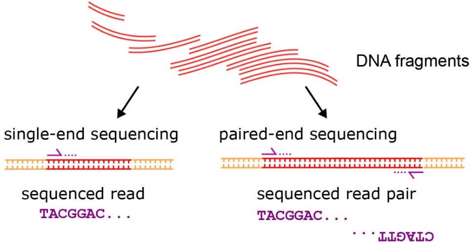

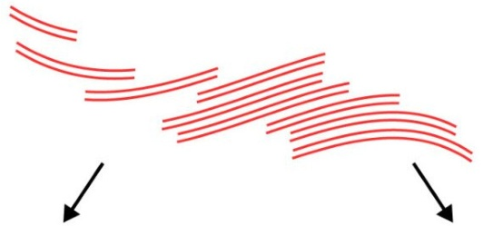

## Paired-end sequencing

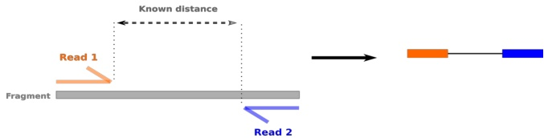

Advantage of paired-end sequencing:

- We know an approximate distance between the two reads (from the average fragment length)

- Can help to identify structural variants, e.g.,

Both reads seem to originate from different chromosomes $\rightarrow$ translocation?

- Distance seems to be far greater when the reads are aligned with the reference genome $\rightarrow$ read span the deletion of some genomic sequence?

- But: single-end sequencing is in some cases sufficient (e.g., ChIP-seq for identifying transcription factor binding sites)

Figure from:

## Genome assembly versus read mapping

- Genome assembly: reconstruct the genome from (short) sequencing reads

- Read mapping: "map" (i.e., align) the reads to a known reference genome

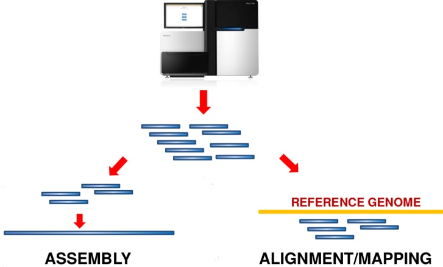


## Genome assembly: the basics

The process of puzzling together a complete genome sequence of an organism for which "shotgun sequencing has been performed is referred to as genome assembly

- As the costs for sequencing have declined, the major challenge is computational

- Can we sequence and de novo assemble a large (> 100 Mb) genome with the short reads typical of current NGS protocols (e.g., reads of 50 bp length)?

- There are two major classes of assembly algorithms

Overlap-layout consensus (OLC)

2 de Bruijn graph (DBG)

- OLC was widely used back in the day when sequencing was performed by the low-throughput, longer-read Sanger method

- DBG-based methods have dominated the scene since the introduction of NGS

Example: "Shakespeare"s

# Friends, Romans countrymen lend me your ears;

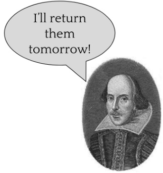

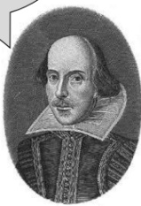

## Example: "Shakespeare"

## Reads

ds, Romans, count ns, countrymen, le Friends, Rom send me your ears; crymen, lend me

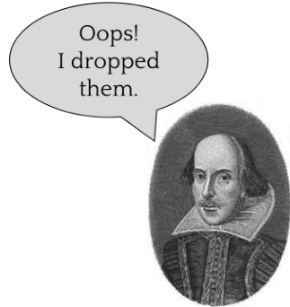

ds, Romans, count ns, countrymen, le Friends, Rom send me your ears; crymen, lend me

## Reads


## Simple? The awful truth is ...

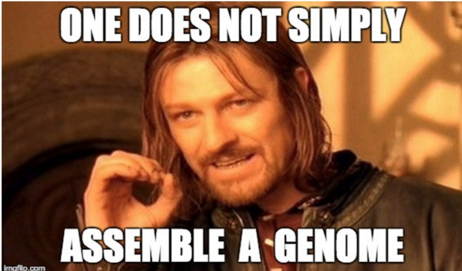

("One does not simply walk into Mordor ... there is evil there that does not sleep", Boromir of Gondor on October 25th, 301814

training.galaxyproject.org/training-material/topics/assembly/tutorials/general-introduction/slides-plain.html

## The task ...

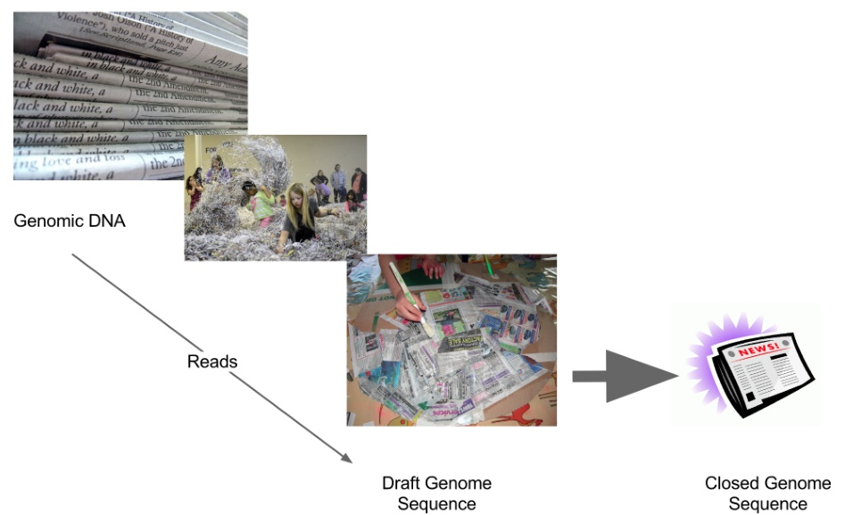


## Sequencing data: models and intuition

To get intuition about genome assembly, let us consider an idealized genome that represents a long random sequence of four bases and that does not contain repeats or other complex structures

- Consider a simple and error-free sequencing strategy: single-end, whole-genome sequencing (WGS); no sequencing errors

- That is, we sample equal-length fragments (the reads) with starting points randomly distributed across the genome

- Thus, our "shotgun" sequencing can be compared to a process that samples bases from all genome positions at random

- The chance that any particular base $^{1}$ is sampled is very low in a single sampling process (a single read)

- However, we perform the sampling process a very large number of times (millions of reads!)

Any suggestions as to how we might model this?

$^{1}$ as often, some terminology is used with multiple meanings: a "base" can be intended as one of the four nucleotides; or, as in this case, for a specific position in the genome i.e., the base at a specific position.

## Sequencing data: models and intuition

The Poisson distribution expresses the probability of a given number of events occurring in a fixed interval of time and/or a fixed interval of space if these events are iid (independent and identically distributed)

$$
f (k; \lambda) = P (X = k) = \frac {e ^ {- \lambda} {k} / k!} \tag{1}
$$

- $k$ refers to number of reads that overlap a certain genomic position ( "coverage")

- $\lambda =$ mean sequencing depth (average coverage; average number of reads covering each base in the genome)

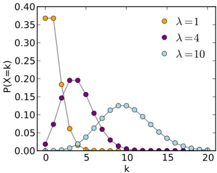

(from Wikipedia)

## Sequencing data: models and intuition

Let's look at the model more closely.

- $G:$ genome size (e.g., $3.2 \times10^{9}$

- L: read length (e.g., 100 bases for an older Illumina "run")

- N: number of reads

- $n_{b}$ total number of sequenced bases

It is now easy to calculate that

$$
n _ {b} = N \times L
$$

Similarly, the average coverage depth per base is $\lambda = \frac {n _ {b} G$

(This is the $\lambda$ we can use for the Poisson distribution!

## Sequencing data: models and intuition

An example: How many reads do we need to cover the human genome on average 10-fold ("10x) if each read has a length of 200 bases?

- G: genome size: assume $3 \times10^{9}$

- L: read length: assume 20000000000000 nucleotides

- N: number of reads

- $n_{b}=N \cdot L$ total number of sequenced bases

- $\lambda = n_{b} / G = N L / G$ is the coverage

For instance, 10x coverage $\left( \lambda=10$ of the human genome requires

$$
N = \lambda G / L = 1 0. 1 0 \times 3 \times 1 0 ^ {9} / 2 0 0 0 0 0 0 0 0 1 5 0 0 0 0 0
$$

## Sequencing data: models and intuition

k-mers: subsequences with k nucleotides (here: k=3)

- Consider all possible k-mers in a short read of 17 nucleotides

$_{k}$(TCATTCTTCAGGTCAGGTCAAA)

TCA

CAT

ATT

TTC

TCT

TCA

CATT

TTC

TCA

CAGGTC

TCA

ATT

TGCAA

TTC

AGG

AAA

AAA

- How many 3-mers are there in this read?

## Sequencing data: models and intuition

- In general there are $L - ( k - 1) = L - k + 1$ k-mer subsequences in a sequence of length $L$ with $k \leq L$

- Let's say we want to know the total number of k-mers in our WGS (whole genome sequencing) data. Since we have N reads, each of which has $L-k+1$ k - mers in our WGS (whole genome sequencing) is

$$
n _ {k} = N \times (L - k + 1)
$$

- The coverage depth in terms of k-mers is then $d_{k} = \frac{n_{k}$

- The ratio between the coverage depth for bases $(\lambda)$ and that for k-mers is then

$$
\frac {\lambda}{d _ {k} = \frac {n _ {b} / G = \frac {n _ {k} {/ G} = \frac {L - k + 1}
$$

## Sequencing data: models and intuition

Say we are performing de novo sequencing for an organism that has not been sequenced before. How can we estimate its overall genome size?

- The number of k-mers in the WGS reads $\left(n_{k}\mathrm{n}_{k}$

- If k is large enough, the mean coverage depth $d_{k}$ d_{k}$ of k-mers can be estimated from the peak value of the empirical k-mer coverage depth distribution curve

peak depth value $d_{k}=30. 4$

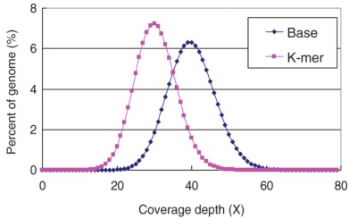

## Sequencing data: models and intuition

But how can we obtain the empirical k-mer coverage depth distribution curve?

- We assume k-mers are from unique genome positions in most cases (if k is large enough and the genome has no repeats), i.e., a specific k-mer sequence is equivalent to a specific position

- Hence: we interpret the count (=number of matches on all sequenced reads) of a specific k-mer as the coverage depth at the corresponding genome position!

- We plot the distribution over all k-mers (how many k-mers have a specific count=coverage?) and identify the peak as the mean coverage depth of k-mers of k-mers

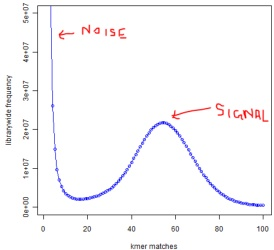

Graphic:

Homolog.us - Frontier in Bioinformatics blog

http://www.homolog.us

## Sequencing data: models and intuition

With this data in hand, we can now estimate the genome size as

$$
G \approx \frac {n _ {k} {/} {d _ {k}
$$

and we can estimate the average base coverage by

$$
\lambda \approx \frac {L}{L - k + 1} \times d _ {k}
$$

- Here, we would use a value of k large enough such that we do not expect to see a given k-mer sequence more than once in a random genome

- In practice, these estimates are not exact even in a random genome because of sequencing errors (why?)

## Sequencing data: models and intuition

Getting back to our initial question, we can now use the estimated mean base coverage $\lambda$ to estimate the probability that a given base will not be covered

$$
P (X = 0) = \frac {e ^ {- \lambda \lambda^ {0} {0} {=} e ^ {- \lambda} {0} = e ^ {- \lambda}
$$

Therefore, the probability of seeing at least one read at a given position is

$$
P (X > 0) = 1 - P (X = 0) = 1 - e ^ {- \lambda}
$$

## Sequencing data: models and intuition

- So if we want to estimate the mean read depth required such that at least 99% of the genome is covered once (and thus the probability of any base is at least $99 \%$ ^2 $99\%$

$$
P (X > 0) = 0. 9 9 = 1 - e ^ {- \lambda}
$$

$$
e ^ {- \lambda} = 0. 0. 1
$$
e ^ {- \lambda}
$$

$$
- \lambda = - 4. 6 0 5
$$
- 1 6 0 5
$$

- Thus we need to sequence enough reads to obtain an average depth of at least 4.6 if we want 99% of the genome to be covered at least once

- This roughly explains the goal of 6x coverage in initial Sanger sequencing projects of the human genome

- Note: this model, however, suggests that covering 100% of the genome at least once would require an infinite coverage!

## What are contigs?

Now let us consider "contigs": combinations of overlapping reads that represent contiguous sequence

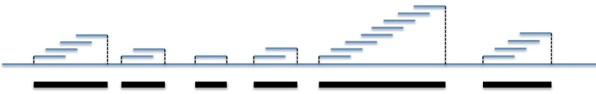

- Collection of $N = 21$ reads assembled into 6 contigs

- The contigs are assumed to be the best possible representation of the original DNA sequence

- Note that the actual locations of the contigs and their orientation to one another are unknown to us

## Genome assembly and contigs

## The initial steps of genome assembly are basically an attempt to find contigs


Genome: 3.2 Gb Many copies of genome

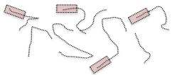

Reads: 5000bp Only one end sequenced Not all fragments sequenced

tgctgctgctgctgctcctacacaacatcacaacatcggccgtgcgccgtgcgctgctgctgctg

...tgctgctgctgctcctcctcctcctacacaacatcggccgtgcctggaagcgtcgctggaagcctggaagcct

Find overlapping reads

Merge overlapping reads into contigs

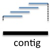

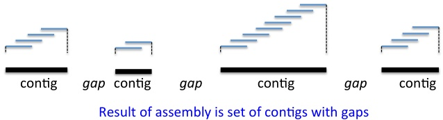

## Genome assembly and scaffolds

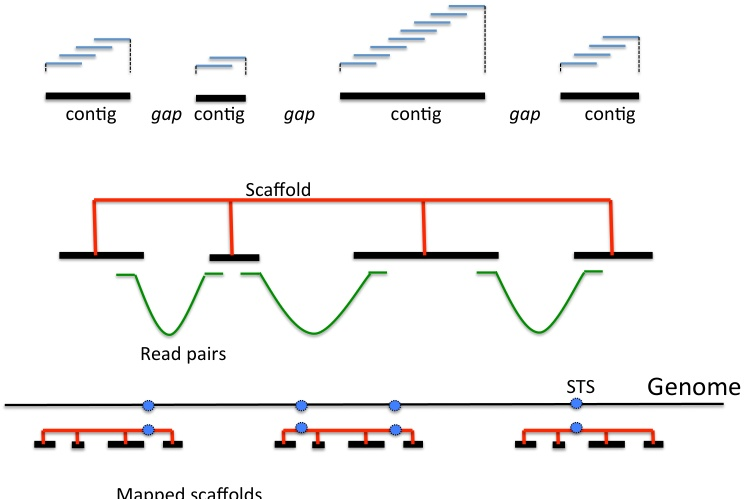

- Additional processing to piece together contigs; with paired-end sequencing we can assemble some contigs into "scaffolds", but we consider only contigs here

## How many bases are covered by contigs?

- In a genome of length $G$ , $G$ a read of length L can start anywhere (except at the very ends of the chromosomes; we ignore this here)

- Approximation for the expected number of reads $N_{i} starting at a specific genomic location (base) i:$ N_{i}=N / G$

Probability of reads to start in a given interval:

- Consider an interval / that is as long as a read (L nucleotides):

The expected number of reads that start in is then $L\times N / G = \lambda$ (i.e., $L\times N/G$ is then $L\times N / G=$ $\lambda$ i $ $ (i.e.,$ $L\times N / G $is the expected number for each individual position!$ $ $ $ $ $ $ $ $ $ $ $ $ $ $ $ $ L\times N / G $ $ $ $ $

Assuming a Poisson distribution, the probability that no read starts in / is then

$$
P (X = 0) = \frac {e ^ {- \lambda^ {- \lambda} {0} = e ^ {- \lambda} \tag{2}
$$

The probability that at least one read starts in / is then

$$
P (X > 0) = 1 - P (X = 0) = 1 - e ^ {- \lambda} \tag{3}
$$

## How many bases are covered by contigs?

- Consider a nucleotide at genomic position i

- This nucleotide is in a gap between contigs if no read starts in the interval

$$
[ i - (L - 1), i ] = [ i - L + 1, i ] = [ i - L + 1, i ]
$$

- This interval has length $L$ , $and thus, the probability that no read starts in it is$ e^{-\lambda} $

- By linearity of expectation, we can estimate the number of nucleotides in gaps across the entire assembly as

$$
G \cdot e ^ {- \lambda}
$$

- Correspondingly, the number of nucleotides included in contigs is $G \cdot \left( 1 - e^{-\lambda}$

The fraction of the genome which will be covered by contigs depends on the "sequencing depth" (i.e., how much sequence data we produce and thus what average per-base coverage we have!

How many contigs will we obtain?

$$
\begin{array}{c c c c c
$$

- Each contig has a unique rightmost read ("R")

- The probability that a given read is the rightmost read is the same as the probability that no other read starts within that read

If the read starts at position i, this is the probability that no read starts within the interval $[ i,i+L-1] , which also amounts to$ e^{-\lambda} $

- The number of contigs must be equal to the number of rightmost reads

There are a total of N reads, each of which has a probability of $e^{-\lambda}$ of being an R read. Thus, the expected number of contigs is

$$
N e ^ {- \lambda}
$$

The expected number of reads per contig is then

$$
\frac {N}{N e ^ {- \lambda} = 1 / e ^ {- \lambda} = 1 / e ^ {- \lambda}
$$

## How big are the contigs?

- We have seen that the expected size of the sequenced region of the genome is

$$
\left(1 - e ^ {- \lambda\right) \cdot G
$$

- The expected number of contigs is $Ne^{-\lambda}$

Therefore, the expected size of a contig is simply

$$
\frac {\left(1 - e ^ {- \lambda\right) \cdot G N e ^ {- \lambda} {/}
$$

- Example: if we go for a coverage of $\lambda=6$ of the human genome with $L=500$ nt reads, we would expect roughly

1 $N=\lambda G / L=3 6$ million reads

$( 1 - e^{-\lambda} = 99.8 \%$

An estimated total of $N e^{-\lambda} = 89,235$ contigs

An average contig length of $\frac{(1-e^{-\lambda})\cdot G$ $N e^{-\lambda} = 3,53,53,536$ nucleotides

## Contigs and overlaps

But we have completely neglected the topic of how much of an overlap is required to connect two reads in a contig?

- Let's say we require an overlap of one nucleotide only

- Then any two random reads will overlap with a probability of $ 1 / 4=25 \% (last nucleotide of one read is by chance the same as the first nucleotide of the other read) — not exactly what we want...

- Let instead $\theta$ \mathrm{~} $\mathrm{\theta}$ refer to the minimum portion of L $that is required to detect an overlap$ \mathrm{e.g.,\theta=0.1$ $ \mathrm{means} 10.1\% $of the reads must overlap)$


- We will thus combine a group of reads to a contig if they are connected by overlaps of length $\geq \theta L$

## Overlaps and expected number of contigs

Let us now calculate the expected number of contigs, given that we demand an overlap of at least $\theta L$ nucleotides between combined reads

- The calculation that a given read at posistion i is the rightmost read ("R") now requires not that there is no read starting in the interval $[i,i+L-1] but instead that there is no read starting in the leftmost (1 -$\theta$ $i$ $i+L-1]$,but instead that there is no read starting in the leftmost$ 1-\theta)$ portion of this interval!

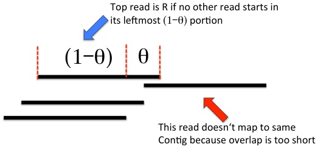

- We need to calculate the probability that zero reads start in $( 1 - \theta ) L$

- We saw that the expected number of reads which start in an interval I of length $L$ \lambda $L$ \mathrm{of} $length$ L $is$ \lambda $N/G$

- Here, we adjust this to reflect the expected number of reads that start in $( 1 - \theta) L$ to be $( 1-\theta)$

## Overlaps and expected number of contigs

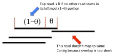

- The expected number of contigs is then N (number of reads) times the probability that a read is the rightmost read of an island, which is equivalent to their being no reads starting in $ (1 - \theta ) L

$$
\begin{array}{l} \mathbb {E} [ \# c o n t i g t i s ] = N \times P (\mathrm {n o r e a d p (n o r e a l s t a t s t i n f l u m a t s i n (1 - \theta) L / G ] \\ = N e ^ {- 1} \\ = N e ^ {- (1 - \theta) L / G} \\ = N e ^ {- 1} \\ \end{array}
$$

- Expected number of contigs depends on the average coverage $\lambda$ (x $-axis) and the degree of overlap$ \theta $ (colors):

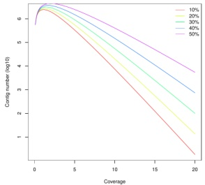

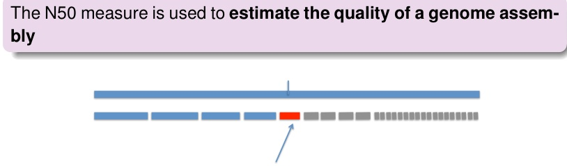

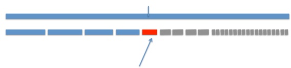

Arrange the contigs from largest to smallest

Find the position where the contigs cover 50% of the total genome size

The length of the contig at this position is defined as the N50

The longer the N50 is, the better the assembly (fewer gaps to cover half of the genome)!

## Königsberg

The "Hello World" of Eulerian graphs is of course Königsberg (founded by Teutonic knights; now Kaliningrad in Russia) with its seven bridges. Königsberg which were connected to each other and the mainland by seven bridges.

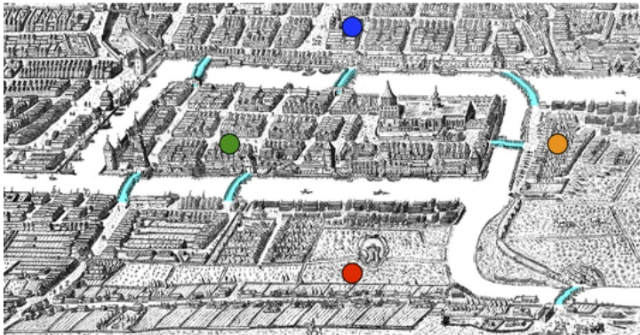

## Königsberg

The problem was to find a walk through the city that would cross each bridge once and only once

- In his 1736 paper $^{3}$ Swiss mathematician Leonhard Euler formulated the problem as a graph problem

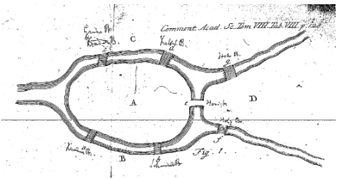

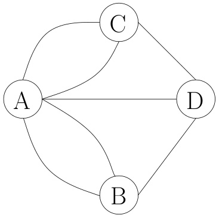

## Genome sequencing and graphs

Our goal today is to find an algorithm that will allow us to take a collection of short NGS sequence reads say, strings of 100-250nucleotides in length with the letters ACGT and to output a longer string representing the Genome that was sequenced.

- We will present several simplified scenarios with the goal of motivating and explaining the de Bruijn graph and its use in genome assembly algorithms

We will begin by discussing a ridiculously naive string reconstruction problem. Here, and in the following, the "string" will represent a genome that we have sequenced, and its k-mer subsequence (with k=3) will represent our short reads.

- Let's examine a small "genome" of only 17 nucleotides

## TCATTCTTCAGGTCAAA

## Naive genome assembly

Imagine we have a function called composition $k$ that takes a DNA sequence and returns a set of all k-mers contained in it

- In the following examples we will choose $k=3$

Composition $\mathrm{k}_{\mathrm{k}}$

$n_k(\text{k}$(TCATTCTTCAGGTCAA)$

TCA

CAT

ATT

TTC

TCT

TTC

CAG

GGT

AAA

## Naive genome assembly

However, we do not know the original order of the k-mers in the genome. Therefore, we show them lexicographically

Composition $_{k}$(TCATTCTTCAGGTCAGGTCAA)

"Genome order": "TCAATT TTC CAT ATT TTC TCTT TTCAGGTCACA"

"Lexicographic order"

```python

Composition_k(TCATTCTTCAGGTCAGGTCAGGTCACAAGG TGC TTCATCATACTT TTCATCAGGTCATCAGGTCATCAGTTCACGTGTCATCAGGTCATCAGGATCACGTACTTTCATCAGGGTGTCATCGAAGGATCACGATCACGATCAGGGTGTCATCAGGTCATCACGATCACGATCACGATCACGATCAGGTCATCAGGTCAGGTCAAA

```python

```

Let us now put each of the k-mers into the node of a graph and connect the graph by edges

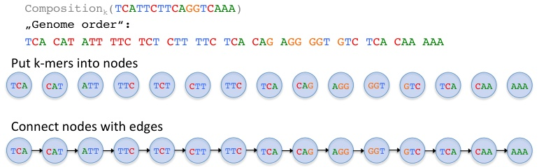


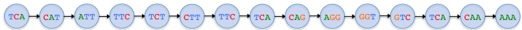

## Naive genome assembly

But what if the nodes are not connected? Can we reconstruct the original string if we only have the nodes and do not know their correct order?

TCATTCTTTCAGGTCAGGTCAAA


- Challenge: find the following sequence based only on a collection of 3-mer subsequences:

## TCATTCTTCAGGTCAAA

- The basic strategy to do this involves searching for overlaps between k-mers

- E.g., connect k-mer $i$ with k-mer_{i}$

$$
\operatorname {s u f i x f i f i x f i x i (k - m e r e r _ {i} = \mathrm {p r i t h e x i n g (k - m e r _ {i}) = prefix (k - m e r i j)
$$

## Naive genome assembly

## If we do not know the order of the nodes the task seems rather difficult...

TCATTCTTCTTCAGGTCAGGTCAAA

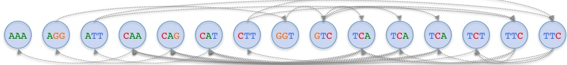

## Naive genome assembly

However, just to demonstrate how to generate a path that represents the sequence, let us pretend we are omniscient and start with the k-mer TCA and connect it to CAT and ATT

TCATTCTTCTTCAGGTCAGGTCAAA

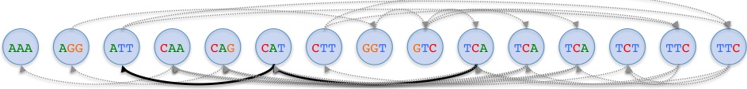

## Naive genome assembly

Continuing in this way ...

TCATTCTTCTTCAGGTCAGGTCAAA

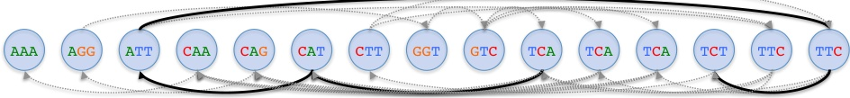

## TCATTCT

## Naive genome assembly

## Further ...

TCATTCTTCTTCAGGTCAGGTCAAA

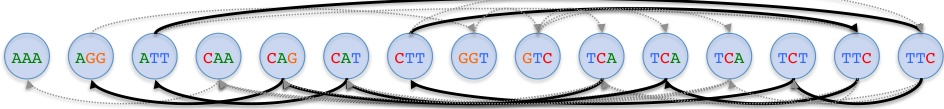

TCATTCTTTCAG

## Naive genome assembly

And finally ...

TCATTCTTCAG GTCAAA

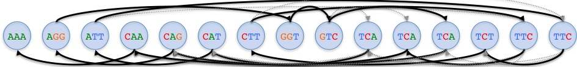

TCATTCTTCTTCAGGTCAGGTCAAA

## Naive genome assembly

## Notice that the solution to our problem was a path that visited every node exactly once!

TCATTCTTCAG GTCAAA

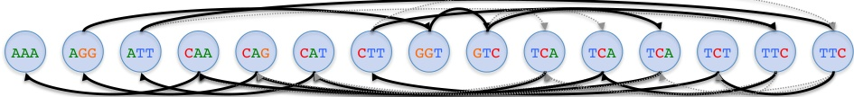

TCATTCTTCTTCAGGTCAGGTCAAA

## Hamiltonian path

A Hamiltonian path is a path in an undirected or directed graph that visits each vertex exactly once (no need to use all edges). A Hamilton cycle is a Hamiltonian path that is a cycle.

- Determining whether Hamiltonian paths and cycles exist a given graph is the Hamiltonian path problem, which is NP-complete. $^{4}.$

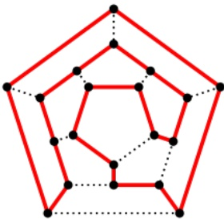

## Another approach

Instead of labeling the nodes with the k-mer subsequences, let us label the edges with these k-mers

TCATTCTTCTTCAGGTCAGGTCAAA


We will then label the nodes with the (k-1)-mers, i.e., 2-mer suffixes and prefixes

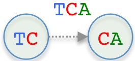

TCATTCTTCTTCAGGTCAGGTCAAA

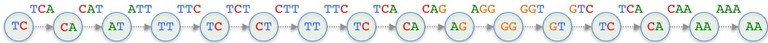

## Constructing a de Bruijn graph

Let us now merge identically labeled nodes in this graph. We will show the steps along the way for our example graph. A key idea is that we will merge identical nodes whilst retaining the edges!

TCATTCTTCAGGTCAAA

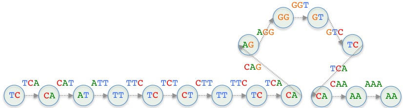

Here, we see two CA nodes, but also the upstream TC nodes are identical!

## Constructing a de Bruijn graph

Merge two CA nodes (and two TC nodes) whilst retaining their edges

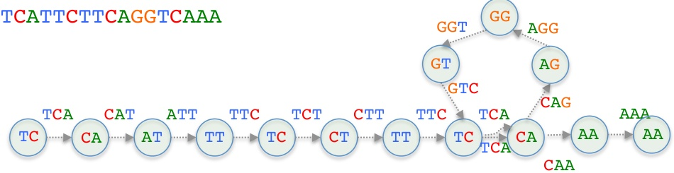

## Constructing a de Bruijn graph

## Continuing ... Merge two TC nodes whilst retaining their edges

## TCATTCTTCTTCAGGTCAAA

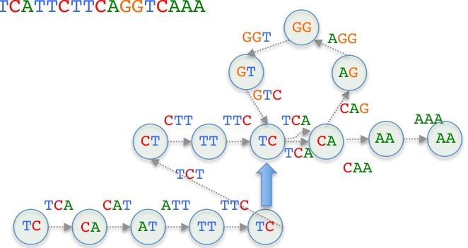

## Constructing a de Bruijn graph

Continuing ... Merge two TT nodes whilst retaining their edges

TCATTCTTCTTCAGGTCAAA

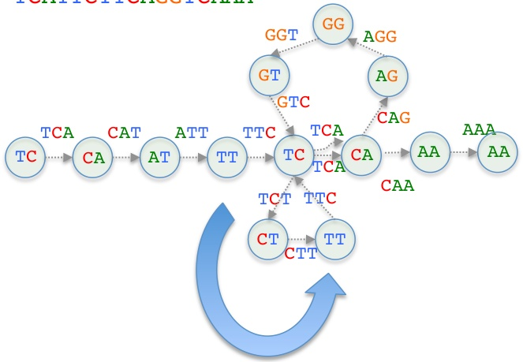

## Constructing a de Bruijn graph

Continuing ...

TCATTCTTCTTCAGGTCAAA

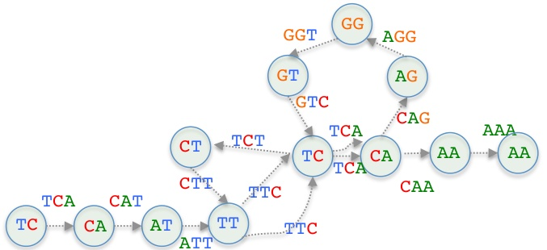

## Constructing a de Bruijn graph

Continuing ... Merge two CA (and two TC) nodes, retaining their edges

TCATTCTTCTTCAGGTCAAA

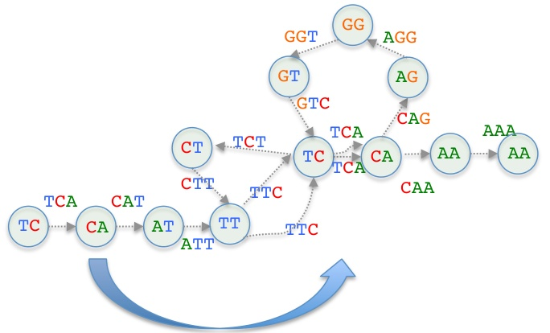

## Constructing a de Bruijn graph

Continuing ...

## TCATTCTTCTTCAGGTCAAA

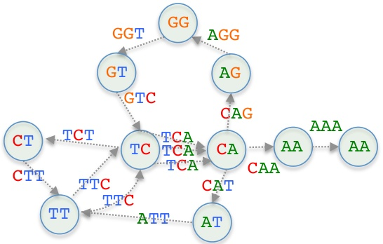

## Constructing a de Bruijn graph

Continuing ... Merge two AA nodes whilst retaining their edges

## TCATTCTTCTTCAGGTCAAA

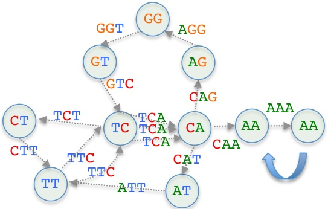

## Constructing a de Bruijn graph

Done; no other nodes to be merged!

TCATTCTTCTTCAGGTCAAA

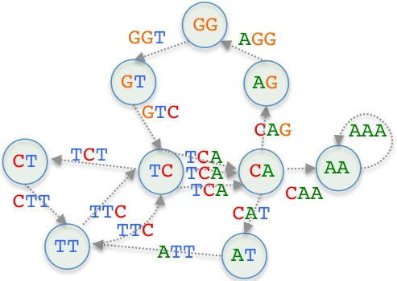

This is the de Bruijn graph (de Bruijn, 1946) of the string TCATTCTTCAGGTCAGGTCAGGTCAAA!

## Traversing a de Bruijn graph

Let us now examine how we might reconstruct the original sequence from this de Bruijn graph

## TCATTCTTCTTCAGGTCAAA

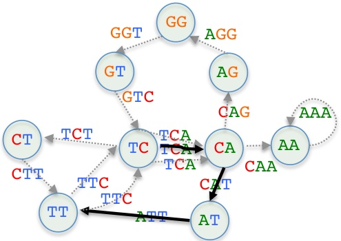

TCATT...

Follow the edges and write down the letters

## Traversing a de Bruijn graph

Continuing ...

## TCATTCTTCTTCAGGTCAAA

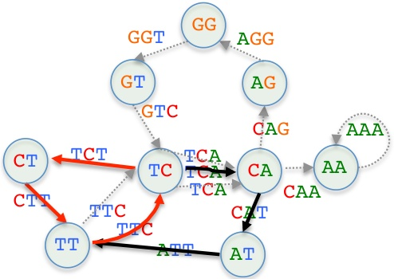

## TCATTCTT...

Follow the edges and write down the letters

## Traversing a de Bruijn graph

Continuing ...

TCATTCTTCTTCAGGTCAAA

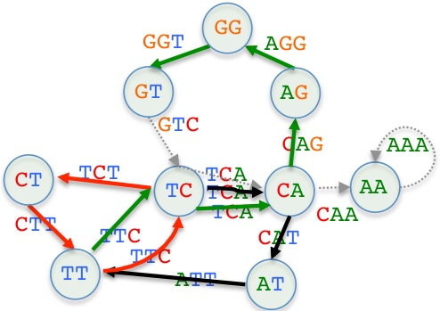

TCATTCTTCTTCAGGT...

Follow the edges and write down the letters

## Traversing a de Bruijn graph

Done! (We visited every edge exactly once!)

## TCATTCTTCTTCAGGTGCAAA

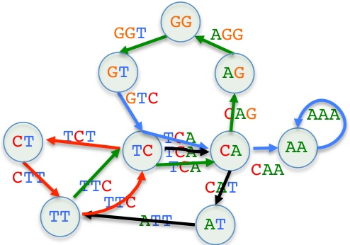

## TCATTCTTCTTCAGGTGCAAAA

Follow the edges and write down the letters

## Hamilton and Euler

So we have seen two potential methodologies for traversing a graph to reconstruct a sequence based on the Hamiltonian and the Eulerian path problem

TCATTCTTCTTCAGGTCAGGTCAAA

TCATTCTTTCAGGTCAGGTCAAAA

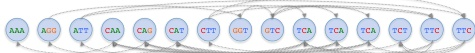


Hamiltonian path problem:

Find a path to visit each node exactly once (no need to use all edges)

TCATT...

Eulerian path problem:

Find a path to visit each edge exactly once (a node can be visited multiple times)

Which do we take?

The Eulerian path problem (is there a path that visits every edge exactly once?), and the Hamiltonian path problem (is there a path that visits every node exactly once) are superficially similar

It turns out that $^{5}$

- the Hamiltonian path problem is NP-complete

- but the Eulerian path problem has efficient algorithms to solve it

## Another example: "The Dr. Seuss-Ome"

To show a second example, we will adapt a brilliant idea of Michael Schatz (Cold Spring Harbor Laboratory, CHSL), who used the first sentence of Dicken's A Tale of Two Cities to illustrate De Bruijn graphs. We will, however, use a similar repetitive sentence from another author ...


Dr. Seuss (Theodor Seuss Theodor Seuss Geisel), American writer of children's books. I Can Read With My Eyes Shut! (1978)

## Shredded Seuss Reconstruction

Imagine Seuss accidentally shreds the first printing of I can read with my eyes shut!

The more that you read,the more things you will know.The more that you learn,the more places you'll go.


- Many different copies of the book are shredded into three word fragments ( "3-mer" subsequence)

- Start position of the fragments is random

- In the previously described example of the construction of a de Bruijn graph, we started from the original string ("genome"). But we actually don't have that! Goal: start from the fragments and find overlaps to reconstruct the Seussome

## The Dr. Seuss-Ome

more that you

## Greedy Reconstruction

more that you

more things you

- Let's try to reconstruct the original text on the basis of overlaps

- Start with an arbitrary fragment

- "Extend" the fragment with fragments whose 2-prefix matches the last 2-suffix

you read the

you learn the

things you will

you will know

will know The

We choose this 3-mer "at random"

## The Dr. Seuss-Ome

## Greedy Reconstruction


## The Dr. Seuss-Ome

## Greedy Reconstruction


## The Dr. Seuss-Ome

## Greedy Reconstruction


## The Dr. Seuss-Ome

Original 3-mer

2-mer vertices connected by edge labeled with 3-mer

the more things

the more

the more things

more things

- $G = (V, E)$

- $V$ : $all fragments of length k - 1$ (here: k - 1 = 2 $

- E: directed edges between consecutive subfragments with labels of length k (here: $k = 3$

- Note that vertices overlap by $k - 2 words (here:$ k - 2 = 1$

We will now construct a de Bruijn graph (DBG) from the Seussome as explained before

## The Dr. Seuss-Ome

more that you

more that you

more things you

Places youll go

read the more

that you learn

that you read

## DBG Reconstruction

the more places

the more things

things you will

you learn the

you read the

you will know

will know The

The more that you read, the more things you will know. The more that you learn, the more places you'll go.


A particular Eulerian tour of the graph reconstructs the original text but there are multiple such tours

## The Dr. Seuss-Ome

## DBG Compression

The more that you read, the more things you will know. The more that you learn, the more places you'll go.


After reconstruction, many edges are unambiguous and can be compressed

## de Bruijn Graph of k-mers

To summarize:

The de Bruijn graph of a collection of k-mers is a representation of every k-mer as an edge between its prefix and its suffix

- The nodes of the graph are thus the (k-1)-mer suffixes and prefixes

- All nodes with identical labels are merged (to have each node label only once), preserving edges

- Finally (and optionally), unambiguous paths (without diverging branches) can be compressed by uniting their nodes

## Eulerian cycles

An Eulerian cycle is a path that traverses every edge exactly once and returns at the end of the traversal to the start node


- Does this graph contain an Eulerian cycle?

## Eulerian cycles

A Eulerian cycle is a path that traverses every edge exactly once and returns at the end of the traversal to the start node


- Does this graph contain an Eulerian cycle?

## Eulerian cycles

A Eulerian cycle is a path that traverses every edge exactly once and returns at the end of the traversal to the start node


- Does this graph contain an Eulerian cycle?

## Traversable graph

A traversable graph is one that can be drawn without taking a pen from the paper and without retracing the same edge. In such a case the graph is said to have an Eulerian path (a trail in a graph which visits every edge exactly once)


<table border="1"><tr><td>Vertex</td><td>D</td><td>D</td><td>3</td></tr><tr><td>A</td><td>3</td></tr><tr><td>A</td><td>B</td><td>3</td></tr><td>C</td></tr><td>B</td></tr><tr><td>C</td></tr><tr><td>D</td></tr><tr><td>D</td></tr></table>

- Is this graph traversable? No, this graph does not have an Eulerian path!

## Traversable graph


<table border="1"><tr><td>Vertex</td><td>Degree</td></tr><tr><td>A</td><td>3</td></tr><td>A</td><td>3</td></tr><td>B</td><td>3</td></tr><td>C</td></tr><td>4</td></tr><td>C</td></tr><td>D</td></tr><td>E</td></tr><td></td><tr><td></td></tr><td></td><td></td><td>4</td><td>5</td></tr><td>6</td></tr><td>7</td></tr><td>8</td></tr><td>9</td></tr><td>10</td></tr><td>10</td></tr><td>1</td></tr><td>1</td></tr><td>1</td></tr><td>1</td></tr><td>1</td></tr><td>1</td></tr><td>1</td></tr><td>1</td></tr><td>1</td></tr><td>1</td></tr><td>1</td></tr><td>1</td></tr><td>1</td></tr><td>1</td></tr><td>1</td></tr><td>1</td></tr><td>1</td></tr><td>1</td></tr><td>1</td></tr><td>1</td></tr><td>1</td></tr><td>1</td></tr><td>1</td></tr><td>1</td></tr><td></tr></table>

- This graph has an Eulerian path from A to B or vice versa


<table border="1"><tr><td>Vertex</td><td>Degree</td></tr><td>A</td><td>4</td></tr><td>4</td></tr><td>B</td><td>4</td></tr><td>C</td><td>4</td></tr><td>F</td></tr><td>2</td></tr><td>2</td></tr><td>F</td></tr><td>2</td></tr><td>4</td></tr><td>4</td></tr><td>4</td></tr><td>4</td></tr><td>4</td></tr><td>2</td></tr><td>4</td></tr><td>4</td></tr><td>4</td></tr><td></td></tr><td></td></tr><td>4</td></tr><td>4</td></tr><td></td></tr><td></td></tr><td></td></tr><td></td></tr><td></td></tr><td></td></tr><td></td></tr><td></td></tr><td></td></tr><td></td></tr><td></td></tr><td></td></tr><td></td></tr></table>

- This graph has an Eulerian cycle

## Traversable graph

The pattern is related, of course, to the degrees of the vertices of the graph (degree = number of edges ending/starting at the vertex)

- When the degree of all the vertices is even, the graph is traversable and we can draw it starting at any vertex (Eulerian cycle)

In directed graphs: all vertices have degree $ in - degree outout edges!

- If there are exactly two vertices of odd degree and all other vertices are of even degree, there is a Eulerian path (starting at one of the odd vertices, but no cycle.

In directed graphs: one vertex has degree $\mathrm{in} - \mathrm{degree}_{in} - \mathrm{out} = 1$, one vertex has degree_{in} - degree_{out} = 1$

- If there are more than two odd vertices the graph cannot be traversed without repeating an edge

(Note: graphs with an uneven number of odd vertices are impossible!)

(Video on this: https://www.youtube.com/watch?v=xR4sGgwtR2I

## Finding an Eulerian path

We have constructed a de Bruijn graph from our sequencing data (k-mers taken from our sequenced reads), now what?

- We need to find an Eulerian path (visit all edges once) to reconstruct the genome or at least a contig!

- For undirected graphs: start at one of the two vertices with odd degree

- For directed graphs: start at the vertex with one more outgoing edge, end at the vertex with one more incoming edge!

- Let's ignore undirected graphs and look only at directed graphs (like a de Bruijn graph!)

- Note: if the graph has an Eulerian cycle, you automatically find it when searching for an Eulerian path! (You can start from any vertex)

## Hierholzer's algorithm

Other algorithms exist, but Hierholzer's can find an Eulerian path in linear time, i.e., $ O (E)!

Make sure the graph satisfies the degree requirements for an Eulerian path (or cycle) to exist

2 Initialize two stacks, a temporary stack "tpath" and a stack "epath" for the final solution (reminder: stack means "last in, first out", so it can be used for backtracking!

Choose a suitable starting vertex $\nu$ (the one with one more outgoing edge for an Eulerian path; any for a cycle)

4 Push $v$ to tpath

5 Let $u = \mathrm{tpath . TOP$ (i.e., last visited vertex)

Check: all outgoing edges from u have been visited?

Yes: pop $u$ from tpath and push it to epath

No: select a random outgoing edge $(u,x)$; push x $to tpath and delete the edge$(u,x)$

## 7 Repeat from step 5 until tpath is empty

The Eulerian path will be in epath (with the starting vertex on the TOP and the end vertex on the BOTTOM)!

## Hierholzer's algorithm: example


- Starting vertex: 1 (two outgoing edges, 1 incoming)

## Hierholzer's algorithm: example


- Starting vertex: 1 (two outgoing edges, 1 incoming)

- End vertex: 6 (1 outgoing edge, 2 incoming)

- tpath = TOP [6,5,3,1] BOTTOM

- epath = TOP [ ] BOTTOM

## Hierholzer's algorithm: example


- Starting vertex: 1 (two outgoing edges, 1 incoming)

- End vertex: 6 (1 outgoing edge, 2 incoming)

- tpath = TOP [4,2,3,6,5,1] BOTTOM

- epath = TOP [ ] BOTTOM

## Hierholzer's algorithm: example


- Starting vertex: 1 (two outgoing edges, 1 incoming)

- End vertex: 6 (1 outgoing edge, 2 incoming)

- tpath = TOP [6,4,2,3,6,5,1] BOTTOM

- epath = TOP [ ] BOTTOM

## Hierholzer's algorithm: example


- Starting vertex: 1 (two outgoing edges, 1 incoming)

- End vertex: 6 (1 outgoing edge, 2 incoming)

- tpath = TOP [4,2,3,6,5,1] BOTTOM

- epath = TOP [6] BOTTOM

## Hierholzer's algorithm: example


- Starting vertex: 1 (two outgoing edges, 1 incoming)

- End vertex: 6 (1 outgoing edge, 2 incoming)

- tpath = TOP [3,4,2,3,6,5,1] BOTTOM

- epath = TOP [6] BOTTOM

## Hierholzer's algorithm: example


- Starting vertex: 1 (two outgoing edges, 1 incoming)

- End vertex: 6 (1 outgoing edge, 2 incoming)

- tpath = TOP [2,1,3,4,2,3,4,2,3,6,5,1] BOTTOM

- epath = TOP [6] BOTTOM

## Hierholzer's algorithm: example


- Starting vertex: 1 (two outgoing edges, 1 incoming)

- End vertex: 6 (1 outgoing edge, 2 incoming)

- tpath = TOP [4,2,1,3,4,2,1,3,4,2,3,6,5,1] BOTTOM

- epath = TOP [6] BOTTOM

## Hierholzer's algorithm: example


- Starting vertex: 1 (two outgoing edges, 1 incoming)

- End vertex: 6 (1 outgoing edge, 2 incoming)

- tpath = TOP [2,1,3,4,2,3,4,2,3,6,5,1] BOTTOM

- epath = TOP [4,6] BOTTOM

## Hierholzer's algorithm: example


- Starting vertex: 1 (two outgoing edges, 1 incoming)

- End vertex: 6 (1 outgoing edge, 2 incoming)

- tpath = TOP [2, 1, 2,1,3,4,2,3,6,5,1] BOTTOM

- epath = TOP [4, 6] BOTTOM

## Hierholzer's algorithm: example


- Starting vertex: 1 (two outgoing edges, 1 incoming)

- End vertex: 6 (1 outgoing edge, 2 incoming)

- tpath = TOP [2,1,3,4,2,3,4,2,3,6,5,1] BOTTOM

- epath = TOP [2,4,6] BOTTOM

## Hierholzer's algorithm: example


- Starting vertex: 1 (two outgoing edges, 1 incoming)

- End vertex: 6 (1 outgoing edge, 2 incoming)

- tpath = TOP [4,2,3,6,5,1] BOTTOM

- epath = TOP [3,1,2,2,1,2,2,4,6] BOTTOM

## Hierholzer's algorithm: example


- Starting vertex: 1 (two outgoing edges, 1 incoming)

- End vertex: 6 (1 outgoing edge, 2 incoming)

- tpath = TOP [6,5,3,1] BOTTOM

- epath = TOP [3,2,4,3,1,2,4,3,1,2,4,6] BOTTOM

## Hierholzer's algorithm: example


- Starting vertex: 1 (two outgoing edges, 1 incoming)

- End vertex: 6 (1 outgoing edge, 2 incoming)

- tpath = TOP [1] BOTTOM

- epath = TOP [3,5,6,3,2,4,3,2,1,2,4,3,1,2,4,6] BOTTOM

## Hierholzer's algorithm: example


- Starting vertex: 1 (two outgoing edges, 1 incoming)

- End vertex: 6 (1 outgoing edge, 2 incoming)

- tpath = TOP [ ] BOTTOM

- epath = TOP [1,3,5,6,3,2,4,3,1,2,4,1,2,4,6] BOTTOM

## Hierholzer's algorithm: example


This example has been adapted from William Fiset's video at https://www.youtube.com/watch?v=8Mpo02zA214

- Check the video for additional explanations, hints for keeping track of available outgoing edges from the different vertices and a possible implementation (pseudocode)

## Problem 1: what k-mer size?

- How do we choose a value for k in real life?

- "Big enough": the k - 1 mer sequences should mainly be unique in the genome (i.e., possibly from only one specific genomic location)

E. g., each 3-mer has a very high frequency in the genome; but finding a given 50-mer multiple times is much less likely

- However, memory usage grows as $\mathcal{O}(nk k)$ for about $n\approx 3.2\times 10^{9}$ or $ $ $ $ nucleotides, k $-mer size$ k$ $ \mathrm{k} = 27 $, requiring about$ 10$ $ \frac{1}{4} $ $ k $ $ n k $bytes) of memory to store the nodes alone$

Note: 1 byte can be used to store 4 nucleotides (2 bits for each)

- Repeats in typical genomes are often larger than individual reads, so even if we could hope to sequence without errors, we would not quite yet have a complete solution to the assembly problem

- "Repeats" (repetitive sequences/elements) are patterns of nucleotides that occur in multiple copies throughout the genome, often as "tandem repeats which lie adjacent to each other (e.g., "CATCATCATCAT

[We have ignored this problem here ...]

## Problem 2: sequencing errors


(from: Li et al., 2012012012

- Let k=5

- The five 5-mers which crossed the erroneous base appear in low frequency (because the specific sequencing error occurs only on one read)

- The surrounding 5-mers appear in high frequency (because there will be correct 5-mers for this position from other sequencing reads)

- In practice, the situations are often more complex than this

## Problem 2: sequencing errors


There's a high number of erroneous k-mers due to sequencing errors, with only few copies each (red curve). Therefore, an obvious heuristic is to remove low-frequency k-mers from the assembly!

## More problems

Other problems need to be addressed (but we omit them here):

- Repetitive regions

- Strand ambiguity

- Whole-genome sequencing is typically not strand-specific, i.e., each read (and hence its k-mers) could be either from the forward strand or from the reverse strand or from the reverse strand (reverse complement!)

For a more realistic approach:

Pevzner PA, Tang H, Waterman MS (201) An Eulerian path approach to DNA fragment assembly. PNAS 98:974-98:9753

For a review of different genome assembly methods:

Sohn J-I & Nam J-W (2018) The present and future of de novo whole-genome assembly. Briefings in Bioinformatics 19(1):23-40

## References I


de Bruijn, N. G. (1946) A combinatorial problem

Indagationes Mathematicae 49:758-764

A combinatorial problem

Good, I. J. J. (194) Normal recurrring decimals, Journal of the London Mathematical Society 21(3):167-167-16


Sohn J.-I. & Nam J.-W. (2018)

The present and future of de novo whole-genome assembly

Briefings in Bioinformatics 19(1):23-40


Li Z., et al. (201201201 Comparison of the two major classes of assembly algorithms: overlap-layout-consensus and de-bruijn-graph Briefings in Functional Genomics 11(1)25-37