POLITECNICO

MILANO 1863

# Bioinformatics Algorithms Read mapping (part 1)

Rosario M. Piro (based on slides by Peter N. Robinson)

Dipartimento di Elettronica, Informazione e Bioingegneria (DEIB Politecnico di Milano

## Reference-based assembly

Considering DNA sequencing data (whole-genome sequencing or exome sequencing), referenced-based assembly often follows the goal of finding the differences between an individual's genome and the reference genome for the corresponding species, rather than characterizing the genome of that species in the first place

- A major application is in medical diagnostics

Somatic mutations in cancer

Germline mutations associated with hereditary disorders

...

- Other applications include the characterization of genetic variation in model organisms such as mice, or for plant and animal breeding programs

Note: apart from the identification of genetic variation, such as mutations, the concepts we will learn here are used also for related purposes, for example:

Measurement of gene expression by RNA sequencing (RNA-seq)

- Identification of DNA binding by transcription factors (ChIP-seq)

- Analysis of epigenetic marks (identification of DNA methylation; ChIP-seq of histone modifications)

## Identification of mutations with NGS data

Example of a "missene" mutation (change of amino acid)

A

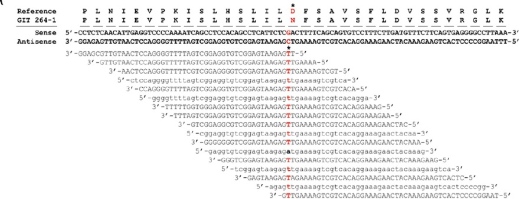

B

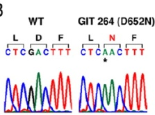

C

D652

H.s. S L I L I L I L D F S A V

M.m. S L I L D F S A V

O.c. L I D

B.t. g. I

G. g. I L I

L I L D F S A V

B. t

B. t

D. I

C. I L

D. I L

D. S T

I. V

A R

T E

R U

P O

U N

E

V I

N

A

T

I C

W

T

S I

T

I

D

S

I

T

I

S

T

I

S

I

T

I

S

I

I

V

L

I

V

L

I

V

L

I

D

I

V

I

D

S

I

V

I

I

V

I

V

I

D

S

I

V

I

V

I

V

I

V

I

D

I

S

T

I

I

I

D

I

T

I

S

T

I

S

T

I

I

T

I

I

I

I

I

S

T

I

I

I

I

I

I

I

I

I

I

I

I

I

V

I

V

V

I

V

V

V

V

V

V

V

V

V

V

V

V

V

V

V

V

V

V

V

V

D

E

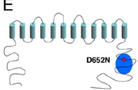

## Alignment of NGS reads

Example of a read alignment in the IGV Browser

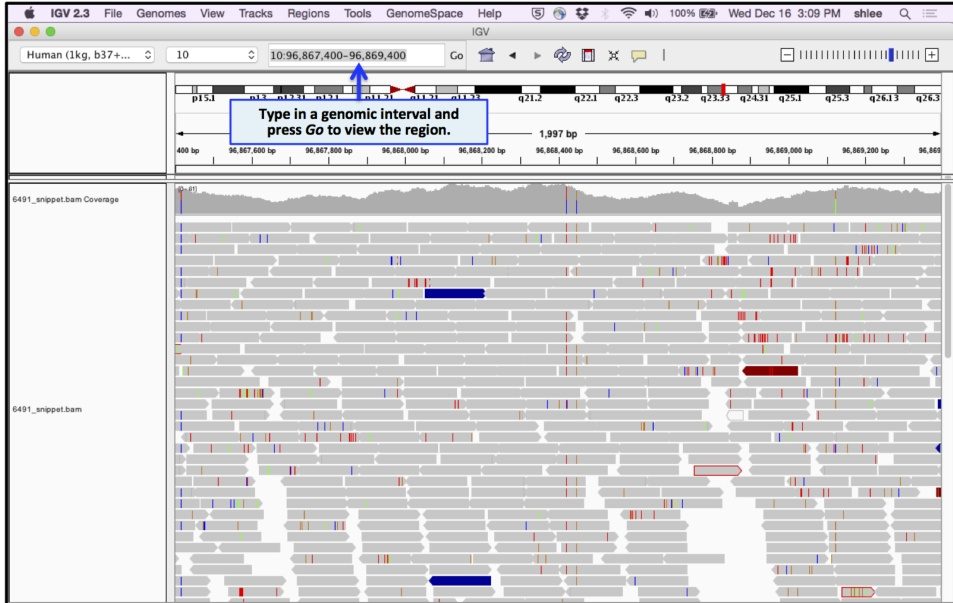

## Germline and somatic SNVs

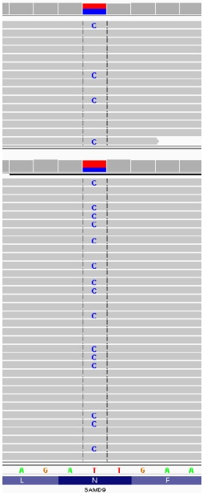

Germline mutation versus somatic mutation

- Left: SNV in the gene SAMD9

- Right: SNV in the gene KLF4

- Top: normal control sample (from the same patient)

- Bottom: tumor sample

(Both SNVs are "heterozygous", i.e., they don't affect both chromosome copies)

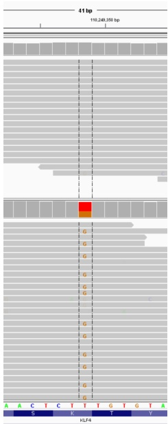

## Importance of a high coverage for variant calling

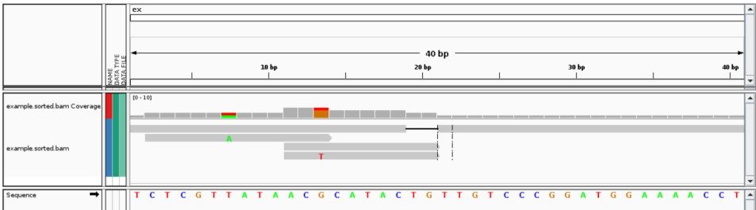

- Two base changes and one indel (short deletion of two bases)?

- BUT: are these really mutations or just sequencing/mapping errors??

"Variant calling":

- Computational identification of high-quality mutations from sequencing data

- Requirement: reads must be aligned/mapped to the reference genome

- We will use this as a motivation to align/map reads to the reference genome, but:

As already mentioned: read alignment / read mapping / reference-based assembly is useful also for purposes other than variant calling!

## A standard clinical test for personalized medicine?

- Precision medicine: stratification of patients based on large-scale data (e.g., DNA-seq), beyond classical "signs-and-symptoms approach (König et al, 2017)

- Personalized medicine: tailoring of medical treatment to the individual characteristics (e.g., genetic profile) of each patient; e.g., by predicting which medical treatments will be safe and effective for a patient (Cirillo & Valencia, 2019

- Genome (or exome) sequencing can be extremely useful for (some) patients with rare genetic diseases or cancer

- It is still not very useful for common genetic diseases (usually complex diseases with small contributions by individual mutations)

- But: Clinical NGS sequencing is rapidly gaining in importance in many areas

## So why not use de novo assembly?

- De novo assembly algorithms with de Bruijn graphs are computational demanding and error-prone

- We would like to use our knowledge about the reference human genome to guide alignment of NGS reads of individual humans

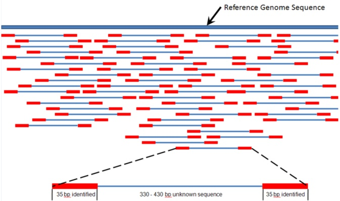

## Basic idea

Should we perform a local sequence alignment (Smith-Waterman)?

- Complexity: $\mathcal{O}(L \cdot G)$

- $L$ is the read length (up to a few hundred bases)

$G > 3$ billion bases (human genome)!$

Problem:

For each read, we'd need a huge matrix and compute hundreds of billions of intermediate alignment scores to find the best match ...

And: in NGS data we usually have (hundreds of) millions of reads!!!

## Better ideas:

- Faster search algorithms are based on preprocessing of the text (genome) to build a substring index

- Using the resulting data structure, occurrences of a pattern can be found quickly

- A substring index is a data structure which gives substring search in a text or text collection in sublinear time

Suffix tree

2 Suffix array

FM index

4 ...

## String searches

String matching algorithms identify the positions where one or multiple strings are found as substrings of a larger string

Classic book by Dan Gusfield:

"Algorithms on strings, trees,and sequences"

Cambridge University Press,1997

Note: in the following discussion of string search algorithms, we will first assume that the search pattern (read) matches perfectly to a substring in the full text (genome)!

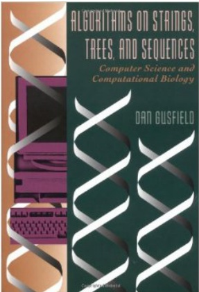

## Naive string search

Our "genome": bananasavannah (G characters) Our "read" (pattern): nas (L characters)

- The simplest string algorithm would simply slide the pattern across the genome, extending it letter for letter as long as there is a match

Bananasavannah nas

- Run time $\mathcal{O}(G \cdot L)$

Bananasavannah

nas

- Perfectly fine if we only have one read... but we have too many of them

Run time for $\ell$ \mathrm{reads} : \mathcal{O}(G\cdot \ell \cdot \ell \cdot L)$

Bananasavannahnas

- In practice $\ell \cdot L$ (=total number of sequenced bases) is much larger than G (e.g., for 30 G)

Bananasavannah

nas

Bananasavannahnasasnashanah nas

Let us now look at some slightly more intricate, but still naive ways of performing reference-based genome alignment

## Tries

A trie (from retrieval), is a multi-way tree structure useful for storing strings over an alphabet

banana$

- Usually pronounced like "try"

bandana$

- A data structure for representing a collection of strings

- Fast pattern matching within this collection

Let's make a trie for this collection of "reads"

A trie is defined formally as the smallest tree over an alphabet $\Sigma$ such that

- Each edge of the trie is labeled with one character $c \in \Sigma$

- A node has at most one outgoing edge labeled for each $c \in \Sigma$ (i.e., at most $|\Sigma$ outgoing edges)

- Each key (string contained in the trie) is "spelled out" along some path starting at the root (i.e., one-to-one correspondence to a path from the root to a leaf!)

Tries can be constructed to have all of the suffixes of some larger string be the keys

## Trie (1)

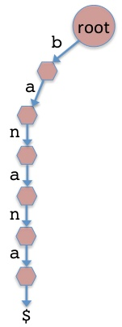

banana $bandana$

nasa $anna$

annex $Annex$

- Add each word to the trie one at a time

- The letters of the word label the edges, with one node/edge for each letter

- The dollar sign $ is a termination character

## Trie (2)

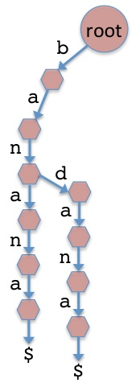

banana $bandana$

nasa $anna$

annexnex$

- Adding the second word: bandana

## Trie (3)

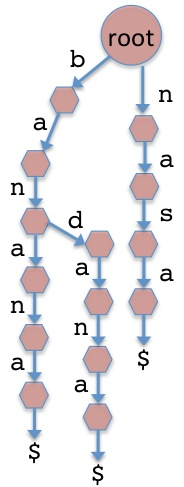

banana $bandana$

nasa $anna$

annex$

- Adding the third word: nasa

## Trie (4)

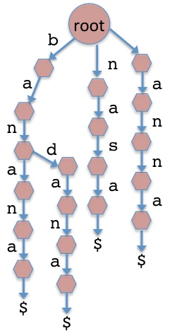

banana $bandana$

nasa $anna$

annex$

- Adding the fourth word: anna

## Trie (5)

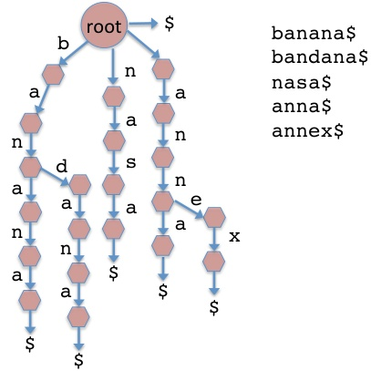

- Adding the fifth word: annex

- Important: adding the termination character $ as an empty word

## Trie (5)

Idea: can we construct such a trie for all sequencing reads and then use that trie to simultaneously search for them within the genome?

- Let us now use the trie to map reads to the genome:

Construct a trie from the reads

Instead of sliding individual reads down the genome one by one, we just slide the trie down the genome once

## Trie (6)

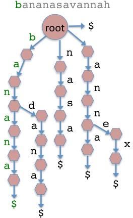

- Search for a pattern match starting at position 1 of genome

- Found banana

## Trie (7)

bananasavannah

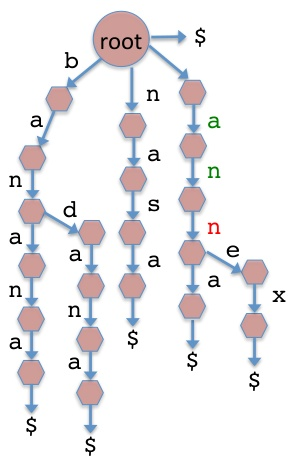

- Search for a pattern match starting at position 2 of genome

- No match (could only match the first two letters of anna $or annex$

## Trie (8)

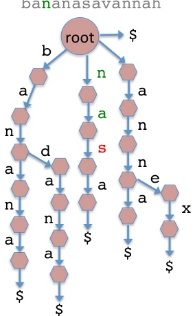

- Search for a pattern match starting at position 3 of genome

- No match (could only match the first two letters of nasa$

## Trie (9)

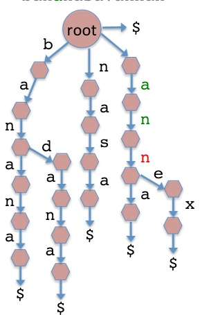

- Search for a pattern match starting at position 4 of genome

- No match (matched the first two letters of anna $/annex$

## Trie (10)

bana nasavannah

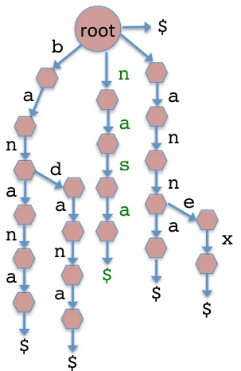

- Search for a pattern match starting at position 5 of genome

- Found nasa$ ... and so on ...

## Trie: that pesky dollar sign

$is a symbol that does not appear anywhere else in our genome template$ T (i.e., not part of our alphabet $ \Sigma)

- We define it to be lexicographically "less" than our other characters

- For instance, for nucleotide sequences we would have $ < A < C < G < T

- The $ enforces a lexicographic rule that we know from dictionaries: For instance, "over" comes before "overture"

- For instance, AC comes before AC because we are actually comparing AC $with ACG and by definition$ AC$

- $also ensures that no suffix will be considered as a prefix of any other suffix (e.g., "an" would be prefix of an"anna$" is not a prefix of any other suffix

This is important to make sure that each key or word in the trie has a one-to-one correspondence with one specific path from the root to a leaf!

- Example: the trie of the previous slide does not contain the individual word "an", because we don't have a path from root to leaf for that word; we'd need a path "root $\rightarrow a n \rightarrow$ "$!$"

## Trie

- So what have we gained?

- Recall the running time of the simple naive algorithm was $\mathcal{O}(G\cdot n_b)$ with

$\triangleright G$ being the genome length and

$n_{b}=\ell \cdot L$ being the combined length of reads (total sequenced bases) and $L$ the average read length

- If $L^{\prime}$ L^{\prime} $is the maximum length of any read, then the runtime of the trie algorithm is the$ \mathcal{O}(L^{\prime}\cdot G)$for matching and$ n_{b}$

But ... the amount of memory required for the trie is in the worst case proportional to the total length of the reads, which can be enormous: $\mathcal{O}(n_b)$

Can we flip the paradigm and preprocess the genome?

## Trie

In the previous example, we made a trie out of the "reads" and slid this trie across our "genome" to search for matches. Let us now examine another strategy that will take us to suffix trees and suffix arrays

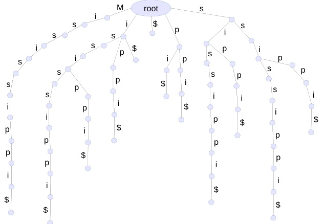

## Trie T: MISSISSIPPI

## T $: MISSISSIPPI$

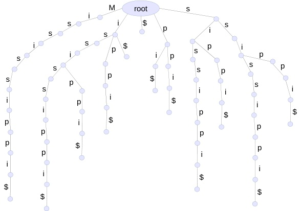

Instead of using different words for the trie, let's use all suffixes of $T$!$

- Hence, each path from the root to a leaf represents a suffix, and each suffix is represented by a path from the root to a leaf (including the full string and the empty suffix "$"!

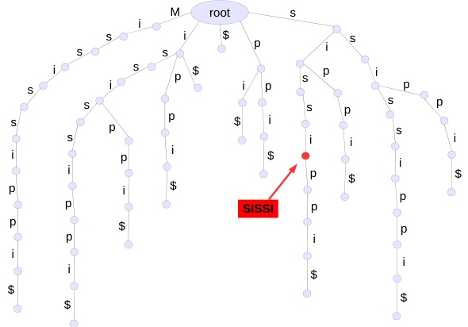

- The nodes have implicit labels that reflect the string of characters on the path from the root to the node

## Trie

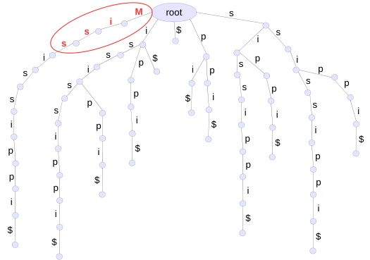

MISS is a substring of $T$

$MIST is not a substring of$ T$

- Each substring of $T$ is represented by a path from the root, i.e., every substring is a prefix of some suffix of $T$

- Thus to search for a substring S, start at the root and follow the edges labeled with the characters of S

- If at some point there is no outgoing edge for the next character of S, then S is not a substring of T

## Trie

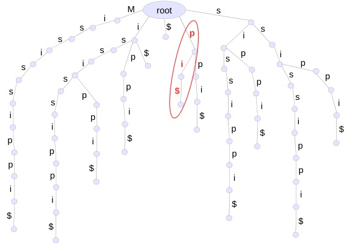

PI is a substring of $T$

PI is also a suffix of $T$

- A string S is a suffix of T if it is a substring and the final node on the walk has an outgoing edge labeled $

## Trie

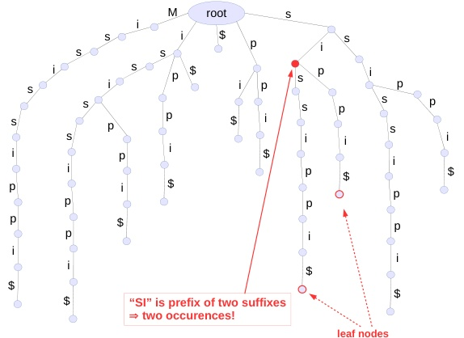

The substring SI occurs twice in $T!$

How often does "I" occur in T?

- How many times does some substring $S$ occur in $T?$

- Follow the path for S

- If we finish at some node n, then S occurs the same number of times as the number of leaf nodes in the subtree rooted at n

- Another reason why suffixes need a terminal "$"; e.g., check occurrences of "i" in$ T$

## Trie

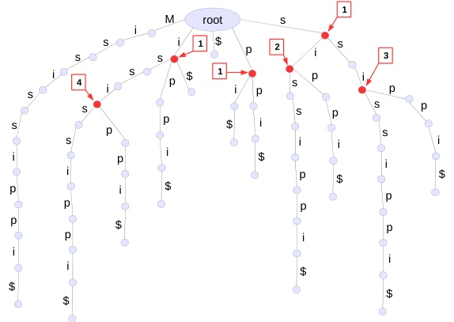

ISSI is the longest repeated substring

- What is the longest repeated substring S of T?

This is the depth of the deepest node with 2 or more children!

## Constructing a suffix trie

The naive algorithm is pretty simple to implement

# Algorithm 1 SuffixTrie($T$)

1: $T+ = \$

2: root = {}

3: **for**i=1 to i=length(T)$

4: n is current node

5: **for**n**

6: if c in n**then**

7: n**$**

8: **end for**

9: **return root**

## Searching a suffix trie

followPath returns the node at the end of the path or NULL if there is no path

# Algorithm 2 followPath(T, S)

1: root = SuffixTrie (T)

2: n is the current node

3: root = S

4: c = S[i] # i-th char of S

5: return NULL # not found

6: return n

7: return n

8: return n

9: return n

10: return n

10: return n

10: return n

10: return n

10: return n

## Searching a suffix trie

# Algorithm 3 hasSubstring(T,S)

1: n = followPath(T,S)

2: if n ≠ NULL then

3: return TRUE

4: end if

5: end if

- hasSubstring basically checks if followPath does not "fall off" the tree and return NULL

- One could write a similar function hasSuffix that would check if the node returned by followPath is not NULL and is equal to $

## Suffix trie: size complexity

We would like to know the limits for the size of a suffix trie

- How many nodes does a suffix trie have if the string it is based on has $m = | T|$ characters?

- Simplest case: a string of minimum complexity (repetition of the same character)

Consider the string $T = aaaa$ , i.e., m "a"s in a row

There is one root

There are m nodes with an incoming "a" edge

There are m+1 nodes with an incoming "$" edge

Total 2m+2 nodes, i.e., $\mathcal{O}(m)$ nodes

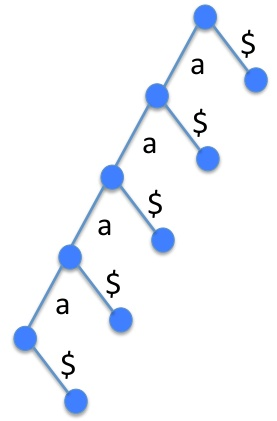

## Suffix trie: size complexity

We would like to know the limits for the size of a suffix trie

- How many nodes does a suffix trie have if the string it is based on has $m = | T|$ characters?

- Consider the string $T = AAABBB$ with $n=3$ "A"s, n=3 "$"B"$ and $m=2n$

There is one root

There are n nodes on the "B" chain (right)

There are n nodes on the "A" chain (middle)

There are n chains having n "B" nodes (hanging from each "A" node)

There are 2n+1 "$" nodes (not shown here; one for each suffix, including the empty suffix)

Total $n^{2}+4n+2$ nodes, i.e., $\mathcal{O}\left(n^{2}\right)$ nodes

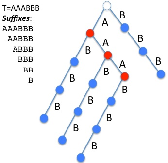

($ omitted for better readability)

## Suffix trie: size complexity

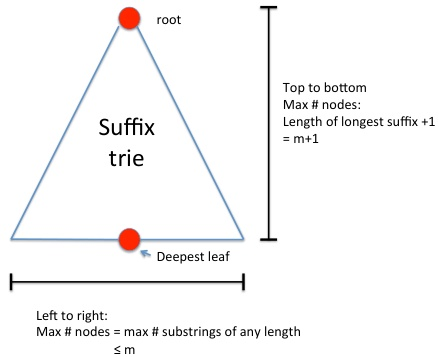

- Thus, we have seen two example string classes with size complexity (number of nodes that grow at $\mathcal{O}(m^{2})$

- The above figure shows that the worst case is $\mathcal{O} ( m^{2}$

Height: length of longest suffix (=original string!) + 1 (for the $) = m+1

Maximum width: maximum number of leaf nodes (= number of suffixes!) = m

- On real life data, the number of nodes grows more than linearly but less than quadratically - still usually too much to be practical ...

Remember: human genome has >3 billion "letters"

## Suffix trie: size complexity

The challenge of algorithmic development for NGS read aligners/mappers is basically to make string indices smaller and faster. We will go through various ideas that take us from the suffix trie to the suffix tree ...

- Combine non-branching paths into a single edge with a string label

- Replace the string label with $\mathcal{O}(1)$ references to the original "genome" string

- $\mathcal{O}(n)$ "online" method for constructing suffix tree (Ukkonen, 1995)

## From suffix trie to suffix tree

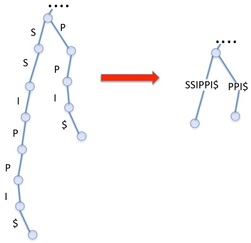

- Combine non-branching paths into a single edge with a string label

- This clearly reduces the number of nodes and edges

- As a side effect, it ensures that all internal nodes have more than one child node

## From suffix trie to suffix tree

- Example: $T=MISSISSIPPI$

$m=\operatorname{length}(T)=1 2$ (including the termination character $)$

- Once non-branching paths are combined into single edges, what is the effect on the number of leaves and internal nodes?

## From suffix trie to suffix tree

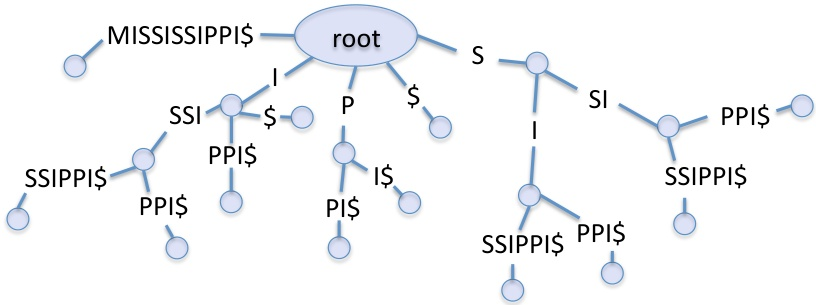

- We have the root node and m leaf nodes (obvious, since we have m suffixes)

- What can we say about the number of internal nodes?

If a full binary tree has m leaf nodes, it has exactly $m-1$ internal nodes

Our tree has at most as many internal nodes as a full binary tree If an internal node has > 2 children then we have fewer parent nodes!

- Thus, there are $\leq 2m$ total nodes, i.e., $\mathcal{O}(m)$ nodes

$m$ [suffixes] + 1 [root] + ( \leq m - 1 ] [internal nodes] $

- Edges? Each leaf and internal node has one incoming edge, so $ \leq 2 m - 1!

## From suffix trie to suffix tree

- Thus, the number of nodes is now linear in the size of the input

- BUT: the total length of the edge labels is still $\mathcal{O}\left(m^{2}$

## From suffix trie to suffix tree

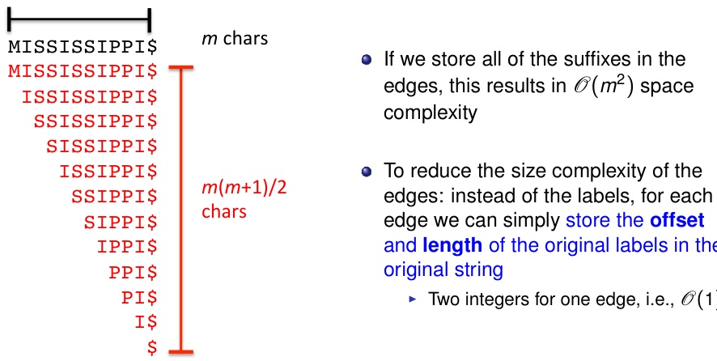

## From suffix trie to suffix tree

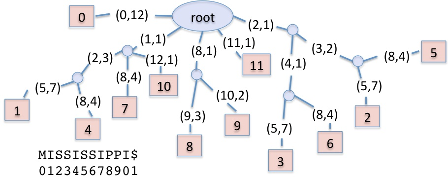

- For each edge we store the offset and length of the corresponding labels

- We additionally store the offset of the full suffixes in the leaves

- Examples:

The longest suffix (top left) has offset zero (and length 12)

- Top right path: (2,1) => "S"; (3,2) => "SI"; (8,4) => "PPI $"

    Overall offset: 5 (for "SSIPPI$")

## From suffix trie to suffix tree

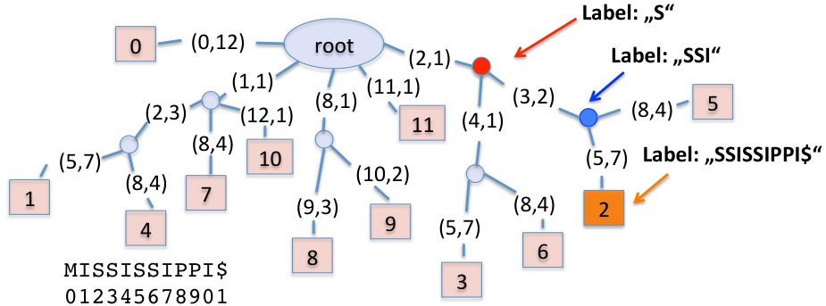

- The node label is the concatenated edge labels from the root to the node

Example, leaf 5: (2,1) $>$ "S"; (3,2)="S"; (3,2)="SI"; (8,4)="PPI $"$"

Example, leaf 2: (2.1) $> "S"; (3,2)="SI";$"SSIPPI$"

Thus, the total label for the path to the blue node is: "S" + "S" + "SI" = "SSI"

- As mentioned, the labels are not stored explicitly

They can be directly looked up in the original string (using offset and length)

## From suffix trie to suffix tree

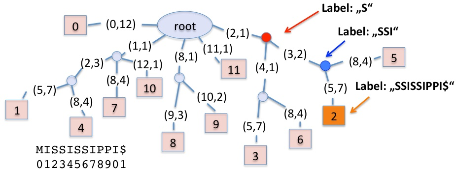

- Node depth: number of edges from the root to a given node

- Label depth: total length of edge labels (characters) on a path from the root to a given node

- Example for the blue node

Node depth = 2 (two edges)

Label depth = 3 (1 + 2; sum of label lengths along the path)

## How to build a suffix tree

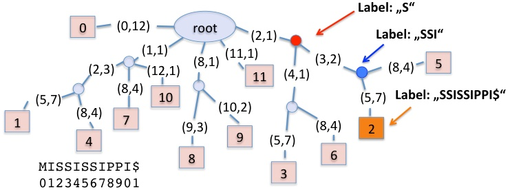

- Naive method 1: first build a suffix trie and then convert it to a suffix tree by combining non-branching paths and relabeling the edges

- Naive method 2: directly build a suffix tree one suffix at a time (first add entire string, then the suffixes starting at position 1, 2, 3, ...

- These methods take $\mathcal{O}(m^{2})$ time.

- Is there a difference in the space complexity of the two methods?

## How to build a suffix tree

One of the most elegant algorithms around is Ukkonen's linear time online suffix tree construction algorithm (Ukkonen, 1995; see also Gusfield's book for a detailed description)

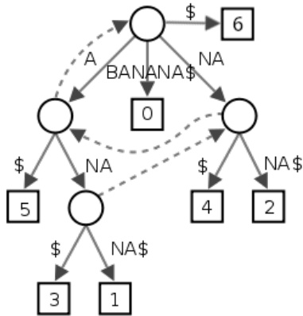

- Memory and time for construction are linear, i.e., $\mathcal{O}(m)$

- No details here ...

- Basic idea: shorter suffixes are the final parts of longer suffixes, so there is some redundancy in the suffix tree!

Here, for example: the subtree for "NA $" and "NANA$" and "A$" is repeated twice.

- Also the subtree with "$" and "NA$" is used several times, here (see dashed arrows)

## Suffix tree: find all matches of P in T

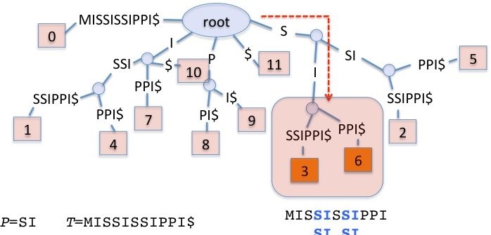

Walk down path corresponding to P Visit all leaf nodes in subtree (DFS)

- Let $T$ be our "genome" and $P$ be a "sequencing read"

- Let k be the number of matches and n be the length of the pattern P

- The search is then $\mathcal{O}(n+k)$

- Note, the subtree where we stop has $\mathcal{O}(k)$ nodes and depth first search (DFS) to enumerate these nodes is linear time

## A note on "generalized" suffix trees

- It may make sense to build a combined suffix tree from more than one input string

For example: the human genome is composed of multiple chromosomes, thus it can be represented by a set of strings" (one per chromosome)!

- Construction:

- Instead of using one termination character, we use $k$ different termination characters, one for each input string!

★ E.g., "$" for chromosome 1, "#" for chromosome 2,...,"%" for chromosome Y

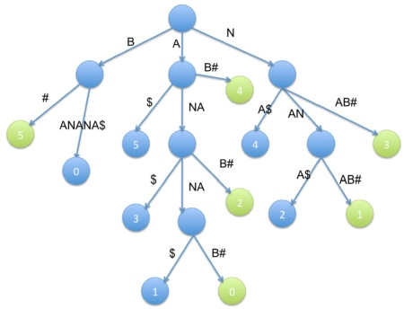

- Example: $T_{1}=\mathrm{banaanab$

## Difference to trees from single strings:

Each leaf is labeled with two integers to identify the input string from which the suffix originates (here illustrated by color instead of an integer), and the position of the suffix within that string

- Also each edge is additionally labeled with an integer to identify the input string

Note: using different terminators ensures that each suffix of each string corresponds to a distinct leaf!

## A note on "generalized" suffix trees

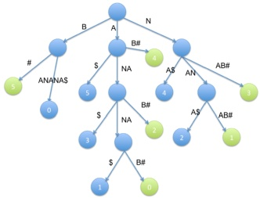

- Example: $T_{1}=\mathrm{banana}\$ ,$ T_{2} = \mathrm {ananab$

- Pattern matching works as the same way:

- Leaf nodes indicate in which input strings and at what positions a search pattern occurs

- The generalized suffix tree provides the best solution to different problems related to string comparison:

- Longest common substring problem: longest common label depth with leaf nodes from all input strings; in our example: "ANANA" with leafs "$" and "B#"

- Longest palindrome substring of a string (see $T_{1} and$ T_{2}$ in our example :-)

- Longest reverse complementary pair of substrings in an RNA sequence (any idea?)

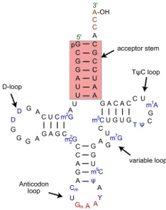

## Suffix tree: back to the real world ...

Question: can we use suffix trees for read mapping (=alignment to reference genome)?

- Although a linear algorithm (i.e., $\mathcal{O}(n)$ is desirable, the big-O notation tells us nothing about the constant factor

$\triangleright \mathcal{O}(n)$ means $c\times n+d$; if the factor $c$ is too high, the algorithm will still be unpractical

- The constant factor is relatively high for suffix trees

Up to over 20 bytes per node for naive implementations

Practical implementations reach about 12.5 bytes per node

Can be relatively impractical for indexing say the human genome ( $ n > 3 billion!

- So, we still need a more efficient approach, but we want to exploit the same principles!

Consider reads or search patterns as "prefixes of suffixes"

Having a very quick way of identifying all suffixes in the genome

★ We need to index the genome based on all suffixes

## If you want to "play" with suffix trees:

https://visualgo.net/en/suffixtree

## Suffix arrays

The suffix array, at least in its simplest incarnation, requires only 4 bytes per character of the input sequence. We will discuss some of the algorithms surrounding suffix arrays here in preparation for our treatment of BWT algorithms for read mapping

Notation:

- We will refer to our string $T="MISSISSIPPI$ as $T=[0, \dots N-1]$ with $N=12$

Alternatively, we might also use a 1-based indexing, i.e., $ T[1\dots N]

- The suffixes of this strings are: $T[0 \dots N - 1], T [1 \dots N - 1 ], \dots N - 1 ], \dots , T [ N - 1 ], \dots N - 1 ],$

- A naive implementation of the suffix array basically manipulates an array of pointers to the suffixes of $T!$ (In our case: pointer = index where suffix starts)

## How to build a suffix array (naive)

T: MISSISSIPPI $0: MISSISSIPPI$

1: ISSISSIPI $2: SSISSIPPI$

3: SISSIPPI $4: ISSIPPI$

5: SSIPPI $6: SIPPI$

7: IPPI $8: P$

Step 1: Form all possible suffixes from the input string $T=MISSISSISSISSISSISSISSIPI$

Important: with each suffix associate its position/index in the original string

E.g., IPPI starts at position 7 (0-based)

• Step 1: Form all possible suffixes from the input string $T=MISSISSIPPI$

• Important: with each suffix associate it’s position/index in the original string

• Step 1: Form all possible suffixes from the input string $T=MISSISSIPPI$

• Important: with each suffix associate its position/index in the original string

• Important: with each suffix associate it's position/index in the original string

• E.g. IPPI starts at position 7 (0-based) starts at position 7 (0-based)

• Important: with each suffix associate its position in the original string

## How to build a suffix array (naive)

0: MISSISSIPPI $11:$

1: ISSISSIPI $10: ISSISSIPI$

1: ISSISSIPI $10: MISSISSIPI$

2: SSISSIPI $10: I$

1: ISSISSIPI $0: ISSISSIPI$

1: $1: ISSISSIPI$

1: ISSISSIPI $2: SSISSIPI$

3: SISSIPI $0: MISSISSIPI$

11: $1: ISSISSIPI$

0: MISSISSIPI $1: ISSISSIPI$

0: MISSISSIPI $1$

1: ISSISSIPI $1: ISSIPI$

0: MISSISSIPI $1:$

1: ISSISSIPI $0: MISSISSIPI$

1: SSIPI $1:$

1: ISSISSIPI $0: MISSISSIPI$

1: ISSIPI $sort

1: ISSISSIPI$

1 $1: ISSISSIPI$

0: MISSISSIPI

1: ISS

1: ISSISS

1$

0: MISSISSIP

0: MISSISSIP

0: MISS

0: MISS

0: MISS

0: MISS

0: MISS

0: MISS

0: MISS

0: MISS

0: MISS

0: MISS

0

1: ISS

1: ISS

## Step 2: Sort lexicographically (e.g., radix sort)

As before, the termination symbol $ comes before all other symbols

Sort the information of the starting positions together with the suffixes!

We actually keep only the array of indices (11, 10,7,...), not the suffixes!

- Effect: we bring repeated substrings together!

- This suggests a search algorithm to find all occurrences

1 Suffix sort the text

2 Binary search for the query (e.g., "ISSI") and scan until mismatch

## MISSISSIPPI$

Consider the naive approach:

- Try all indices i and j of a string with N characters

- Compute the longest common prefix for each pair

- Complexity $\mathcal{O}\left(DN^{2}\right)$ where $D$ is the length of the longest match

## Suffix array

Longest repeated substring problem

0: MISSISSIPPI $11:$

1: ISSISSIPI $10: ISSISSIPI$

1: ISSISSIPI $10: MISSISSIPI$

2: SSISSIPI $10: I$

1: ISSISSIPI $0: ISSISSIPI$

1: $1: ISSI P$

1: ISSISSIPI $1: ISSIPI$

2: SSISSIPI $3: SISSIPI$

4: ISSIPI $0: MISSISSIPI$

1: ISSISSIPI $0: MISSISSIPI$

11: $1: ISSISSIPI$

0: MISSISSIPI $1: ISSI$

1: $1: ISSISSIPI$

1: ISSI $0: MISSISSIPI$

sort

1: ISSI $1: ISSI$

1: ISSI $1: ISSI$

sort

sort

0: MISSISSIPI $sort

1: ISSISSIPI$

sort

0: MISSISSIPI $sort

0: MISSISSIPI$

sort

sort

0: MISSISSIPII

sort

0: MISSISSISSIP

sort

0: MISSISSIP

sort

0: MISSISSISSIP

sort

0: MISSISSISS

sort

0: ISSISS

sort

0: ISS

1: ISS

1: ISS

1: ISS

1$

1: ISS

1: ISS

1: ISS

1: ISS

1: ISS

1: ISS

1: ISS

1: ISS

1: ISS

1: ISS

1: ISS

1: ISS

1: ISS

1: ISS

1: ISS

1: ISS

1: ISS

1: ISS

1: ISS

1: ISS

1: ISS

1: ISS

1: ISS

1: ISS

1: ISS

1: ISS

0:

Using a suffix array instead:

- Easy if we have a suffix array of the input string

- Scan through the list to find neighbors with the longest common prefix

While in the original string the occurrences of the longest repeated substring can appear at arbitrary positions, in the suffix array they will always be consecutive (lexicographically sorted)!

Thus: the complexity is $\mathcal{O}(DN)$ instead of $\mathcal{O}(DN^2)$

## How to build a suffix array (Manber and Myers)

- The naive method for constructing the suffix array is not very efficient

- There are linear time construction algorithms (see Shrestha et al., 2014

- We will instead present the simpler $\mathcal{O}(n\log n)$ algorithm that was described in the paper which first introduced suffix arrays (Manber & Myers, 1990)

## Manber Myers algorithm

Initialization: sort only the first character of the suffixes (using key-indexed counting sort)

Recursive phase (i): given an array of suffixes sorted on the first $2^{i-1}$ characters, create an array of suffixes sorted on the first $2^{i}$

Thus: sort 1, 2, 4, 8, 16, ... characters

We can perform a single phase in linear time

## How to build a suffix array (Manber and Myers)

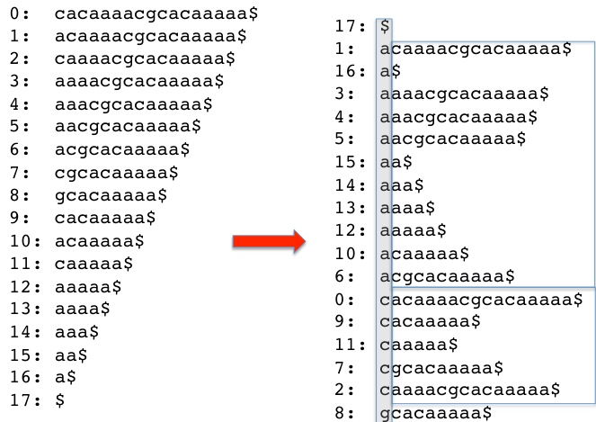

Initialization: radix sort on first character $(2^{0}$

## How to build a suffix array (Manber and Myers)

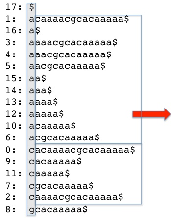

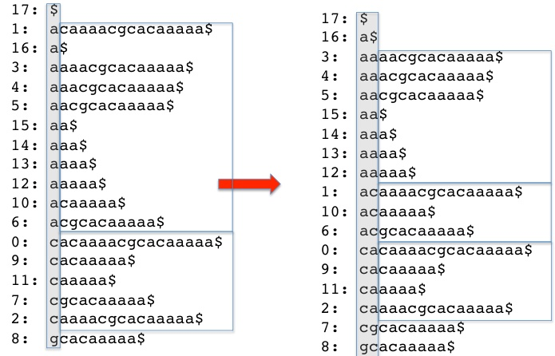

Step 1: radix sort on first two characters $(2^{1}$

## How to build a suffix array (Manber and Myers)

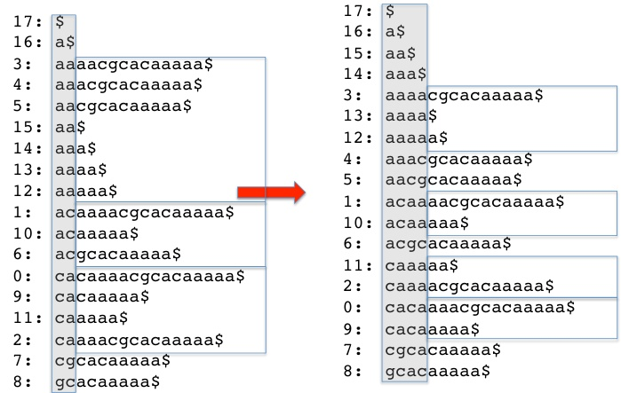

Step 2: radix sort on first four characters $( 2^{2}$

## How to build a suffix array (Manber and Myers)

17: $$

17: $16: a$ 16: a $15: aa$

14: aaaa $13: aaaa$

16: aa $15: aa$

12: aaaaa $13: aaaacgcaccaaaaaa$

10: acgcacaaaaa $14: acgacaaaaa$

15: cacaaaaa $16: acgacaaaaa$

14: acgacaaaaa $15: acgacaaaaa$

15: acacaaaaa $14

15: acgcacaaaaa$

15: acacaaaaa $16: acgacaaaaa$

14: acgacaaaaa $15: acacaaaaa$

14: acgacacaaaaa $15: acacaaaaa$

14: acacaaaaa$

2: acacaaaaa

15: acacaaaaa

15: acacaaaaa

6: acacg

7: cgcacaaaaa

8: gcacaaaaa

9: acacaaaaa

10

11

10: ac

10: ac

10: ac

1: ac

1: ac

1: ac

2: ac

2: ac

3: ac

3: ac

4: ac

4: ac

5: ac

6: ac

7: ac

8: ac

9: ac

9: ac

10: ac

10: ac

1: ac

2: ac

3: ac

1: ac

2: ac

3: ac

1: ac

2: ac

3: ac

3: ac

4: ac

4: ac

5: ac

1: ac

1: ac

1: ac

1: ac

1: ac

2: ac

1: ac

1: ac

1: ac

2: ac

3: ac

3: ac

2: ac

4: ac

4: ac

5: ac

1: ac

1: ac

1: ac

1: ac

1: ac

1: ac

1: ac

1: ac

1: ac

2: ac

1: ac

1: ac

2: ac

1: ac

1: ac

2: ac

1: ac

3: ac

1: ac

1: ac

1: ac

1: ac

1: ac

1: ac

1: ac

2: ac

2: ac

2: ac

2: ac

2: ac

2: ac

2: ac

2: ac

3: ac

3: ac

2: ac

3: ac

3: ac

2: ac

3: ac

3: ac

2: ac

2: ac

2: ac

2: ac

2: ac

2: ac

2: ac

2: ac

1: ac

1: ac

1: ac

3: ac

3: ac

3: ac

3: ac

3: ac

3: ac

3: ac

3: ac

3: ac

4: ac

4: ac

4: ac

4: ac

4: ac

4: ac

4: ac

4: ac

4: ac

4: ac

4: ac

4: ac

4: ac

4: ac

4: ac

4: ac

4: ac

4: ac

4: ac

4: ac

4: ac

4: ac

4: ac

4: ac

4: ac

5: ac

5: ac

5: ac

5: ac

5: ac

5: ac

5: ac

5: ac

6: ac

6: ac

7: ac

8: ac

8: ac

9: ac

1: ac

1: ac

2: ac

1: ac

1: ac

2: ac

1: ac

1: ac

1: ac

2: ac

1: ac

1: ac

1: ac

1: ac

1: ac

1: ac

1: ac

1: ac

1: ac

1: ac

1: ac

1: ac

2: ac

2: ac

2: ac

2: ac

2: ac

2: ac

2: ac

2: ac

2: ac

2: ac

2: ac

3: ac

3: ac

3: ac

3: ac

3: ac

3: ac

3: ac

3: ac

3: ac

2: ac

2: ac

2: ac

2: ac

2: ac

3: ac

3: ac

3: ac

3: ac

3: ac

3: ac

3: ac

3: ac

3: ac

3: ac

3: ac

3: ac

4: ac

4: ac

4: ac

4: ac

4: ac

4: ac

4: ac

4: ac

4: ac

4: ac

4: ac

4: ac

4: ac

4: ac

4: ac

4: ac

4: ac

4: ac

4: ac

4: ac

4: ac

4: ac

4: ac

5: ac

5: ac: 3: a

5: ac

6: ac

6: a

7: ac

8:

Step 3: radix sort on first eight characters $(2^{3}$

## How to build a suffix array (Manber and Myers)

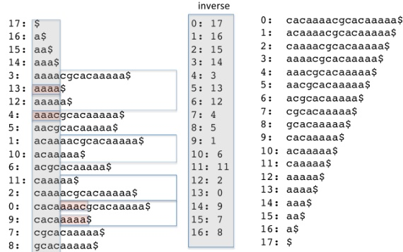

- To sort by 8-mers we can reuse information we have from sorting 4-mers!

- Example: sort the suffixes 0 and 9 ("cacaaaac...$" and "cacaaaaa$")

The first four chars are sorted, se we only need to care about the last four chars

But these last four chars were sorted previously! (They are prefixes of other suffixes!)

To get the index of the second four chars of suffix 0, we look at the suffix at 0+4=4 (rank 7 in sorted list); and for suffix 9, we look at rank 5 in sorted list)

Thus, without comparing the last four chars, we know that suffix 9 comes first!

## References I

Cirillo D. & Valencia A. (2019 Big data analytics for personalized medicine Curr. Opinion 58161-161-167

Gusfield D. (197) Algorithms on strings, trees, and sequences (book Cambridge University Press, 1997

König I.R. et al. (2017)

What is precision medicine?

Eur. Respir. J. 504:1700391

Manber U. & Myers G. (1990) Suffix arrays: a new method for on-line string searches First Annual ACM Symp. on Discrete Algorithms. pp. 3195-932(5) 9:93-48, 195-98, 198, 193-4, 193-4, 193-4, 193-4, 193-4, 193-4, 193-4, 193-5, 193-4, 193-5, 193, 193-4, 193, 193, 193, 1, 1, 4, 4, 4, 5, 6, 7, 1, 5, 1, 4, 6, 7, 1, 1, 1, 4, 5, 6, 7, 1, 1, 1, 1

Shrestha A.M. et al. (2014) A bioinformatician's guide to the forefront of suffix array construction algorithms Brief. Bioinformatics 15(2):138-154

Ukkonen E. (195) On-line construction of suffix trees Algorithmica 14(3):24-26