POLITECNICO

MILANO 1863

# Bioinformatics Algorithms Read mapping (part 2)

Rosario M. Piro (based on slides by Peter N. Robinson)

Dipartimento di Elettronica, Informazione e Bioingegneria (DEIB Politecnico di Milano

## Burrows Wheeler Transform (BWT)

The BWT applies a reversible transformation to a block of input text. The transformation does not itself compress the data, but reorders it to make it easy to compress with simple algorithms such as move-to-front coding

Original publication: Burrows & Wheeler, 1994

## The significance of the BWT for most of the world is its use for data compression

Leads to a block-sorted data structure (runs of repeated characters)

E. g., basis for the bzip2 compression algorithm

## Basis for many of the read mapping algorithms in common use today

The obtained block-sorted data structure is also well suited to searching short strings in a larger text (here: reads in a genome)

The FM index uses the BWT, the suffix array and additional data structures to enable search with time linear in the length of the search string (length of the read! see Ferragina & Manzini, 20000000000

## Burrows Wheeler Transform (BWT)

## First step: form all rotations of the input text $T$

Note that as with the suffix array and suffix tree, we append a termination character $ to the end of the text

T="abracadabra $"

```text

0: abracadabra$

1: bracadabra $2: racadabra$ a

3: acadabra $abra$

4: adabra $5: adracada

6:$ abracadabra $7:$ abracadabra $8:$ abracadabra $9: abracadabra$

10: a $abracadabra$

10: abracadabra $10: abracadabra$

10: abracadabra

```bash

$abracadabra$

```bash

abracadabra

```bash

abracadabra

abracadabra

abracadabra

abracadabra

abracadabra

abracadab

abracadabra

abracadabra

abracadab

abracadab

abracadab

abra

abracadab

abra

abracadab

abra

abracadab

abra

abra

abracadab

abra

abra

abracadab

abra

ab

ab

ab

ab

## Burrows Wheeler Transform (BWT)

## Second step: Sort the rotated strings lexicographically The result is the Burrows Wheeler matrix

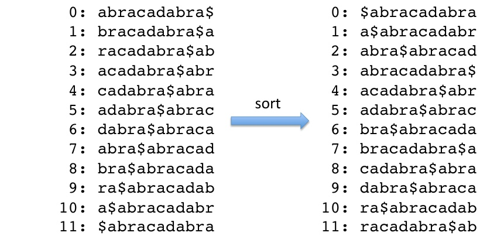

Recall that, lexicographically the termination character $ comes before every other character!

## Burrows Wheeler Transform (BWT)

Third step: The Burrows Wheeler Transform is simply the last column of the Burrows Wheeler matrix

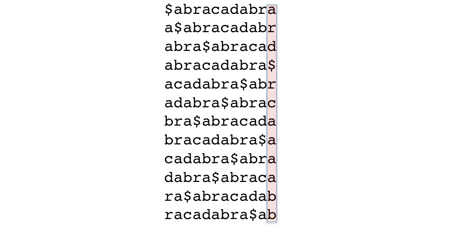

Note: since we rotated all characters, the last column contains the same set of characters as $T$

## Burrows Wheeler Transform (BWT)

We will denote the Burrows Wheeler transform of an input string $T$ as

## BWT(T)

- Thus, BWT($T$) = "ard $rcaaaabb" for$ T = "abracadabracaa$

- It is relatively easy to implement a naive version of the BWT

Create all rotations of $T$

2 Sort the rotations lexicographically

Concatenate the last character of each rotation to form BWT $(T)$

- The BWT tends to contain lots of "runs" of identical characters, which is a good feature to have for compression algorithms such as run-length encoding

The examples we use here are too short to appreciate this, but consider the following excerpt of BWT( Macbeth, Act 1, Scene 1):

...uoaoiiiiiiiiiiiiiiiiiiiiiiiiiiiiaaaaaaiiiiiuiiiiiuiiiiiiiiiiiiuiiiiiiiiiiaAAiiiiiiiiiaAaIIiiioieeI

## A simple run-length encoding might be

...uoaoi{15}a{5}a{5}i{5}i{5}ui{17}aA{2}i{7}oie{2}i{1}i{7}oie{2}i...

## BWT and Suffix array

## BW matrix

$abracadabra$ abracadabra $abracadabra$ abracadabra $abracadabra$ abracadabra $abracadabra$ acadabra $acadabra$ acadabracadabra $acadabra$ abracadabra $abracadabra$ abracadabra $abracadabra$ abracadabra $abracadabra$ abracadabra $abracadabra$ abracadabra$

## Suffix array with corresponding suffixes

[11] $[11]$

[10] a $[7] abra$

[0] abracadabra $[3] acadabra$

[5] adabra $[8] bra$

[2] racadabra $[4]$

[6] dabra $[1]$

[1] $[2] ra$

[2] racadabra $[1]$

[1] $[1] ra$

[2] racadabra $[1]$

[1] ra $[2] racadabra$

- The Burrows Wheeler matrix is (nearly) the same as the suffixes referred to by the suffix array of the same string

## BWT and Suffix array

We can now write an algorithm to create BWT(T) from the suffix array SA(T) of T by noting that position i of the BWT corresponds to the character that, in the original string is just to the left of the i-th suffix in the SA

Explanation: this is exactly the character that has been "rotated" to the back of the BW matrix!

## BW matrix

## Suffix array with corresponding suffixes

Consider the third sorted rotation in the BWM and the third suffix in the suffix array for $T=abracadabra$ $\mathbf{a}$

[7]$abra$

The character just to the left of the suffix is the $i^{\mathrm{th}$ character of BWT($T$

$T=abracadabraca dabra$

## BWT and Suffix array

BW matrix

## Suffix array with corresponding suffixes

Consider the third sorted rotation in the BWM and the third suffix in the suffix array for $T=abracadabra$ $T=$ abracadabra $[7] abra$

The character just to the left of the suffix is the $i^{th}$

$$T=abracadabra$

- We can now construct the BWT as follows:

(where $SA[i]$ is the position/offset in $T$ of the i$-th sorted suffix)

$$
\mathrm {B W T} (T) [ i ] = \left[ i \right] = \left\{ \begin{array}{l l l l l \tag{1}
$$

To see the reason for the second case, consider that the first suffix of the suffix array is always $

## BWT and Suffix array

T=abracadabracabadabra$

01234578901

$$
\mathrm {B W T} (T) [ i ] = \left[ i \right] = \left\{ \begin{array}{l l l l l l} {T [ S A [ i ] - 1 ] \quad \mathrm {i} \\ \$ \end{array} \rightarrow 0}
$$

## BW matrix

$abracadabra$ abracadabra $abracadabra$ abracadabra $abracadabra$ abracadabra $abracadabra$ acadabra $acadabra$ acadabra $acadabra$ acadabra $acadabra$ abracada $bracadabra$ abracadabra $abracadabra$ abracadabra $abracada$

Wait, the $acadabra$ is not there.

The $acadabra$ is at the end of line.

The $acadabra$ is at the end.

The $acadabra$ is at the end.

The $acracada$ is at the end.

The $acracada$ is at the end.

The $acracada$ is at the end.

The $acracada$ is at the end.

The $acracada$ is at the end.

The $acracada$ is at the end.

The $acracada$ is at the end.

The $acracada$ is at the end.

The $acracada$ is at the end.

The $acracada$ is at the end.

The $acracada$ is at the end.

The $acracada$ is at the end.

The $acracada$ is at the end.

The $acracada$ is at the end.

The $acracada$ is at the end.

The $acracada$ is at the end.

The $acracada$ is at the end.

The $acracada$ is at the end.

The $acracada$ is at the end.

The $acracida$ is at the end.

The $acracada$ is at the end.

The $acracada$ is at the end.

The $acracada$ is at the end.

The $acracada$ is at the end.

The $acradia. The$ acracada.

Suffix array with corresponding suffixes

[111] $[11]$ 

[10] a $[7] abra$

[0] abracadabra $[3] acadabra$ 

[4] abra $[5] adbra$ 

[2] ra $[1] abra$ 

 [4] acadabra $[5] acadabra$ 

[6] acadabra $[5] acadabra$ 

[5] acadabra $[5] acadabra$ 

[5] acadabra $[5] acadabra$ 

[5] acadabra $[5] acadabra$ 

[5] acadabra $[5] acadabra$ 

[5] acadabra $[1]$ 

[1] $[1]$ 

[1] $[1]$ 

[1] $[1]$ 

[1] $[1]$ 

[1] $[1]$ 

[1] $[1]$ 

[1] $[1]$ 

[1] $[1]$ 

[1] $[1]$ 

 [1] $[1]$ 

[1] $[1]$ 

[1] $[1]$ 

 [1] $[1]$ [1] $[1]$ [1] $[1]$ [1] $[1]$ [1] $[1]$ [1] $[1]$ [1] $[1]$ [1] $[1]$ [1] $[1] [1]$ [1] $[1] [1]$ [1] $ [1] [1] [1]

## Constructing a BWT from a Suffix Array

The naive algorithm is pretty simple to implement

# Algorithm 1 bwtFromSuffixArray(T)

1: $sa = constructSuffixArray(T)$

2: $L = length(sa)$

3: $bwt = new string[L]$

4: **for**i=0 $then

5:$ bwt[i] = T[sa[i] = T[sa[i] - 1$

6: **end if**

7: **end for**

8: **bwt**

9: **return bwt**

## Reversing the BWT

If we want to get the original string back, we need to

Reverse the compression procedure (in case we compressed the BWT)

2 Get the original string back from the BWT

So, how do we reverse the Burrows Wheeler transformation?

## The reversibility of the BWT depends on the

## LF Mapping property

For any character, the T-ranking of characters in the first column (F) of the BW matrix is the same as order of characters in the last column (L)

## Reversing the BWT

So, what is the T-ranking?

$$
a _ {0} b _ {0} r _ {0} r _ {0} r _ {0} a _ {1} c _ {0} a _ {1} c _ {0} a _ {2} d _ {0} a _ {1} r _ {1} a _ {1} r _ {1} a _ {1} r _ {1} a _ {4}$
$$

- The T-ranking of the character at any given position is the number of times that an identical character has preceeded it in $T$

- The $T$-ranking of $is always zero (no previous$! )$ and is omitted here

- Important: the ranks are shown here just to help understand the LF mapping property; the T-ranks are not stored explicitly!

## Reversing the BWT

$$
\begin{array}{l} \$_ {0} a _ {0} a _ {1} c _ {0} a _ {0} b _ {0} r _ {0} a _ {1} r _ {1} a _ {1} \mathrm {a _ {1} \mathrm {a} _ {0} \mathrm {a} _ {0} \mathrm {b} _ {0} r _ {1}$ $a _ {1} \mathrm {a} _ {1} \mathrm {a} _ {1} \mathrm {a} _ {4} \$$ a _ {0} \mathrm {a} _ {2} \mathrm {b} _ {0} r _ {1} r _ {1} \mathrm {a} + a _ {1} \mathrm {a} ^ {\prime} + a _ {1} + a _ {2} \mathrm {2} \mathrm {a} _ {3} b _ {1} r _ {1} r _ {1} a _ {1} \mathrm {a} + 0} r _ {1} \mathrm {a} + a _ {1} \mathrm {a} _ {2} \mathrm {2} \mathrm {a} + a _ {2} \mathrm {a} _ {3} \mathrm {b} _ {3} \mathrm {b} _ {1} \mathrm {3} \mathrm {d} _ {3} \mathrm {d} _ {3} \mathrm {d} _ {3} \mathrm {d} _ {0} \mathrm {d} _ {3} \mathrm {d} _ {3} \mathrm {d} _ {3} \\ b _ {1} \\ \mathrm {3} \\ \end{array}$
$$

- Here is the Burrows Wheeler matrix with the T-ranks of all the characters

## Reversing the BWT

$$
\begin{array}{l} \mathrm {a} _ {4} \$_ {4} \$ _ {4} \$ a _ {0} b _ {1} \mathrm {a} _ {1} r _ {1} \mathrm {a} _ {1}$ $ \mathrm {a} _ {1} \mathrm {b} _ {1} \mathrm {a} _ {2} \mathrm {a} _ {3} b _ {1} \mathrm {a} ^ {1} \mathrm {1} \mathrm {a} _ {2} \\ \mathrm {3} \mathrm {a} _ {2} \mathrm {3} \mathrm {b} _ {1} r _ {1} \mathrm {a} ^ {\prime} \mathrm {3} \mathrm {a} ^ {\prime} + 0} r _ {1} + \mathrm {a} ^ {\prime} + 0 r _ {1} + 0} + 0 \mathrm {a} ^ {\prime} + 0 \mathrm {a} ^ {\prime} + 0 \mathrm {1} + 0 0} + 0 0 0 0 0
$$

- What do you notice about the T-ranks of the "a" characters?

## Reversing the BWT

- The "a"s have the same relative order in the F and the L columns

- A similar observation pertains to the other characters

E. g., first " $\mathrm {r}_{1}$ , then $" r_{1}$

## Can you explain this?

Idea: let's have a look of the lexicographical sorting!

$$
\begin{array}{l} \mathrm {a} _ {4} \$ a _ {4} \$ \mathrm {a} _ {4} \$ $ \mathrm {a} _ {4} \mathrm {a} _ {1} r _ {1} \mathrm {a} _ {4} \mathrm {a} _ {3} b _ {1} r _ {1} \mathrm {a} _ {4} \mathrm {a} _ {2} \mathrm {b} _ {1} \mathrm {a} ^ {\prime} \\ \mathrm {b} _ {1} r _ {1} \mathrm {a} _ {1} \mathrm {a} ^ {\prime} \mathrm {a} ^ {\prime} \\ \mathrm {a} ^ {\prime} \\ \mathrm {a} ^ {\prime} \\ \mathrm {a} ^ {\prime} \mathrm {a} ^ {\prime} \mathrm {b} _ {1} \mathrm {a} ^ {\prime} \mathrm {a} ^ {\prime} \mathrm {b} _ {2} \mathrm {a} ^ {\prime} \mathrm {b} _ {2} \mathrm {b} \mathrm {a} ^ {\prime} \mathrm {b} \mathrm {b} \mathrm {a} ^ {\prime} \mathrm {b} \mathrm {b} \mathrm {b} \mathrm {a} _ {2} \mathrm {b} \mathrm {a} _ {2} \mathrm {a} _ {2} \mathrm {a} _ {2} \mathrm {a} _ {2} \mathrm {2} \mathrm {2} \\ \end{array}
$$

## Reversing the BWT

$$
\begin{array}{l} \mathrm {a} _ {0} a _ {4} \frac {1} b _ {1} r _ {1} a _ {1} \mathrm {a} _ {4} \mathrm {a} ^ {\prime} \\ b _ {1} \mathrm {a} _ {4} \mathrm {a} _ {2} \mathrm {a} _ {1} \mathrm {a} _ {4} \$ \mathrm {a} _ {1} \mathrm {a} ^ {2} \mathrm {b} _ {3} \mathrm {b} _ {1} \mathrm {a} _ {3} \mathrm {a} ^ {3} \mathrm
$$

- The relative $T$ \boldsymbol{T}$- ranks of the a characters in column$ \mathbf{F} $ are determined by the lexicographic ranks of the strings to the right of the characters

## Reversing the BWT

$$
\begin{array}{l} \mathrm {a} _ {4} \mathrm {a} _ {4} \$ a _ {0} b _ {1} \mathrm {a} ^ {\prime} _ {1} \\ \mathrm {a} _ {1} \mathrm {b} _ {1} \mathrm {a} ^ {2} \mathrm {a} _ {1} \mathrm {a} _ {1} \mathrm {a} ^ {2} \mathrm {a} _ {1} \mathrm {a} ^ {3} \mathrm {b} _ {1} \mathrm {3} \mathrm {3} \mathrm {b} _ {1} \mathrm {3
$$

- The relative $T$ \boldsymbol{T}$ - ranks of the a characters in column L must reflect the lexicographic ranks of the strings to the "rotated" right of the characters

## Reversing the BWT

$$
\begin{array}{l} \mathrm {a} _ {0} a _ {1} \mathrm {a} _ {4} \mathrm {a} ^ {2} b _ {1} r _ {1} \mathrm {a} _ {1} \mathrm {a} ^ {2} \\ \mathrm {a} _ {1} \\ b _ {1} \mathrm {a} ^ {2} \mathrm {a} _ {1} \mathrm {3} \mathrm {4} \mathrm {4} \$ $ \mathrm {a} _ {1} \mathrm {a} _ {1} \mathrm {a} _ {1} \mathrm {a} ^ {2} \mathrm {b} _ {1} \mathrm {a} _ {1} \mathrm {a} ^ {2} \mathrm {a} _ {1} \mathrm {a} _ {1} \mathrm {a} ^ {\prime} + 0} \mathrm {a} ^ {2} + \mathrm {0} + \mathrm {0} + \mathrm {0} + \mathrm {0} + 1 0} + 1 0 ^ {\prime} + 1 0 ^ {\prime} + 1 0 ^ {\prime} + 1 0 ^ {\prime} + 1 0 ^ {\prime} + 1 0 ^ {\prime} + 1 1 0 0 0 0 0
$$

$$
\begin{array}{l} \mathrm {a} _ {4} \mathrm {a} _ {4} \$ _ {0} a _ {1} b _ {1} r _ {1} \mathrm {a} ^ {\prime} \mathrm {a} _ {1} \\ \mathrm {a} _ {1} \mathrm {b} _ {2} d _ {0} \mathrm {a} ^ {1} \mathrm {a} _ {1} \mathrm {a} _ {1} \mathrm {a} ^ {2} \mathrm {a} + \mathrm {a} ^ {2} + \mathrm {a} + \mathrm {a} + \mathrm {a} _ {3} \mathrm {b} _ {1} + \mathrm {a} + 1 - 1 + 1 - 1} + 1 = 0 r _ {1} + 1 = 0 r _ {1} + 1 = 0 r _ {1} + 1 = 0 ^ {\mathrm {1} + 0 0 ^ {\mathrm {1} + 0 0} + 1 = 0 0 0 0 0
$$

- These are the same strings (consequence of the rotation!)

- Thus: if the sorting of "a"s in F and L is determined by exactly the same strings their sorting (T-ranking) must be exactly the same!

## Reversing the BWT

- Do we really need to remember/store the T-ranking?

- We introduce another "vertical" ranking

- The B-ranking of a character at a specific position is the number of that times the same character has occured in the F column "above" the current position

- The B-ranking is thus like a cumulative count of the characters

- Just a re-labeling of identical characters, so also the B-ranking is the same for the F and L columns!

$_ { 0} abracadabracaadabra$

a<sub>0</sub>$abracadabraca abbr$ a_{0}$

a<sub>1</sub>bra $abracad<sub>0}$

a₂bracadabra $_{2}$

a<sub>3</sub>cadabra $abr<sub>1}$

a<sub>4</sub>dabra $\$abra$ \$abrac_{0}$

$$
b _ {0} \mathrm {r a} \mathrm {a} \$ra$ \$abracada_{1}$
$$

$$
b _ {1} \mathrm {r a c a r a c a d a d a b r a b r a \mathrm {a} a s a a _ {2}
$$

$$
\mathrm {c} _ {0} \mathrm {a d a d a b r a b r a \$ abra $ \mathrm {a b r a} _ {3}
$$

$$
\mathrm {d} _ {0} \mathrm {a b r a b r a \$ ab r \$ abraca c a$
$$
\mathrm {4}
$$

$$
r _ {0} a \$a \$ abracadab$
$$

r₁acadabra $ab$

Just the F and L columns are shown for better legibility

## Reversing the BWT

- Column F has a simple structure: chunks of identical characters with ascending B-ranks

Remember: they are lexicographically sorted!

- Column L does not generally have this kind of strict chunk structure, but the B-ranks of any given character also are arranged in ascending order

$_{0}$ abracadabra$ $a_0 $abracadabr$ a $abracadabra$ $a_0$ $abracadabra$ $a_0$ $abracadabra$ $a$ $abracadabra$ $a$ $abracadabra$ $a$ $bra$ $abracadabra$ $a$ $abracadabra$ $a$ $a$ $abracadab$ $a$ $abracadabra$ $a$ $a$ $abracadab$ $a$ $abracadab$ $a$ $a$ $abracadabra$ $a$ $abracadabra$ $a$ $abracadabra$ $a$ $abracadabra$ $a$ $a$ $abracadabra$ $a$ $a$ $abracadab$ $a$ $a$ $abracadabra$ $a$ $a$ $a$ $abracadab$ $a$ $a$ $abracadab$ $a$ $a$ $a$ $abracadab$ $a$ $a$ $a$ $a$ $a$ $abracadab$ $a$ $a$ $a

## Reversing the BWT

- Can we now use these observations to reconstruct the original string?

- We will first try to reconstruct the first column of the BWM

$$
\begin{array}{l} ? _ {2}? _ {2} \mathrm {2} ? ? ? ? ? ? ? ? ? ? ? ? ? ? ? ? ? ? ? ? \mathrm {a} _ {0} a _ {0} \\ ? ^ {2} \\ ? ? \mathrm {2} \mathrm {2} \mathrm {2} \mathrm {2} \mathrm {?} \mathrm {2} \mathrm {a} _ {2} \mathrm {a} \\ ? \mathrm {a} \\ ? \mathrm {a} \\ ? \mathrm {a} \\ ? \mathrm {a} \\ ? \mathrm {a} \\ ? \mathrm {a} \\ ? \mathrm {a} \\ ? \mathrm {a} \\ ? \mathrm {a} \\ \end{array}
$$

## Reversing the BWT

- Consider $c_{0}$

- We know that the $\$ , all the "a"s, all the "b"s, but not any of the "d"s must precede$ c_{0} in the first column

The number of identical characters in F is the same as in L, so we can simply count them in the BWT!

<table><thead><tr><th>F</th><br></thead><tbody><tr><td>?</td><strong>F</strong></td><strong>F</strong></td><strong>L</strong></td></tr><tr><td></td><strong>a</strong></td></tr><td></td></tr><td></td><td></td></tr><td></td><td></td><td></td></tr><td></td></tr><td></td><td></td></tr><td></td><td></td><td></td></tr><td></td></tr><td></td><td></td><td></td></tr><td></td><td></td><td></td></tr><td></td><td></td><td></td><td></td></tr><td></td><td></td><td></td><td></td></tr><td></td><td></td><td></td><td></td></tr><td></td><td></td><td></td><td></td></tr><td></td><td></td><td></td></tr><td></td><td></td><td></td><td></td><td></td></tr><td></td><td></td><td></td><td></td></td></tr><td></td><td></td><td></td><td></td></td></tr><td></td><td></td><td></td><td></td></tr><td></td><td></td><td></td><td></td></td><td></td></tr><td></td><td></td><td></td><td></td><td></td><td></td></tr><td></td><td></td><td></td><td></td><td></td><td></td><td></td><td></td><td></td><td></td><td></td><td></td><td></td><td></td><td></td></td><td></td><

## Reversing the BWT

- The index of $c_{0}$ in column F must equal 1+5+2=8$

## We will refer to this as the cumulative index property

- This will help us to find a particular character (with a specific B-ranking in the F column ...

- Reconstructing the full F column would be easy: simply sort the L column lexicographically

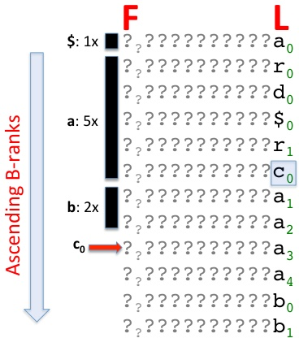

## Reversing the BWT

<table border="1"><thead><tr><th>F</th><th colspan="2">L</th><th></th><th></th><th></th><th colspan="2">Reconstruction to date</th></thead><tbody><tr><td></td><tr><td></td><tr><td></td><td></td><th></td><th></th><tr><td></td><td></td></tr><tr><td></td><td></td><td></td><td></td><td></td><td></td><td></td><td></td><td></td><td></td><td></td><td></td><td></td><td></td><td></td></tr><tr><td></td><td></td><td></td><td></td><td></td><td></td><td></td><td></td><td></td><td></td></td><td></td></tr><tr><td></td><td></td><td></td><td></td><td></td><td></td><td></td><td></td></td></tr><tr><td></td><td></td><td></td><td></td><td></td></td></tr><td></td><td></td><td></td><td></td><td></td><td></td><td></td></td><td></td></tr><td></td><td></td><td></td><td></td><td></td><td></td></tr><td></td><td></td><td></td><td></td><td></td><td></td></tr><td></td><td></td><td></td><td></td><td></td><td></td><td></td></tr><td></td><td></td><td></td><td></td><td></td><td></td><td></td><td></td><td></td><td></td><td></td><td></td><td></td><td></td></tr><td></td><td></td

- The character that precedes the $in T is now in the last column (L): Because of the rotation we know that the character preceding the$ must be an a $ a_{0}

$$
\$ $ \$ 0
$$
\$ 0
$$
\$
$$

$$
a _ {0}
$$

$$
a _ {0}
$$

$$
a _ {1}
$$

$$
r _ {0}
$$

$$
\mathrm {d} _ {0}
$$

$$
a _ {2}
$$

$$
\$ _ {0}
$$

$$
a _ {3}
$$

$$
r _ {1}
$$

$$
a _ {4}
$$

$$
\mathrm {C} _ {0}
$$

$$
\mathrm {b} _ {0}
$$

$$
a _ {1}
$$

$$
\mathrm {b} _ {1}
$$

$$
\mathrm {C} _ {0}
$$

$$
a _ {2}
$$

$$
a _ {0} $
$$
a _ {0} \$
$$
a _ {0}$
$$

$$
a _ {3}
$$

$$
\mathrm {d} _ {0}
$$

$$
r _ {0}
$$

$$
a _ {4}
$$

$$
r _ {1}
$$

$$
\mathrm {b} _ {0}
$$

$$
\mathrm {b} _ {1}
$$

- Because of the cumulative index property and because a comes right after $\$ a$ , $ we go to the second row of the BWM and find the same a0

- The character that precedes the $a_{0} in T is again in the last (L) column (rotation!):$ r_{0}$

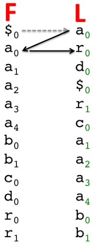

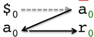

Reconstruction to date

$$
T = \dots r _ {0} a _ {0} a _ {0} \$
$$

## Reversing the BWT

- To find the position of $r_{0} in the first column, we note that its index must be 1+5+2+1+1+1+1+0=10 because of the cumulative index property! There are one "$", five "a", two "b", one "c", one "d", and zero "r" before $ r_0)

- We go to column L to get the next preceding character

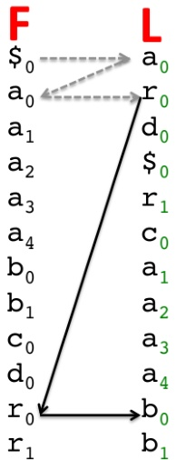

Reconstruction to date

$$
T = \dots b _ {0} r _ {0} r _ {0} a _ {0} $
$$

## Reversing the BWT

- The game continues...

- To find the position of $ b_{0} in the first column, we note that its index must be 1+5+0=6 because of the cumulative index property

- We go to column L to get the next preceding character

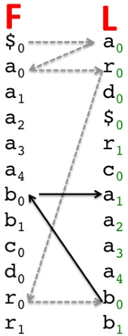

Reconstruction to date

$$
T = \dots a _ {1} b _ {1} b _ {0} r _ {0} r _ {0} a _ {0} $
$$

## Reversing the BWT

- Note that to find the position of $a_{4}$ is the correct answer $a_{4} with the cumulative index property, we take into account the preceding characters (here only$ \mathrm{a_{1}, a_{2}, a_{3}$, so that the index$ a_{4}$is$ a_{1},$No, it's$ a_{1}, a_{1}, a_{2}, a_{2}, a_{3},$No, that's not$ a_{4}$is$ a_{4}$ No, that's not

- and so on...

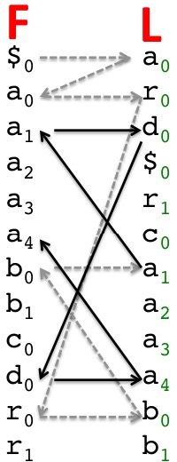

Reconstruction to date

$$
T = \dots a _ {4} d _ {0} a _ {1} b _ {0} r _ {0} a _ {1} b _ {0} a _ {0}$
$$

## Reversing the BWT

But what information exactly did we need to do this reversal?

- We can do everything starting only from the BWT(T), which corresponds to the L column!

- If we count the number of each character in BWT (T), we can easily reconstruct the "chunks" of characters in the first (F) column of the BWM

We don't need to fully reconstruct the F column, we just need to know how many characters of each type it contains! $ ^{1}

- We don't need to reconstruct the entire BW matrix!

## Alternative definition of the BWT

Please note, sometimes you will see a different way of defining the BWT:

- Instead of using a termination character ($), you can use the plain input string, compute the BWT (now without$) and store an additional integer which indicates at what position in the BWT one can find the last character of the original string.

Without $, this integer is needed to know from where to reconstruct the original string

Advantage of using $: Since$ is by definition the first character in lexicographical order, the start point for reconstruction is always the first row of the BWM (that's why we don't need to store information about where to start the reconstruction!

> Disadvantage of using $: the BWM has one additional line (one more character = one more rotation), and we need to be sure that the termination character (e.g.,$ cannot be part of the input string $T$ itself!

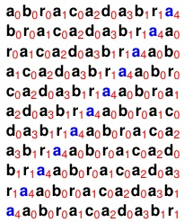

$a_4a_1a_4b_0r_0r_0r_0a_1a_1c_1a_2a_0b_0r_0a_1a_0r_11[0] [0]$ a_3b_1r_1$

$a_1$

$a_0$

$a_0$

$a_00$

$a_1$

$a_1$

$a_1$

$a_1$

$a_1$

$a_11$

$a_0000000$

$a_11$

$a_11$

$a_11$

$a_11$

$a_11$

$a_11$

$a_2d_00000$

$a_2d_3_11$

$a_2$

$a_2$

$a_2$

$a_2$

$a_2$

$a_2$

$a_2$

$a_2$

$a_2$

$a_2$

$a_2$

$a_2$

$a_2$

$a_2$

$a_2$

$a_2$

$a_2$

$a_2$

$a_2$

$a_2$

$a_2$

$a_2$

$a_2$

$a_2$

$a_2$

$a_2$

$a_2$

$a_2$

$a_2$

$a_2$

$a_2$

$a_2$

$a_2$

$a_2$

$a_2$

$a_2$

$a_2$

$a_2$

$a_2$

$a_2$

$a_2$

$a_2$

$a_2$

$a_2$

$a_2$

$a_2$

$a_2$

$a_2$

$a_2$

$a_2$

$a_2$

$a_2$

$a_2$

$a_2$

$a_2$

$a_2$

$a_2$

$a_2$

$a_2$

$a_2$

$a_2$

$a_2$

$a_2$

$a_2$

$a_2$

$a_2$

$a_2$

$a_2$

$a_2$

$a_2$

$a_2$

$a_2$

$a_2$

$a_2$

$a_2$

$a_2$

$a_2$

$a_2$

$a_2$

$a_2$

$a_2$

$a_2$

$a_2$

$a_2$

$a_2$

$a_2$

$a_2$

$a_2$

$a_2$

$a_2$

$a_2$

$a_2$

$a_2$

$a_2$

$a_2$

$a_2$

$a_2$

$a_2$

$a_2$

$a_2$

$a_2$

$a_2$

$a_2$

$a_2$

$a_2$

$a_2$

$a_2$

$a_2$

$a_2$

$a_2$

$a_2$

$a_2$

$a_2$

$a_2$

$a_2$

$a_2$

$a_2$

$a_2$

$a_2$

$a_2$

$a_2$

$a_2$

$a_2$

$a_2$

$a_2$

$a_2$

$a_2$

$a_2$

$a_2$

$a_2$

$a_2$

$a_2$

$a_2$

$a_2$

$a_2$

$a_2$

$a_2$

$a_2$

$a_2$

$a_2$

$a_2$

$a_2$

$a_2$

$a_2$

$a_2$

$a_2$

$a_2$

$a_2$

$a_2$

$a_2$

$a_2$

$a_2$

$a_2$

$a_2$

$a_2$

$a_2$

$a_2$

$a_2$

$a_2$

$a_2$

$a_2$

$a_2$

$a_2$

$a_2$

$a_2$

$a_2$

$a_2$

$a_2$

$a_2$

$a_2$

$a_2$

$a_2$

$a_2$

$a_2$

$a_2$

$a_2$

$a_2$

$a_2$

$

$

$

$

$

$

$

$

$

$

$

$

$

$

$

$

$

$

$

$

$

$

$

$

$

$

$

$

$

$

$

$

$

$

$

$

$

$

$

$

$

$

$

$

$

$

$

$

$

$

$

$

$

$

$

$

$

$

$

$

$

$$

\begin{align*}

\end{align*}

```

$

```

Example (with $T$-ranking shown):

$T = abracadabracaaabbra

BWT(T) = rdarcaaaabb

Note:

With$ \mathrm{T}$We will use the$ $!$

The FM index uses the BWT and some other auxiliary data structures to generate a fast an efficient index for search for small patterns within a larger string $T$

- "FM" stands for "Full-text index in Minute space" (or for "Ferragina-Manzini")

- Paolo Ferragina and Giovanni Manzini (20092009): "Opportunistic Data Structures with Applications". Proceedings of the 41st Annual Symposium on Foundations of Computer Science, pp. 398

## FM Index

- The main data structures of the FM index are the F column and the L column (=BWT) from the BWM

Note that the F column itself is not stored because it can be represented as an array of integers (one per character of our alphabet)

In our example, and using the order

$$
\$ < a < b < c < d < r
$$

we have

<table><tr><td>1</td><td>5</td><td>2</td><td>1</td><td>2</td><td>1</td><td>1</td><td>1</td><td>2</td></tr></table>

As mentioned, the block-sorted L column is also easily compressible

- We will add auxiliary data structures to this ...

## F

$_ { 0 } abracadabra a b c d a b r a a b$

$a_0$ \$abracadabra$

$a_1bra$ abracad $d_0$

a₂bracadabra $_{0}$

a<sub>3</sub>cadabra $abra$ abr_{1}$

$\mathbf{a}_{4} \mathrm{dabra}\$$ abra$ $ \mathbf{c}$

$\mathbf{b}_{0} \mathrm{ra}\$$ abracad a_{1}$

$\mathbf{b}_{1}racadabra\textbf{a} \mathbf{a}_{\mathbf{2}$

$\mathbf{c}_{0} \mathrm{adabra}\mathbf{a} \mathbf{a} \mathbf{a}\mathbf{b} \mathbf{a} \mathbf{a} \mathbf{a}_{\mathbf{3}$

$\mathbf{d}_{0} \mathrm{a b r a b r a \mathrm {b} \mathrm {a} \mathrm {s} \mathrm {a} \mathrm {s} \mathrm {a} \mathrm {a} \mathrm {b} \mathrm {a} \mathrm {a} \mathrm {s} \mathrm {a} \mathrm {b} \mathrm {a} \mathrm {a} \mathrm {s} \mathrm {a} \mathrm {a} \mathrm {b}rac \mathbf {a} \mathbf {a} \mathrm {a} \mathrm {a} \mathrm {a} \mathrm {a} _ {4}$

$$
\mathbf {r} _ {0} a \$a \$ abracad a b$
$$

$\mathbf{r}_{1}acadabra}\mathbf{a b}_{\mathbf{a}$

## FM Index

- But how can we search for a particular substring (e.g., for a read)?

Is it present?

▶ If so, at what position(s)?

- As mentioned, the BWM is very similar to a suffix array:

- Same sorting

> Strings in the BWM until $ are the suffixes

The substring we're looking for should be the prefix of a suffix in the BWM, but a binary search over just F and L is obviously not possible (the "middle" of the matrix is missing

- We will again make use of the B-ranks and take an approach which is somewhat similar to the reconstruction of the original string

We will try to reconstruct the prefixes of suffixes which fit the searched substring!

## F

$_{0}$ abracadabra$ $^{0}$

$a_{0}$

$a_{0} \text{abracadabra$

$a_{0}$

$a_{0}$

$abracadabra$

$a$

$a$

$b$

$abracadabra$

$a$

$a$

$a$

$abracadabra$

$a$

$a$

$abracadab

$a$

$a$

$a$

$a$

$abracadabra$

$a$

$a$

$a$

$abracadab$ a$

$a$

$a$

$a$

$abracadab

$a$

$a$

$a$

$a$

$abracadab$ a$

$a$

$a$

$a$

$abra

$a$

$a$

$a$

$a$

$abracadab$ a$

$a$

$a$

$a$

$abracadab

$a$

$a$

## FM Index

- For example, let us search for the string P=abra in our "genome" T=abracadabra

- Our strategy is to look for all rows of BWM(T) that have P as a prefix, without reconstructing the entire BWM!

- We successively look for the longer suffixes which have prefix P, starting with the last character of P (here: an "a")

- But it is easy to find the chunk of the BWM(T) that starts with a given character using the cumulative index property:

<table border="1"><tr><td>1</td><span style="border: 1px solid black;</td><span style="background-color: #55555555555555555</span></table>

Search string abra

$_{0}$ abracadabra$ $a_0 $abracadabra$ $a_0$ abracadabra$ $a_0$

$a_0$ $abracadabra$ $abracadab$ $a_0$

$a$ $abracadabra$ $a$ $b$ $abracadabra$ $a$ $a$ $abracadabra$ $a$ $a$ $abracadabra$ $a$ $a$ $abracadabra$ $a$ $a$ $abracadabra$ $a$ $a$ $a$ $a$ $abracadabra$ $a$ $a$ $a$ $abracadabra$ $a$ $a$ $abracadabra$ $a$ $a$ $a$ $abra$ $a$ $a$ $a$ $a$ $a$ $abraca$ $a$ $a$ $abra$ $a$ $a$ $abra$ $a$ $a$ $

## FM Index

- Once we have found all rows that begin with the last letter of $\mathbb{P}$, we can look in $L$ to identify those rows whose last letter corresponds to the second to last letter in $P$ here: letter $r$ of abra$

- Due to rotation, the last letter in the row (in column L) must come right before the first letter (column F) in the original string!

- We can now read off the B-ranks of these characters (here: 0 and 1) and use the LF mapping to find the rows in F that begin with these characters

Note: we are guaranteed to have consecutive B-ranks for the second letter (here: r) because we're looking at a set of adjacent rows!

Search string abra

F L

$_{0}$ abracadabra$ $a_0 $abracadabra$ $a_0$

$a_0$ abracadabra$ $a_0 $abracadabra$ $a_0$

$abracadabra$ $a_1$

$abracadabra$ $a_1$

$abracadab$ $a$ $a$ $abracadabra$ $a$ $a$ $a$ $abracadabra$ $a$ $a$ $abracada$ $a$ $a$ $a$ $a$ $a$ $abracadabra$ $a$ $a$ $a$ $abracadabra$ $a$ $a$ $a$ $a$ $abracadabra$ $a$ $a$ $a$ $a$ $abra$ $a$ $a$ $abra$ $a$ $a$ $a$ $abra$ $a$ $a$ $a$ $abra$ $a$ $a$ $

## FM Index

- Using the LF mapping we find the rows in F that begin with "ra" $(r_0$ and $r_{1}$

- The character that precedes “r” in our query string P=“abra” is “b” so we can continue

- Again, we check the rows which start with $r_{0} and$ r_{1} $ for occurrences of "b" in the last column!

In this case: both of them have a "b", which before the rotation was right in front of the "ra" at the beginning of the rows

★ We take note of their B-ranks: From 0 to 1 $( b_{0} and$ b_{1} $

- We have now matched the last 3 characters of P=abra and continue one more step using the LF mapping

## Search string abra

$ \mathbf{a}_{0} abracadabra b a r c d a b r a b a

$a_0$ \$abracadabracaabacadabr$

$a_1bra$ abracad $a_{1}$

Wait, the $a_2$ is $a_2$ and $bracadabra$? No.

The $a_2$ is $a_2$.

Let's re-read the whole thing.

$a_1bra$ abracada $.$ a_1 $.$ a_1bra $abracad$.

$a_2$.

$a_1bra$?

Yes.

Okay, I'll just use $a_1$.

Final check of the text.

$a_1bra$.

$a_1bra$.

$a_1bra$.

$a_1bra$.

$a_1bra$.

$a_1bra$.

$a_1$.

$a_1bra$.

$a_1bra$.

$a_1$.

$a_1$.

$a_1$ bra.

$a_1$.

$a_1$.

$a_1$.

$a_1$.

$a_1$.

$a_1$.

$a_1$.

$a_1$.

$a_1$.

$a_1$.

$a_1$.

$a_1$.

$a_1$.

$a_1$.

$a_1$.

$a_1$.

$a_1$.

$a_1.$ a_1

- We find the rows that begin with "bra" $( b_{0} and$ b_{1} $ and look at the corresponding characters in L to see if we have a match for P

Check L for the first character in P (the only remaining character we need to check)

- Both rows have an "a" (B-ranks 1 to 2), so both match P!

## Search string abra

$ \mathbf{o} abracadabra b a b c d a b r a a b c d a r a b \mathbf {a} \mathbf{a} \mathbf{a}

$a_0$ \$abracadabra$

$a_1bra$ abracad $d_0$

$a_1bracadabra$ $a_2$ bracadabra$ $a_2$

$a_3cadabra$ $a_4dabra$ $a_1$

$bracadabra$ $a_2$ $a_1$

$bracadabra$ $a_2$ $bracadabra$ $a_2$ $a_3$

$a_1$ $bracadabra$ $a_1$ $a_2$ $bracadabra$ $a_1$ $a_1$

$a_2$ $a_1$ $bracadabra$ $a_1$ $a_1$ $a_1$ $abracadabra$ $a_1$ $a_1$ $a_2$ $a_1$ $bracadabra$ $a_1$ $a_1

r₁acadabra $a b_1$

## FM Index

- Finally, we look up $a_{1} and$ a_{2} $ in the F column to find the rows of the BWM that begin with our full query string: [2,4)

Remember: we are guaranteed to have consecutive B-ranks, so we will by definition have consecutive rows!

Actually, the image has a bullet point with a triangle symbol and text.

Actually, it's just a simple representation of a list.

Actually, it looks like:

Actually, it might be:

Actually, the text is:

Actually, the word "Actually, in each of the steps when we looked up letters in the image, it might be:

Actually, it looks like:

Actually, the word "Actually, the word is "Actually, the word is "Actually, in the image, it might be:

Actually, the word is "Actually, the word is "Actually, in each of the steps when we look at the word is "Actually, in each of the steps when we looked up letters in F we had consecutive rows ..."

Wait, the word is "Actually, the word is "Actually, the word is "Actually, the word is "Actually, in each of the steps when we looked up letters in F we had consecutive rows ..."

Actually, the word is "Actually, the word is "Actually, in each of the steps when we looked up letters in the word is "F"... but the word is "F" or something else."

Let's re-read the word is "F" or maybe "F" or "F" or "F" or "F" or "F" or "F" or "F" or "F" or "F" or "F" or "F" or "F" or "F" or "F" or "F" or "F" or "F" or "F" or "F" or "F" or "F" or "F" or "F" or "F" or "F" or "F" or "F" or "F" or "F" or "F" or "F" or "F" or "F" or "F" or "F" or "F" or "F" or "F" or "F" or "F" or "F" or "F" or "F" or "F" or "F" or "F" or "F" or "F" or "F" or "F" or "F" or "F" or "F" or "F" or "F" or "F" or "F" or "F" or "F" or "F" or "F" or "F" or "F" or "F" or "F" or "F" or "F" or "F" or "F" or "F" or "F" or "F" or "F" or "F" or "F" or "F" or "F" or "F" or "F" or "...

We didn't need to reconstruct the matrix; all necessary information is in F and L=BWT!

- These are equivalent to the rows we would have identified with a binary search over the suffix array (which is of course an array of start positions of suffixes)

- However, it is not immediately clear how to identify the positions in $\mathbb{T} that correspond to$ P $ when using the BWT (and F) alone

Search string abra

$$
\mathbf {F}
$$

$_ { 0 } abracadabrabra$

$a_0$ abracadab $\mathbf{r}_0$

$a_1bra$ abra $abracad$ d_0$

a $_2$ bracadabra $_{0}$

$$
\mathbf {a} _ {3} \mathrm {c a d a d a b r _ {3} \mathrm {a} \mathrm {a} \mathrm {s} \mathrm {a b r} \mathbf {r} _ {1}
$$

$$
\mathbf {a} _ {4} \mathrm {d a b r a b a b r a \$abra$
$$

$$
\mathbf {b} _ {0} \mathrm {r a} \$
$$

$$
\mathbf {b} _ {1} \mathrm {r a c a d a d a b r a d a b r a \mathrm {a} \mathrm {a} \mathrm {a} \mathrm {a} \mathrm {b} \mathrm {a
$$

$$
\mathbf {c} _ {0} \mathrm {a d a d a b r a b r a \$ abra $ \mathbf {a} \mathbf {a} \mathbf {a} \mathbf {b} \mathbf {a} \mathbf {a} _ {3}
$$

$$
\mathbf {d} _ {0} \mathrm {a b r a b r a \$abra$ is written as $
$$

$$
\mathbf {r} _ {0} a \$a \$ abracad a b$
$$

$\mathbf{r}_{1}acadabra}\mathbf{a b}_{\mathbf{a}$

## FM Index

- What about the search pattern P=adaa?

- We start matching the last character in the F column as previously

- But: when we now look at the letters in the L column of the corresponding rows, there is no "a" (second last letter in P)

Thus, there is no "aa" in the original string!

> Ergo, the full search pattern adaa does not occur in T!

## Once we have a mismatch,we end the search

At least for now, we will see how to cope with mismatches later ...

Since we want to identify mutations,we ultimately need to be able to map reads also if they do not precisely match the reference genome; for now, we ignore that problem

Search string adaa

$$
\$ \mathbf {a} _ {0} a b r a b r c a d a d a b c a d a b r e l t o n g
$$

$$
\mathbf {a} _ {0} \$\mathrm {s} \mathrm {a} _ {0} \
$$

$$
\mathbf {a} _ {1} \mathrm {b r a} \mathrm {b r a} \mathrm {b r} \mathrm {a} \mathrm {b r} \mathrm {a} \mathrm {a} \mathrm {a} ^ {\prime} \mathrm {b} \mathrm {a} \mathrm {a} \mathrm {s} ab r a c a b r a c a d e l s u t \mathrm {a} \mathrm {d} \mathrm {a} \mathrm {a} \mathrm {a} \mathrm {a} \mathrm {a} \mathrm {a} \mathrm {a} \mathrm {d} \mathrm {a} \mathrm {d} _ {0}
$$

$$
a _ {2} b r a c a b r a c a d a d a b r a d a b r a d a b \mathbb {S} _ {0}
$$

$$
\mathbf {a} _ {3} \mathrm {c a d a d a b r _ {3} \mathrm {a} \mathrm {s} \mathrm {a b r} _ {1}
$$

$$
\mathbf {a} _ {4} \mathrm {d a b d a b r a \mathrm {b r} \mathrm {a} \$
$$

$$
\mathbf {b} _ {0} ^ {\mathrm {o} _ {1} \mathrm {r a} \$ ra $abracad a a
$$

$$
\mathbf {b} _ {1} \mathrm {r a c a c a d a d a b r a b a b r a \mathrm {a}
$$

$$
\mathbf {c} _ {0} \mathrm {a d a d a b r a b r a \$abra$
$$

$$
\mathbf {d} _ {0} \mathrm {a b r a b r a \$abra$
$$

$$
\mathbf {r} _ {0} a \$ \mathrm {a} \$
$$

$$
\mathbf {r} _ {1} \mathrm {a c a d a c a d a d a b r a b \mathrm {a} \mathbf {b} = \mathbf {a} \mathbf {a} \mathbf {a} \mathbf {b}
$$

## FM Index - Interim Report

We have presented a somewhat naive version of the FM index search. However, we have glossed over three issues that need to be solved an efficient and practical algorithm

## Issue #1

- How do we efficiently find the preceding character (i.e., starting from a chunk of prefixes in or starting from in F, how do we find the correct characters in L to continue leftwards)?

- In the worst case, we may have to scan down as far as the length of the entire input string $\mathcal{O}(|T|)$

> $ |T| > 3 billion for the human genome!

Search

$F L$ 0 abracadabra $a_0$

$abracadabra$ $a_0$

$abracadabra$ $a_0$

$abracadabra$ $a_0$

$abracadabra$ $a_0$

$abracadabra$ $a_0$

$abracadabra$ $a_0$

$abracadabra$ $a_0$

$abracadabra$ $a_0$

$a_1$

$abracadabra$ $a_1$

$0|T|$

$0|T|$

## FM Index - Interim Report

## Issue #2

- Recall that we did not want to **explicitly store the B-ranks of the characters - this would be at least 4 bytes per input character, and whatever advantage we had with respect to the suffix array would disappear

- So, we still need a way of getting the B-ranks of the characters in L

## F

$_ { 0 } abracadabra a b c d a b r a a b$

$a_0$ abracadabra$ $abracadabr$

$a_1bra$ $abracadabra$ $abracad$

$a_{1}$

$a_{2}bracadabra$

$a_{2}$

$a_{3}$

$bracadabra$

$a_{2}$

$

$

$a_{1}$

$

$

$a_{2}racadabra$

$a_{2}bracadabra$

$a_{2} \text{abra} $

$

$

$a$

$a$

$a$

$a$

$

$a$

$

$a$

$

$

$

$

$a$

$abracadabra$

$

$

$

$

$

$a$

$a$

$

$

$

$

$

$

$

$

$a$

$

$a$

$

$

$

$

$

$

$a$

$a$

$a$

$

$

$

$

$

$a$

$a$

$a$

$a$

$

$a

$

$a

$a$ a

$a$ a

$a$

$a$ a

$a$ a

$a$ a

$

$a

$a

a

a

a

## FM Index - Interim Report

## Issue #3

- Recall that in the suffix array, we explicitly stored the start position of each suffix of T

- We do not have this information with the BWM

- So, we still need a way of figuring out at what positions matches occur in $ \mathbb{T}

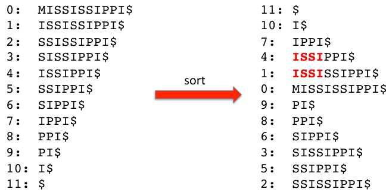

## FM Index - Tally Table

Issue #1: efficiently find the preceding character(s) in L

- Construct a tally table: ("tally" $\approx$ counter)

Precalculate the number of each specific character in L up to every row

(In general, we can substract one from the tally to obtain the zero-based B-rank; i.e., $B$-rank = tally - 1)$

<table border="1"><tr><td>$</td><td>a</td><td>b</td><td>c</td><td>d</td><td>0</td><td>0</td><td>1</td><td>1</td><td>1</td><td>1</td></tr><td>1</td><td>2</td></tr><tr><td>1</td><td>0</td><td>1</td></tr><td>1</td><td>1</td></tr><td>1</td></tr><td></tr><tr><td></td><td></td><td></td></tr><td></td><td></td><td></td></tr><td></td></tr><td></td><td></td><td></td></tr><td></td><td></td></tr><td></td><td></td></tr><td></td><td></td></tr><td></td><td></td></tr><td></td><td></td></tr><td></td><td></td></tr><td></td><td></td><td></td></tr><td></td><td></td></tr><td></td><td></td></tr><td></td><td></td></tr><td></td><td></td></tr><td></td><td></td></tr><td></td></tr><td></td><td></td></tr><td></td></tr><td></td><td></td></tr><td></td></tr><td></td></tr><td></td></tr><td></td><td></td></tr><td></td></tr><td></td></tr><td></td></tr><td></td><td></td></tr

Tally table

## FM Index - Tally Table

- Say we are search for P=abra

- After we have found all rows beginning with a in the first step,we need to find rows with r in the L column

- Say the range of rows is $[i,j]$

- We look in the tally table in row i - 1. No occurences of r before i!

- Now look in the tally table row $j$. Two occurrences of $r$ at $j!$

- Therefore, we know that (only) $r_{0}$ and $r_1$ occur in $\mathbf{L}$ in the range $[i,j]$

$Two lookups instead of$ O(|T|)$ !

<table border="1"><thead><tr><th>a</th><th>b</th><th>c</th><th>d</th><th></th><th>

Tally table

## FM Index - Tally Table

- A problem with this idea is that we need to store $\mathcal{O}(|T|\cdot|\cdot|\Sigma|)$ integers

- What if we store only every $ k^{th} row?

“checkpoints”

- We reduce the size of the tally table by a factor of k,but at the price of not having all of the information we need immediately available

$$
\$ _ {0} a _ {0}
$$

$$
a _ {0} r _ {0}
$$

$$
\mathrm {a} _ {1} \mathrm {d} _ {0}
$$

$$
a _ {2} \$ $ \mathrm {S} _ {0}
$$

$$
a _ {3} r _ {1}
$$

$$
\mathrm {a} _ {4} \mathrm {c} _ {0}
$$

$$
b _ {0} a _ {1}
$$

$$
b _ {1} a _ {2}
$$

$$
\mathrm {c} _ {0} a _ {3}
$$

$$
\mathrm {d} _ {0} a _ {4}
$$

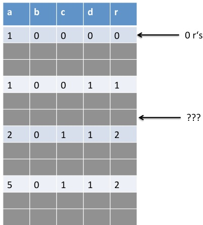

$$
r _ {0} b _ {0}
$$

$$
\mathrm {r} _ {1} \mathrm {b} _ {1}
$$

Tally table

## FM Index - Tally Table

- For instance, to calculate the rank of the A near the $\leftarrow$ ???

- We can go to the previous checkpoint and count the number of A's that we encounter from there to the position we are interested in: $ 11111111113+1=1114

- Or: We can go to the next checkpoint and subtract the number of A's that we encounter along the way: $ 1115-1=11111114

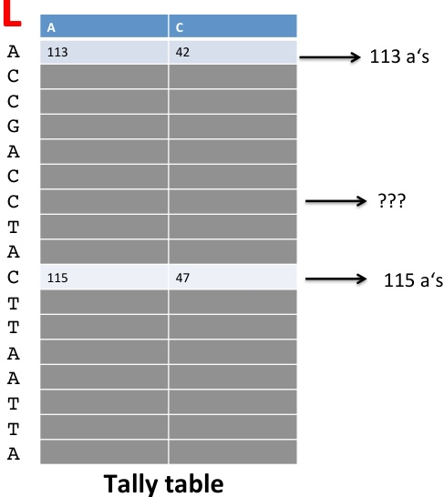

## FM Index - Tally Table

- Assuming we space the check point rows a constant number of rows away from one another (k is constant): $\mathcal{O}(1)$ for instance, 50 rows then lookups are still $\mathcal{O}(1)$ rather than $|T|$

- We now also have a way of getting the B-ranks we need for issue # 2

- In general, we will substract one from the tally to obtain the zero-based B-rank

- (The storage space needed is still $\mathcal{O}(|T|)$ but with a smaller factor)

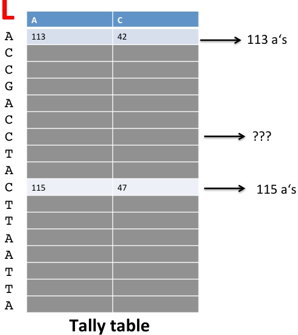

## FM Index - Finding indices in T

# F L

$_{0}$ [11] $$

$a_0$ abracadabra$ $a_0$ $abracadabra$ $a_0 $[11]$

$a_0$ [1] $\text{a}$

$a_0$ [1] $abracadabra$ [1] $

$a_0 $[1]$ abracadabra $[1]$ a$

$a_0 $[1]$ abracadabra $[1]$ a$

$a $[1]$ abracadabra $[1]$ [1] $a$

$a_0$ $abracadabraca$ [1] $[1]$ [1] $abra$ a_0 $[1]$ abracadabraca $[1]$ [1] $a$

$aracadabra$ [1] $[1]$ abra

$aracadabraca$ [1] $[1]$ ab

$aracadabraca$ [1] $[1]$ [1] $[1]$ abracadabraca $[1]$ [1] $[1]$ [1] $abracadabraca$ aracadabraca

$aracadabraca$ [1] $[1]$ [1] $[1]$ [1] $abracadabraca$ aracadabraca

$ a

a c

a c

a c

a c

a

a

b

c

d

e

f

g

h

i

j

k

l

m

n

l

m

n

o

r

s

t

w

x

y

z

w

u

v

w

x

a

b

c

d

e

f

g

h

i

j

k

l

m

i

j

k

l

m

n

w

y

z

w

y

x

z

w

y

z

w

y

z

w

y

z

w

y

z

w

y

z

w

y

z

w

y

z

w

y

z

w

y

z

w

y

z

w

y

z

w

y

z

w

y

z

w

y

z

w

y

z

w

y

z

w

y

z

w

y

z

w

y

z

w

y

z

w

y

z

w

y

z

w

y

z

w

y

z

w

y

z

w

y

z

w

y

z

w

y

z

w

y

z

w

y

z

w

y

z

w

y

z

w

y

z

w

y

z

w

y

z

w

y

z

w

y

z

w

y

z

w

y

z

w

y

z

w

y

z

w

y

z

w

y

z

w

y

z

w

y

z

w

y

w

y

w

y

w

y

w

y

w

y

w

y

w

y

w

y

w

y

w

y

w

y

w

y

w

y

w

y

w

y

w

y

w

y

w

y

w

y

w

w

y

w

w

y

w

w

y

w

w

y

w

w

y

w

w

y

w

y

w

y

w

y

w

y

w

y

w

y

w

y

w

y

w

y

w

y

w

y

w

y

w

y

w

w

y

w

w

y

w

y

w

y

w

y

w

y

w

y

w

y

w

y

w

y

w

y

w

y

w

y

w

w

w

w

w

w

w

w

w

w

w

w

w

w

w

w

w

w

w

w

w

w

w

w

y

w

y

w

y

w

y

w

y

w

y

w

y

w

y

w

y

w

y

w

y

w

y

w

y

w

y

w

y

w

y

w

y

w

y

w

y

w

y

w

y

w

y

w

y

w

y

w

y

w

w

w

w

w

w

w

w

w

w

w

w

w

w

w

w

w

w

w

w

w

w

w

w

y

w

y

z

z

z

z

z

z

z

z

z

z

z

z

$$

$$

$$

$$

$$

$$

$$

$$

- Issue #3 referred to the desire to have information, like in the suffix array that would allow us to find the position of matches in the original string

- Recall the suffixes to which the suffix array refers (which stores the indices/positions in $T$, not the suffixes themselves are equivalent to the strings of the BWM (until the $)

## FM Index - Finding indices in T

F L

$_{0}$

$a_0$ abracadabra$ $abracadabra$ $a_0 $[11]$ $

$a_0 $abracadabra$ [11] $abra$

$a_0$ abracadabra $[1]$ abracadabra$

$a_0 $[1]$ abracadabra $[1]$ a$

$a_0 $[1]$ abracadabra $[1]$ abracadabra$

$a$ $a$ $abracadabra$

$a $[1]$ abracadabra$

$a$ $ [1] $abracadabra$

$a$ [2] acadabra$

$a $[2] acadabra$

$a$ [2] acadabra$

$ a $[3] acadabra$ [4] acadabra$

$ [2] $adabra$

$[3] acadabra$

$[2] acadab$

$[3] acadabra$ [4] acadabra$

$ [2] acadabra$

$ [3] acadabra$

$ [3] acadabra$

$ [3] acadabra$

$

```markdown

| | |

| :--- | :--- |

| **abracadabra$ | |

| :--- | --- |

| abra | Pos. 0 |

| abra | Pos. 7 |

| : | |

| abra | Pos. 0 |

| abra | Pos. 7 |

```text

```

- For instance, if we had just used the algorithm described above to find two occurrences of the pattern abra, then we could look up their start positions in T (here: 0 and 7) if we also had the suffix array!

## FM Index - Finding indices in T

# F L

$_{0}$ [11] $$

$a_0$ abracadabra$ $a $[11]$

$a_0$ abracadabra $[1]$ abracadabra $[1]$ a$

$a_0 $a$ [1] $abracadabra$ [1] $abracadabra$

$a$ [1] $abracadabra$ [1] $[1]$ abracadabra $[1]$ [1] $a$

$a$ $abracadabra$

$a$ [2] $a$ [3] acadabra$

$a $[2]$ abracadabra $[2]$ abracadabra$

$a $[2]$ abracadabraca $[3]$ [3] acadabra$

$a $[2]$ abracadabra $[3]$ [2] $abracadabra$

$a$ [3] $acadabra$ [4] $adabraca$ [3] $[4] acadabra$ [3] $a$ [3] $acadabraca$ [3] $acadabraca$ [3] $acadabraca$ [4] $acacadabraca$ [4] $acadabraca$ acadabraca ca $acadabraca$ ac

$a$ ac

$a$ ac

$a$ ac

$a$ ac

$a$ ac

$a$ ac

$a$ ac

$a$ ac

$abracadabraca$ ac

$a ac$ a ac

$ac

[1]$ ac

[1] $[1]$

- But, if we stored the entire suffix array, this would incur roughly an additional $4 \times|\mathrm{T}|$ bytes of storage

- We can use the same checkpoint idea as for the tally table:

Don't store all of the values of the suffix array, just store every $ k^{th} value

Importantly, we store every $k^{th} value for the original string T (e.g., indexes 0,3,6,9,... in$ T $,$ $k^{th}$

## FM Index - Finding indices in T

F L

$_{0}$ [11] $$

$a_0$ abracadabra$ $abracadabra$ $a_0 $[11]$

$a_0$ abracadabra $[10]$ a $[10]$ a $[10]$ abracadabra $[1]$ a $[1]$ abracadabra $[1]$ a $[1]$ a $[1]$ abracadabra $[3]$ a $[2]$ a$ $abracadabra $[1]$ a $[1]$ a $[1]$ abracadabraca $[1]$ a $[2]$ abracadabra $[2]$ a $[2]$ abracadabraca $[1]$ [1] $abracadabraca$ [2] $[3]$ abra $[4]$ abracadabraca $[3]$ [3] $abracadabraca$ [2] $[2]$ [3] $[1]$ abracadabraca $[2]$ [3] $[3]$ abracadabraca $[2]$ [3] $[2]$ [3] $[3]$ [2] $[3]$ [3] $[3]$ [3] $[3]$ [3] $[3]$ [3] $[3]$ [3] $[3]$ [3] $[3]$ [3] $[3]$ [3] $[3]$ [3] $[3]$ [3] $[3]$ [3] $[3]$ [3] $[3]$ [3] $[3]$ [3] $[3]$ [3] $[3]$ [3] $[3]$ [3] $[3]$ [3] $[3]$ [3] $[3]$ [3] $[3]$ [3] $[3]$ [3] $[3]$ [3] $[3]$ [3] $[3]$ [3] $[3]$ [3] $[3]$ [3] $[3]$ [3] $[3]$ [3] $[3]$ [3] $[3]$ [3] $[3]$ [3] $[3]$ [3] $[3]$ [3] $[3]$ [3] $[3]$ [3] $[3]$ [3] $[3]$ [4] $[4]$ [4] $[4]$ [4] $[4]$ [4] $[4]$ [4] $[4]$ [4] $[4]$ [4] $[4]$ [4] $[4]$ [4] $[4]$ [4] $[4]$ [4] $[4]$ [4] $[4]$ [4] $[4]$ [4] $[4]$ [4] $[4]$ [4] $[4]$ [4] $[4]$ [4] $[4]$ [4] $[4]$ [4] $[4]$ [4] $[4]$ [4] $[4]$ [4] $[4]$ [4] $[4]$ [4] $[4]$ [4] $[4]$ [4] $[4]$ [4] $[4]$ [4] $[4]$ [4] $[4]$ [4] $[4]$ [4] $[4]$ [4] $[4]$ [4] $[4]$ [4] $[4]$ [4] $[4]$ [4] $[4]$ [4] $[4]$ [4] $[4]$ [4] $[4]$ [4] $[4]$ [4] $[4]$ [4] $[4]$ [4] $[4]$ [4] $[4]$ [4] $[4]$ [4] $[4]$ [4] $[4]$ [4] $[4]$ [4] $[4]$ [4] $[4]$ [4] $[4]$ [4] $[4]$ [4] $[4]$ [4] $[4]$ [4] $[4]$ [4] $[4]$ [4] $[4]$ [4] $[4]$ [4] $[4]$ [4] $[4]$ [4] $[4]$ [4] $[4]$ [

- So, let's again search for the pattern P=abra

- We find one hit and our "selective suffix array" indicates the match to occur at position 0 of the original string ("abracadabra$")

- What do we do about the other hit?

## FM Index - Finding indices in T

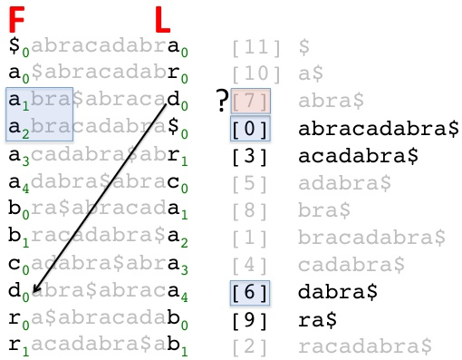

- To find the position of the match, we can take advantage of the LF mapping:

This tells us where to find the $d_{0}$ in the first column F

We can look this up in our selective suffix array - but note that we have moved one position to the left - the position of dabra is 6, so the position of abra must be 7!

## FM Index - Finding indices in T

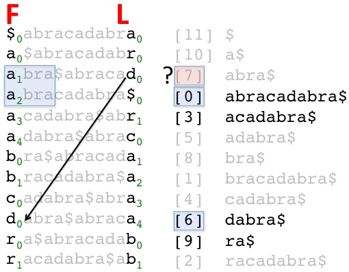

- Note that the fact that we are storing every $k^{th} value for the original string T, ensures that we need to perform at most$ k - 1 "hops" to retrieve the index we are looking for

- However, we are still keeping $\mathcal{O}(|T|)$ elements in the selective suffix array

## FM Index - Memory footprint

The FM index of the human genome has a substantially smaller memory footprint than the suffix tree (at least 60 GB) or the suffix array (at least 12 GB)

<table border="1"><tr><td>Component</td><td>Complexity</td><td>Size (for the human genome</td></tr><tr><td>F</td><td>$\mathcal{O}(|\Sigma|)$</td></tr><td>$</td><td>$\mathcal{O}(|\Sigma|)$</td></tr><td>$</td></tr><td>$</td></tr><tr><td>F</td><td>$\mathcal{O(|\Sigma|$)</td></tr><td>$

$\rightarrow$ Total size for the FM index of the human genome thus about 1.5 GB

Notes:

(i) We store the 4 nucleotides with 2 bits each, i.e., 4 nucleotides per byte

(ii) $k$ and x are the lengths of the skips; 4 bytes per integer


Burrows M. & Wheeler D.J. (1994) A block-sorting lossless data compression algorithm Technical report 124


Ferragina P. & Mazzini P. & Mazzini P. (2000) Opportunistic Data Structures with Applications pp. 390-398