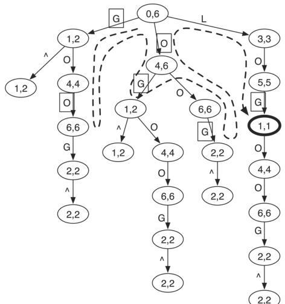
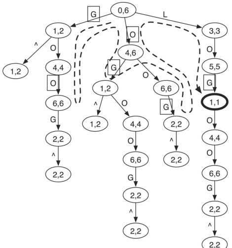
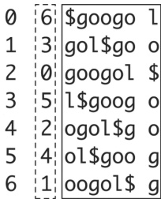
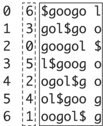
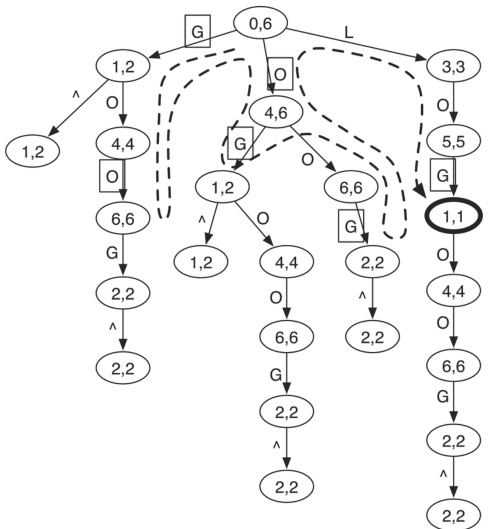
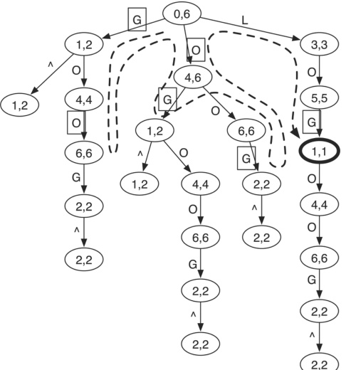

POLITECNICO

MILANO 1863

# Bioinformatics Algorithms Read mapping (part 3)

Rosario M. Piro (based on slides by Peter N. Robinson)

Dipartimento di Elettronica, Informazione e Bioingegneria (DEIB Politecnico di Milano

## BWT/FM Index algorithms for read mapping

There are lots of published read aligners for genomic resequencing. Perhaps the best known amongst them use the BWT/FM Index plus lots of bells and whistles

- BWA: Li H, Durbin R (209). Fast and accurate short read alignment with Burrows-Wheeler transform. Bioinformatics 25:17540

- BWA-MEM: Li H (2013. Aligning sequence reads, clone sequences and assembly contigs with BWA-MEM. arXiv:1397.

- Bowtie: Langmead B, Trapnell C, Pop M, Salzberg SL (209). Ultrafast and memory-efficient alignment to the human genome. Genome Biol 10:R25

- SOAP2: Li R et al (209). SOAP2: Li R et al (209). SOAP2: an improved ultrafast tool for short read alignment. Bioinformatics. 25:196-7

- More short-read sequence aligners at:

https://en.wikipedia.org/wiki/List_of_sequence_alignment_software#Short-read_sequence_alignment_software#Short-read_sequence_alignment

Many of these are based on the BWT!

Here, we will concentrate on BWA ...

## Burrows Wheeler Aligner-BWA

The nomenclature and descriptions used in the BWA paper are different in a few ways to those used in this lecture

- Only some aspects of the paper can be presented here

- Exact matching is performed roughly as we have seen before

Based on the BWT (of course ...)

We will see this now in a more formalized way

- A major issue that needs to be solved by any practical read mapper is inexact matching

Individual reads may differ from the reference genome, e.g., due to ...

★ sequencing errors

★ single nucleotide variants ( $\sim 1$ out of 100000000$ bases differ)

- We will introduce the topic of inexact matching with the brute force approach that is mentioned (and rejected) in the introduction of the BWA paper

## Inexact matching: problem definition

Given:

- Let W (search word/pattern) and T (input "text"/string,e.g., reference genome) be two strings over the same alphabet $\Sigma$ $\mathrm{e.g}.$

- Let $| W |= m$ and $| T |= n$

- Let $d ( a,b )$ be a distance measure for two strings a and b $ e.g., Hamming distance or edit distance)

- Let $d_{max}$ be a threshold for the allowed maximum distance

- Let $T^{p}=T[p\dots p+(m-1]$ be the substring of $T$ having length m $)$ the substring of search pattern starting at position $p$

We assume the substring in $T$ to be of the same length as the pattern W, but this actually not necessarily the case if we use the edit distance and allow for gaps

Find:

- Does at least one $T^{p} \ exist such that$ d(W,T^{p})\leq d_{max} ?$ (yes/no)

- If so, how many $p$ with $0 \leq p \leq n - m$ exist such that $d_{max} ?$

- List all p for which $d \left( W,T^{p} \leq d_{max}$

Wait, the $d_{max}$ is not there.

$d_{max}$

Let's look at the image again. It's $d_{max}$

Actually, it's $d_{max}$

$d_{max}$

Yes.

One more check on the $d_{max}$

$d_{max}$

$d_{max}$

The $d_{max}$

Okay, I'll just use $d_{max}$

$d_{max}$

Yes.

Final check of the text:

• List all $p$ for which $d(W, T^{p}$

$List all p$

Wait, the $p$

$list all$ p $Actually, it might be$ d_{max}$

$List all $p$

Wait, the $p$

Wait, the $p$ is $p$ is $p$ in $W,$ T^{p}$

$

- Alternatively: find the best match regardless of distance and report a "mapping quality" (somehow score the quality of the match

## Prefix trie

- Prefix trie for string $T$:$ $ T $:$ equivalent to suffix trie, but a path from a leaf to the root gives a unique prefix of $T$

- Thus, path from root to leave gives the reverse of a prefix!

- The prefix trie of $T$ is identical to the suffix trie of the reverse of $T!$

- Example shown here:

$ T="\hat{=}^\text{"GOOOGOL" (note the use of a start character!)

The reverse of a substring of $T$ T $ is a path from root to some node

- Example: the reverse of substring "GOL" is the path from the root to the bold node

$$
(\rightarrow " L" \rightarrow " L" \rightarrow " O" \rightarrow " G")
$$



## Prefix trie

- Like for the BWT-based approach, on a prefix trie we can search for substrings starting with the last character of the substring

Example: to search for "GOL", we start with "L"!

- Depth-first search (DFS) to search for a substring!

- Inexact matching (brute-force):

- DFS but allow for up to $d_{max}$ is not a valid identifier.

$d_{max}$

Wait, the prompt says "recognize text only the first line.

The first line has "$\triangleright$.

The first line is "$\triangleright$.

The second line is "$DFS but allow for up to$ d_{max}$.

The first word is "$ DFS but it's "$DFS but allow for up to$ d_{max}$.

The second line is "$ d_{max".

Let's re-read the whole thing.

$DFS but it's "$ DFS but allow for up to $d_{max}$.

The "$d_{max".

The "$ d_{max}$.

The "$ d_{max}$.

The "$ d_{max}$.

The "$ d_{max".

The "$d_{max}$.

The "$d_{max}$.

The "$max".

The "$ max".

The "$d_{max".

The "$ max".

The "$max".

The "$ max".

The "$max".

The "$ max".

The "$max".

The "$ max".

The "$max".

The "$ max".

The "$max".

The "$ max".

The "$max".

The "$ max".

The "$max".

The "$ max".

The "$max".

The "$ max".

The "$max".

The "$ max".

The "$max".

The "$ max".

The "$max".

The "$ max".

The "$max".

The "$ max".

The "$max".

The "$ max".

The "$max".

The "$ max".

The "$max".

The "$ max".

The "$max".

The "$ max".

The "$max".

The "$ max".

The "$max".

The "$ max".

The "$max".

The "$ max".

The "$max".

The "$ max".

The "$max".

The "$ max".

The "$max".

The "$ max".

The "$max".

The "$ max".

The "$max".

The "$ max".

The "$max".

The "$ max".

The "$max".

The "$ max".

The "$max".

The "$ max".

The "$max".

The "$ max".

The "$max".

The "$ max".

The "$max".

The "$ max".

The first line.

The first line.

The first line:

$$

$DFS but allows for$ d $."

The first line:$ DFS but for up to $d$".

The first line:

$DFS but for up to$ d $".

The first line:$ DFS but for up to up to $d$.

The first line:

$DFS$.

The first line:

$DFS$.

The first line:

$DFS$.

The first line:

$DFS$.

The first line:

$DFS$.

The first line:

$DFS$.

The first line:

$DFS$

Example: search word "LOL" with $d_{max}=1$ DFS path is dashed line! Letters with mismatches are shown in boxes, for example, $\Box G$



Note: the numbers associated with nodes are suffix array intervals

## Suffix array interval

## BWA uses the following notation for a "suffix array interval"

- All occurrences of a substring W in the original string T appear next to each other in the suffix array (SA), because a substring is equivalent to the prefix of a suffix of a substring in the suffix array (SA), because a substring is equivalent to the prefix of a suffix of a suffix of a string in the original string $T$ \mathrm{W}$.

$\rightarrow$ A substring W can be represented as an SA interval:

$$
\left[ \underline {{R}}(W), \overline {{R}}(W), \overline {{R}}) ]
$$

- For instance, in the example shown to the right (T=googol$), the SA interval of substring "go" is [1,2] and the suffix array interval of substring "o" is [4,6]

Important: the indices $\underline{R}(W)$ and $\overline {{R}}(W)$ and $R(W)$ do not directly refer to positions in the original text $T$ , $ but instead define a section of the suffix array (shown in dashed lines) which in turn contains references to the original text

T=googol$

0123456

012345



(i) (SA) (BWM)

## BWA: perfect matching

The BWA paper presents the method of calculating the SA interval of the query/search word $ W=W[0...m-1] that we have already seen, using a slightly different notation:

- Can be done iteratively, starting from the end of W:

$$
\begin{array}{l} \underline {{R}} \\ = C \left(a _ {k}\right) + O c c \left(a _ {k}, \underline {{R}} \\ = C \left(a _ {k} + \underline {{W _ {k} + 1\right) + 1) + 1) + 1) + 1) + 1) + 1 \\ \end{array}
$$

$$
\begin{array}{l} \bar {R} \left(W _ {k}\right) = \bar {R} \left(a _ {k} W _ {k} = \bar {R} \left(W _ {k}\left(W _ {k}\right) \\ = C \left(a _ {k}\left(a _ {k}\right) + O c c \left(W _ {k}\left(W _ {k}\right) \\ \end{array}
$$

$$
\begin{array}{c c c c c
$$

where

- $W_{k}=W[k\dots m-1]$; suffix of $W$ with $0 \leq k \leq m-1$

- $a_{k}$ is the k-th character of $W$ a_{k}$

Thus $W_{k}=a_{k} = a_{k} W_{k+1}$

- $C \left( a_{k}\right)=$ number of chars in $T[0,n-2]$ (i.e.,in T $without the final$ ) that are lexicographically smaller than $a_k$

- Occ $\left(a_{k}, i\right) =$ number of occurrences of $a_{k} in BWT[0,i]$

- Initialization: $ W_{m}=\overline{w} = \prime^{\prime \prime \prime \prime \prime \prime \prime \prime \prime \prime \prime \prime \prime \prime \prime \prime \prime ; R(\prime \prime

## Example for perfect matching

Example for perfect matching: find the SA interval for query $W="goo$ in $T="googol$

- Step 1: search for "o" (last character)

$$
\begin{array}{l} \underline {{R}} \\ = 3 + 0 + 1 = 4 \\ \end{array}
$$

$$
\begin{array}{l} \bar {R} \left(" o"\right) = C (" o") + O c c c c \left(" o", " R (" " "\right) \\ = 3 \\ = 3 \\ = 6 \\ \end{array}
$$

- Step 2: search for "go" (last two characters)

$$
\begin{array}{l} \underline {{R}} \left(" g o "}\right) = C (" g ^ {\prime} \\ = 0 + 0 + 1 = 1 \\ \end{array}
$$

$$
\begin{array}{l} \overline {{R}} ^ {\prime} \left(" g o "}\right) = C (" g") + O c c \left(" g", \bar {g" , \bar {R} (" o ")} \\ = 0 + 2) = 2 \\ \end{array}
$$



## BWA: precalculations

- We can calculate $C(a)$ for $T= \mathrm { }$ ' googol $,$ defined in the paper as the number of symbols in $T[0,n-2]$ a\in\Sigma$

- Let us assume $\Sigma = \{g, I, o$

- The vector $\mathbf{C} is then:^{1}$

<table border="1"><tr><td>a</td><span style="border="1px solid black">$a$</span></td><span style="border: 1px solid black;</span>g</span></table>

- We also calculate Occ(a,i), the number of occurrences of a in BWT[0, i]^2.

<table border="1"><tr><td>i</td><td>a</td><td>Occ("g", i)</td><td>Occ("g", i)</td><td>Occ("l"</td><td>Occ("l"</td><td>i)</td><td></td><td></td><td></td><td></td><td></td><td></td><td></td><td></td></tr><tr><td>0</td><td></tr><tr><td>0</td><td></td><td></td><td></td><td></td><td></td><td></td></tr><tr><td>0</td><td></td><td></td><td></td><td></td><td></td><td></td></tr><tr><td></td><td></td><td></td><td></td><td></td></tr><tr><td></td><td></td><td></td><td></td><td></td></tr><tr><td></td><td></td><td></td><td></td><td></td></tr><tr><td></td><td></td><td></td><td></td><td></td></tr><tr><td></td><td></td><td></td><td></td></tr><td></td><td></td><td></td></tr><td></td><td></td><td></td><td></td></tr><td></td><td></td><td></td><td></td></tr><td></td><td></td><td></td></tr><td></td><td></td><td></td><td></td></tr><td></td><td></td><td></td><td></td></tr><td></td><td></td><td></td></tr><td></td><td></td><td></td></tr><td></td><td></td></tr><td></td><td></td><td></td></tr><td></td><td></td></tr><td></td><td></td><td></td></tr><td></td><td></td><td></td><td></td></tr><td></td></tr><td></td><td></td><td></td></tr><td></td><td></td></tr><td></td><td></td></tr><td></td><td></td></tr><td></td><td></td><td></td></tr><td></td><td></td><td></td></tr><td></td><td></td></tr><td></td><td></td><td></td></tr><td></td><td></td></tr><td></td><td></td><td></td></tr><td></td><td></td><td></td><td></td></tr><td></td><td></td><td></td></tr><td></td><td></td><td></td></tr><td></td><td></td><td></td><td></td><td></td></tr><td></td><td></td><td></td><td></td><td></td></tr><td></td><td></td><td></td><td></td><td></td></tr><td></td><td></td><td></td><td></td><td></td><td></td><td></td><td></td><td></td><td></td><td></td><td></td><td></td><td></td><td></td><td></td><td></td></tr><td></td><td></td

$^{1}$ Equivalent to $\mathbf{F}$, but cumulative (cumulative index property!)

$^{2}$ Equivalent to the tally table to determine the B-rank

## Inexact matching

The overall algorithm looks like this

**Algorithm 1 InexactSearch($W,z$)

1: CalculateD(W)$2: **return**InexactSearch(W, z)$

- CalculateD(W) precalculates lower bounds of the number of mismatches

- InexRecur $W,i,z,k,\ell$ returns the SA intervals of substrings in $T$ that match $W$ with no more than $z$ differences

*Recursive function:

For query word/pattern $W$ ...$

- search for matches to $W[0...i] (here: we start with the full word, so$ i = |W| - 1)$ ...

with a max number of z mismatches (here: start with $z = d_{max}$ ...

on the condition that the suffix $W_{i+1$ already matches the SA interval $[k..\ell]$ (here: start with $W_{i+1}$ and thus $k=1$ and $\mid T|-1$, i.e., full interval) $

Let's see more details ...

## Inexact matching

Let us examine the CalculateD (W) algorithm

1: $z \leftarrow 0$

2: $j\leftarrow 0$

3: **for**i = 0 $to$|W|-1 $do

4: if$ W[j\dots i]$is not a substring of differences in$ W[0..i]$to the best match in$ W[0..i]$4:$ D(i)$is not a substring of differences in$ W[0..i]$to the best match in$ T $4: start with$ z \leftarrow z+i+1 $(after current substring!; D(0) = 1; increase i and check W[0...1]$

5: $z \leftarrow z + i+1$ after current substring!; D(i)$5: end for$ D(i)$6:$ D(i)\leftarrow$

## Inexact matching

Retionale for CalculateD (W):

- Assume we use a depth-first search for inexact matches (as shown here)

(BWA uses breadth-first search)

- CalculateD (W) is a heuristic that allows to stop the DFS early:

Example: search for $W="LOL" in$ W= "LOL" in $T = "\hat{W}$ $\text{ }$ $\bigcirc GOOGOL$ $ $ \bigwedge d_{max}=1 $

- First compare the last letter ("L") with the "G" on the left: $1^{st}$ error

- If at this point, we already know that for the rest of the search pattern there will also be at least 1 mismatch, then we know that the left branch of the trie will lead to least 2 mismatches and we can avoid descending further!

- How do we know? Because $ W[0 \dots 1] = "LO" is not in T!

$$
\rightarrow D (1) = 1
$$
\rightarrow D (1) = 1
$$



## Inexact matching

## Algorithm 2 Calculate D(W)

1: $z \leftarrow 0$

2: $j \leftarrow 0$

3: **for** $i = 0$ to $|W|-1$ do

4: if $W[j..i]$ is not a substring of $T$

5: $z \leftarrow z+1$

6: $j\leftarrow i+1$

7: end if $8: return D$

9: return D $10$

10 $10: return D$

10: return D$

- For $T="GOOGOL$ and $W="LOL", the for loop goes from 0 to 2$

- We obtain:

$D ( 0 ) = 0$ because " L $is in T$

$D ( 1 ) = 1$ because "LO" (first two letters) is not in T $

$D ( 2 ) = 1$ because " L $is in T$

## Inexact matching

Algorithm 3 InexRecur(W,i,j,z,k,l)

Algorithm 3 InexRecur($W, I, Z, K, \ell$

```text

1: if $i < 0$ then

2: return $\{k,\ell$ //i.e., an SA interval

3: return $W,I,I,Z,k,\ell$

2: return {k} //mismatch, decrement z $3: end if

4: return$ W,I,I,Z,k,\ell $5: return$ k $6: return$ k $7: end if

8: return$ I,I\cup \in \text{Inexecur(W,i-1, k-1, z-1,k,\ell $9: return$ W,I, i,j $10: return$ W,I,I,I,I,I,J,K,I,J,I,J,K,J,I,J,K,I,J,I,J,K,I,J,I,J,K,I,J,K,1,1,1 $9: return$ J,I,J,I,J,K,1,1,1,1 $8: return$ W,I,J,1,1,1,1,1 $10$

10: return $W,1,1,1,1,1,1,1$

10 $10: return$ W,1,1,1,1,1 $10: return$ W,1,1 $10: return$ W,1,1 $1: return$ W,1,1 $1: return$ W,1,1 $1: return$ W,1,1 $1: return$ W,I,1,1 $1: return$ W,1,1 $1: return$ W,1,1 $1: return$ W,1 $1: return$ W,1 $2: return$ W,1 $1: return$ W,1 $1: return$ W,1 $2: return$ W,1 $1: return$ W,1 $1: return$ W,1 $2: return$ W,1 $3: return$ W,1 $3: return$ W,1 $4: return$ W,1 $5: return$ W,1 $6: return$ W,1 $1: return$ W,1 $1$

1: return $W,1$

1: return $W,1$

1: return $W,1$

1 $1: return$ W,1 $3: return$ W,1 $3: return$ W,1 $4: return$ W,1 $5: return$ W,1 $6: return$ W,1 $7: return$ W,1 $1: return$ W,1 $1: return$ W,1 $3: return$ W,1 $4: return$ W,1 $5: return$ W,1 $6: return$ W,1 $1: return$ W,1 $1: return$ W,1 $1$

1: return $W,1$

1: return $W,1$

## Lines 1-3

- If $i < 0$ then we are arriving from a recursive call where we have finished matching $W$ (potentially including up to z mismatches)

- We return the SA interval $\{k,\ell$

## Inexact matching

Algorithm 3 InexRecur(W,i,j,z,k,l)

1: if $i < 0$ then

2: return $\{k,\ell$ //i.e., an SA interval

3: end if

4: if $z < D(i)$

5: return $k \leftarrow C(b) + O(b, k - 1$

6: return 0 $7: end if

8: return$ k - 1 $9: return$ k $10$

10 $10$

Algorithm 3: inexecur(W,i, i, j = 1, z - 1, z - 1, k - 1, k - 1, k, \ell $10$

10 $1: if$ i < 1, z - 1, z - 1, k, k, \ell $10$

1: if $i, i - 1, j, i - 1, k, i, j, k, \ell$

1: return $j, i, i, j, k, i, j, i, j, k, i, j, k, i, j, k, i, j, k, i, j, n$

1: if $i, j, i, j, k, i, j, k, i, k, i, j, k, i, j, n$

1: if $i, j, i, j, i, j, i, j, i, j, i, i, j, i, j, i, i, j, i, j, i, i, j, i, i, i, i, j, i, i, i, j, i, j, i, i, i, i

## Lines 4-6

- If the lower bound on the number of differences in $ W[0...i] is already more than the maximum number of (still) allowed mismatches z, give up

- Return null (no match for $W[0...i] found)

## Inexact matching

Algorithm 3 InexRecur(W,i,j,z,k,l)

1: if $i < 0$ then

2: return $\{k,\ell$ //i.e., an SA interval

3: end if

4: return $\{k, \ell$ //i.e., an SA interval

5: end if

6: return $k-1$

7: return $k$

```matlab

end if

return 0 $8: end if

9: return$ k-1 $10$

10 $10$

10 $10$

11: end if

end for

return 1 $```matlab

end if

return 1$

```

## Line 7

- For this recursion, initialize the current SA interval / to the empty set

## Inexact matching

Algorithm 3 InexRecur(W,i,j,z,k,l)

1: if $i < 0$ then

2: return $\{k,\ell$ //i.e., an SA interval

3: end if

4: return $\{k, \ell$ //i.e., an SA interval

5: end if

6: return $k-1$

7: return $k$ // match, decrement by 1

8: return $k$

9: return $k-1$

10 $10$

10: return $k$

10: end if

10 $10$

10: return $k$

10 $10: return$ k $11: if$ i = i $, return$ k-1, z-1, k, \ell $11$

101 $101$

101: if $i$, return $k, k-1, z-1, k, \ell$

11 $11: return$ k, \ell $11: return$ k, \ell $11: return$ k, \ell $11: return$ k $11: return$ k, \ell $11: return \ell$

1: if $i$, return $k$

1: return $k$

1: return $k$

1: return $k$

1: return $k$

1: return $k$

1: return $k$

1: return $k$

1: return $k$

1: return $k$

1: return $k$

1: return $k$

1: return $k$

1: return $k$

1: return $k$

1: return $k$

1: return $k$

1: return $k$

1: return $k$

1: return $k$

1: return $k$

1: return $k$

1: return $k$

1 $1: return$ k $1.1$

1. end if $i$

## Line 8

- Loop over all nucleotides (A,C,G,T), looking for a match...

## Inexact matching

Algorithm 3 InexRecur(W, i, j, k, l)

1: if $i < 0$ then

2: return $\{k, \ell$ //i.e., an SA interval

3: end if

4: return $b, i - 1, k - 1$

5: return 0 $6: end if

7: return$ 0 $8: for each$ b, i = 1 $9: return$ i $,$ i = 1, j = 1, k - 1, z - 1, k - 1, k, \ell $10$

10 $10$

10 $10$

10 $10$

10 $10$

10 $10$

1 $1$

1 $1$

1 $1$

1 $1$

1 $1$

1 $1$

1 $1$

1 $1$

1 $1$

1 $1$

1 $1$

1 $1$

1 $1$

1 $1$

1 $1$

1 $1$

1 $1$

1 $1$

1 $1$

1 $1$

1 $1$

1 $1$

1 $1$

1 $1$

1 $1$

1 $1$

1 $1$

1 $1$

1 $1$

1 $1$

1 $1$

1 $1$

1 $1$

1 $1$

1 $1$

1 $1$

1 $1$

1 $1$

1 $1$

1 $1$

1 $1$

1 $1$

1 $1$

1 $1$

1 $1$

1 $1$

1 $1$

1 $1$

1 $1$

1 $1$

1 $1$

1 $1$

1 $1$

1 $1$

1 $1$

1 $1$

1 $1$

1 $1$

1 $1$

1 $1$

1 $1$

1 $1$

1 $1$

1 $1$

1 $1$

1 $1$

1 $1$

1 $1$

1 $1$

1 $1$

1 $1$

1 $1$

1 $1$

1 $1$

1 $1$

1 $1$

1 $1$

1 $1$

1 $1$

1 $1$

1 $1$

1 $1$

1 $1$

1 $1$

1 $1$

1 $1$

1 $1$

1 $1$

1 $1$

1 $1$

1 $1$

1 $1$

1 $1$

1 $1$

1 $1$

1 $1$

1 $1$

1 $1$

1 $1$

1 $1$

1 $1$

1 $1$

1 $1$

1 $1$

1 $1$

1 $1$

1 $1$

1 $1$

1 $1$

1 $1$

1 $1$

1 $1$

1 $1$

1 $1$

1 $1$

1 $1$

1 $1$

1 $1$

1 $1$

1 $1$

1 $1$

1 $1$

1 $1$

1 $1$

1 $1$

1 $1$

1 $1$

1 $1$

1 $1$

1 $1$

1 $1$

1 $1$

1 $1$

1 $1$

1 $1$

1 $1$

1 $1$

1 $1$

1 $1$

1 $1$

1 $1$

1 $1$

1 $1$

1 $1$

1 $1$

1 $1$

1 $1$

1 $1$

1 $1$

1 $1$

1 $1$

1 $1$

1 $1$

1 $1$

1 $1$

1 $1$

1 $1$

1 $1$

1 $1$

1 $1$

1 $1$

1 $1$

1 $1$

1 $1$

1 $1$

1 $1$

1 $1$

1 $1$

1 $1$

1 $1$

1 $1$

1 $1$

1 $1$

1 $1$

1 $1$

1 $1$

1 $1$

1 $1$

1 $1$

1 $1$

1 $1$

1 $1$

1 $1$

1 $1$

1 $1$

1 $1$

1 $1$

1 $1$

1 $1$

1 $1$

1 $1$

1 $1$

1 $1$

1 $1$

1 $1$

1 $1$

1 $1$

1 $1$

1 $1$

1 $1$

1 $1$

1 $1$

1 $1$

1 $1$

1 $1$

1 $1$

1 $1$

1 $1$

1 $1$

1 $1$

1 $1$

1 $1$

1 $1$

1 $1$

1 $1$

1 $1$

1 $1$

1 $1$

1 $1$

1 $1$

1 $1$

1 $1$

1 $1$

1 $1$

1 $1$

1 $1$

1 $1$

1 $1$

1 $1$

1 $1$

1 $1$

1 $1$

1 $1$

1 $1$

1 $1$

1 $1$

1 $1$

1 $1$

1 $1$

1 $1$

1 $1$

1 $1$

1 $1$

1 $1$

1 $1$

1 $1$

1 $1$

1 $1$

1 $1$

1 $1$

1

1

```

## Lines 9-111

- Figure out the SA interval in $ \mathbf{F} where the current nucleotide b would be

The SA interval is computed as for exact matching, just that we try all nucleotides!

- Check whether this interval is empty (no valid interval for $k > \ell$

## Inexact matching

Algorithm 3 InexRecur(W, i, j, k, l)

1: if $i < 0$ then

2: return $\{k,\ell$ //i.e., an SA interval

3: end if

4: return $\{k, \ell$ //i.e., an SA interval

5: return ${k, \ell$

6: return 0 $7: if$ k \le k \leq \ell $8: for each$ k \in \mathbb{R}$9: return 0$

10 $10$

10: if $k \in \mathbb{R}$

10 $10$

10 $10$

11: if $i = i$, return $k - 1, z = 1, z = 1, z = 1, z = 1, z = 1, k - 1, k - 1, k - 1, k \neq 0$

10 $11: return 0$

1: return 0 $1: if$ k \neq $1: return 0$

1: return 0 $1: if$ i = i $, //i.e., an SA interval

1: return$ W, i = i, i - 1, i = i, i - 1, i - 1, j = i, j = i, k, k - 1, z, z, k, z, k, z, z, k, z, y, z, z, x $1: return z, y, z, y, z, z, y, z, w$

1: return y, z, w $2: return y, z, w$

3: return y, z, w, x, y, z, w $1: return y, z, w, x, y, z, w$

1: if $i, y, w, y, w, x, y, w, x, y, z, w, x, y, z, w, y, z, w, y, z, w, y, z, w, y, z, y, z, w, y, z, y, z, y, z, y, z, y, w, y, z, y, w, y, z, y, x, y, x, y, z, y, w, y, y, z, y, w, y, w, y, y, w, x, y, x, y

## Lines 12-15

- If we have a match, then decrement $i$ and keep going, thus checking $W[0...i-1]$.

- If we have a mismatch, then decrement i and also z and keep going, thus allowing one less mismatch for $ W[0...i - 1]!

## Inexact matching

## Consider now the role of the D matrix in the DFS shown in the figure

## The initial call to

InexRecur(W,i,z,k, $\ell$ (W,i,z,k,\ell)$with$ W="LOL"$and$ T="GOOGOL$ is maximally one mismatch allowed) is:

InexRecur $\mathrm{InexRecur}(W,|W,|W|-1,z,1,|T|-1)$

i.e., InexRecur(W,2,1,1,1,1,6)$

- The DFS skips lines 1-7 and from the root node chooses the character 'G'

- 'G' does not match the last character of 'LOL', so there is a mismatch, and we recursively call InexRecur, after decrementing i and z



## Inexact matching

## Consider now the role of the D matrix in the DFS shown in the figure

## The recursive call looks like this:

InexRecur(W,1,0,1,0,1,2)

Because in the previous iteration:

$$
i \leftarrow i - 1 = 1
$$

$$
k \leftarrow C \left(^ {\prime} G ^ {\prime} G ^ {\prime} G ^ {\prime} G ^ {\prime} G ^ {\prime}) + O \left(G ^ {\prime} + O \left(G ^ {\prime}, k - 1\right) + 1 = 1)
$$

$$
\ell \leftarrow C \left(^ {\prime} ^ {\prime} G ^ {\prime} G ^ {\prime} G ^ {\prime}) + O \left(\prime} ^ {\prime} ^ {\prime} ^ {\prime} G ^ {\prime}, \ell) = 2)
$$

- When we get to line 4, i =1 and $z=0$. Recalling that we calculated $D (1)=1$, we have that $z < D(i)$.

- Similarly, we avoid descending into the 'O' subtree

- Only for the 'L' subtree we will continue until we find the match


## Li H. & Durbin R. (209)

Fast and accurate short read alignment with Burrows-Wheeler transform Bioinformatics 25:1754-60