POLITECNICO

MILANO 1863

# Bioinformatics Algorithms Variant calling

Rosario M. Piro (based on slides by Peter N. Robinson)

Dipartimento di Elettronica, Informazione e Bioingegneria (DEIB)

Politecnico di Milano

## Today's Lecture

Today serves as as an outlook of things we can do once we have mapped/aligned ou sequencing reads to the reference genome. We will focus on a specific topic: using whole genome sequencing (WGS) data for the identification of differences between the sequenced genome and the reference genome, so called "variants". However, we will only scratch the surface; the topic is mouch more complex and varied than illustrated here!

But before, let's have a very brief look at some things that we can do but won't discuss today:

- In case of ChIP-seq data: peak calling

- In case of RNA-seq data: measure gene expression, identify alternative splicing

- In case of Hi-C data: identify chromatin interaction

...

## ChIP-seq: peak calling

## ChIP-seq = **chromatin** **immuno** **recipitation** followed by next generation **sequencing**

Basic idea: don't sequence DNA fragments from the entire genome, but only DNA fragments to which a specific protein (e.g., TP53) has bound!

Mapped reads are concentrated around specific DNA regions, only "random noise" for the rest of the genome

- (Usually two peaks that can be merged)

- Statistical "peak calling" to identify the bound DNA regions

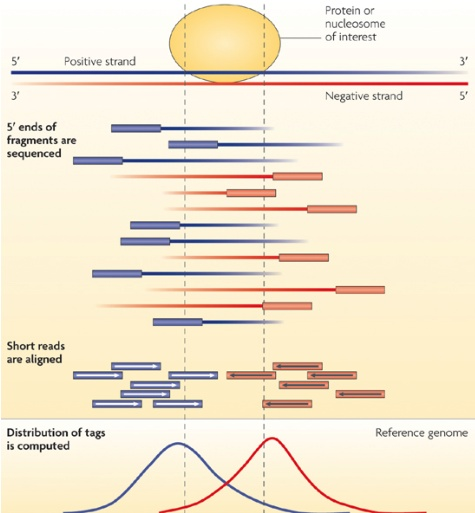

## RNA-seq: gene expression and splicing

## RNA-seq = RNA sequencing (see for example: Wang et al., 2009)

- Basic idea: sequence RNA molecules instead of genomic DNA (actually: RNA copied into "complementary DNA"=cDNA, which is then sequenced)

- Mapped reads are concentrated in exonic regions which are present in transcribed, mature RNA molecules (e.g., protein-coding messenger RNA)

- Genes with higher read coverage have higher expression levels (more copies of the RNA = more fragments!)

- Reads can "span" splice junctions, e.g., they can start in one exon and end in another

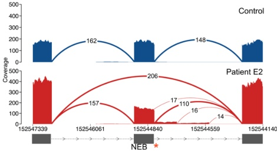

MacArthur lab (Massachusetts General Hospital); https://macarthurlab.org

Example: aberrant splicing due to a mutation in the NEB gene; the "Sashimi" plot shows the read coverage over exonic regions and the numbers of splice-junction spanning reads in a control sample (top) and a patient (bottom)

## Hi-C: identification of chromatin interactions

## Hi-C is a chromosome conformation capture method (Lieberman-Aiden et al, 2009)

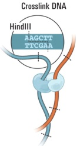

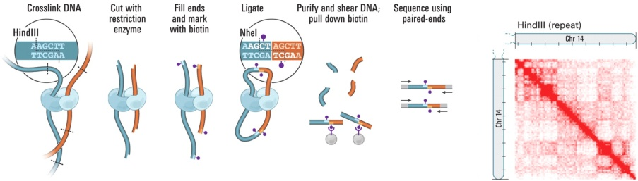

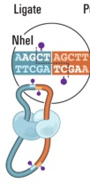

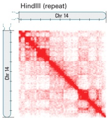

- Basic idea: fuse two genomic regions which interact, then sequence a read pair spanning the artificial junction (one read from each region)

- Mapped reads are concentrated in regions which interacted; each read pair indicates two specific interacting regions

- Output: two-dimensional interaction maps

- The number of read pairs obtained for two regions depends on the interaction frequency

## Why variant calling?

Variant calling is one of the key challenges in many areas of genomics research and diagnostics. Having aligned the fragments from DNA sequencing of one or more individuals to a reference genome, "single-nulceotide variant (SNV) calling" identifies variable sites, whereas "genotype calling" determines the genotype for each individual at each site (heterozygous SNV, homozygous SNV?). Also structural variants (such as copy-number changes or translocations) can be identified.

- We assume to have data from whole genome sequencing (WGS), not whole exome sequencing (WES)

- WES works similarly for SNV calling, but poses many difficulties for the identification of structural variants

- In the following we will only scratch the surface of the topic ...

## Germline Mutations in Human Genetics

- Fibrodysplasia Ossificans Progressiva

- OMIM ID: #135100

- Spontaneous or trauma-induced ossification of soft tissue (muscle, tendon, ligament)

- Caused by a specific point mutation in the BMP type I receptor ACVR1, (c.617G>A; p.R206H)

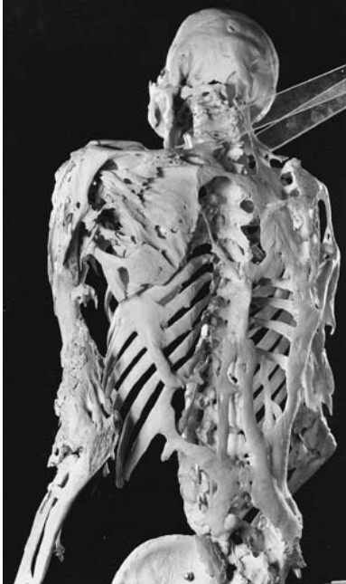

## Somatic Mutations in Cancer

## Example: Somatic ERBB2 mutations in glioblastoma tumors

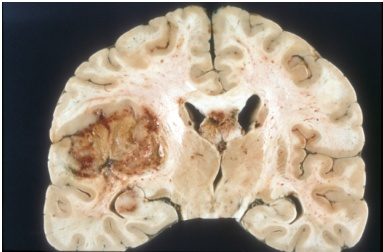

Exon-specific probe set summaries

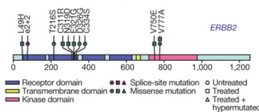

The Cancer Genome Atlas Research Network.

Nature 2008;455:1061-1068

- Somatic mutations in ERBB2, NF1, IDH1 and other genes contribute to the development of glioblastoma

- Somatic mutations can be identified by comparing the tumor sample to a normal control sample (e.g., blood) from the same individual to filter out germline SNVs/SNPs

## Basic genomic variations

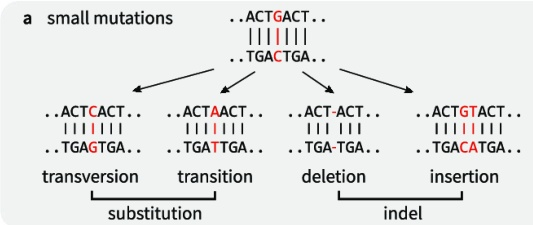

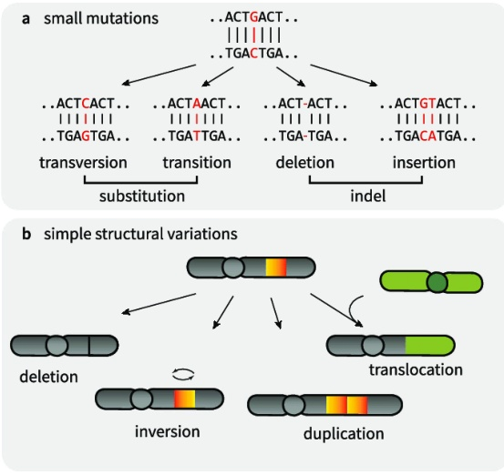

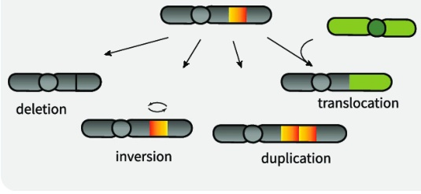

(from: Yi & Ju, 2018)

- Small mutations: SNPs and SNvs, indels (small insertions and deletions)

- Structural variants: duplications, deletions, inversions, translocations, ...

## SNPs and SNVs

- SNP: Single-nucleotide polymorphism. A variant that is polymorphic within a population (pronounced "snip")

By convention: called SNP if present in at least 1% of the population; otherwise it's a "rare variant"

- SNV: Single-nucleotide variant. A variant identified in an individual genome

A "called" SNV can be a SNP (somatic SNVs in tumor samples need not be SNPs)

In medical genomics, we're often interested in SNVs that are not known as SNPs (e.g., rare variants)

(However, except for tumor samples, the terms "SNP" and "SNV" often are used interchangeably)

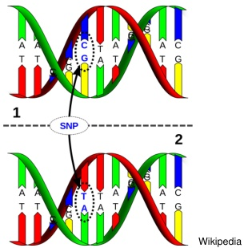

About 3-4 million SNVs in a typical genome! Several thousand SNVs in a typical exome ( $\approx$ 1% of genome)!

## Indels

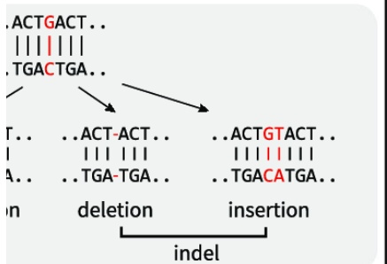

Conceptual visualization of indels (adapted from: Yi & Ju, 2018)

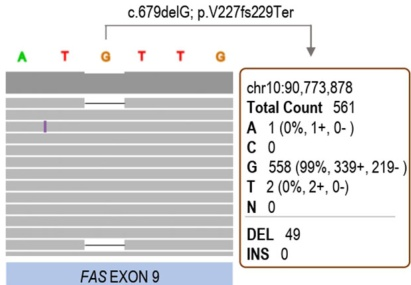

In protein-coding regions:

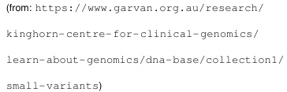

Somatic FAS mutation in autoimmune lymphoproliferative syndrome

- indels can cause "frameshifts"!

(abberant amino acid reading frame after short insertion or deletion)

(adapted from: López-Nevado et al, 2021)

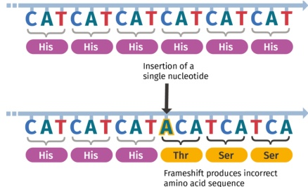

## Structural variants

SV Types


Destructive (non-balanced)


Non-destructive (balanced)

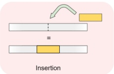

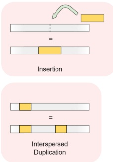

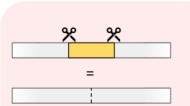

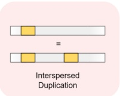

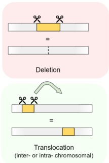

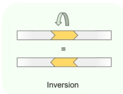

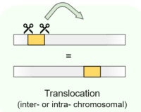

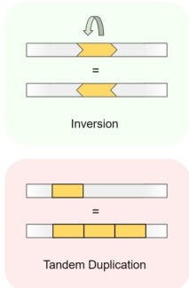

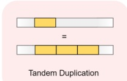

- Balanced: no change in amount of DNA Unbalanced: amount of DNA increased or decreased

- Copy number variants (CNV): change in copy number (unbalanced)

Duplications or deletions (but not insertion of novel sequences, e.g., viruses)

- Hundreds/Thousands of structural variants per genome! Average size of 250,000 nt (n.b.: avg. gene length is ca. 60,000 nt)

## Cancer: somatic variants

germline SNV (SNV present in tumor and control)

somatic SNV (SNV present only in tumor)

somatic and germline CNVs (one CNV present already in control!)

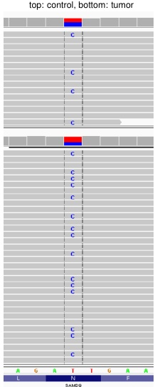

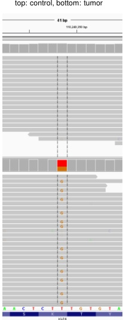

top: cntrol, ccter: tumor, bctom: ratioc

top: cntrol, ccter: tumor, bctom: ratioc

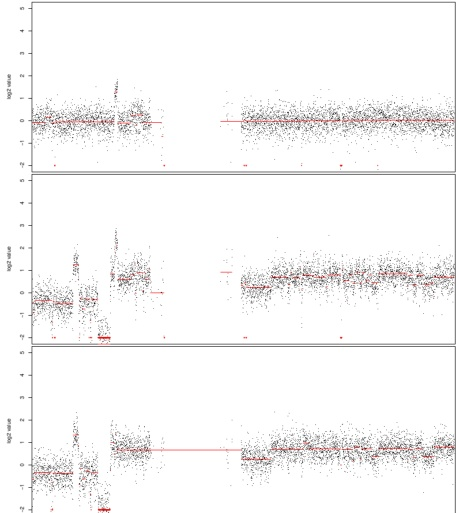

## Variant allele frequency (fraction of reads)

For germline SNVs:

- heterozygous SNV (one copy affected): $\approx$ 50% of reads

- homozygous SNV (both copies affected): $\approx 100\%$ of reads

More complicated for somatic SNVs!

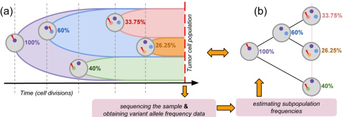

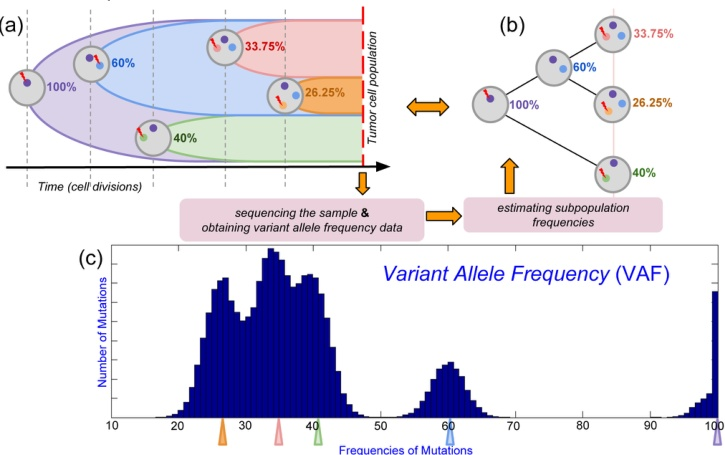

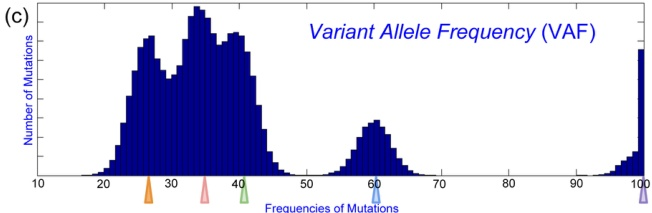

## PHRED quality scores

Two measures are fundamental when evaluating how confident we are with the information obtained from high-throughput sequencing:

- "mapping quality": quality/confidence with a given read maps to a unique genomic location (remember: we have inexact matching and some genomic regions are highly repetitive)

- "base quality": quality/confidence with which an individual base was sequenced or "called" (how clear an unambiguous was the light signal?)

Both measures are usually reported as PHRED quality scores $^{1}$ , defined as

$$
Q _ {P H R E D} = - 1 0 \log_ {1 0} p
$$

where $p$ is the probability that the corresponding base call (or read mapping) is wrong.

- The PHRED quality score is nothing more than a simple transformation:

<table><thead><tr><th>$Q_{PHRED}$</th><th>$p$</th><th>Accuracy</th></tr></thead><tbody><tr><td>$10</td><td>10^{-1}$</td><td>$90%</td></tr><tr><td>20</td><td>10^{-2}$</td><td>$99%</td></tr><tr><td>30</td><td>10^{-3}$</td><td>$99.9%</td></tr><tr><td>40</td><td>10^{-4}$</td><td>$99.99%</td></tr><tr><td>50</td><td>10^{-5}$</td><td>99.999%</td></tr></tbody></table>

$^{1}$ See https://en.wikipedia.org/wiki/Phred_quality_score

## Read alignment

- samtools to sort, index, subset, and display BAM file

peter@peter:~/SVN/slides/lehre/genomics/lectures... peter@peter:~/bin/samtools-0.1.19 peter@peter:~/Dropbox/Genomics-FU

31587731 31587741 31587751 31587761 31587771 31587771 31587781 31587791 31587801 31587811 31587821 31587831 31587841

TGCCGTGGTCCATCCTA AGTAGAGAGCTTCTCCAAGCTCACGTTTTTGGGCAACATTCACCTATGTTAGTTATAGAAATCTCCTGATGATGGCATTGCCAAGCTCACAGGGATGAGCACCACCATGCCCG

R

ccat a a ag agagagct c ccaagcac c cacat t ggcaacat

## Pileups

- Pileup format facilitates SNP/indel calling and brief alignment viewing by eyes.

- Each line consists of chromosome, 1-based coordinate, reference base, the number of reads covering the site, read bases and base qualities.

- Pileups can easily be produced using samtools

... 

21 31587791 T 24 .,.,.,.,.,.,.,.,.,.,.,.,^],

21 31587792 G 25 .,.,.,.,.,.,.,.,.,.,.,^],

21 31587793 A 26 .,.,g.Gg,.G..GG,G.gG.,g,^],

21 31587794 G 27 $.,$,.,.,.,.,.,.,.,.,.,.,^],

21 31587795 T 26 .,.,.,.,.,.,.,.,.,.,.,^].

...

```sql

GDFEDEDEEFEFEFEFEFD2E=>;

BCH198H8I9J17H8768I91I:9I...

8G=B6F56GC4BC45I5B76BA?8AA

<D7F5698GH78H74F5698H79E@C@BB

;CECDEE0B4A0A7=@C0F82BB>=B

```

## Read bases are indicated as:

a dot: sequence match to the reference base on the forward strand

a comma: sequence match on the reverse strand

▶ 'ACGTN': for a mismatch on the forward strand

▶ 'acgtn': for a mismatch on the reverse strand

(plus other symbols we are going to ignore here ...)

Position 31587793 seems to be of interest:

- Covered by a total of 26 reads: 16 reads favor the reference "A", and 10 reads favor an alternate base "G"

- Intuitively, this seems likely to be a heterozygous variant!

## Variant calling and genotyping

For germline variants we can do the following:

- Variant calling: identifying variants and their genomic locations

- Genotype calling/genotyping: determining the "genotypes" of individual genomic positions (this implicitly also determines the variants)

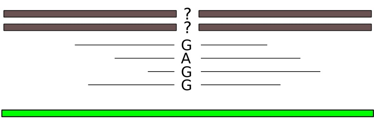

Sequenced Genome

Reads

Possible genotypes in the germline (considering two copies):

Reference Genome

- Homozygous reference: both copies have the base of the reference genome

- Heterozygous variant: one copy has an alternate (= non-reference) base $^{2}$

- Homozygous variant/alternate: both copies have the same alternate base

$^{2}$ Also: if both copies show different non-reference bases at the location, then the genotype is also heterozygous! E.g., REF is "A", individual has "C" and "T".

## Germline variants

Goal: characterize each column of the sequence alignment, i.e., the alignment of all reads which map to the corresponding position in the reference genome

For each column, let's denote the reference base ("REF") as a and the alternate base ("ALT") as b. There are then usually only three possible outcomes:

- Homozygous reference (aa)

- Heterozygous (ab)

- Homozygous alternate (bb)

Assume, of n reads which map to a given genomic position, we observe k REF bases and n-k ALT bases. We can make the following assumptions:

- If the true genotype is aa (= homozygous REF), then the n-k observed ALT bases must be sequencing errors!

- If the true genotype is bb (= homozygous ALT), then the k observed REF bases must be sequencing errors!

- If the true genotype is ab (= heterozygous), then we can approximate the probability of observing $k$ reference bases (out of n) as

$$
\operatorname {d b i n o m} (n, k, p = 0. 5) = \binom {n} {k} p ^ {k} (1 - p) ^ {n - k} = \binom {n} {k} \frac {1}{2 ^ {n}}
$$

## A naive algorithm

Early NGS studies basically filtered base calls according to quality and then used a frequency filter:

Typically, a base quality filter of PHRED score $Q\geq 20$ was used (equivalent to a sequencing error probability of 1%)

2 Then, the following thresholds were used for the ALT base (b) frequency $f ( b )=\frac{n-k}{n}$ :

<table border="1"><tr><td>f(b)</td><td>genotype call</td></tr><tr><td>[0,0.2)</td><td>homozygous reference</td></tr><tr><td>[0.2,0.8]</td><td>heterozygous</td></tr><tr><td>(0.8,1]</td><td>homozygous variant</td></tr></table>

Note: the frequency $f ( b )$ is often also referred to as 'variant allele frequency (VAF)' or 'mutant allele frequency (MAF)' (the latter term is ambiguous because it's also used in population genetics).

## A naive algorithm

For germline variants, the frequency heuristic works reasonably well if the sequencing depth/coverage is high (large enough n for most genomic positions), so that the probability of a heterozygous nucleotide falling outside of the 20% - 80% region is low. (For somatic variants in cancer we can also have lower frequencies!)

Problems with the frequency heuristic:

- For low sequencing depth (and hence low n), it leads to undercalling of heterozygous genotypes

Example: 2 out of 6 reads (33%) would be interpreted as a heterozygous mutation, 1 out of 6 reads (17%) would be homozygous reference (no variant at all), but is this actually a significant difference considering a random sampling process?

- Also: a changed base on a single read can also be a sequencing error

Possible solution: require a minimum number of reads $(n)_{min}$ and a minimum number of ALT bases $(n-k)_{min}!$

★ Problem here: we may have many locations in the genome for which these thresholds aren't reached and we cannot tell whether there are variants or not ...

- Use of a binary (yes/no) base quality filter leads to loss of information

- Are the reads hinting at an alternate base those with the lowest mapping quality and/or lowest base quality at that position?

- The approach does not provide a measure of confidence in the genotype call

How likely is the predicted genotype/variant to be true?

## A probabilistic approach: MAQ

- To address the problems raised by the approach based on frequency heuristic, a number of probabilistic methods have been developed

- We will discuss an early algorithm (not state of the art), named MAQ (Li et al, 2008), and provide some algorithmic background

- The MAQ SNV calling algorithm makes use of Bayesian statistics and the maximum a posteriori (MAP) formalism, which will be explained in the following

## Given:

Read mapping $\Rightarrow$ aligned columns of nucleotides with:

mapping quality for each read

2 base call quality for each sequenced nucleotide

A stack of nucleotides

We can use this information to improve accuracy of variant calling!

For each genomic position (= each base):

- *k* reference nucleotides a

- $n-k$ alternate nucleotides b

- a,b $\in$ {a,c,g,t} and a $\neq$ b

## Bayes' theorem

Bayes' theorem follows from the definition of the conditional probability and relates the conditional probability $P ( A | B )$ to $P ( B | A )$ for two events A and B such that $P ( B ) \neq 0$:

Let $P ( X | Y )$ be the probability that event X occurs under condition of event Y, and $P ( X )$ the overall (unconditional) probability that X occurs, then:

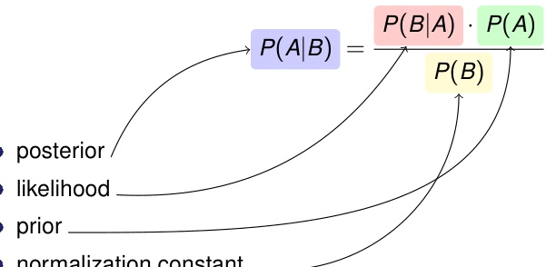

- normalization constant

In our case, for example, A=heterozygous variant and B=a set of observed reads and base calls (with their respective mapping and base qualities)

## Bayes' theorem

Bayes' theorem is often used for a set of n mutually exclusive events $E_{1}, E_{2}, \dots , E_{n}$ (e.g., our three genotypes: aa, ab, bb!) such that $\sum_{i} P \left(E_{i}\right) = 1$ . Then, we have

$$
P \left(E _ {i} \mid B\right) = \frac {P \left(B \mid E _ {i}\right) P \left(E _ {i}\right)}{\sum_ {i} P \left(B \mid E _ {i}\right) P \left(E _ {i}\right)}
$$

- This form of Bayes' theorem makes it clear why $P (B) = \sum_{i} P (B | E_{i}) P (E_{i})$ is called the normalization constant, because it forces the sum of all $P (E_{i}|B)$ to be equal to 1, thus making $P (\cdot | B)$ a real probability measure

In the context of bioinformatics, Bayesian inference is often used to identify the most likely model: For instance, we observe a DNA sequence and would like to know if it is a gene $( M_{1} )$ or not $( M_{2} ).$

Often, the model is symbolized by M and the observed data by D. Then, Bayes' theorem can be given as:

$$
P \left(M _ {1} \mid D\right) = \frac {P \left(D \mid M _ {1}\right) P \left(M _ {1}\right)}{P \left(D \mid M _ {1}\right) P \left(M _ {1}\right) + P \left(D \mid M _ {2}\right) P \left(M _ {2}\right)}
$$

## Maximum a posteriori (MAP)

In Bayesian statistics, maximum a posteriori (MAP) estimation is often used to generate an estimate of the maximum value of a probability distribution.

That is, if x is used to refer to the data (x can be an arbitrary expression), and $\theta$ is used to refer to the parameters of a model, then Bayes' law states that:

$$
P (\theta | x) = \frac {P (x | \theta) P (\theta)}{P (x)}
$$

The term $P(\theta|x)$ is referred to as the posterior probability, and specifies the probability of the parameters $\theta$ given the observed data x. The denominator on the right-hand side, $P(x)$ , can be regarded as a normalizing constant that does not depend on $\theta$ , and so it can be disregarded for the maximization of $\theta$ .

The MAP estimate of $\theta$ is defined as:

$$
\hat {\theta} = \underset {\theta} {\operatorname {a r g m a x}} P (\theta | x) = \underset {\theta} {\operatorname {a r g m a x}} P (x | \theta) P (\theta)
$$

## Maximum a posteriori (MAP)

One important issue about MAP estimation procedures (that we will not discuss further here), is that they tend to have the disadvantage that they "get stuck" in local maxima without being able to offer a guarantee of finding the global maximum.

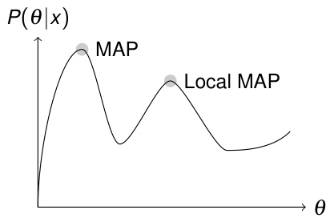

## MAQ and MAP

Let's see how MAQ (Li et al., 2008) uses a MAP-based approach to call the genotype that maximizes the posterior probability!

MAQ also peforms read mapping; we will not review the entire MAQ mapping algorithm, but will exploit the mapping qualities computed by MAQ (or another aligner)

- The probability that the alignment of read s is wrong is given as PHRED score

$$
Q _ {s} = - 1 0 \log_ {1 0} \Pr [ \text {r e a d i s w r o n g l y m a p p e d} ]
$$

For example, $Q_{s}=3 0$ implies there is a 1:1000 probability that the read s has been wrongly mapped, $Q_{s}=2 0$ implies a 1:100 probability, and so on

## MAQ: mapping quality

We consider the probability that a read $z$ comes from position $u$ of a reference sequence/genome $\mathcal{R}.$ Let $\{MM\}$ refer to the set of mismatched positions in the read. (Remember that we allow a certain number of mismatches for inexact read mapping.)

$$
p (z | \mathcal {R}, u) = \prod_ {i \in \{\mathcal {M M} \}} 1 0 ^ {- \frac {Q _ {i}}{1 0}} = 1 0 ^ {- \frac {\sum_ {i} Q _ {i}}{1 0}}
$$

That is, the probability that a read $z$ comes from position $u$ of reference sequence $\mathcal{R}$ is modeled as the product of the error probabilites for each of the bases $i \in \{\mathcal{M M}\}$ that are mismatched in the alignment (because $1 0^{-\frac{Q_{i}}{1 0}}=p_{i}$

For instance, if the alignment at position u has one mismatch with PHRED base quality 20 and one with PHRED quality 10, then

$$
p (z | \mathcal {R}, u) = 1 0 ^ {- \frac {2 0 + 1 0}{1 0}} = 1 0 ^ {- 3} = 0. 0 0 1
$$

## MAQ: mapping and base quality

We now calculate the posterior probability $p_{s}\left(u|\mathcal{R},z\right)$ that read z actually maps to position u, using Bayes' law

$$
p _ {s} (u | \mathcal {R}, z) = \frac {p (z | \mathcal {R} , u) p (u | \mathcal {R})}{\sum_ {v} p (z | \mathcal {R} , v) p (v | \mathcal {R})}
$$

- MAQ actually uses various heuristics to calculate the mapping error probability, an thus the the mapping quality of read $z$, resulting in a Phred-scaled score $Q_{z}$ for the probability that the read is wrongly mapped

- MAQ then redefines base qualities as the minimum of base quality $Q_{i}$ and mapping quality $Q_{z}$ :

$$
Q _ {i} = \min \left(Q _ {i}, Q _ {z}\right)
$$

Rationale: if a base has a high base quality (confident sequencing result) but we're not sure whether the read actually comes from that genomic region (low mapping quality), we shouldn't give much emphasis on what the base tells us about the position to which is has (maybe wrongly) been mapped

The inverse is also true: if we are very confident about the mapping of a read, but not about the quality of the individual base, then the information of this read for this particular position in the genome should be taken with caution!

## MAQ: consensus genotype calling

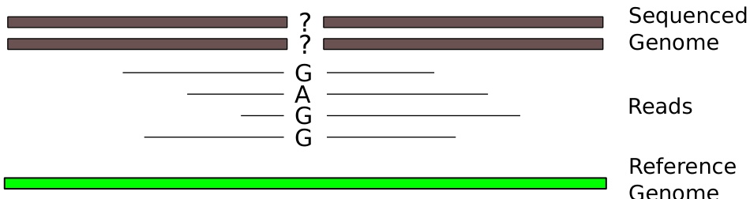

MAQ then uses maximum a posteriori methodology to identify the genotype that maximizes the probabilities (compute all three, take the best)

- $p(< a,a>|D)$ : homozygous ref

- $p(< a,b>|D)$ : heterozygous

- $p(< b,b>|D)$: homozygous alt

Where a refers to the reference base, b to the alternate base, and D to the data (the alignment column)

## MAQ: consensus genotype calling

MAQ uses the base quality values (adjusted by mapping quality) to call the most likely genotype. We assume we have a column of an alignment with

- $k$ references bases (a)

- $n-k$ alternate bases $(b)^{3}$

<table border="1"><tr><td>True genotype</td><td># of errors</td><td>Cond. prob. of genotype4</td></tr><tr><td>a,a</td><td>n-k</td><td>$\alpha_{n,n-k}$</td></tr><tr><td>b,b</td><td>k</td><td>$\alpha_{n,k}$</td></tr><tr><td>a,b</td><td>?</td><td>$\binom{n}{k}\frac{1}{2^n}$</td></tr></table>

The goal is now to decide which of the three possible genotypes has the highest posterior probability given the data (the mapping and alignment): $p ( g | D )$

MAQ now assumes the priors for the genotypes are

$$
P (\langle a, a \rangle) = (1 - r) / 2 \quad P (\langle b, b \rangle) = (1 - r) / 2 \quad P (\langle a, b \rangle) = r
$$

Here, r is the probability of observing a heterozygous genotype. MAQ uses r=0.001 for new SNPs, and 0.2 for known SNPs, but also site-specific values for r could be used

## MAQ: consensus genotype calling

MAQ thus calls the genotypes as

$$
\hat {g} = \underset {g} {\operatorname {a r g m a x}} p (g | D)
$$

Here, the genotype $\hat{g}\in\left(\langle a,a\rangle ,\langle a,b\rangle ,\langle b,b\rangle\right)$ with the maximum posterior probability is sought. The quality of this genotype call can then be calculated as

$$
Q _ {g} = - 1 0 \log_ {1 0} [ 1 - P (\hat {g} | D) ]
$$

- $Q_{g}$ is then the reported PHRED score for the genotype call

- Note that $1-P(\hat{g}|D)$ is the calculated probability that the genotype call is wrong

We now need a way of calculating $\alpha_{n,k}$ , the probability of observing k errors in n nucleotides in the alignment. If we assume that errors arise independently, and error rates are identical for all bases, then we can use a binomial distribution

$$
\mathrm {d b i n o m} (n, k, p = \varepsilon) = \binom {n} {k} \varepsilon^ {k} (1 - \varepsilon) ^ {n - k}
$$

For instance, for a per-base error rate $\varepsilon=0.01$ , the probability of observing 2 erroneous nucleotides in 20 is: dbinom(20,2,p=0.01) = 0.01585576

## MAQ: consensus genotype calling

In practice, MAQ errors are correlated and rates are not identical for each base in the alignment. Therefore, MAQ does not use a binomial distribution, but a heuristic that reflects the probabilities of observing an alignment with the given pattern of per base error probabilities:

$$
\alpha_ {n, k} = c _ {n, k} ^ {\prime} \prod_ {i = 0} ^ {k - 1} \varepsilon_ {i + 1} ^ {\theta^ {i}}
$$

Here, $\varepsilon_{i}$ is the $\mathrm{i}^{\mathrm{th}}$ smallest base error probability for the k observed errors, $c_{n,k}^{\prime}$ is a constant and $\theta$ is a parameter that controls the dependency of errors

This equation reflects the base errors. We will not go into further detail, but if desired see the Supplemental material of the MAQ paper (Li et al., 2008)

## MAQ: consensus genotype calling

With all of this, we can now call the posterior probabilities of the three genotypes given the data D, that is a column with n aligned nucleotides and quality scores of which k correspond to the reference a and n-k to a variant nucleotide b

$$
\begin{array}{l} p \left(g = \langle a, a \rangle | D\right) \propto p \left(D | g = \langle a, a \rangle\right) p \left(G = \langle a, a \rangle\right) \\ \propto \boxed {\alpha_ {n, n - k} \cdot (1 - r) / 2} \\ \end{array}
$$

$$
\begin{array}{l} p \left(g = \langle b, b \rangle | D\right) \propto p \left(D | g = \langle b, b \rangle\right) p \left(G = \langle b, b \rangle\right) \\ \propto \boxed {\alpha_ {n, k} \cdot (1 - r) / 2} \\ \end{array}
$$

$$
\begin{array}{l} p (g = \langle a, b \rangle | D) \propto p (D | g = \langle a, b \rangle) p (G = \langle a, b \rangle) \\ \propto \boxed {\binom {n} {k} \frac {1}{2 ^ {n}} \cdot r} \\ \end{array}
$$

(Not shown: division by normalization constant $p(D)$ , i.e., the sum of the 3 boxes!)

Finally, the genotype with the highest posterior probability is chosen

$$
\hat {g} = \underset {g \in \left(\langle a, a \rangle , \langle a, b \rangle , \langle b, b \rangle\right)} {\operatorname {a r g m a x}} p (g | D)
$$

The probability of this genotype is used as a measure of confidence in the call

## MAQ: consensus genotype calling

A major problem in SNV calling is false positive heterozygous variants. It seems more probable to observe a heterozygous call at a position with a common SNP in the population. For this reason, MAQ uses a different prior (r) for previously known SNPs $( r=0.2 )$ and "new" SNPs $( r=0.001 )$

Let us examine the effect of these two priors on variant calling:

$$
p \left(G = \langle a, b \rangle | D\right) \propto \binom {n} {k} \frac {1}{2 ^ {n}} \cdot r
$$

Example figures for n = 20 reads

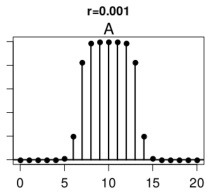

k

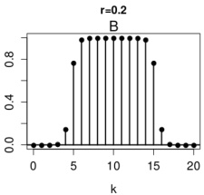

- The figures show the posterior for the heterozygous genotype according to the simplified MAQ algorithm discussed in this lecture

- The prior r=0.001 means than positions with 5 or less ALT bases (out of 20) do not get called as "heterozygous", whereas the prior with r=0.2 means that positions with 5 bases do get a "heterozygous" call

## What have we learned?

The MAQ algorithm is typical for many problems in genomics in that a well known statistical or algorithmic framework is used with a number of heuristics that deliver reasonable values for the parameters needed for the framework to work.

Major aspects of MAQ SNV calling algorithm:

- Integrates mapping and per base quality scores

- Bayesian (MAP) framework to integrate observations and priors on genotypes

- Provides estimation of reliability/confidence of genotype call

## Pipeline for calling somatic SNVs in cancer

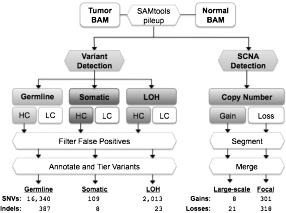

(from: Koboldt et al., 2012)

- Important difference to germline variant calling:

- Use of a matched normal control sample (from the same patient) to distinguish somatic mutations from germline mutations!

- Let us now examine a heuristic, pileup-based approach towards somatic variant calling implemented by the VarScan2 algorithm (Koboldt et al., 2012)

## Simple approach: VarScan2

For each position in the genome, the following steps are performed in parallel for the tumor sample and the matched normal sample:

Check minimum coverage requirement for both samples:

By default, n $\geq$ 3 reads with base quality $Q \geq 2 0$ at that position

Based upon the observed read bases, determine a genotype for each sample individually. By default, a variant allele must be supported by at least n-k $\geq 2$ independent reads and at least 8% of all reads, i.e., $\mathrm{VAF}=\frac{(n-k)}{n}\geq 0.08$

Variants are called homozygous if supported by $\geq 75\%$ of all reads at a position, i.e., $(n-k) / n\geq 0.75$ ; otherwise they are called heterozygous ...

Note: this may be problematic because it ignores important problems:

- Sample purity (tumor samples contain a fraction of normal cells; 80% tumor purity is already good!)

- Tumor clonality (tumors may be composed of multiple distinct clones, i.e., often only a certain fraction of the tumor cells contain a specific mutation)

- Example: assume a tumor purity of 80%

Homozygous ALT in all tumor cells: expected VAF of $\sim 80\%$

Heterozygous in all tumor cells: expected VAF of $\sim 40\%$ （ $\frac{1}{2}$ of 80%)

Homozygous ALT in 40% of the tumor cells: expected VAF of $\sim 32\%$ (40% of 80%)

Heterozygous in 40% of the tumor cells: expected VAF of $\sim 16\%$ （ $\frac{1}{2}$ of 40% of 80%）

## Simple approach: VarScan2

If the genotypes of the two samples (tumor and control) do not match, then their read counts are evaluated by a one-tailed Fisher's exact test in a two-by-two contingency table:

Tumor sample reads Control sample reads (total)

<table border="1"><tr><td>ALT(variant)base</td><td>REFbase</td><td>(total)</td></tr><tr><td>$N_{T,alt}$</td><td>$N_{T,ref}$</td><td>$(N_{T})$</td></tr><tr><td>$N_{C,alt}$</td><td>$N_{C,ref}$</td><td>$(N_{C})$</td></tr><tr><td>$(N_{alt})$</td><td>$(N_{ref})$</td><td>$(N_{tot})$</td></tr></table>

Probability to have exactly $N_{T,alt}$ ALT reads in the tumor sample:

$$
P \left(X = N _ {T, a l t}\right) = \frac {\binom {N _ {T}} {N _ {T , a l t}} \binom {N _ {C}} {N _ {C , a l t}}}{\binom {N _ {t o t}} {N _ {a l t}}}
$$

(hypergeometric distribution)

## Simple approach: VarScan2

But we actually need the probability to have at least $N_{T,\mathrm{alt}}$ ALT reads in the tumor sample:

$$
P \left(X \geq N _ {T, a l t}\right) = \sum_ {i = N _ {T, a l t}} ^ {N _ {T}} \frac {\binom {N _ {T}} {i} \binom {N _ {C}} {N _ {C , a l t}}}{\binom {N _ {t o t}} {i + N _ {C , a l t}}}
$$

- That is, we sum the probabilities of having $N_{T,alt}, N_{T,alt}+1, \dots, N_{T}$ ALT reads ...

If $P \left( X \geq N_{T,alt} \right) \leq 0.05$ (significant p-value $^{5}$ ) then

- if the normal sample was called as "reference" and the tumor sample was called as "alternate" (variant base), then the variant is called somatic!

Another possibility for $P \left( X \geq N_{T,alt} \right) \leq 0.05$ is "loss of heterozygosity" (LOH): heterozygous variant in the control, but homozygous in the tumor ...

- This can happen, for example, when the copy of the genomic region which contained the reference base has been deleted in the tumor ...

## In practice it's not that easy ...

Intersection of variants called by different programs:

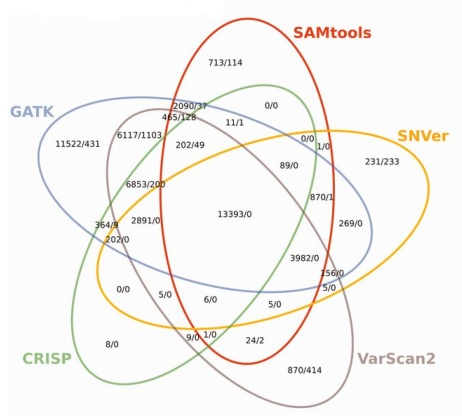

Variant calling remains difficult; programs disagree, potentially affecting all downstream analyses!

(from Pabinger et al., 2014)

Reasons for seeing mismatches in mapped reads include include:

- Errors from library preparation (e.g., PCR error)

- True variants (that we want to "call")

- Sequencing errors

- Misalignment (mapping errors)

- Degraded DNA, contaminated DNA

- (Errors in the reference sequence)

## Structural variation (about 1 kbp or larger)

- Deletions or duplications

- Inversions

- Translocations (inter-chromosomal, intra-chromosomal)

- Insertions of novel sequences

- Complex rearrangements

## Information used for detecting structural variations from WGS data

- Read-depth (coverage) information

- Information from specific reads (e.g., "split reads", orientation and distance of paired reads, ...)

## Copy number variant (CNVs)

- Also called copy number alterations (CNAs)

- Major class of genomic structural variation

- Alteration in normal number of copies of a genomic segment

Autosomes (chromosomes 1-22 in humans):

normal: 2 copies; deletion: 1 copy; duplication 3 copies, sometimes more!

- Sex chromosomes (X,Y in humans): in females usually like autosomes (XX in males (XY): normal: 1 copy; deletion: 0 copies; duplication 2+ copies (except some parts which are shared in X and Y: like autosomes)

## Read depth

Analysis of read depth can identify deletion/duplications

$$
\mathrm {图} 1 - 2
$$

Heterozygous Deletion? Mappability Issue? Poor "sequencability"?

However, we usually do not determine the coverage (= read depth) for each single base of the genome ...

## Coverage plots

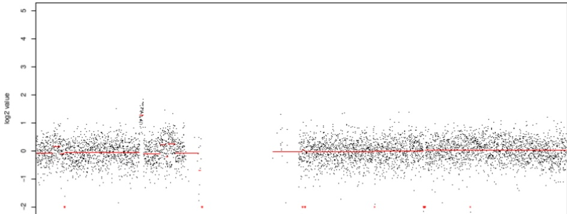

Median-normalized log2-transformed read counts for a single chromosome from a WGS control sample

- Read coverage is often plotted as: log2 of the number of reads which start within windows of fixed size (e.g., 1 kbp windows)

- The median per-window read count is often normalized to 1 (corresponding to a log2-value of 0)

- Best done with WGS data (also low coverage WGS, e.g., $\sim1\times$ )

Difficult with WES data (highly variable target extraction efficiencies)

## Coverage plots

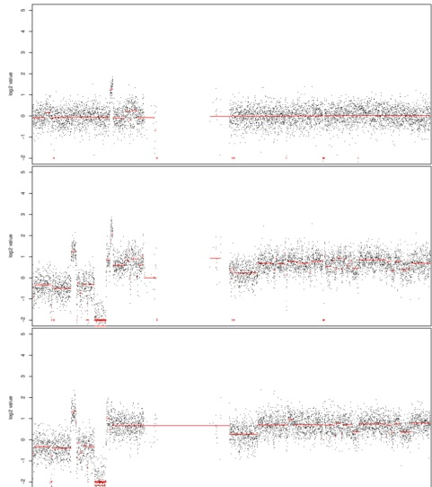

For tumor samples, we often compare the coverage in the tumor sample (center) with the coverage in the control sample (top) to evidence somatic differences (bottom) ...

## Coverage plots

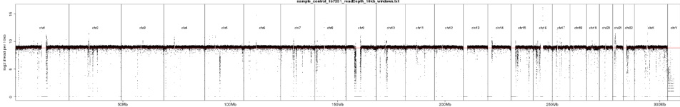

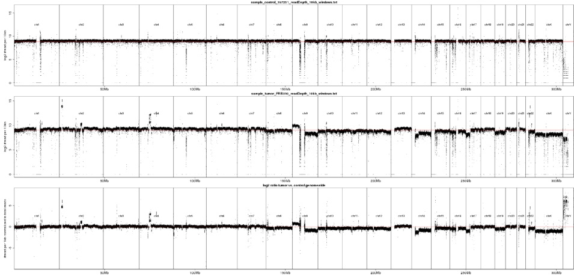

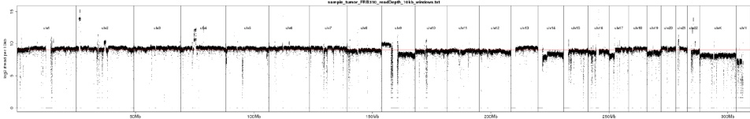

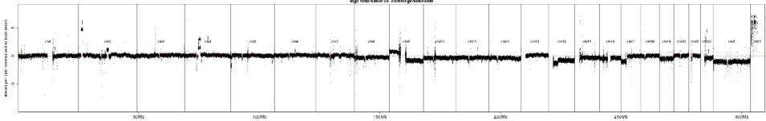

## Coverage plots

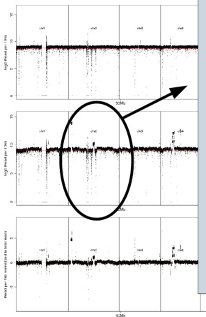

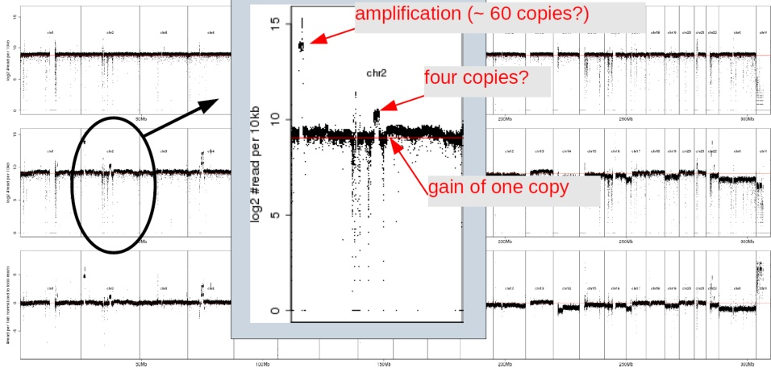

## Coverage plots

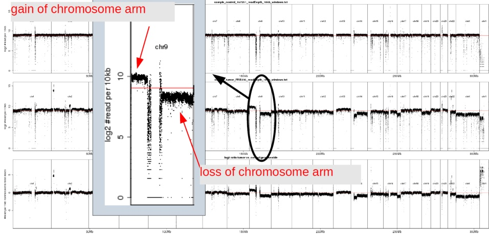

$$
P (X = k) = \frac {\lambda^ {k} e ^ {- \lambda}}{k !}
$$

- k = number of occurrences

$\lambda =$ average number of occurrences per time interval (or genomic window)

$P ( X=k)=$ probability to observe exactly k occurrences

- For $X \sim \mathrm{Poisson}(\lambda)$ , both the mean and the variance are equal to $\lambda$

- We can use the Poisson distribution to model the number of reads which start in a window of fixed size!

Expect: half as many reads as normal for a heterozygous deletion (1 copy instead of 2), and 1.5 times as many reads as normal for a duplication (3 copies instead of 2)

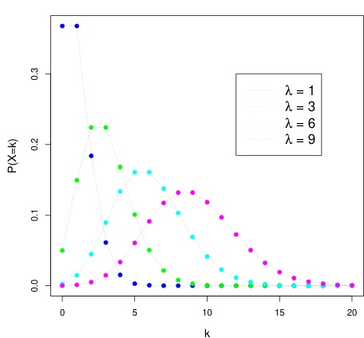

We can compute the average number of reads per window as

$$
\lambda = \frac {N}{G} \cdot W
$$

where $N =$ total number of reads; $W =$ size of window; $G =$ size of genome

## Poisson and normal approximation

For sufficiently large $\lambda$ (greater than about 10), we can approximate the Poisson distribution by the normal distribution $^{6}$


## Z-scores

For this reason, we can use the z-score to describe the read count measurements:

$$
z = \frac {x - \mu}{\sigma}
$$

Meaning of z: how many standard deviations $\sigma$ is the read count x of a given window above or below the mean read count $\mu$?


(from Wikipedia)

## CNV calling via read depth

With all of this in hand, we now will examine how to call CNVs from whole genome data. We will present a simplified version of the algorithm described by Yoon et al (2009).

We will consider only WGS data from a single sample (no tumor-control comparison)

Assume we have addressed some issues we will ignored so far

We have to decide a window size to be used, depending on the biological question we want o answer and the overall average coverage of the sample

Usually reads are filtered (e.g., for sufficient high read mapping quality)

Read counts are adjusted accoring to the GC content of the window

We then calculate a z-score for the read count of every window

## CNV calling via read depth

For event detection, Yoon et al. (2009) developed a heuristic approach they call event-wise testing (EWT)

- A deletion or duplication is evident as a decrease or increase across multiple consecutive windows


Basic idea: identify regions of consecutive windows with significantly increased or decreased read depth

- Rapidly search across all windows for windows that meet criteria of statistical significance

- Clusters of small events are grouped into larger events by extending identified regions with significant windows

## CNV calling via read depth

## Convert to upper and lower tail probabilities

- Convert the z-score to its upper-tail probability

$$
P _ {i} ^ {\mathrm {U p p e r}} = \Pr \left(Z > z _ {i}\right)
$$

This is simply the probability to observe a read count with a z-score higher than $z_{i}$ in window i

- Analogously, we calculate a lower-tail probability

$$
P _ {i} ^ {\mathrm {L o w e r}} = \Pr \left(Z < z _ {i}\right)
$$


## CNV calling via read depth

## Evaluation of intervals of consecutive windows to identify duplications

- For an interval $\mathcal{A}$ of $\ell$ consecutive windows, we call it an unusual event if (for duplications)

$$
\max _ {i} \left\{P _ {i} ^ {\mathrm {U p p e r}} | i \in \mathscr {A} \right\} < \left(\frac {\ell}{L} \times \mathrm {F P R}\right) ^ {\frac {1}{\ell}}
$$

- Here, L is the length in windows of the entire chromosome (= number of windows)

- Thus $\frac{\ell}{L}$ is the proportion of the chromosome that is taken up by the candidate CNV

- FPR is the desired false-positive rate (e.g., FPR=0.05) for the entire chromosome

- If all p-values for the windows of $\mathcal{A}$ are less (more significant) than the term on the right side, we call the interval an "unusual event"

## CNV calling via read depth

The EWT score $\left( \frac{\ell}{L}\times\mathrm{FPR}\right)^{\frac{1}{\ell}}$ increases as the number of windows, $\ell$ , increases


Iteration:

- The initial analysis calculates the p-values for each single window

- The EWT procedure then searches for two-window intervals (i.e., $\ell=2$) such that $\max_{i}\left\{P_{i}^{\mathrm{Upper}}|i\in\mathcal{A}\right\}<$ $\left(\frac{\ell}{L}\times\mathrm{FPR}\right)^{\frac{1}{\ell}}$

- Continue iterating (increasing the size of $\ell$ by 1) as long as this condition is fulfilled

- Terminate the procedure if

$$
\left(\frac {\ell}{L} \times \mathrm {F P R}\right) ^ {\frac {1}{\ell}} > = 0. 5
$$

## CNV calling via read depth

## Evaluation of intervals of consecutive windows to identify deletions

- The same procedure is now done separately for deletions, using the formula

$$
\max _ {i} \left\{P _ {i} ^ {\mathrm {L o w e r}} | i \in \mathcal {A} \right\} < \left(\frac {\ell}{L} \times \mathrm {F P R}\right) ^ {\frac {1}{\ell}}
$$

Is there any justification for this heuristic EWT score? Let's have a brief look at multiple testing ...

## Correction for multiple testing

We are making millions of tests across the genome (millions of windows!) ..

- For each test we compute a p-value: a probability that the "null hypothesis" (no particular event) is true

- Usually, we say we "reject" the null hypothesis if $p < 0.05$ (we consider this to be an interesting event!)

- But: the probability that we are wrong is $p!$


If you make millions of tests, some p-values will just by chance be low enough without constituting true events ...

## Correction for multiple testing

The p-value is the probability, under the null hypothesis, that the test statistic assumes the observed or a more extreme value.

It is important to realize that if we go on testing long enough, we will inevitably find something which appears "significant" by chance alone.

- If we test a null hypothesis that is true (= no significant event) using a significance level of $\alpha=0. 0 5$ , then there is a probability of $1-\alpha=0. 9 5$ of arriving at a correct conclusion of non-significance

- If we now test two independent true null hypotheses, the probability that neither test appears significant is $0.95\times0.95=0.90$

- If we test 50 independent null hypotheses, the probability that none will appear significant is then $( 0.95 )^{50}=0.077$ (only 7.7%)

This corresponds to a probability of $1-0.077=0.923$ of getting at least one spurious "significant" result even of there is no true event(!), and the expected number of spurious significant results in 50 tests is $50\times 0.05=2.5$

These are called "false positives" (we consider them relevant, but they are not!)

Multiple-testing correction (MTC) procedures have been developed to limit the probability of false-positive results.

## Correction for multiple testing

The most stringent MTC is the Bonferroni procedure.

- Probability of non-significant result for a single test if the null hypothesis is true $\Leftrightarrow 1-\alpha$

- Probability of getting no significant result for k such tests is $(1 - \alpha)^{k}$

- If we make $\alpha$ small enough, then we can make $(1-\alpha)^{k}=0.95$ (corresponding to overall $\alpha$ level of 5%, i.e., with a 95% we have not a single false positive among the k tests!)

- If $\alpha$ is very small, then $(1-\alpha)^{k}\approx 1-k\alpha$

- Therefore, the Bonferroni sets $\alpha=\frac{1-0.95}{k}$

- Thus, instead of accepting each result with a $p$ -value of $p < 0.05$ , we accept only results with $p < \frac{0.05}{k}$ where k is the number of tests we make

- Note: this, in contrast to other MTC procedures, is very restrictive and may thus lead to a high number of "false negatives" (true events which we don't recognize as such)

## CNV calling via read depth

## Back to the EWT method

In the context of our method for calling CNVs, a Bonferroni correction would correspond to

$$
P _ {i} ^ {\mathrm {L o w e r}} < \frac {\mathrm {F P R}}{L}
$$

Here, the number of tests is equal to the number of windows (L) and FPR (false positive rate) is equal to our significance level of $\alpha=0. 0 5$

- Note that if $\ell=1$ , the EWT score corresponds to the Bonferroni correction because

$$
\left(\frac {\ell}{L} \times \mathrm {F P R}\right) ^ {\frac {1}{\ell}} = \left(\frac {1}{L} \times \mathrm {F P R}\right) ^ {\frac {1}{1}} = \frac {\mathrm {F P R}}{L}
$$

The Bonferroni method is typically too conservative in that it reduces false positives at the cost of many false negative results. The authors therefore have chosen a heuristic formula that is less conservative than a standard Bonferroni MTC.

- The term $\frac{\ell}{L}\times$ FPR is equivalent to dividing FPR not by L (total number of 100 nt windows) but by $\frac{L}{\ell}$ (total number of non-overlapping window intervals of size $\ell$ on the chromosome)

## CNV calling via read depth

Finally, with all this in hand...


Genomic Position on Chromosome 1 (in Mb)

- Yellow: significant EWT result for window at given position on chromosome (X axis) at given EWT event size $\ell$ (Y axis)

## References I


Koboldt D.C., et al (2012)

VarScan2: somatic mutation and copy number alteration discovery in cancer by exome sequencing

Genome Research 22:568-576


Li H., Ruan J., and Durbin R. (2008)

Mapping short DNA sequencing reads and calling variants using mapping quality scores

Genome Research 18(11):1851-1858


Lieberman-Aiden E., et al. (2009)

Comprehensive mapping of long-range interactions reveals folding principles of the human genome

Science 326:289-293


López-Nevado M., et al. (2021) Next Generation Sequencing for Detecting Somatic FAS Mutations in Patients With Autoimmune Lymphoproliferative Syndrome Front. Immunol. 12:656356

## References II


Pabinger S., et al. (2014) A survey of tools for variant analysis of next-generation genome sequencing data Briefings in Bioinformatics 15(2):256-278


Wang Z., et al. (2009)

RNA-Seq: a revolutionary tool for transcriptomics

Nature Reviews Genetics 10(1):57-63


Yi K. & Ju Y.S. (2018) Patterns and mechanisms of structural variations in human cancer Experimental & Molecular Medicine 50:98


Yoon S., et al. (2009) Sensitive and accurate detection of copy number variants using read depth of coverage Genome Research 9:1586-1592