POLITECNICO

MILANO 1863

# Bioinformatics Algorithms

Multiple sequence alignment (part 1)

Rosario M. Piro (based on slides by Giulio Pavesi)

Dipartimento di Elettronica, Informazione e Bioingegneria (DEIB)

Politecnico di Milano

## Evolutionary trees

Evolution is an important application of computational approaches

Many interesting algorithms have been developed to study evolutionary processes

- We will concentrate on one specific class of algorithms which extends our previous topics

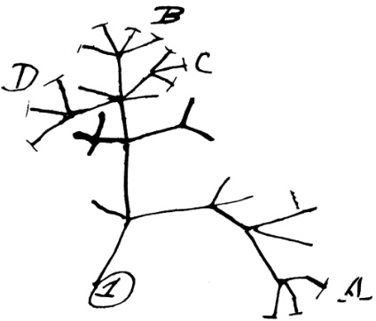

Charles Darwin's coneptualization of evolution as a "tree of life"

## Evolutionary trees

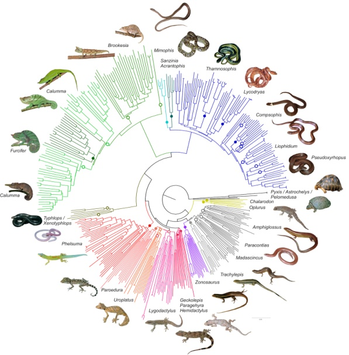

(Evolutionary tree of Madagascan reptiles based on similarities in the cytochrome oxidase subunit I (COI) gene; from: Nagy et al, 2012)

## Evolutionary trees

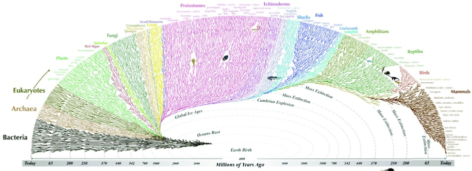

All the major and many of the minor living branches of life are shown on this diagram, but only a few of those that have game extinct are shown. Example: *Dionaea* - extinct.

(from: https://www.evogeneao.com/en/explore/tree-of-life-explorer;see there for an interactive version!)

## Evolutionary trees

SARS-CoV-2 Evolutionary Tree Data as of March 15, 2022

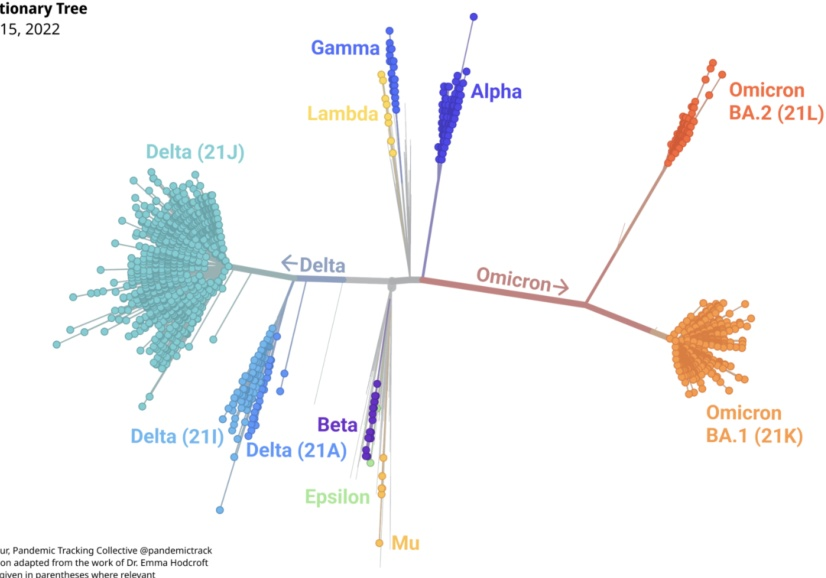

Visualization: Jonathan Gilmour, Pandemic Tracking Collective @pandemictrack

Source: Nextstreet, visualization adaptation from the work of Dr. Erma Hodrock

(from: https://www.rockefellerfoundation.org/)

## Multiple sequence alignment (MSA)

So far, we have learned only about pair-wise sequence comparison:

- Global alignment of two sequences

- Local alignment of two sequences

- Mapping of a single read to the reference genome (even if we do this millions of times, we always map only one read at a time!)

But for many applications (especially in the field of evolutionary genetics/genomics) it is usefull to align multiple sequences (>2) to each other at the same time ...

- We want to compare more than two sequences at the same time, that is, we want to align more than two sequences ("multiple sequence alignment", MSA)

- Ideally, the comparison/alignment should be simultaneous; we want to analyze a single alignment containing all sequences, not the list of all possible pairwise alignments

## From two to many

Sequences may share a common evolutionary history (a common ancestor)

The more similar two sequences, the closer in time is their common ancestor

"Parsimony" for evolutionary changes:

Match: nothing changed during evolution

Mismatch: one of the two sequences changed with respect to the ancestor sequence

- Gap: insertion or a deletion with respect to the ancestor sequence

In this particular example: the final "consensus" (most frequent letters) is exactly (the sound) of the common ancestor word ...

## Pair-wise alignment:

S U G A R -

S U C - R E

Multiple sequence alignment:

Consensus:

$$
\begin{array}{l} - S U G A R - \\ - S U C - R E \\ - S A K A R I \\ - Z U K E R - \\ A Z U C A R - \\ - Z U K E R O \\ - S U K A R - \\ \end{array}
$$

## From two to many

Multiple sequence alignments can give us much more information, and a more "general" view of what the relationships among all our sequences are

- Permit to clarify "ambiguous" cases resulting from pairwise comparisons

Depending our mismatch and gap penalty weights, the pairwise-alignment of "SUGAR" and "SUCRE" can change

But the other sequences can help us to clarify the most "correct" choice (correct from a "biological"/ evolutionary point of view)

- That is, we can "extrapolate" the pairwise relations from the multipe sequence alignment

Pair-wise alignment (alternative 1):

$$
\begin{array}{l} S U G A R - \\ S U C - R E \\ \end{array}
$$

Pair-wise alignment (alternative 2):

S U G A R

S U C R E

Multiple sequence alignment:

Which is the best alternative?

- S U G A R -

- S U C - R E

- S A K A R I

- Z U K E R -

A Z U C A R -

- Z U K E R O

- S U K A R -

Consensus:

Alternative 1 is the best because the "R" seems conserved over all sequences!

## From two to many

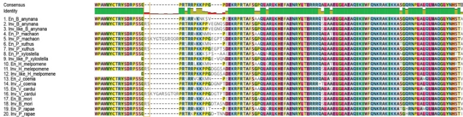

C

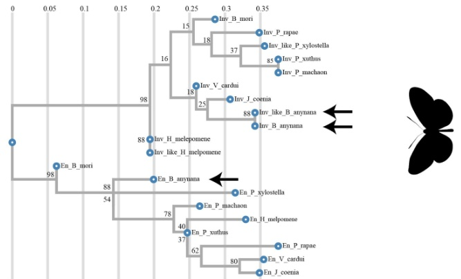

(from Banerjee et al., 2020)

## From two to many

Evolutionary relationship:

Consensus

Identity

1. En_B_anynana

2. En_B_anynana

3. Inv_like_B_anynana

4. En_M_chasmon

5. En_P_rapepe

6. En_P_xuthus

7. En_P_xuthus

8. En_P_xylostella

9. En_P_xylostella

10. En_H_melopemone

11. Inv_H_melopemone

12. Inv_like_H_melopemone

13. En_I_joinna

14. En_V_cardui

15. En_V_cardui

16. En_B_mori

16. En_B_mori

17. En_P_rapepe

18. En_P_rapepe

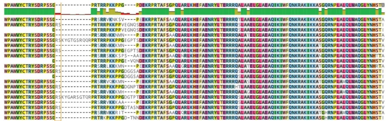

(from Banerjee et al., 2020)

Useful also for comparison of sequences within one species:

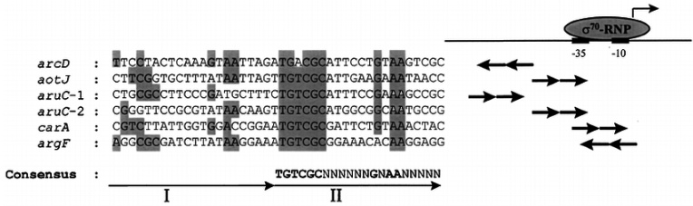

(Sequence alignment of ArgR binding sites; from Lu et al., 1999)

A multiple sequence alignment (MSA), sometimes "multiple alignment", of k strings $S_{1}, S_{2}, \dots S_{k}$ over an alphabet $\Sigma$ is a set of k strings with gaps ("-"):

$S_{1}^{\prime}, S_{2}^{\prime}, \dots S_{k}^{\prime}$ over the alphabet $\Sigma^{\prime}=\Sigma \cup \{-\}$ where

1 $| S_{1}^{\prime} | = | S_{2}^{\prime} | = \dots = | S_{k}^{\prime} |$ , i.e., after alignment all sequences have the same length

$\forall i \in(1\dots k), S_{i}^{\prime}$ is obtained from $S_{i}$ with the insertion of gaps

The alignment $A$ is written with the $S_{i}'$ strings one over the others, in any order: $^{1}$

$$
\begin{array}{l} A C. B C D B \\ . C A D B. D. \\ A C A. B C D. \\ \end{array}
$$

Matrix 3 rows 8 columns

Figure 4.1: A multiple alignment of ACBCDB, CADBD and ACABCD.

## Multiple alignment scores: Sum of Pairs

- The possible ways to align k strings depend on where we place gaps (this actually holds also for k=2)

- Like for k=2, we might choose a formalization where we have a "score" that has to be optimized or a "distance" to be minimized

- As we saw, a multiple alignment implicitly induces a pairwise alignment for every pair $S_{i}, S_{j}$

- We can use the substitution matrix we employed for pairwise alignment, and compute the pairwise alignment score a $( S_{i}, S_{j} )$ for every pair $S_{i}, S_{j}$

$$
\begin{array}{l} - S U G A R - \\ - S U C - R E \\ - S A K A R I \\ - Z U K E R - \\ A Z U C A R - \\ - Z U K E R O \\ \end{array}
$$

- We compute the "Sum of Pairs (SP) score" as the sum of the alignment scores of every possible pair:

$$
S P = \sum_ {i = 1} ^ {k - 1} \sum_ {j = i + 1} ^ {k} a \left(S _ {i}, S _ {j}\right)
$$

- Goal: find the multiple alignment that maximizes this score! This is an optimization (maximization) problem

## Multiple alignment scores: Sum of Pairs

- The SP-score is essentially a generalization to k strings of the principle we applied to 2 strings

- But it has another fundamental property: like for k=2, the optimal solution can be found by dynamic programming!

- The idea:

For $k = 2$, we use a two-dimensional structure (a matrix)

- For $k = 3$, we use a three-dimensional structure (a cube)

For $k > 3$ , we use a $k$-dimensional structure (a hypercube = hyperlattice)

$$
\begin{array}{l} - S U G A R - \\ - S U C - R E \\ - S A K A R I \\ - Z U K E R - \\ A Z U C A R - \\ - Z U K E R O \\ \end{array}
$$

$$
S P = \sum_ {i = 1} ^ {k - 1} \sum_ {j = i + 1} ^ {k} a \left(S _ {i}, S _ {j}\right)
$$

- But the principle is the same as for k=2: for filling a cell we look at the values in the neighboring cells

- The last cell in the structure (maximum index in each dimension) will then contain the score of the optimal (global) multiple alignment!

## Neighboring cells

How many neighboring cells do we have?

- For k=2, we have 3 neighbors

- For k=3, we have 7 neighbors:

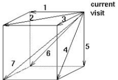

- For k, we have $2^{k}-1$ neighbors!

Example: align "VSNS", "AS" and "SNA"

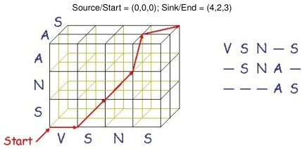

(after G. Fullen, 1996)

Example: align "VSNS", "AS" and "SNA"

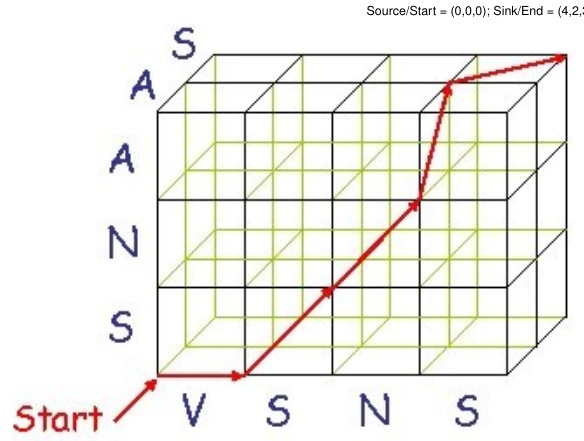

(after G. Fullen, 1996)

$$
\begin{array}{l} V S N - S \\ - S N A - \\ - - - A S \\ \end{array}
$$

## Neighboring cells and scoring

Example for k=3:

Computing a Node on Hyperlattice

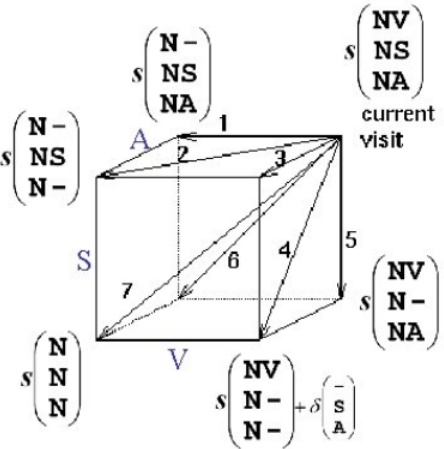

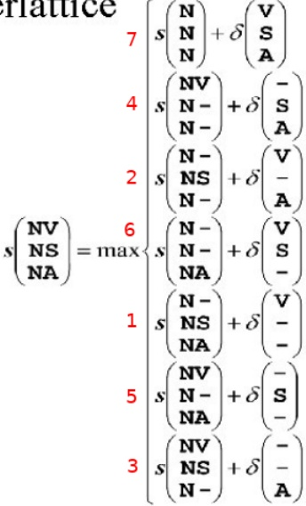

## Neighboring cells and scoring

Computing a Node on Hyperlattice

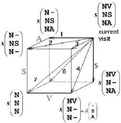

$$
s \binom {N V} {N S} = \max  \left\{ \begin{array}{l l} s \binom {N} {N} + \delta \binom {V S} {A} \\ s \binom {N V} {N -} + \delta \binom {- S A} {A} \\ s \binom {N - N S} {N -} + \delta \binom {V - A} {A} \\ s \binom {N - N A} {N -} + \delta \binom {V S} {A} \end{array} \right.
$$

$$
s _ {i, j, k} = \max \left\{ \begin{array}{l l} s _ {i - 1, j - 1, k - 1} + \delta \left(v _ {i}, w _ {j}, u _ {k}\right) & \text {c u b e d i a g o n a l :} \\ s _ {i - 1, j - 1, k} + \delta \left(v _ {i}, w _ {j}, \_ \right) & \text {n o i n d e l s} \\ s _ {i - 1, j - 1, k - 1} + \delta \left(v _ {i}, \_ , u _ {k}\right) & \text {f a c e d i a g o n a l :} \\ s _ {i - 1, j - 1, k - 1} + \delta \left(\_ , w _ {j}, u _ {k}\right) & \text {o n e i n d e l} \\ s _ {i - 1, j, k} + \delta \left(v _ {i}, \_ , \_ \right) & \text {e d g e d i a g o n a l :} \\ s _ {i, j - 1, k} + \delta \left(\_ , w _ {j}, \_ \right) & \text {t w o i n d e l s} \\ s _ {i, j, k - 1} + \delta \left(\_ , \_ , u _ {k}\right) & \end{array} \right.
$$

$\delta ( x, y, z )$ is an entry in the 3D scoring matrix

## Neighboring cells and scoring

Each step is one column in the alignment, so we can compute the corresponding $\delta ( x,y,z)$ as follows:

Column Score

$$
S \left(A _ {i}\right) = \sum_ {j = 1} ^ {N} \sum_ {k > j} s \left(a _ {i} ^ {(j)}, a _ {i} ^ {(k)}\right)
$$

$$
S \left(A _ {i}\right) = \sum_ {j = 1} ^ {N} \sum_ {k > j} s \left(a _ {i} ^ {(j)}, a _ {i} ^ {(k)}\right)
$$

$$
\begin{array}{l} A ^ {(1)} \mathrm {A} - \mathrm {C T C C A T} \\ A ^ {(2)} \mathrm {A} - \mathrm {G T C C} - \mathrm {T} \\ A ^ {(3)} \mathrm {A C G T C A - T} \\ \end{array}
$$

$$
\begin{array}{l} \mathrm {A - C T C C A T} \\ \mathrm {A - G T C C - T} \\ \mathrm {A C G T C A - T} \\ \end{array}
$$

$$
\begin{array}{l} \text {C o l u n n S c o r e} (3) = s (C, G) + s (C, G) + s (G, G) \\ = M a t c h + 2 \cdot M i s m a t c h \\ \end{array}
$$

(one match and two mismatches in column 3)

$$
\begin{array}{l} \text {C o l u n n S c o r e} (3) = s (A, -) + s (A, -) + s (-, -) \\ = s (-, -) + 2 \cdot G a p P e n a l t y \\ = 2 \cdot G a p P e n a l t y \\ \end{array}
$$

(two gaps in column 7)

What we need:

- 2D scoring matrix $s(x,y)$ for alignment matches (sequence match or mismatch)

- $\delta(x,y,z)$ can be computed from this, e.g., $\delta(C,G,G)=s(C,G)+s(C,G)+s(G,G)$

- Gap penalty

- We set $s(-,-)=0$ , because aligning two gaps has little meaning from a biological point of view (it neither improves nor worsens the alignment)!

## Space and time complexity of the approach

We have $k$ strings as input, suppose for sake of simplicity that all strings have the same length $n$, i.e., $|S_{i}| = n \quad \forall i \in (1\dots k)$

- The data structure we fill has $(n + 1)^{k}$ cells $\Rightarrow$ space complexity is $O(n^{k})$

- For filling each cell we compare $2^{k} - 1$ scores $\Rightarrow$ time complexity is $O(2^{k} n^{k})$

- All in all space/time is exponential in the number of strings to be aligned ...

- Important note: $k$ is not a constant here—it is an input value!—therefore ...

... the multiple sequence alignment problem is NP-hard!

- NP hardness = "non-deterministic polynomial-time" hardness

- It cannot be solved in polynomial time (unless P=NP ...)

In practice, it is considered to be "unfeasible" to align more than 4 sequences with dynamic programming

- Improvements in dynamic programming make it feasible to align up to 6 sequences (but the problem remains NP-hard)

And, it also remains NP-hard if we change the scoring function, for every "reasonable" scoring function which is not trivial

Intuitively, the problem arises from the k in $O(2^{k} n^{k})$

It has been proven to be NP-hard for basically every scoring function employed

## Dealing with NP-hard problems

(Note: the following is not an exhaustive discussion of NP-hardness and approximate solutions!)

- When we have to face an NP-hard problem, in an "applicative" field (that is, it comes from the formalization of a problem), we have to find a way to solve it anyway; that is, we need to find a way to efficiently align $k>4$ (or $k>6$) sequences

- Different possibilities:

- Change the formalization in order to solve it in polynomial time, hoping that the formalization still captures the "right solution" for the problem

- Explore the space of possible solutions (which is exponential in size), considering only a reasonable polynomial subset of them, hoping that it contains the optimal one

- Design a polynomial time/space algorithm, based on some heuristic, hoping that it will find the optimal solution (or another one very close to it) for most of the "typical" instances that will be provided as input

- Design a polynomial time/space algorithm, based on some heuristic, proving that for every possible input the solution will not be too far (within certain limits) from the optimal one (that is, design an approximation algorithm!)

## Dealing with NP-hard problems

## Approximability:

- Suppose that we design a polynomial time algorithm for an NP-hard maximization problem

- For an instance I of the problem, let $A(I)$ be the value/score of the solution found by our algorithm

- Let $M(I)$ the optimal (maximum) value for instance $I$

- If we can prove that there is a constant value $\varepsilon\in(0,1]$ such that for every instance I, we have

$$
\frac {A (I)}{M (I)} \geq \varepsilon
$$

then we have designed a "performance guaranteed" approximation algorithm for the problem

Of course we exclude the trivial case $\varepsilon=0$ and want $\varepsilon$ to be as close as possible to 1!

In our case: can we design a polynomial-time algorithm that for each set of k strings to be aligned (each specific set constitutes an instance I) guarantees that the obtained alignment score $A(I)$ is sufficiently close to the maximum $M(I)$ obtained when computing the correpsonding full hypercube?

## Dealing with NP-hard problems

## Approximability:

"Approximability" of NP-hard problems has received a lot of attention starting from the late 1990's

Different classes of approximability have been defined for NP-hard problems; these classes tell us how "close" we can get to the optimal solution of the problem, in polynomial time

For some classes, we can prove that "the closer we get" the "more time" (polynomial anyway) we need—that is, we can get as close as we want

- For some classes the bigger is the size of the problem, the farther is our approximate solution

For some classes we cannot even find an approximation algorithm ...

## Back to multiple sequence alignment

How can we design a polynomial-time algorithm for the multiple sequence alignment problem?

- We know how to compute a pairwise alignment

- We could try to build the multiple alignment as a series of consecutive pairwise alignments

- If we think about the definition, what makes different solutions differ from one another is where we decide to put gaps in the original strings

Thus, if at some step we put the gap in the wrong place, we miss the optimal solution

Heuristic: intuitively, the more similar the input sequences are, the less gaps we have to place during their alignment, the less likely we are to put a gap in the wrong position!

## The center star algorithm

Input: k strings $S_{1}, S_{2}, \dots S_{k}$

Procedure:

Compute the pairwise alignment of every pair of input strings

Let $a(S_{i}, S_{j})$ be the score of the alignment of strings $S_{i}$ and $S_{j}$

- Let $SP(S_{i}) = \sum_{i \neq j} a(S_{i}, S_{j})$ be the total pairwise alignment score of $S_{i}$ with all other strings

Choose $S_{c}$ to be

$$
S _ {c} = \operatorname {a r g m a x} _ {S _ {i}} S P \left(S _ {i}\right)
$$

- This is simply the string with the highest SP, i.e., the string which is globally "more similar" to the other strings of the set

We call this string the "center of the star"

The multiple alignment is built by starting with $S_{c}$ and iteratively, i.e., one by one, adding the other strings as they were aligned to $S_{c}$ in step 1 (i.e., simply using their pairwise alignment with $S_{c}$)!

## The center star algorithm: example

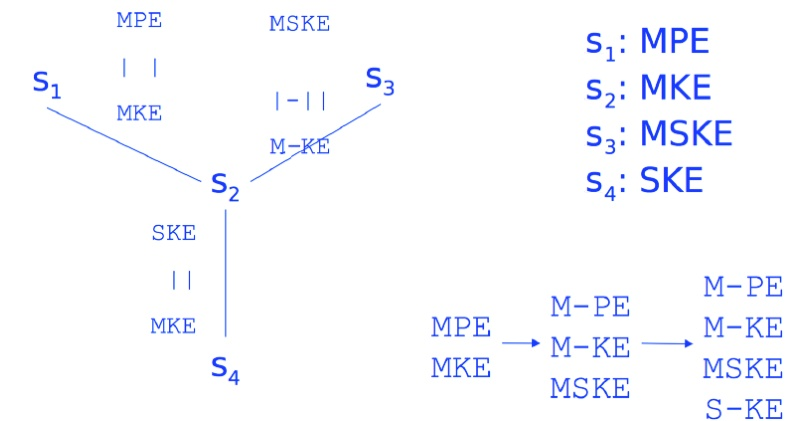

- We compute all pairwise alignments

- $S_{2}$ is our "center" of the star

E. g., for match=1, mismatch=-1 and gap=-1 we get $SP ( S_{2} )=3$

- The multiple alignment is built by adding all other strings according to their pairwise alignment with $S_{2}$

- The order in which they are added is thus not important

## The center star algorithm: example

Step-by-step example (by Sushmita Roy, 2013)

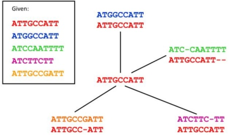

Final alignment:

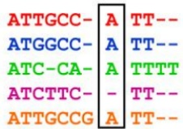

- merging pairwise alignments

present pair

Current multiple alignment

1. ATGGCCATT

ATTGCCATT

ATTGCCATT

ATGGCCATT

2. ATC-CAATTTT ATTGCCATT-present pair Current multiple alignment

ATTGCCATT--  

ATGGCCATT--  

ATC-CAATTTT

<table><tr><td rowspan="4">3.</td><td>ATCTTC-TT</td><td>ATTGCCATT--</td></tr><tr><td>ATTGCCATT</td><td>ATGGCCATT--</td></tr><tr><td></td><td>ATC-CAATTTT</td></tr><tr><td></td><td>ATCTTC-TT--</td></tr></table>

4. ATTGCCGATT ATTGCC-ATT

shift entire columns when incorporating a gap

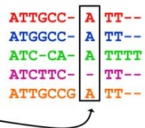

## The center star algorithm: example

Does it really not depend on the order? Switch steps 2 and 3 ...

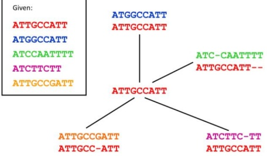

Final alignment:

Pair

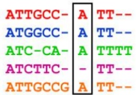

ATTGCCATT

ATGGCCATT

ATCTTC-TT

1. ATGGCCATT

ATTGCCATT

ATTGCCATT--

ATGGCCATT--

ATCTTC-TT--

ATC-CAATTTT

3. ATCTTC-TT

ATTGCCATT

Current multiple alignment

ATTGCCATT

ATGGCCATT

2. ATC-CAATTTT

ATTGCCATT--

4. ATTGCCGATT

ATTGCC-ATT

ATTGCC-ATT--  

ATGGCC-ATT--  

ATCTTC--TT--  

ATC-CA-ATTTT  

ATTGCCGATT--

(No! Sequences align in the same way ...)

## The center star algorithm: complexity

Let us for simplicity assume we have k strings of equal length n

Space and time complexity:

- Step 1: pairwise alignment

We produce $k(k-1)/2=O(k^{2})$ pairwise alignments

Each alignment takes $O(n^{2})$ time and space (filling the 2D scoring matrix!)

The overall complexity of the first step is thus $O(k^{2} n^{2})$ time and space, as opposed to $O(n^{k})$ space and $O(2^{k} n^{k})$ time for using a hypercube to perform the optimal multiple sequence alignment ...

In practice, we have additional advantages:

- Actually, if we compute the pairwise alignments sequentially, we only need $O(n^{2})$ space (we can discard the matrix after each pairwise alignment)

- If we perform the $k(k-1)/2$ alignments in parallel, then we only need $O(n^{2})$ wall clock time (but of course more computing power/processor cores)

## Steps 2 and 3: Choosing the center string and building the final alignment takes $O(nk)$ time

- Hence, the overall time/space complexity is $O \left( k^{2} n^{2} \right)$

## The center star algorithm: approximation

- With this algorithm, we do not actually compare all the strings to one another

- We just compare all the strings to the center, hoping that the pairwise alignment of each of them would also be found in the optimal multiple alignment

Essentially, we hope that in the optimal alignment the gaps would be placed in the same positions where we place them in the pairwise alignments with the center

How accurate is this approximation?

- We can re-formalize the problem: instead of maximizing the overall similarity (sum of pairs), we can minimize the overall distance (sum of distances)

- If the triangle inequality holds (for the edit distance it does!),

$$
z \leq x + y
$$

then we can prove that it is an approximation algorithm with $\varepsilon=2$ . That is, the ratio between the overall distance found by the algorithm and the "minimum" (optimal) overall distance is always equal to or lower than 2!

Thus, in the worst case, the alignment found by the "center star" algorithm has an overall distance between the sequences (the function to be optimized) which is (at worst) twice the optimal overall distance. It can be lower (3/2, 6/5, etc) but never higher (5/2, 7/3, etc)!

Can we produce more "biologically relevant" alignments, regardless of the approximation?

## Some biological reasoning

- The assumption is that our sequences have a common evolutionary history

- Remember Darwin's "tree of life" for species?

At the sequence level, imagine we can trace the evolutionary history of DNA (or protein) sequences with their "ancestor tree"—in molecular evolution this is called a "phylogenetic tree".

That is, assume we know the true history among different alternatives like these:

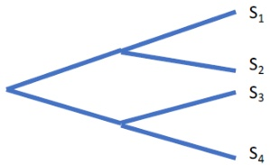

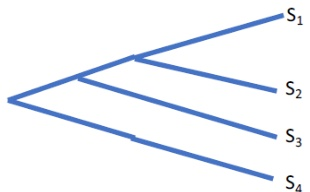

- Suppose the evolutionary history is the one shown to the left

- The idea is to keep aligning pairs of sequences, but instead of choosing a "center" string we follow the evolutionary history, going back in time

- That is, we start by aligning the strings that are "closest relatives", then we move back on the tree. In this example:

1 We align S1 with S2

2 We align S3 with S4

We somehow "merge" the alignment of (S1,S2) with the alignment of (S3,S4)

## Some biological reasoning

- The assumption is that our sequences have a common evolutionary history

- Remember Darwin's "tree of life" for species?

At the sequence level, imagine we can trace the evolutionary history of DNA (or protein) sequences with their "ancestor tree"—in molecular evolution this is called a "phylogenetic tree".

That is, assume we know the true history among different alternatives like these:

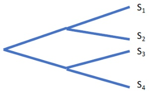

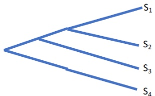

- Suppose the evolutionary history instead is the one shown to the right

- We again start by aligning the strings that are "closest relatives", then we move back on the tree.

Now we would proceed as follows:

1 We align S1 with S2

2 We somehow add S3 to the alignment of (S1,S2)

We somehow add S4 to the alignment of (S1,S2,S3)

- How can we "merge" two alignments or add a string to an existing alignment?

## Alignment profile

- One very useful way of describing a multiple alignment is to represent it it as an alignment profile

- For each column of the alignment, the profile represents the frequency with which we find each symbol of the alphabet (including the gap) in that column

Frequencies in each column sum up to 1

x: AC-GCGG-C

y: AC-GC-GAG

z: GCCGC-GAG

$$
\begin{array}{c c c c c c c c c c} A & 2 / 3 & 0 & 0 & 0 & 0 & 0 & 2 / 3 & 0 \\ C & 0 & 1 & 1 / 3 & 0 & 1 & 0 & 0 & 1 / 3 \\ G & 1 / 3 & 0 & 0 & 1 & 0 & 1 / 3 & 1 & 0 & 2 / 3 \\ T & 0 & 0 & 0 & 0 & 0 & 0 & 0 & 0 \\ - & 0 & 0 & 2 / 3 & 0 & 0 & 2 / 3 & 0 & 1 / 3 & 0 \end{array}
$$

- Profiles are a way of representing an MSA in a compact manner

- The drawback is that we lose the information about which sequence each character/symbol belongs to

We know that the profile was built from 3 sequences and that there are two "A" in the first column; but we don't know in which of the 3 sequences these "A"s are ...

## Weighted dynamic programming

Can we use such this profile to align (add) a fourth sequence?

- We can also use a dynamic programming matrix like for a pairwise global alignment, but we replace one of the two strings by an entire profile

- The rows represent the string to be added

But for the columns we have the profile: not single letters but for each column we have all letters of the alphabet (plus gap) and their respective frequencies in the previous alignment

Like for the rows, we let also the first column represent a gap

- That is, we compare a character (of the string to be added) to a column of the profile, with the frequency of each letter

<table border="1"><tr><td>A</td><td>0</td><td>2/3</td><td>0</td><td>0</td><td>0</td><td>0</td><td>0</td><td>2/3</td><td>0</td></tr><tr><td>C</td><td>0</td><td>0</td><td>1</td><td>1/3</td><td>0</td><td>1</td><td>0</td><td>0</td><td>1/3</td></tr><tr><td>G</td><td>0</td><td>1/3</td><td>0</td><td>0</td><td>1</td><td>0</td><td>1/3</td><td>1</td><td>0</td></tr><tr><td>T</td><td>0</td><td>0</td><td>0</td><td>0</td><td>0</td><td>0</td><td>0</td><td>0</td><td>0</td></tr><tr><td>-</td><td>1</td><td>0</td><td>0</td><td>2/3</td><td>0</td><td>0</td><td>2/3</td><td>0</td><td>1/3</td></tr><tr><td>-</td><td></td><td></td><td></td><td></td><td></td><td></td><td></td><td></td><td></td></tr><tr><td>A</td><td></td><td></td><td></td><td></td><td></td><td></td><td></td><td></td><td></td></tr><tr><td>C</td><td></td><td></td><td></td><td></td><td></td><td></td><td></td><td></td><td></td></tr><tr><td>C</td><td></td><td></td><td></td><td></td><td></td><td></td><td></td><td></td><td></td></tr><tr><td>G</td><td></td><td></td><td></td><td></td><td></td><td></td><td></td><td></td><td></td></tr><tr><td>C</td><td></td><td></td><td></td><td></td><td></td><td></td><td></td><td></td><td></td></tr><tr><td>G</td><td></td><td></td><td></td><td></td><td></td><td></td><td></td><td></td><td></td></tr><tr><td>A</td><td></td><td></td><td></td><td></td><td></td><td></td><td></td><td></td><td></td></tr></table>

## Weighted dynamic programming

<table border="1"><tr><td>A</td><td>0</td><td>2/3</td><td>0</td><td>0</td><td>0</td><td>0</td><td>0</td><td>2/3</td><td>0</td></tr><tr><td>C</td><td>0</td><td>0</td><td>1</td><td>1/3</td><td>0</td><td>1</td><td>0</td><td>0</td><td>1/3</td></tr><tr><td>G</td><td>0</td><td>1/3</td><td>0</td><td>0</td><td>1</td><td>0</td><td>1/3</td><td>1</td><td>0</td></tr><tr><td>T</td><td>0</td><td>0</td><td>0</td><td>0</td><td>0</td><td>0</td><td>0</td><td>0</td><td>0</td></tr><tr><td>-</td><td>1</td><td>0</td><td>0</td><td>2/3</td><td>0</td><td>0</td><td>2/3</td><td>0</td><td>1/3</td></tr><tr><td>-</td><td>0</td><td>-1</td><td>-2</td><td>-2.33</td><td>-3.33</td><td>-4.33</td><td>-4.66</td><td>-5.66</td><td>-6.33</td></tr><tr><td>A</td><td>-1</td><td></td><td></td><td></td><td></td><td></td><td></td><td></td><td></td></tr><tr><td>C</td><td>-2</td><td></td><td></td><td></td><td></td><td></td><td></td><td></td><td></td></tr><tr><td>C</td><td>-3</td><td></td><td></td><td></td><td></td><td></td><td></td><td></td><td></td></tr><tr><td>G</td><td>-4</td><td></td><td></td><td></td><td></td><td></td><td></td><td></td><td></td></tr><tr><td>C</td><td>-5</td><td></td><td></td><td></td><td></td><td></td><td></td><td></td><td></td></tr><tr><td>G</td><td>-6</td><td></td><td></td><td></td><td></td><td></td><td></td><td></td><td></td></tr><tr><td>A</td><td>-7</td><td></td><td></td><td></td><td></td><td></td><td></td><td></td><td></td></tr></table>

- We fill the matrix with a "weighted" version of the global alignment rule

The initialization of the first row is "weighted" too, since the profile contains gaps

The gap penalty (here: -1) is weighted by the fraction of non-gap characters

Example: $1 / 3 \times - 1 = - 0. 3 3$ as penalty for column four (from -2 to -2.33)

## Weighted dynamic programming

Computing the individual scores for the alignment matrix A:

Given: Profile R with frequencies $R[c,j]$ for character c (including gap) in column j Given: String $X=\left(x_{1},\dots,x_{n}\right)$ to be aligned (in the rows of matrix A)

<table border="1"><tr><td></td><td>1</td><td>2</td><td>3</td><td>4</td></tr><tr><td>A</td><td>1</td><td>0</td><td>0</td><td>0</td></tr><tr><td>C</td><td>0</td><td>0.75</td><td>0.25</td><td>0.5</td></tr><tr><td>G</td><td>0</td><td>0</td><td>0.75</td><td>0</td></tr><tr><td>T</td><td>0</td><td>0.25</td><td>0</td><td>0</td></tr><tr><td>-</td><td>0</td><td>0</td><td>0</td><td>0.5</td></tr></table>

<table><tr><td>5</td><td>6</td><td>7</td><td>8</td><td>9</td></tr><tr><td>0</td><td>0.25</td><td>0</td><td>0</td><td>0.75</td></tr><tr><td>0</td><td>0</td><td>0.25</td><td>0.25</td><td>0.25</td></tr><tr><td>0.75</td><td>0</td><td>0</td><td>0.5</td><td>0</td></tr><tr><td>0.25</td><td>0.75</td><td>0</td><td>0.25</td><td>0</td></tr><tr><td>0</td><td>0</td><td>0.75</td><td>0</td><td>0</td></tr></table>

ACC - AGACGA

Score of matching character x with column j of the profile:

$$
P (x, j) = \sum_ {c \in \Sigma} \sin (x, c) \times R [ c, j ]
$$

$sim(x,c)$ is the cost of aligning x with c (including gaps), $R[c,j]$ is the frequency of char c in column j of the matrix

$A[i,j] = \max \left\{ \begin{array}{ll} A[i - 1,j - 1] + P(x_i,j) & \mathrm{align} x_i \mathrm{to} \mathrm{column} j \\ A[i - 1,j] + \mathrm{gap} & \mathrm{introduce} \mathrm{gap} \mathrm{into} \mathrm{profile} \\ A[i,j - 1] + P("_{-}",j) & \mathrm{introduce} \mathrm{gap} \mathrm{into} x \end{array} \right.$

Here, $sim(x,c)$ will usually be the match score, mismatch penalty or gap penalty, or alternatively the score obtained from a substitution matrix; $sim(-,-) = 0$ for two gaps

## Weighted dynamic programming

<table border="1"><tr><td>A</td><td>0</td><td>2/3</td><td>0</td><td>0</td><td>0</td><td>0</td><td>0</td><td>2/3</td><td>0</td></tr><tr><td>C</td><td>0</td><td>0</td><td>1</td><td>1/3</td><td>0</td><td>1</td><td>0</td><td>0</td><td>1/3</td></tr><tr><td>G</td><td>0</td><td>1/3</td><td>0</td><td>0</td><td>1</td><td>0</td><td>1/3</td><td>1</td><td>0</td></tr><tr><td>T</td><td>0</td><td>0</td><td>0</td><td>0</td><td>0</td><td>0</td><td>0</td><td>0</td><td>0</td></tr><tr><td>-</td><td>1</td><td>0</td><td>0</td><td>2/3</td><td>0</td><td>0</td><td>2/3</td><td>0</td><td>1/3</td></tr><tr><td>-</td><td>0</td><td>-1</td><td>-2</td><td>-2.33</td><td>-3.33</td><td>-4.33</td><td>-4.66</td><td>-5.66</td><td>-6.33</td></tr><tr><td>A</td><td>-1</td><td>?</td><td></td><td></td><td></td><td></td><td></td><td></td><td></td></tr><tr><td>C</td><td>-2</td><td></td><td></td><td></td><td></td><td></td><td></td><td></td><td></td></tr><tr><td>C</td><td>-3</td><td></td><td></td><td></td><td></td><td></td><td></td><td></td><td></td></tr><tr><td>G</td><td>-4</td><td></td><td></td><td></td><td></td><td></td><td></td><td></td><td></td></tr><tr><td>C</td><td>-5</td><td></td><td></td><td></td><td></td><td></td><td></td><td></td><td></td></tr><tr><td>G</td><td>-6</td><td></td><td></td><td></td><td></td><td></td><td></td><td></td><td></td></tr><tr><td>A</td><td>-7</td><td></td><td></td><td></td><td></td><td></td><td></td><td></td><td></td></tr></table>

$$
P (x, j) = \sum_ {c \in \Sigma} \sin (x, c) \times R [ c, j ]
$$

$$
A [ i, j ] = \max \left\{ \begin{array}{l l} A [ i - 1, j - 1 ] + P \left(x _ {i}, j\right) & \text {a l i g n} x _ {i} \text {t o c o l u m n} j \\ A [ i - 1, j ] + \text {g a p} & \text {i n t r o u c e} g a p \text {i n t o p r o f i l e} \\ A [ i, j - 1 ] + P \left(" ", j\right) & \text {i n t r o u c e} g a p \text {i n t o} x \end{array} \right.
$$

- Option 1 (diagonal): align $x_{1} = "$ "A" to column $j = 1$ (having $\frac{2}{3}$ "A" and $\frac{1}{3}$ "G")

- $0+P("A",1)=0+\sum_{c\in\Sigma}\operatorname{sim}("A",c)\times R[c,1]=1\times \frac{2}{3}+(-1)\times \frac{1}{3}=\frac{1}{3}$

- Option 2 (from top): gap in profile

$$
\triangleright - 1 + (- 1) = - 2
$$

- Option 3 (from left): gap in x

$$
- 1 + \sum_ {c \in \Sigma} \sin \left(" -", c\right) \times R [ c, 1 ] = - 1 + (- 1) \times \frac {2}{3} + (- 1) \times \frac {1}{3} = - 2
$$

## Weighted dynamic programming

- By using the "weighted" version of the update rule, we can fill the matrix as we did in the global alignment of two strings

- At each step, we keep track of the cell that gave the best choice at each step (for backtracing)

- At the end, as usual, cell (n,m) will contain the value of the optimal alignment

- The alignment will be build with a traceback, as in the global alignment of two strings

- Then, according to the resulting alignment, we update the alignment profile by adding the new string we just aligned and recomputing the new frequencies

- We also save the actual alignment as output (final output if all sequences were used; otherwise input to the next step)

- The same principle can be applied to the alignment of two profiles!

- For both rows and columns of the alignment matrix we would have a profiles instead of a string

- The update of the cells can be performed with a "double weighted" version of the rule for global alignment

## "Progressive" multiple alignments

- Algorithms of this kind are in general said to build a "progressive" multiple alignment

- The key is having the "guide-tree" telling us the order of operations in which the alignment has to be built:

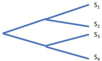

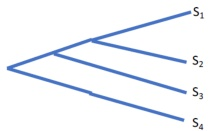

- But, what if we don't have a guide-tree?

Usually we don't! As a matter of fact an MSA is the starting point for inferring the evolutionary history of the sequences, so we will have an evolutionary tree that we could use for guidance only after having performed the multiple alignment ...

- Idea: before proceeding with the alignments, we build the guide tree ourselves, that is, we try to predict the evolutionary history behind the sequences!

## References I

Banerjee T.D. et al. (2020) Expression of Multiple engrailed Family Genes in Eyespots of Bicyclus anynana Butterflies Does Not Implicate the Duplication Events in the Evolution of This Morphological Novelty Front. Ecol. Evol. 8:227

Lu C.-D. et al. (1999) The ArgR Regulatory Protein, a Helper to the Anaerobic Regulator ANR during Transcriptional Activation of the arcD Promoter in Pseudomonas aeruginosa Journal of Bacteriology 181(8):2459-2464

Nagy Z.T., et al. (2012) First Large-Scale DNA Barcoding Assessment of Reptiles in the Biodiversity Hotspot of Madagascar, Based on Newly Designed COI Primers PLoS One 7(3):e34506