POLITECNICO

MILANO 1863

# Bioinformatics Algorithms

# Multiple sequence alignment (part 2)

Rosario M. Piro (based on slides by Giulio Pavesi)

Dipartimento di Elettronica, Informazione e Bioingegneria (DEIB)

Politecnico di Milano

## "Progressive" multiple alignments

- The idea of progressive alignment is to keep aligning pairs of sequences (or of alignment profiles) following their evolutionary history backwards

- That is, we start by aligning the strings that are the "closest relatives" (most recent divergence), then we move backwards to the more distant history

The key is having the "guide-tree" telling us the order of operations in which the alignment has to be built:

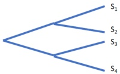

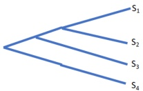

Example: according to the evolutionary tree to the left, we ...

1 Align S1 with S2 to build the alignment profile P(S1,S2)

2 Align S3 with S4 to build the alignment profile P(S3,S4)

3 Align P(S1,S2) with P(S3,S4) to derive the final alignment (S1,S2,S3,S4)

- We need a "guide tree" which represents the evolutionary history (and thus the order of operations) before proceeding with the alignments ...

- Note: in this progressive procedure the algorithm never actually evaluates the score associated with an alignment; it just builds the final solution step-by-step!

## "Progressive" multiple alignments

- Idea: we build the guide tree ourselves, that is, we try to guess the evolutionary history behind the sequences

The tree should give us an estimate of the evolutionary history of the sequences

The general principle/assumption behind the tree is: "The more two strings are similar, the more recent is the evolutionary event that produced them"

- Thus, a good idea would be to build the tree going "back in time"

We start from the final sequences, and derive their common ancestors

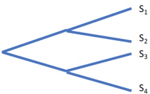

We start from the leaves and move up the tree. Every time we find an internal node, we meet an evolutionary event (e.g., speciation)

## Building the guide tree

- We start again by comparing all sequences and compute their pairwise distances

- We proceed in a "greedy" way: we choose the pair with minimal distance, align them and build their profile

- Suppose that the closest pair is S1-S2: we have the first node of the tree, and call A(S1,S2) their alignment

- The alignment represents their common ancestor, and it will be part of the final multiple alignment

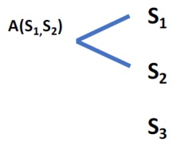

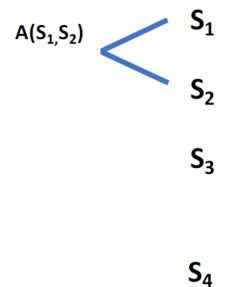

Step 1: S1 and S2 are the strings at minimum distance among all pairs

## Building the guide tree

- At the second step, we have three objects:

- Alignment A(S1,S2)

★ This replaces S1 and S2!

String S3

String S4

- We choose again the closest pair among the three possibilities

- Distance between A(S1,S2) and S3

- Distance between A(S1,S2) and S4

- Distance between S3 and S4 [computed already for step 1!]

- Suppose that the best choice (minimal distance) is the third. We align S3 and S4, and add the node A(S3,4) to the tree

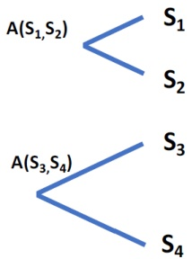

Step 2: S3 and S4 are the strings at minimum distance among all pairs. We generate a new node and the corresponding alignment A(S3,S4)

## Building the guide tree

- At the third step, we have two objects left:

- Alignment A(S1,S2)

- Alignment A(S3,S4)

Only one choice. We align the two alignments, represented by their profiles

No matter what the initial number k of sequences is, we will always have a final merge of two alignments and/or sequences!

- The result is A(S1,S2,S3,S4), which is the final alignment!

- Note: we have built the guide tree and constructed the final multiple alignment at the same time!

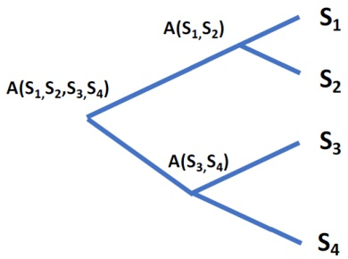

Step 3: We align A(S1,S2) and A(S3,S4) and have reached the root of the tree

## Building the guide tree

This approach is a greedy strategy

- At each step we chose the best alternative

From another point of view, this performs a hierarchical clustering of the strings

- Replace "align" with "cluster" in what we have seen so far:

Every time we align two strings, we put them in the same cluster

Every time we align a string to a profile, we add it to an existing cluster

Every time we align two profiles, we merge two clusters

- At the end, we will have one single cluster comprising all strings

## Hierarchical clustering

## Hierarchical clustering is one of a set of related data mining techniques

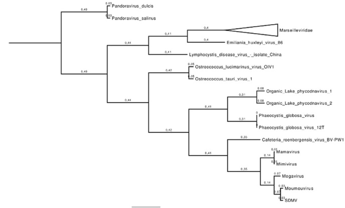

(Clustering of nucleo-cytoplasmic large DNA viruses based on the presence or absence of orthologous genes; from: Bajrai et al, 2016)

- Edge length is often depicted proportionally to the computed distance

- This shows visually how "close" the individual items and clusters are

- Example (see figure): Mamavirus and Mimivirus are closer to each other than the Organic Lake phycodnaviruses

## Clustering

"Clustering" (not only hierarchical clustering) is a very important branch for data mining, machine learning, and statistics

- Clustering algorithms can be divided into many sub-branches, e.g., according to

- whether the number of expected clusters is known beforehand (e.g., k-means clustering)

- whether it is supervised or unsupervised

- whether it is hierarchical, centroid-based, density-based, ...

- Clustering can be applied to different kinds of data, mainly numerical, but also as in our example, to sequences

- Each item to be clustered is seen as a point in a multi-dimensional space: the only thing needed is a suitable distance measure

Different distance (or similarity) measures can be applied, for example

★ Edit distance or alignment score (for sequences)

- Euclidean distance, cosine similarity or correlation coefficients (for numeric data)

## For two sequences, we define a distance measure by "scaling" the similarity score obtained from alignment

- But what is the "distance" between a sequence and an alignment or between two alignments?

## Building the guide tree

At each step, we decide to "join" the two closest objects:

Two strings

- One strings and an alignment (a cluster)

- Two alignments (two clusters)

For measuring the distance between two strings, we just take the distance given by their alignment

- But how do we measure the distance between one string and an alignment or between two alignments?

- This is a problem well studied in clustering, that is:

- Define a distance measure between a point and a cluster

- Define a distance measure between two clusters

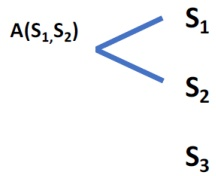

How do we compute the distances between S3 and A(S1,S2) and between S4 and A(S1,S2) to decide the next step?

## Measuring distances

For the distance between a string and an alignment (cluster of strings), we have these main choices:

Distance between the string and the closest string of the cluster (that is, the minimum distance to any member of the cluster)

Distance between the string and the furthest string of the cluster (that is, the maximum distance to any cluster member)

The average distance between the string and all the strings of the cluster

- More complex methods, considering both the average distance to the cluster members and to other strings outside of the cluster (e.g., "neighbor joining"), have been introduced ...

Distances string - cluster

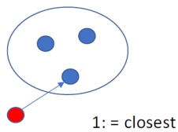

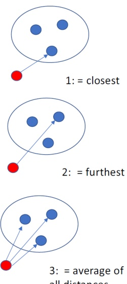

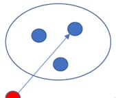

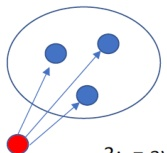

3: = average of all distances

## Measuring distances

- For the distance between two alignments (two clusters) the main choices are:

Distance of the closest pair of members (one from each cluster)

Distance of the farthest pair of members (one from each cluster)

Average distance between all pairs of members (one from each cluster)

- More complex methods, considering both the members of the two clusters and the data points (strings) outside the clusters, have been introduced (e.g., neighbor joining also for this case)

Distances cluster - cluster

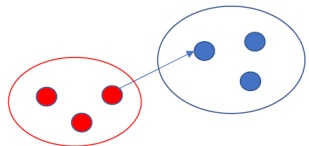

1: = closest pair

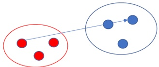

2: = farthest pair

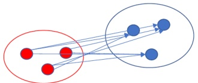

3: = average of all pairs

## Measuring distances

Neighbor joining has turned out to be the best choice for multiple sequence alignment

- A variation of the "average" distance principle

- The measure employed is a score that combines

- the distance (average) between the two objects (single sequences and/or alignments) compared, which has to be small, and

- the distance of the two objects from all other objects, which has to be as large as possible

- It is the relationship between these distances which determines which objects to merge in a given step of the algorithm

Essentially, two objects which are very close to each other but also rather close to other objects need not be the best choice

- Two object which are a little farther away from each other but very far from everything else might be the better choice!

- Multiple sequence alignment based on this approach is very fast and considered to produced reliably "good" guide trees

## "Progressive" multiple alignments

- The approach we have seen has become the de facto standard for solving the MSA problem

Heuristic: since we make a mistake if we insert a gap in the wrong place, we best start with aligning strings where the mistake is less likely!

Thus, if the closest strings are aligned correctly, they can guide the alignment of the more distant strings, which are more likely to be aligned wrongly

No performance guarantee: the procedure does not even take the final SP score into account; so there is no explicit maximization! (But it still turns out to be the approach that works best ...)

Pair-wise alignment (alternatives 1 and 2):

$$
\begin{array}{l} S U G A R - \\ S U C - R E \\ \end{array}
$$

(If started here, we'd likely choose alternative 2 because it has less gaps, but this would be wrong!)

<table><tr><td>-</td><td>S</td><td>U</td><td>G</td><td>A</td><td>R</td><td>-</td></tr><tr><td>-</td><td>S</td><td>U</td><td>C</td><td>-</td><td>R</td><td>E</td></tr><tr><td>-</td><td>S</td><td>A</td><td>K</td><td>A</td><td>R</td><td>I</td></tr><tr><td>-</td><td>Z</td><td>U</td><td>K</td><td>E</td><td>R</td><td>-</td></tr><tr><td>A</td><td>Z</td><td>U</td><td>C</td><td>A</td><td>R</td><td>-</td></tr><tr><td>-</td><td>Z</td><td>U</td><td>K</td><td>E</td><td>R</td><td>O</td></tr><tr><td>-</td><td>S</td><td>U</td><td>K</td><td>A</td><td>R</td><td>-</td></tr></table>

## Consensus:

(Therefore, it's better to start with very close sequences which tend to require much less gaps! Here, we'd probably start with "zuker" and "zukero")

## The local multiple alignment problem

What we have discussed so far is the global version of multiple sequence alignment because we fully aligned all input sequences

The local version of the problem can be formalized as well:

- Find the combination of substrings, one per input string, that produces the multiple alignment with the overall highest score

- With dynamic programming (hypercube...) we can solve it exactly:

- Like for the case of two sequences (matrix), we just need to adjust the way we fill the single cells (including a score of 0 among the possible choices) and then look for the highest score in the entire (hyper)cube!

- Same time/space complexity as the optimal global MSA!

But for a much faster, heuristic method we have an increased difficulty; we have to deal with two problems:

Choose the substrings to be aligned (number of combinations again exponential in $k$)

Multiple alignment of the chosen substrings (that we have just seen is an NP-hard problem)

- As usually done in modern bioinformatics, we formalize the problem in an "easier" way, which is still able to capture the "biological meaning" of the problem

## Why local multiple alignments?

- A typical scenario/use case for local MSA:

A large set of strings (could be even thousands), no longer than 1,000 characters

- The substrings forming the "biologically optimal" solutions are expected to be much shorter (about 10-15 characters)

- The substrings forming the "biologically optimal" solutions differ only by substitutions (=mismatches), not by insertions/deletions (=gaps)

- Hence, the second step (building the multiple alignment) becomes much easier: what remains to be solved is to find the "best combination" of substrings, that produce the alignment of maximum score

## Example:

- Thousands of DNA regions (hundreds of nucleotides each) where a protein of interest (e.g., a transcription factor) binds; obtained, e.g., from a ChIP-seq experiment

Goal: determine the DNA sequence pattern (binding site, usually around 5-20 bases) to which the protein binds; the binding sites will be similar to each other but don't need to have precisely the same sequence!

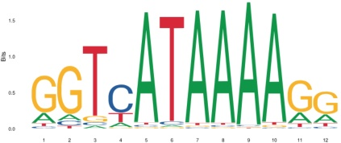

## Local multiple alignments: formalization

- The most common formalization is even more restrictive:

- Given:

A set of input strings $S_{1}, S_{2}, \dots, S_{k}$

A fixed substring length $w$

A function $f ( x )$ for the evaluation of the multiple alignment

- Problem:

- Find the set of $k$ substrings of length $w$, one per input string, that produces the alignment of maximum score according to function $f(x)$

- This problem is also known as "motif finding": that is, the input strings share a "recurring motif" appearing as substrings within them

- Typical problem of "combinatorial optimization", that is, finding the "optimal object" (the best combination of substrings) among a finite set of objects (all possible combinations of substrings)

- But, even in this "reduced" form the problem remains NP-hard!

Assuming all input strings have length n, there are n-w+1 substrings of length w per string, and thus a total of $( n-w+1 )^{k}$ possible solutions (combination of substrings)!

The problem is exponential in the size of the input ( $k$ strings) ...

- We need heuristic techniques as they are usually employed for solving combinatorial optimization problems

## Heuristic approach to motif finding

- For motif finding we consider:

For each input string we take exactly one substring

$^{2}$ All substrings which are part of the solution have the same length $k$

There will be no gaps in the final solution

## Thus:

Any candidate solution can be simply described by a vector of integers $( p_{1}, p_{2}, \dots, p_{k} )$ corresponding to the start positions of the substrings within the k input strings

The final alignment will simply be the respective substrings written one below the other, without gaps

- Hence, for any set of substrings the alignment is well defined and unique

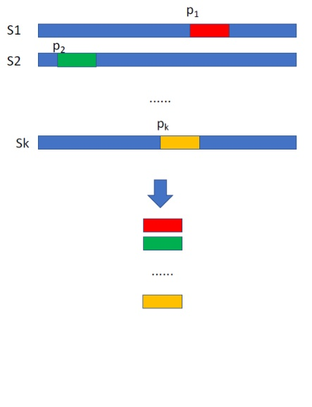

## Motif finding: scoring

- In the global MSA, we usually employ the "sum of pairs" score

- It could be used also for the local version of the problem, but it is common practice to use a different function, borrowed from information theory

- Remember that a multiple alignment can be represented by a profile:

$$
\begin{array}{l} A C G T A A \\ A G G T A T \\ A C G T T T \\ \end{array}
$$

$$
\begin{array}{c c c c c c c} A & | & 1 & 0 & 0 & 0 & 2 / 3 & 1 / 3 \\ C & | & 0 & 2 / 3 & 0 & 0 & 0 & 0 \\ G & | & 0 & 1 / 3 & 1 & 0 & 0 & 0 \\ T & | & 0 & 0 & 0 & 1 & 1 / 3 & 2 / 3 \end{array}
$$

(Note: since the alignment contains no gaps, we don't need the “-” symbol for this profile!)

Therefore, we can describe a solution by means of the corresponding profile

- One row per symbol of the alphabet (4 for DNA)

- $f_{i,j}$ is the frequency of symbol $i$ in column $j$ of the alignment

The frequencies in each column sum up to 1, i.e.,

$$
\sum_ {i} \mathbf {f} _ {i, j} = 1 \quad \forall j \in [ 1, w ]
$$

$$
\begin{array}{l} A \mid f _ {A, 1} f _ {A, 2} f _ {A, 3} \dots f _ {A, w} \\ C \mid f _ {C, 1} f _ {C, 2} f _ {C, 3} \dots f _ {C, w} \\ G \mid f _ {G, 1} f _ {G, 2} f _ {G, 3} \dots f _ {G, w} \\ T \mid f _ {T, 1} f _ {T, 2} f _ {T, 3} \dots f _ {T, w} \\ \end{array}
$$

(For DNA: 4 rows; amino acids: 20 rows; ...)

Motif finding: scoring

$$
\begin{array}{l} \mathrm {A} \mid \mathrm {f} _ {\mathrm {A}, 1} \mathrm {f} _ {\mathrm {A}, 2} \mathrm {f} _ {\mathrm {A}, 3} \dots \mathrm {f} _ {\mathrm {A}, w} \\ \mathrm {C} \mid \mathrm {f} _ {\mathrm {C}, 1} \mathrm {f} _ {\mathrm {C}, 2} \mathrm {f} _ {\mathrm {C}, 3} \dots \mathrm {f} _ {\mathrm {C}, w} \\ \mathrm {G} \mid \mathrm {f} _ {\mathrm {G}, 1} \mathrm {f} _ {\mathrm {G}, 2} \mathrm {f} _ {\mathrm {G}, 3} \dots \mathrm {f} _ {\mathrm {G}, w} \\ \mathrm {T} \mid \mathrm {f} _ {\mathrm {T}, 1} \mathrm {f} _ {\mathrm {T}, 2} \mathrm {f} _ {\mathrm {T}, 3} \dots \mathrm {f} _ {\mathrm {T}, w} \\ \end{array}
$$

(Note: here we increment $i$ to a maximum of 4 and divide £i,j by 1/4 because we have 4 symbols!)

Justification for this score:

- If the profile was built from "random sequences" with "random equiprobable" nucleotides, in each of the columns we would find each nucleotide (A,C,G,T) with a probability of 25% (=1/4)!

- The log compares the actual frequencies $\mathbf{f}_{i,j}$ of the symbols of each column to this random frequency of 1/4

- The final score is maximum if there is one $i$ with $f_{i,j} = 1$ in each column $j$:

All sequences are the same; for each column there is only one possible nucleotide

In this case, each column gives a score of $\log_{2}4=2$ (4 choices $\rightarrow$ 2 bits!); Maximum score: $2\times w$

- The final score is minimum for random sequences:

$\mathbf{f}_{i,j}=1/4$ for all i and j, and $\log_{2}1=0$

Motif finding: scoring

$$
\begin{array}{l} \mathrm {A} \mid \mathrm {f} _ {\mathrm {A}, 1} \mathrm {f} _ {\mathrm {A}, 2} \mathrm {f} _ {\mathrm {A}, 3} \dots \mathrm {f} _ {\mathrm {A}, w} \\ \mathrm {C} \mid \mathrm {f} _ {\mathrm {C}, 1} \mathrm {f} _ {\mathrm {C}, 2} \mathrm {f} _ {\mathrm {C}, 3} \dots \mathrm {f} _ {\mathrm {C}, w} \\ \mathrm {G} \mid \mathrm {f} _ {\mathrm {G}, 1} \mathrm {f} _ {\mathrm {G}, 2} \mathrm {f} _ {\mathrm {G}, 3} \dots \mathrm {f} _ {\mathrm {G}, w} \\ \mathrm {T} \mid \mathrm {f} _ {\mathrm {T}, 1} \mathrm {f} _ {\mathrm {T}, 2} \mathrm {f} _ {\mathrm {T}, 3} \dots \mathrm {f} _ {\mathrm {T}, w} \\ \longrightarrow S (P) = \sum_ {i = 1} ^ {4} \sum_ {j = 1} ^ {w} f _ {i, j} \log_ {2} \frac {f _ {i , j}}{1 / 4} \\ \end{array}
$$

(Note: here we increment *i* to a maximum of 4 and divide £i by 1/4 because we have 4 symbols!)

This measure is not new:

- Known in information theory:

Related to the "Shannon entropy/uncertainty" of set X of events (Shannon, 1948):

$$
H (X) = - \sum_ {i} p _ {i} \log_ {2} p _ {i}
$$

The "relative entropy" or "information content" (IC) of the profile, with respect to the "background probabilities" (here: $25 \% = 1 / 4$ ) of the four symbols of the alphabet

- Known in statistics:

The "Kullback-Leibler" divergence (KL divergence) of the observed probability distribution of the symbols (described by the profile) from the "background distribution" of the symbols of the alphabet (Kullback and Leibler, 1951)

- Note: the score can be defined also for "background probabilities" other than 1/4

Some organisms have a "GC-content" different from 50%

Example: the GC-content of Saccharomyces cerevisiae (yeast) is 38%, so the background frequencies would be: 0.19 for G and C, and 0.31 for A and T

## Motif finding: scoring

- All in all, given

A set of input strings $S_{1}, S_{2}, \dots , S_{k}$ of equal length n

A substring length w

The "information content" score $I C (P)$ for the evaluation of the multiple alignment described as a profile P

- Find the combination of substrings of length w, one per input string, that aligned without gaps produce the profile with maximum IC score

- The "logo" (here: "sequence logo") is a very intuitive way of representing the profile: it is the information content contribution of every symbol in every column (measured in bits for each symbol)

$$
\begin{array}{l} \mathrm {A} \mid f _ {\mathrm {A}, 1} f _ {\mathrm {A}, 2} f _ {\mathrm {A}, 3} \dots f _ {\mathrm {A}, w} \\ \mathrm {C} \mid f _ {\mathrm {C}, 1} f _ {\mathrm {C}, 2} f _ {\mathrm {C}, 3} \dots f _ {\mathrm {C}, w} \\ \mathrm {G} \mid f _ {\mathrm {G}, 1} f _ {\mathrm {G}, 2} f _ {\mathrm {G}, 3} \dots f _ {\mathrm {G}, w} \\ \mathrm {T} \mid f _ {\mathrm {T}, 1} f _ {\mathrm {T}, 2} f _ {\mathrm {T}, 3} \dots f _ {\mathrm {T}, w} \\ \end{array}
$$

$$
I C (P) = \sum_ {i = 1} ^ {4} \sum_ {j = 1} ^ {w} f _ {i, j} \log_ {2} \frac {f _ {i , j}}{1 / 4}
$$

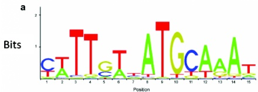

## Motif finding: exhaustive search

- Align every substring of string $S_{1}$ to every substring of $S_{2}$ — we obtain $O(n^{2})$ profiles

- Align every substring of string $S_{3}$ to every possible $\left( S_{1}, S_{2} \right)$ profile - we obtain $O \left( n^{3} \right)$ profiles

- Align every substring of string $S_{4}$ to every $(S_{1}, S_{2}, S_{3})$ profile - we obtain $O(n^{4})$ profiles

- ...

- Align every substring of string $S_{k}$ to every $(S_{1}, S_{2}, S3, \dots, S_{k-1})$ profile - we obtain $O(n^{k})$ profiles

- Determine the profile of maximum IC score

- In this way we generate all possible solutions: we have to find a way to reduce the search space!

## Possible approach: branch and bound

- Algorithmic approach that reduces the search space by discarding partial solutions in advance if they cannot lead to the optimal solution

But the time complexity remains exponential

## Motif finding: greedy algorithm

- Align every substring of string $S_{1}$ to every substring of $S_{2}$ - we obtain $O\left(n^{2}\right)$ profiles - keep only the best n profiles according to their IC score

- Align every substring of string $S_{3}$ to the n best $\left( S_{1}, S_{2} \right)$ profiles - we obtain $O\left(n^{2}\right)$ profiles - keep only the best n profiles according to their IC score

- ...

- Determine the best profile from the last $O(n^{2})$ profiles

- In this way we do not explore all the solutions, by only a polynomial subset of them

- The algorithm is greedy because at every step (except the last), we keep only what are "locally" the best solutions

If only a subset of the $( S_{1}, S_{2} )$ substring combinations is kept after the first step, there is no longer the guarantee that we will find the optimal solution

- The same holds true for every successive step: there is always the risk of discarding a combination of substrings that would lead to the optimal solution

## Greedy algorithms

- The same strategy can be designed for a large number of combinatorial problems that can be formalized in a similar way

- In our case, the solution is given by $k$ integer variables $p_{i}$ , telling us the positions (offsets) of the substrings within the strings $S_{i}$ that are included in the solution

- That is, a solution is an assignment of a value to each of the k variables describing the alignment

In general, the greedy approach for problems that can be formalized in this way can me summarized as illustrated in the right column

- Given k discrete variables

  X1...Xk

- Goal: find the values for the variables that maximize a given function f(X1...Xk)

Find the values of X1, X2 that maximize f(X1,X2): let x1, x2 be these values

2 Find the value of X3 that maximizes f(X1,X2,X3) with X1=x1, X2=x2 found at the previous step

Find the value of Xk that maximizes

f(X1,X2,...,X(k-1),Xk), given the values x1, x2, ..., x(k-1) found at the previous steps

## Greedy algorithms

- The algorithm to the right takes at each step only the single best solution found at the previous step

- The number of solutions kept at each step can be extended to more than one (i.e. keep the b best solutions) as long as at each step the number of solutions we have to evaluate remains polynomial in the size of the input

In our problem, we kept $O(n)$ solutions, hence evaluated $O(n^{2})$ solutions at each step

- Advantage of a greedy algorithm: massively reduced time complexity

Disadvantage: can get "stuck" in local optimum; finding the globally best solution is not guaranteed

- Given k discrete variables

  X1...Xk

- Goal: find the values for the variables that maximize a given function f(X1...Xk)

Find the values of X1, X2 that maximize f(X1,X2): let x1, x2 be these values

2 Find the value of X3 that maximizes f(X1,X2,X3) with X1=x1, X2=x2 found at the previous step

3 ..

Find the value of Xk that maximizes

f(X1,X2,...,X(k-1),Xk), given the values x1, x2, ..., x(k-1) found at the previous steps

## Combinatorial optimization: exploring the search space

- A solution to the problem is an assignment of a value between 1 and $( n-w+1 )$ to k discrete variables $X_{1}, X_{2}\dots X_{k}$ (assuming all strings have length n)

- Hence, each candidate solution to the problem can be seen as a point in a $k$-dimensional "search space" (or "solution space") of the problem

- In our case there are $( n-w+1 )^{k}$ points that can be visited in the search space

- Idea:

- "Explore" the search space, moving from point to point, visiting a polynomial number of points, hoping to visit the one that corresponds to the optimal solution

- The steps in the search space are taken according to a given heuristic

- Nothing is guaranteed for the approximation/solution of the problem: but in practice there are a few "common sense" heuristics that work very well on several problems of this type

## Exploring the search space: local search

- We start at a point in the k-dimensional space, chosen at random or with some heuristic

- We "look around" at the neighboring points and compute their scores

- We choose the point that will bring the best improvement ("steepest" increase): it will correspond to the new solution

- From this new solution we "look around" and move again ...

- We keep moving like this until we find a point at which no further improvement of the objective function is possible

- This point is a local maximum (hopefully the global maximum)

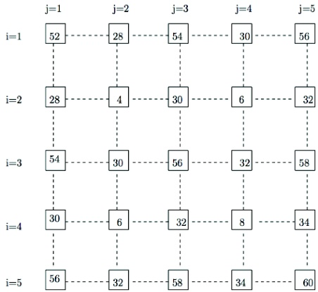

## Exploring the search space: local search

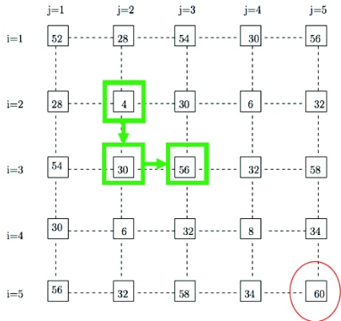

We start at "4". After two steps we reach 56

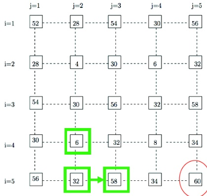

We start at "6". After two steps we reach 58

(Note: in both cases we don't reach the global maximum)

## Exploring the search space: local search

"Looking around" in the search space at neighboring points corresponds to changing the value of one or more of the variables in the current solution

- One possible way is to select one variable $X_{i}$ keeping the other variables fixed and choose the value $X_{i}$ that brings the best improvement

- If changing $X_{i}$ doesn't improve the solution, we keep the previous value

- We iterate this step, by cycling over the $X_{j}$ variables one by one

This is the equivalent to moving in one direction in the k-dimensional space, going to the "maximum" point we see in that direction

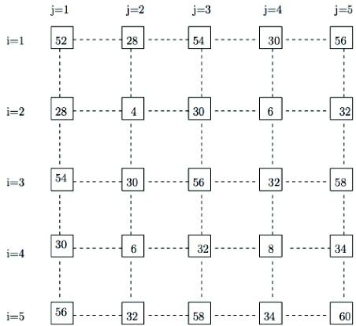

## Exploring the search space: local search

- This local search technique is sometimes referred to as "hill climbing"

- The local search stops when we find a maximum (or minimum in case we have a minimization problem)

- The "steepest" increase that we choose at given point does not necessarily lead to the global maximum

- We can get "stuck" in a local maximum, and hence find a sub-optimal solution

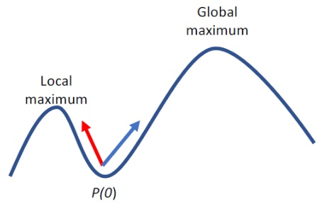

In this example: from the point P(0), the "steeper increase is in direction of the red arrow; but the global maximum is in direction of the blue arrow

## Exploring the search space: local search

- The result of the search is clearly dependent on the starting point (the initial "random" solution)

- So, where to start?

- A good choice is to iterate the whole algorithm many times (anyway a polynomial number) with different starting points and to output the best solution found across all searches

In our example, with k sequences of length n, we could run n iterations, which is still fast enough

- The success depends on the "shape" of the optimization function in the k-dimensional space

The more local maxima the lower chances to find the optimal solution

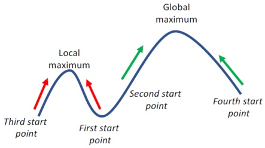

The chance of finding the global maximum (or at least a better local maximum) is increased by starting from different points and reporting the best solution across all searches

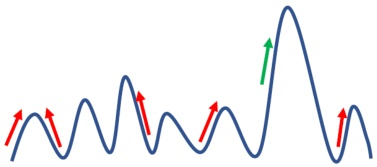

## Implementing a local search

- The rationale is clear, but there are a few implementation details that have to be specified:

How to choose the initial solution (initial alignment as starting point)?

★ Completely at random or according to some criterion?

How to process the strings (variables)?

★ In a specific order or in random order?

How to define the neighborhood for the next step?

- Easy for the 2D grid of the example; but for strings?

- Several different choices are possible

▶ If/when to stop the local search?

How many times to repeat the local search with a different starting point

## Binary variables:

In the simplest case the $k$ discrete variables $X_{1}, X_{2} \dots X_{k}$ are binary variables

The search space has in this case cardinality $2^{k}$ (number of candidate solutions)

NP-hard combinatorial optimization problems derived from real case applications can often be modeled with binary variables

Example of problems: MAX-CUT, MAX-3-SAT, (0-1) KNAPSACK, etc.

## MAX-CUT

"Famous" NP-hard problem for combinatorial optimization

- Given a graph $(V, E)$ , find the partition of the vertices/nodes into two subsets $V_{1}, V_{2}$ with $V_{1}\cup V_{2}=V$ such that the number of edges connecting one node of the first partition $V_{1}$ with one node of the second partition $V_{2}$ is maximized

- That is, the two node sets can be separated by "cutting" a maximum number of edges

- Thus, given k vertices, each solution can be described by k binary variables $X_{1}, X_{2} \dots X_{k}$ indicating to which of the two subsets $(V_{1}$ or $V_{2}$ each node belongs (search space of size $2^{k}!$

- $f \left( X_{1}, X_{2} \dots X_{k} \right)$ is the objective function to be optimized

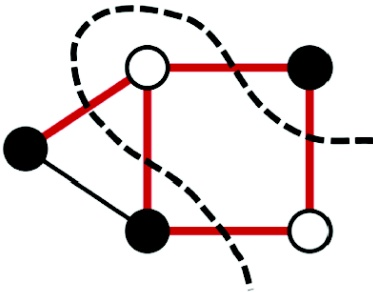

White/black corresponds to the two subsets in which the vertices have been partitioned

## MAX-CUT

- Initialization: random assignment of each binary variable $X_{i}$ (with probability = 0.5, like a coin toss)

- Variables are updated one by one, from $X_{1}$ to $X_{k}$

- Let $X_{i}=x_{i}$ be the current value of every variable $X_{i}$ - hence we are at point $\left(x_{1},x_{2},\ldots,x_{i},\ldots,x_{k}\right)$ of the search space

- The neighborhood is just one additional point: $\left( x_{1}, x_{2}, \dots , \overline{x_{i}}, \dots , x_{k} \right)$ where $\overline{x_{i}}=0$ if $x_{i}=1$ and $\overline{x_{i}}=1$ if $x_{i}=0$ (logical NOT of the current value)

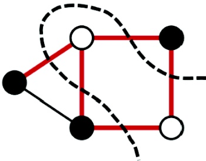

White/black corresponds to the two subsets in which the vertices have been partitioned

- If $f(x_{1}, x_{2}, \dots, \overline{x_{i}}, \dots, x_{k}) > f(x_{1}, x_{2}, \dots, x_{i}, \dots, x_{k})$, then we move to point $(x_{1}, x_{2}, \dots, \overline{x_{i}}, \dots, x_{k})$, which becomes the new current solution

- This is repeated over all the variables $X_{i}$ until a complete cycle over all the variables is completed without any improvement of the solution

## Local search for the local MSA problem

Problem:

- Input: k strings of length n

- The local alignment is formed of substrings of length $w$

- In this case a solution to the problem is an assignment of values between 1 and $( n-w+1 )$ to $k$ discrete variables $X_{1}, X_{2} \dots X_{k}$

- We start with an initial solution $P (0)$ to the problem, either by choosing one random substring per input sequence, or using some heuristic

Defining the neighborhood:

The usual approach is to select one dimension, to "fix" all other dimensions, and to consider all possible alternatives in the selected dimension as "neighborhood"

- Here: we select one $X_{i}=p_{i}$ (position of the chosen substring within the string i) and try—as neighborhood—all possible values ranging from 1 to $(n-w+1)$

- For our problem this means:

Select an $X_{i}$ (a variable to be updated)

2 Remove the substring corresponding to $X_{i}$ from the current solution

For each $j \in[1,n-w+1]$ , compute the IC score by setting $X_{i}=j$ (inserting the corresponding substring) and leaving all other variables (substrings) unchanged

Choose $j$ such that $X_{j} = j$ corresponds to the profile with the highest IC score

5 Adjust the alignment accordingly and select the next $X_{i}$ to update

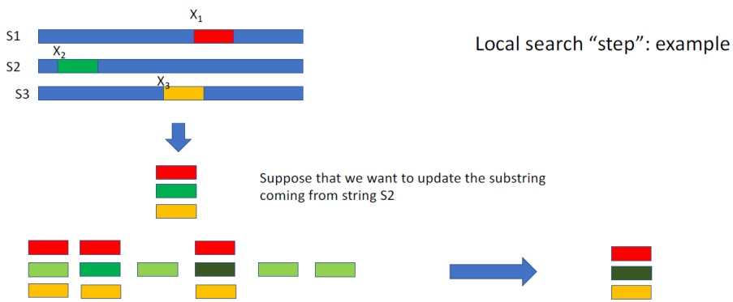

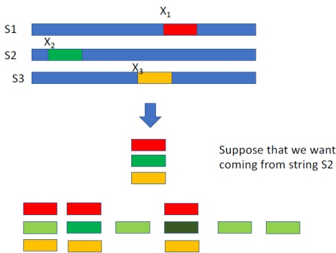

We remove it from the profile, replacing it with every other substring of S2 and evaluating the profile resulting from each. We replace it with the one yielding the highest IC score

New profile, containing a different string from S2 with higher IC score with respect to the starting one

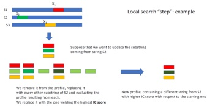

## Defining iterations:

In general, we want one "cycle" of steps to update each of the k variables which define a potential solution

- For our problem there are two possible choices:

Process the variables $X_{i}$ in order from 1 to $k$

2 Process the variables in a random order, using a different random permutation at each cycle

- In practice, there is no big difference in the results for our problem, but for some other problems the "randomized" version is to be preferred

- Using the "random" permutation implies that we might get different results even when starting from the same initial point

- The algorithm will stop at a local maximum in a finite number of steps, where for a full cycle (of all variables) no improvement is obtained

- To be iterated several times with different starting profiles (to increase the chance of finding the global maximum)

## Improving the local search

Local search is "deterministic", it always chooses the best alternative for improving the current solution

- The major problem of this approach: the existence of (possibly too many) local maxima in which we can get "stuck"

- Can we overcome this problem?

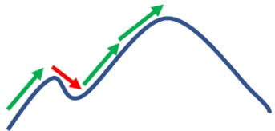

The idea is to make the choice of "non optimal" steps (the one in red) in order to overcome local maxima Whether these steps can be accepted or not it is governed by a random choice

## Solution: "stochastic optimization"

(not to be confused with "randomized algorithms"!)

- Transform the deterministic algorithm into a stochastic algorithm (stochastic search!)

Take into consideration also sub-optimal alternatives

Given different choices, choose a solution at random but with the probability being influenced by the change in the objective function (e.g., the higher the score increase, the higher the probability to choose the solution)

## Stochastic search

Example: stochastic search for binary variables

$X_{1}, X_{2} \dots X_{k}$ are binary variables

- At step i, we compare the value $X_{i}$ with the logical NOT of its current value (as with MAX-CUT)

- Compute $\Delta f=f\left(x_{1},x_{2},\dots,\overline{x_{i}},\dots,x_{k}\right)-f\left(x_{1},x_{2},\dots,x_{i},\dots,x_{k}\right);$ we have two possible results:

The update improves the solution, i.e., $\Delta f > 0$ , then move to the new solution

If not, i.e., $\Delta f\leq0$ , we might anyway choose to move and update the solution

For $\Delta f\leq0$ , accept the change and update the current solution with probability

$$
P [ \text {u p d a t e} X _ {i} ] = e ^ {\frac {\Delta f}{T}} \quad \text {w i t h} \Delta f \leq 0
$$

where $T$ is a parameter that allows for "fine tuning" the degree of randomness:

- Larger $T \Rightarrow$ smaller exponent $\Rightarrow$ higher probability to accept the negative change

- Smaller $T \Rightarrow$ higher exponent $\Rightarrow$ lower probability to accept the negative change

$\star$ For $T \rightarrow 0$, the algorithm becomes deterministic ($P[\textit{update } X_{i}]\rightarrow 0)$

## ▶ That is, the algorithm makes a

That is, the algorithm makes a random choice whose probability is determined by "how bad" the move to the sub-optimal solution is

The bigger the (negative) change $\Delta f < 0$ , the lower the probability of accepting it

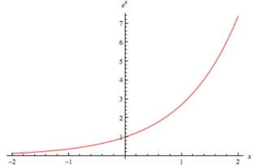

## Stochastic search

$$
P [ \text {u p d a t e} X _ {i} ] = e ^ {\frac {\Delta f}{T}}
$$

We have additional options to alter the behavior of the algorithm, for example:

- The value for $T$ can be dynamically changed during the execution of the algorithm (see, for example, the Wikipedia page for "simulated annealing $^{1}$ and the long list of "related methods" at the end of that page)

We can start with a high value (high randomness) and decrease it at each iteration (ultimately lowering it to zero), thus making the algorithm more and more deterministic (see graph to the right for an example)

- $T$ represents the "temperature": the higher the temperature, the more randomness (in analogy to the kinetic energy of molecules)

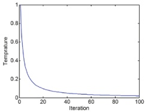

- When it cools down (more deterministic), the "movement" due to kinetic energy slows, until it is finally "cold" and the system stops at the nearest local maximum

## Stochastic search: Gibbs sampling

Let's apply a stochastic search to the local multiple alignment problem:

- We have $k$ variables $X_{1},\dots X_{k}$ defining, as a possible solution, the substrings' starting points in the original input strings

- At step t, we choose to replace the value of variable $X_{i}$

- We evaluate all the possible values (starting positions) $p_{j}$ that the variable can assume

- Local search would always choose the best $p_{j}$ (the one that yields the maximum value of the IC score by inserting the corresponding substring in the profile)

- Here, the situation is more complex than for binary variables, since we will have substrings other than the best $p_{j}$ which ...

either yield some improvement of the IC score, but not as much as the best $p_{j}$

or make the IC score worse (to different extend) with respect to the previous value

- Compute the $IC(p_{i})$ score for each possible $p_{i}$, i.e., each possible substring for $X_{i}$

- Compute $IC(S_{i}) = \sum_{j=1}^{n-w+1} IC(p_{j})$, the total sum of the ICs for all possible substrings for $X_{i}$ — that is, over the whole string $S_{i}$

- We accept a new value for variable $X_{i}$ with a random choice of probability

$$
P r \left[ X _ {i} = p _ {j} \right] = \frac {I C \left(p _ {j}\right)}{I C \left(S _ {i}\right)}
$$

## Stochastic search: Gibbs sampling

- We accept a new value for variable $X_{i}$ with a random choice of probability

$$
P r \left[ X _ {i} = p _ {j} \right] = \frac {I C \left(p _ {j}\right)}{I C \left(S _ {i}\right)}
$$

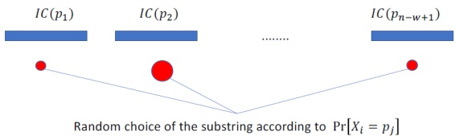

- This strategy is known as "Gibbs sampling": $^{2}$

First developed in statistics but adapted to the local MSA problem

In this case, the algorithm remains "stochastic" over time (probabilities don't get dynamically flattened as in the case of simulated annealing), so there is no guarantee that it will converge to a local maximum and stop

It will stop if a complete cycle of updates always rejected the update

Or, more commonly, after a fixed number of iterations, reporting the best solution found along the way (not necessarily the last one, which could be worse)

Bajrai L.H. et al (2016) Saudi Moumouvirus, the First Group B Mimivirus Isolated from Asia Frontiers in Microbiology 7:2029

Kullback S., Leibler R.A. (1951)

On information and sufficiency

Annals of Mathematical Statistics 22(1):79-86

Shannon C.E. (1948)

A Mathematical Theory of Communication

Bell Systems Technical Journal 27(3):379-423 and 27(4):623-666