# Bioinformatics Algorithms Hidden Markov Models for sequence modeling and pattern mining

Rosario M. Piro

Dipartimento di Elettronica, Informazione e Bioingegneria (DEIB)

Politecnico di Milano

(most slides taken or adapted from: Manolis Kellis, MIT / Broad Institute)

TATTGAATTTTCAAAAATTCTTACTTTTTTTTTTGGATGGACGCAAAGAAGTTTAATAATCATATTACATGGCATTACCCATATATA

ATCCATATCTACTTACTTATATGTTGTGGAAATGTAAAGGCCCCATTATTCTAGCITAAAAAACCTTCTCTTTGGAACTTTT

AATACGCTTAACTGCTCATTGCTATATTGAAGTACGGATTAGAAGCCGCCGAGCGGGCGACAGCCCTCCGACGGAAGACTCTCCTCGCGTCCTCGTCTTCACCGGTCGCGTTTCCTGAAACGCAGATGTGCCTCGCGCCGCACTGCTCCGAACAATAAAGATTCTACAATACTTTTATGGTATTAGAGGAAAATTGGCAGTAACCTGGCCCCACAAACCTCAAATTAACGACAAATAACAACCAGGATATGCGATTAGTTTTTTTAGCCTTATTTCTGGGGTAATTAATCAGCGAAGCGATGATTTTTGATCTATTAACAGATATATAAATGGAACT

## Genes

Encode proteins

Regulatory motifs

Control

gene expression

TATTGAATTTTCAAAAATTCTTACTTTTTTTTTTGGATGAAGCGCAAAGAAGTTTAATAATCATATTACATGGCATTACCACCATATA

ATCCATATCTAATCTTACTTTACTTATGTTGTGGAAATGTAAAGGCCCCATTATTCTAGCCTAAAAAACCTTCTCTTTGGAACTATA

AATACGCTTAACTGCTCATTGCTATATTGAAGTACGGATTAGAAGCCGCCGAGCGGGCGACAGCCCTCCGACGGAAGACTCTCCTC

GCGTCCTCGTCTTCACCGGTGCGCTTCCTGAAACGCAGATGTGCCTCGCGCCGCACTGCTCCGAACAATAAAGATTCTACAATACT

TTTTATGGTTATGAAGGAGGAAAATTGGCGTAACCTGCCCACAAACCTCAAATTAACAACATAGGATAT

ATGCGATTAGTTTTTTTAGCCTTATTTCTGGGGTAATTAATCAGCGAAGCGATGATTTTTGATCTATTAACAGATATATAAATGGAA

CTGCATAACCACTTTAACTAATACTTTCAACATTTTCAGTTGTATTACTTCTTATCAAATGTCATAAAAGTATCAACAAAAAAT

TAATATACCTCTATACTTTAACGTCAAGGAGAAAAAACATAATGACTAAATCTCATCAGAAGAAGTGATTGTACCTGAGTTCAA

TAGCGCAAAGGAATTACCAAGACCATTGGCCGAAAAGTGCCCGAGCATAATTAAGAAATTTATAAGCGCTTATGATGCTAAACCGG

TTGTTGCTAGATCGCCTGGTAGAGTCAATCTAATTGGTGAACATATTGATTATTGTGACTTCTCGGTTTACCTTTAGCTATTGAT

GATATGCTTTGCGCCGTCAAAGTTTGCCAGTGCTCCTCTGGCCGGGCTGCAAGTCTTCTGTGAGGGTGATGTACCA

CGATTTGCCGTTGGACGGTTCTTATGTCACAATTGATCCTTCTGTGTCGGACTGGTCTAATTACTTTAAATGTGGTCTCCATGTTG

ACTCTTTTCTAAAGAAACTTGCACCGGAAAGGTTGCCAGTGCTCCTCTGGCCGGGCTGCAAGTCTTCTGTGAGGGTGATGTACCA

GGCAGTGGTGTCTTCTTCGGCCGCATCATTTGGTGCCGTTGCTTAGCTTGGTTAAAGCGAATGGGCCCTGGTTATCATCA

CAAGCAAAATTTAATGCGTATTACGGTCGTTGCAGAACATTATGTTGGTGTTAACAATGGCGGTATGGATCAGGCTGCCTCTGTTT

GTGAGGAAGATCATGCTCTATACGTTGAGTTCAAAACGCAGTTGAAGGCTACTCCGTTTAAATTTCCGCAATTAAAAAACCATGAA

AGCTTTGTTATTGCGAACACCCTTGTTGTATCTAACAAGTTTGAAACGCCCGAACCACTATAATTAAGTGGTAGAAGTCAC

AGCTGCAAATGTTTTAGCTGCCACGTACGGTGTTGTTTTACTTTCTGGAAAAGAAGGATCGAGCACGAATAAAGGTATCTAAGAG

TCATGAACGTTTATTATGCCAGATATCACAACATTTCCACACCCTGGAACGGCGATATTGAATCCGGCATCGAACGGTTAACAAAG

CTAGTACTAGTTGAAGAGTCTCTCGCCAATAAGAAACAGGCTTTAGTGTTGACGATATGTCGCACAATCCTTGAATTGTTCTCGCGA

ATTCACAAGAGACTTACTAACAACATCTCCAGTGAGATTTCAAGTCTTAAAGCTATCAGAGGGCTAAGCATGTGTATTCTGAAT

TAAGAGTCTTGAAGGCTGTGAAATTAATGACTACAGCGAGCTTTACTGCCGACGAAGACTTTTTCAAGCAATTTGGTGCCTTGATG

GAGTCTCAAGCTTCTTGCGATAAACTTTACGAATGTTCTTGTCCAGAGATTGACAAAATTTGTTCCATTGCTTTGTCAAATGGATC

TGGTTCCCGTTGACCGGAGCTGGCTGGGGTGGTTGTACTGTGTTCACTTTGGTTCCAGGGGGCCCAAATGGCAACATAGAAAAGGTA

AAGCCCTTGCCAATGAGTTCTACAAGGTCAAGTACCCTAAGATCACTGATGCTGAGCTAGAAAATGCTATCATCGTCTCTAAACCA

TGGGCAGCTGTCTATAGTATACTTCTTTTTTTTACTTTGTTCAGAACAACTTCTCATTTTTTCTACTCATAACT

GCATCACAAAATACGCAATAACAACGAGTAGAACACTTTATAGTTCATACGCTTCAACTACTTAATAAATGATTGTATGATA

TTTTCAATGTAAGAGATTTCGATTATCCACAAACTTTAAAACACAGGGACAAAATCTTGATATGCTTTCAACCGCTGCGTTTTGC

CCTATTCTTGACATGATATGACTACCATTTGTTATTGTACGTGGGGCAGTGACGTCTTATCATATGTCAAAGTCATTGCGAAG

TTGGCAAGTTGCCAACTGACGAGATGCAGTAAAAAGAGTGCCGTCTTGAAACTTTTTGTCCTTTTTTTTTCCGGGGACTCTAC

AACCCTTTGTCCTACTGATTAATTTTGTACTGAATTTGGACAATTCAGATTTTAGTAGACGAAGCGCGAGGAGGAAAAGAAATGACA

AAATTCCGATGGACAAGAAGATAGGAAAAAAAAAGCTTTCACCGATTTTCCTAGACCGGAAAAAGTCGTATGACATCAGAATGA

ATTTCAAGTTAGACAAGGACAAAATCAGGACAAATGTAAAGATATATAAAATCTATTGATTCAGCGCCAATTTGCCCTTTTCCA

TCCATTAAATCTCTCTTCTTACTTATATGATGATTAGGTATCATCTGTATAAAACTCCTTCTTAATTTCACTCTCTAAAGCAT

CCATAGAGAAGATCTTTTCGGTTCGAAGACATTTCCTACGCATAATAAAGAATAGGAGGGAATAATGCCAGACAATCTATCATTACATT

GCGCTCTTCAAAAAGATTGAACTCTCGCCAACTTATGGAATCTTCCAATGAGACCTTGCGCCAAATATGTGGATTTGGAAAAA

TATAAGTCATCTCAGAGTAATATAACTACCGAAGTTTATGAGGCATCGAGCTTTGAAGAAAAAGTAAGCTCAGAAAAACCTCAAAT

CTCATTCTGGAAGAAAATCTATTATGAATATGTGGTCGTTGACGAAATCAATCTTGGGTGTTTCTATTCTGGATTCATTTATGTACA

AGGACTTGAAGCCCGTCGAAAAAGAAAGGCGGGTGGTTGTCCTGGTACATTTGGTTACTTTCTGGCTTTCTGGCTTAGATGTTTATCAATC

ACTTGGCAAATTGCAGCTACAGGTCTACAACTGGGTCTAAATTGGTGGCAGTGTTGGATAACAATTTGGATTGGGTACGGTTTCGT

## Extracting signal from noise

AAAGAAGTTTTAATAATCATATTACATACGGCATTACCACCATATA

CCCCATTATTCTTAGCCTAAAAAAAACCTTCTCTTTGGACTAACTT

AGCCGCCGAGCGGGCGACAGCCCTCCGACGGAAGACTCTCCTC

CCTCGCGCCGCACTCTCCGCAACAATAAAGATTCTACAATACT

ACAAACCTTCAACTGTAACGAATCAAATTAACAACACCATAGGATG

Extracting signal from noise

AGCCGCCGACGGCGGACAGCCCTCCGACGGAAGACTCTCCTC

CCTCGCGCCGCACTGCTCCGGAACAATAAAGCTTACAATACTC

ACAAACCTTCAAATTAACGAATCAAATTAACAACCATAGGATG

ATGCGATTAGTTTTTTAGCCTTATTTCTGGGGTAATTAATCAGCGAAGCGATGATTTTTTGATCTATTAACAGATATATAAATGGAA

CTGCATAACCACTTTACTAATACTAATTTTCAACATTTTCAGTTTATGTTACTTCTTATCAATGTCATAACTATCAACAAAAAT

TAATATACCTCTATACTTTAACGTCAAGGAGAAAAACTATAATGACTAAATCTCATTCAGAAGAAGTGATTGTACCTGAGTTCAA

TAGCGCAAAGGAATTACCAAGACCATTGCCGAAAAGTGCCCGAGCATAATTAAGAAATTTATAAGCGCTATGATGCTAAACCGCT

TTGTTGCTAGATCGCCTGGTAGTCAATCTAATTGGTGAACATATTGATTATTGTACTTCTCGTTTACCTTTAGCTATTGAT

GATATGCTTTGCGCCGTCAAAGTTTTTGAACGAGAAAAATCCATCCATTACCTTAATAAATGCTGATCCCAAATTTGCTCAAAGGAA

CGATTTGCCGTTGGACGGTCTTTATGTCACAATTGATCCTTCTGTGTCGGACTGGTCTAATTACTTTAAATGTGGTCTCCATGTTC

ACTCTTTTCTAAAGAAACTTGCACCGGAAAGGTTTGCCAGTGCTCCTCTGGCCGGGCTGCAAGTCTTCTGTGAGGGTATGTACCA

GGCAGTGGATTGTCTTCTTCGCCGCGCATTCATTTGTGCCGTTGCTTTAGCTGTTGTTTAAAGCGAATATGGGCCCTGGTTATCATAT

CAAGCAAAATTAATGCGATTACGGTCGTTGCAGAACATTATGTTGGTGTTAACAATGCGGTATGGATCAGGCTGCCTCTGTTT

GTGAGGAAGATATCATGCTCTATACGTTGAGTTCAAACCGCTAGTAAGGCTACTCCGTTTAAATTTCCGCAATTAAAAAACCAATGAA

AGCTGCAAATGTTTTAGCTGCCACGTACGGTGTTGTTTTACTTTCTGGAAAAGAAGGATCGAGCACGAATAAAGGTAATCTAAGAC

TCATGAACGTTTATTATGCCAGATATCACAACATTTCCACACCCTGGAACGGCGATATTGAATCCGGCATCGAACGGTTAACAAAG

CTAGTAGTTAGTTGAGCTCTCTCGCCAATAAGAAACAGGGCTTAGTGTTGACGATCGCACAATCCTTGAATTGTTCTCGCGA

ATTTCACAAGAGACTACTTAACAACATCTCCAGTGAGATTTCAAGTCTTAAAGCTATATCAGAGGGCTAAGCATGTGTATTCTGAAT

TAAGAGTCTTGAAGGCTGTGAAATTAATGACTACAGCGAGCTTTACTGCCGACGAAGACTTTTTCAAGCAATTTGGTGCCTTGATG

GAGTCTCAAGCTTCTTGCGATAAACTTTACGAATGTTTGTCCAGAGATGACAAAATGTTCCGATTGCTTTGATGATCGAATGGT

TGGTTCCCGTTTGACCGGAGCTGGCTGGGGTGGTTGTACTGTTCACTTGGTTCCAGGGGGCCCAAATGGCAACATAGAAAAGGTAA

AAGCCCTTGCCAATGAGTTCTACAAGGTCAAGTACCCTAAGATCACTGATGCTGAGCTAGAAAATGCTATCATCGTCTCTAAACCA

TTGGGCAGCTGTGCCAATGAGTTCTACAAGGTCAAGTACCCTAAGATCACTGATGCTGAGCTAGAAAATGCTATCATCGTCTCTAAACCA

GCATCACAAAATACGCAATAATAACGAGTAGTAACACTTTTATAGTTCATACATGCTTCAACTACTTAATAAATGATTGTATGATA

TTTTCAATGTGAAGAGATTTCGATTATCCACAAACTTTAAAACACAGGGACAAAATCTTGATATGCTTTCAACCGCTGCGTTTTTGCG

CCTATTTGACATGATATGACTACCATTTGTTATTGTACGTGGGGCAGTGACGTCTTATCATATGTCATGCAATCATTGCGAAT

TTGGCAAGTTGCCAACTGACGAGATGCAGTAAAAAGAGATTGCCGTCTTGAAACTTTTTTGTCCTTTTTTTTTCCGGGGACTCTAC

AACCCTTTGTCCTACTGATTAATTTTGTACTGAAATTGGACAATTCAGATTTTAGTAGACAAGCGCGAGGAGGAAAAGAAATGACA

AAATTCCGATGGACAAGAAGATAGGAAAAAAAAAGCTTCACCGATTCCTAGACCGGAAAAAGTCGTATGACATCAGAAATGA

ATTTTCAAGTTAGACAAGGACAAAATCAGGACAAATTGTAAAGATATAATAAACTATTTGATTCAGCGCCAATTTGCCCTTTTTCCA

TCCATTAAATCTCTGTTTCTCTTACTTATATGATGATAGGTATCATCTGTATAAAAACTCCTTCTTAATATTCACTCTCTAAAGCAT

CCATAGAGAAGATTCCTCGGTTCGAAGACATTCCTACGCATATAAGAATGAGGAGGAATAATGCCAGACAATCTGATCATTACATT

GCGGCTCTTCAAAAAGATTGAACTCTCGCCAACTTATGGAATCTTCCAATGAGACCTTTGCGCCCAAATAATGTGGATTTGGAAAAA

TATAAGTCATCTCAGAGTAATATAACTACCGAAGTTTATGAGGCATCGAGCTTTGAAGAAAAAGTAAGCTCAGAAAAACCTCAATA

CTCATTCTGGAAGGAAATCTATTATGAATATGTGGTCGTTGACAAATCAATCTTGGGTGTTTCTATTCTGGATTCATTTATGTACA

AGGACTTGAAGCCCGTCGAAAAAAGAAAGGCGGGTTGGTCCTGGTACAATTATTGGTTACTTCTCTGGCTTGCTGAATGTTTATCAATC

ACTTGGCAAATTGCAGCTACAGGTCTACAACTGGGTCTAAATTGGTGGCAGTGTTGGATAACAATTTGGATTGGGTACGGTTTCGT

# Modeling DNA sequences

## ...GTACTCACCGGGTTACAGGATTATGGGTTACAGGTAACCGTT...

What can we do with a big unlabelled chunk of DNA (e.g., parts of a newly sequenced genome) ?

- Align it

to things we don't know about (assembly)

to things we know about (database search; e.g., known genes from related species, metagenomics)

## Analyze it's properties

Non-standard nucleotide composition?

Interesting k-mer frequencies?

Recurrent patterns?

- Model it

Make some hypotheses about it

- Build a 'generative model' to describe it

Find sequences of similar type (in terms of characteristics)

## → How do we model DNA sequences?

## Modeling DNA sequences

## Another more familiar example:

An alignment profile/motif is a model for a specific DNA pattern (e.g., a binding site)!

Once defined the model, we can employ it to find other instances of the pattern in new sequences

Do some regions in the new sequences "fit the model" well?

- Compute overall probabilities for regions based on the frequencies (=probabilities) of individual symbols in the motif!

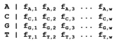

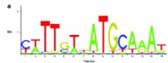

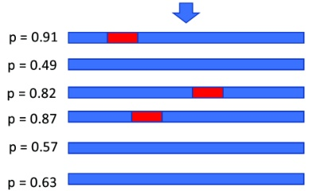

## Modeling DNA sequences

Drawback of modeling sequences by means of profiles/motifs:

- Like in the motif, all other instances of the pattern are assumed to have the same length w

This works well only for certain cases, e.g., transcription factor binding sites

How can we build a sequence model for more general cases, i.e., to model and find interesting genomic regions of variable length?

- Examples of functionally relevant regions of variable length:

★ CpG islands (contain a high frequency of C followed by G)

- Protein-coding genes (different numbers of exons and variable exon length!)

★ ...

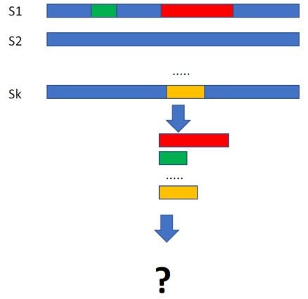

## Modeling DNA sequences

Example: difficulty of modeling and finding protein-coding genes

- The coding region starts with "ATG", has a length that is a multiple of 3 (codons), and ends with a stop codon—either "TGA", "TAA" or "TAG"

The total length can be very different

- The coding regions are usually interrupted by intronic regions which are spliced out!

- Since genes can encode for very different proteins, we can expect no sequence similarity at all (apart from the start and stop codons)

Can we still build a model for this and use it to identify new genes in the genome?

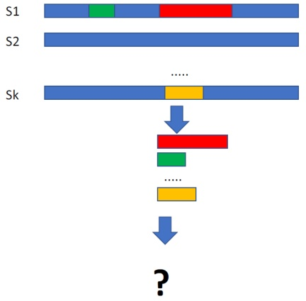

## Modeling biological sequences with HMMs

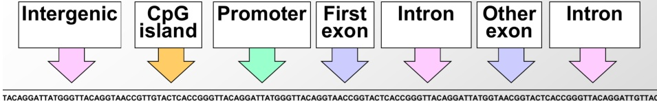

## Goals of sequence modeling:

- Ability to emit (or generate) DNA sequences of a certain type (e.g., simulate promoters)

Not exact alignment to previously known gene, promoter, etc.

Preserving 'properties' of type, not identical sequence

## Ability to recognize DNA sequences of a certain type (state!)

What (hidden) state is most likely to have generated an observation?

- Find a set of states and transitions that generated a long sequence

## Ability to learn distinguishing characteristics of each state

Training our generative models on large datasets

- Learn to classify unlabelled data

## Markov Chains and Hidden Markov Models

Why probabilistic sequence modeling?

- Biological data is noisy

- Probability provides a calculus for manipulating models

- Not limited to yes/no answers - can provide "degrees of belief"

- Many common computational tools are based on probabilistic models

- Our tools: Markov Chains and Hidden Markov Models (HMMs)!

## Andrey Andreyevich Markov

1856-1922

- Russian mathematician, known for his work on stochastic processes

"Markov" chains were the primary subject of his research

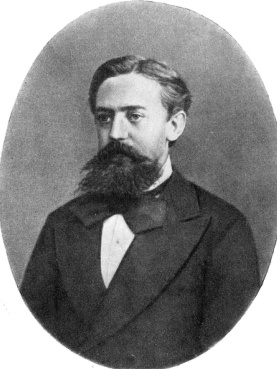

(Image from Wikipedia; public domain)

## Markov Chains and Hidden Markov Models

The general idea (more details later):

## Markov Chain

- A sequence of data items (e.g., sequence of symbols/letters) is generated by a model (can be described by a graph) which has:

- one "state" (node) per symbol/letter, and

★ certain transition probabilities (weighted edges) between the states

## Hidden Markov Model (HMM)

- The model transitions between different states like in a Markov Chains

- But: the states are not directly observable ("hidden")!

- Instead: each state has associated emission probabilities to generate certain observable data items (symbols)

- That is: the observed sequence of data items was generated by the model transition through different states which are, however, not directly observable

★ The set of hidden states is usually not identical/equivalent to the set of emitted symbols/letters!

- In other words: we don't know in which state the model is in, we only observe which characters the model is emitting!

## Predicting tomorrow's weather

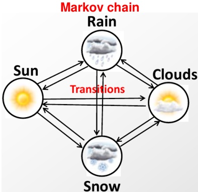

- What you see is what you get (states are directly observed)

- Next state only depends on current state (no memory!)

Hidden Markov Model (HMM)

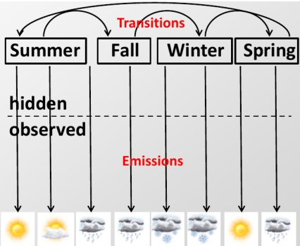

- Hidden state (e.g., season, storm system) determines probabilities of observations (e.g., weather)

- State transitions are governed by a Markov chain

## HMM nomenclature for this course

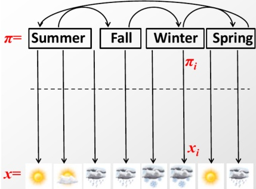

Transitions: $a_{kl}=P(\pi_{i}=I|\pi_{i-1}=k)$

- Transition probability from hidden state k to hidden state I

Emissions: $e_{k}\left(x_{i}\right)=P\left(x_{i}|\pi_{i}=k\right)$

- Emission probability of symbol $x_{i}$ when the hidden state is $k$

- Vector $\pi = (\pi_{1},\pi_{2},\dots)$ : hidden path (sequence of hidden states of a set $\Sigma$ )

- Vector $x = (x_{1}, x_{2}, \dots)$: sequence of observations of a set $V$ of $m$ symbols

- Transition matrix $A= \left( a_{k l} \right)$ : probability of $k \to I$ state transitions

- Emission vector $E_{k} = \left(e_{k}\left(v_{1}\right),\dots,e_{k}\left(v_{m}\right)\right)$: prob. of observing the possible observable letters $v_{j}\in V$ from state $k$

- Emission matrix: contains emission probabilities for all states

- Bayes' rule: use $P \left( x_{i} \mid \pi_{i}=k \right)$ to estimate $P \left( \pi_{i}=k \mid x_{i} \right)$

## Components of a Markov chain

Definition: A Markov chain is a triplet $(Q,p,A)$, where:

- $Q$ is a finite set of states; each state corresponds to a symbol in the alphabet $\Sigma$

- p is a vector of initial state probabilities

- $A$ is the matrix of state transition probabilities, denoted by $a_{kl}$ for each $k, l \in Q$

- For each $k, l \in Q$ the transition probability is: $a_{kl} \equiv P(x_i = l | x_{i-1} = k)$

Output: The output of the model is the state at each instant time (path) $\rightarrow$ the states are directly observable

Property: The probability of each observed symbol $x_{i}$ (= state $q\in Q$ at time step i) depends only on the value of the preceding symbol $x_{i-1}$ :

$$
P \left(x _ {i} \mid x _ {i - 1}, \dots , x _ {1}\right) = P \left(x _ {i} \mid x _ {i - 1}\right)
$$

- In other words: transition probabilities to the next state depend only on the current state, not on the previous path that led to it (no memory)!

Formula: The probability of observing a specific sequence $x$ of length $L$ is:

$$
P (x) = P \left(x _ {L}, x _ {L - 1}, \dots , x _ {1}\right) = P \left(x _ {L} \mid x _ {L - 1}\right) \times P \left(x _ {L - 1} \mid x _ {L - 2}\right) \times \dots \times P \left(x _ {2} \mid x _ {1}\right) \times P \left(x _ {1}\right)
$$

where $P \left( x_{1} \right)$ is the initial state probability of $x_{1}$

## Components of a Hidden Markov Model (HMM)

Definition: An HMM is a 5-tuple (Q,V,p,A,E), where:

- $Q$ is a finite set of states $q_{n}$; $|Q| = N$

- $V$ is a finite set of observable symbols $v_{m}; |V| = M$

- p is a vector of initial state probabilities

- $A$ is the matrix of state transition probabilities, denoted by $a_{kl}$ for each $k, I \in Q$

- For each $k, I \in Q$ the transition probability is: $a_{kl} \equiv P(x_i = I|x_{i-1} = k)$

- $E$ is an $N\times M$ emission probability matrix,

$e_{nm}\equiv P(x_{i}=v_{m}\in V$ at step $i|\pi_{i}=q_{n}\in Q)$

Note: $e_{nm}$ does not depend on the time step i, i.e., emission probabilities of the symbols $v_{m}\in V$ depend only on the states $q_{n}\in Q$ and don't change over time!

Output: Only emitted symbols from V are observable by the system but not the underlying random walk between states from $Q \rightarrow$ "hidden"!

Property: Both emissions and transitions are dependent on the current state only and not on the past (no memory)!

(additional slide credit: Serafim Batzoglou)

## HMM: hidden path and emissions

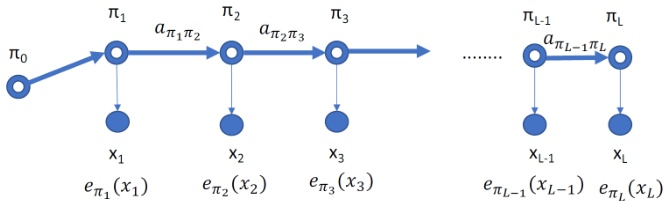

A typical representation of a process which can be modeled by an HMM:

- Start: a random initial state $\pi_{1} \in Q$ according to the initial state probabilities $p$

Note: in this depiction, state $\pi_{0}$ represents a sort of "null" state before the process starts; the transition from $\pi_{0}$ or $\pi_{1}$ represents the choice of the first/initial state $(\pi_{1})$

- The random choice to move from the current (hidden) state $\pi_{i-1}=k\in Q$ to the next (hidden) state $\pi_{i}=I\in Q$ depends on transition probabilities $a_{kl}$

- The set of possible random choices also includes $k \rightarrow k$; so if $a_{kk} \neq 0$, it is possible that $\pi_i = \pi_{i-1}$, i.e., the system remains in the same state

- For each step $i$ of the hidden path, the hidden state $\pi_{i}$ randomly emits an observable symbol $x_{i} \in V$ according to the emission probabilities $e_{\pi_{i}} \left( x_{i} \right)$

For example, let the current hidden state be "summer"; this defines the probabilities of observing different weather: "sun", "clouds", "rain", "snow", ...

For the hidden state "winter", instead, the same weather "symbols" can be observed, but with significantly different "emission" probabilities!

## The six algorithmic settings for HMMs One path All paths

<table border="1"><tr><td>1. Scoring x, one path
P(x,π)
Prob of a path, emissions</td><td>2. Scoring x, all paths
P(x)=∑πP(x,π)
Prob of emissions, over all paths</td></tr><tr><td>3. Viterbi decoding
$\pi^{*}=\operatorname{argmax}_{\pi}P(x,\pi)$
Most likely path</td><td>4. Posterior decoding
$\pi^{\wedge}=\left\{\pi_{i}|\pi_{i}=\operatorname{argmax}_{k}\sum_{\pi}P(\pi_{i}=k|x)\right.$
Path containing the most likely state at any time point.</td></tr><tr><td>5. Supervised learning, given $\pi$
$\Lambda^{*}=\operatorname{argmax}_{\Lambda}P(x,\pi|\Lambda)$
6. Unsupervised learning.
$\Lambda^{*}=\operatorname{argmax}_{\Lambda}\max_{\pi}P(x,\pi|\Lambda)$
Viterbi training, best path</td><td>6. Unsupervised learning
$\Lambda^{*}=\operatorname{argmax}_{\Lambda}\sum_{\pi}P(x,\pi|\Lambda)$
Baum-Welch training, over all paths</td></tr></table>

Baum-Welch training, over all paths

## Examples of HMMs

The dishonest casino

The dishonest genome

... (and many more)

## Example: the dishonest casino

A hypothetical casino has two dice:

- Fair die $D_{F}$ :

$$
P (1) = P (2) = P (3) = P (4) = P (5) = P (6) = 1 / 6
$$

- Loaded (unfair) die $D_{L}$ :

$$
P (1) = P (2) = P (3) = P (4) = P (5) = 1 / 1 0
$$

$$
P (6) = 1 / 2
$$

Casino player switches between fair and loaded die on average once every 20 turns, i.e., $P \left( D_{F}\rightarrow D_{L}\right)=P \left( D_{L}\rightarrow D_{F}\right)=1/20$

$$
[ \text {T h u s}: P \left(D _ {F} \rightarrow D _ {F}\right) = P \left(D _ {L} \rightarrow D _ {L}\right) = 1 9 / 2 0 ]
$$

Game:

1 You bet $1

2 You roll (always with a fair die)

Casino player rolls (maybe with a fair die, maybe with a loaded die)

4 Highest number wins $2

(additional slide credit: Serafim Batzoglou)

## The dishonest casino model

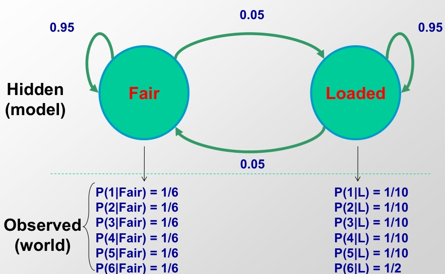

Slide credit: Serafim Batzoglou

## The dishonest genome model

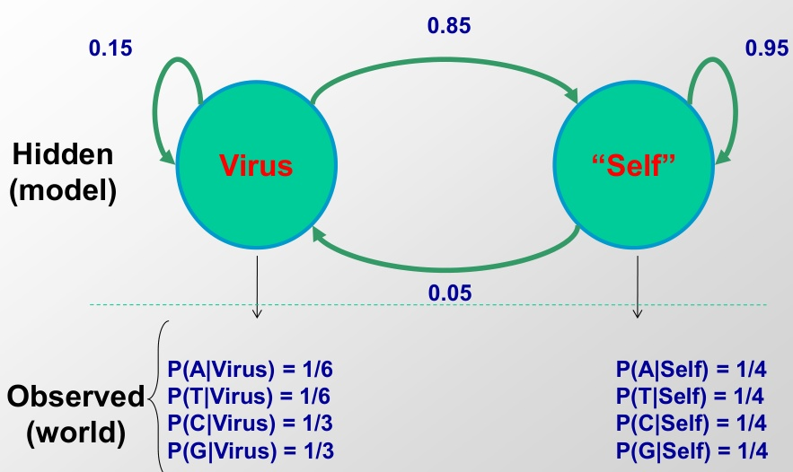

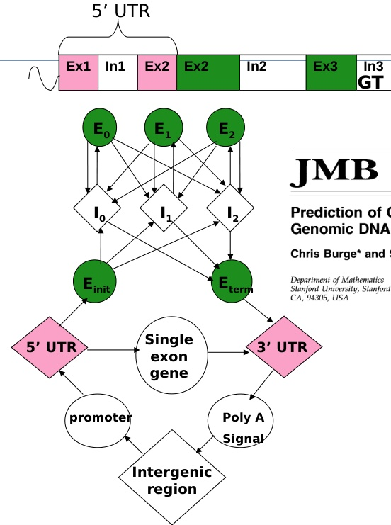

# Prediction of Complete Gene Structures in Human Genomic DNA

Chris Burge* and Samuel Karlin

We introduce a general probabilistic model of the gene structure of human genomic sequences which incorporates descriptions of the basic transcriptional, translational and splicing signals, as well as length distributions and compositional features of exons, introns and intergenic regions. Distinct sets of model parameters are derived to account for the many substantial differences in gene density and structure observed in distinct C + G compositional regions of the human genome. In addition, new models of the donor and acceptor splice signals are described which capture potentially important dependencies between signal positions. The model is applied to the problem of gene identification in a computer program, GENSCAN, which identifies complete exon/intron structures of genes in genomic DNA. Novel features of the program include the ca-

GENSCAN (Burge & Karlin)

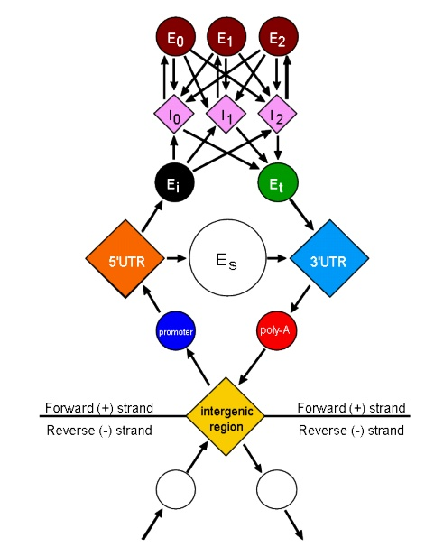

<table><tr><td>62001</td><td>AGGACAGGTA CGGCTGTCAT CACTTAGACC TCACCCTGTG GAGCCACACC</td></tr><tr><td>62051</td><td>CTAGGGTTGG CCAATCTACT CCCAGGCAAG GGAGGGCGG GAGCAGGGCG</td></tr><tr><td>62015</td><td>TGGCATAAA AGTCAGGCG GAGCCATGTA TTGCTTACAT TTGCTTCTGA</td></tr><tr><td>62051</td><td>CACAACTGTC TTCACTAGC ACCTCAAACG GACAC</td></tr><tr><td>62021</td><td></td></tr><tr><td></td><td></td><td>GTP TGGTATCAAG GTTACAAGAC</td></tr><tr><td>62051</td><td>AGGTTTAAGG AGACCAATAG AAACTGGGCA TGTGGAGACA GAGAAGCTC</td></tr><tr><td>62015</td><td>TTGGGTTTCT GATAGGCACT GACTCTCTCT GCCTATTGGT CTATTTTCCC</td></tr><tr><td>62051</td><td>ACCCTTAAC TATAGGCACT GACTCTCTCT GCCTATTGGT CTATTTTCCC</td></tr><tr><td>62051</td><td>TTGCTTTAAC TATAGGCACT GACTCTCTCT GCCTATTGGT CTATTTTCCC</td></tr><tr><td>62051</td><td>AGCTTATCT GGAAAAGTG GGTGCCGTG TTAGTGATCG CATGGCGTA</td></tr><tr><td>62051</td><td>TGTGTAATCT GGAAAAGTG GGTGCCGTG TTAGTGATCG CATGGCGTA</td></tr><tr><td>62051</td><td>GAACTTAC TTGAAACCTG GGTGCCGTG TTAGTGATCG CATGGCGTA</td></tr><tr><td>62051</td><td>GAACTTAC TTGAAACCTG GGTGCCGTG TTAGTGATCG CATGGCGTA</td></tr><tr><td>62051</td><td>GATGTTTTCT TTCCCCTTCT TTTCTATGGT TAAGTTCATG TCATAGGAAG</td></tr><tr><td>62051</td><td>GGGAGAAGT ACAGGGTACA GTTTAGAATG GGAAACAGAC GAATGATTGC</td></tr><tr><td>62051</td><td>ATCAGTAGT GAGATACAT TAAGTCTTT AAAAAAAAAC TACAACAGT</td></tr><tr><td>62051</td><td>CTGCCTAGTA CATTACTATT TGGAATATAT GTGTGCTTAT TTGCATATTC</td></tr><tr><td>62051</td><td>ATAATCTCCC TACTTTATT TGCTTTATT TTAATTGATA CATAATCAT</td></tr><tr><td>62051</td><td>ATACATATT ATGGGTAAA GTGTAATTT TTAATGTATC TACAATCAT</td></tr><tr><td>62051</td><td>GACCAAATCA GGGTAATTT GCATTTGTAA TTTAAAAAA TGCTTTCTC</td></tr><tr><td>62051</td><td>TTTTAATTCAG CTTTTTGTAT TATCTATTA CTAATCTCT CCTACTCAT</td></tr><tr><td>62051</td><td>TTTCTTTCAG GGGAATAA ATACATTA TCAATCTCT CTGCACTCAT</td></tr><tr><td>62051</td><td>CTAAAGAATA ACAGTGATAA TTTCTGGGTT AAGGATAGA CAATATTCT</td></tr><tr><td>62051</td><td>CATATAAAT ATTCTGATAA ATAAATGTAA ACTGATGCTG GAGGTTTCAT</td></tr><tr><td>62051</td><td>ATTGCTAAAT GCAGCTACA TCCAGTACC ACTGCTTAT TATTTTCA</td></tr><tr><td>62051</td><td>TTGGGATAAG GCTGGATTAT TCTGAGTCC AGCTAGGCCC TTTGCTAAT</td></tr><tr><td>62051</td><td>CATGTCATA CGCTCTATCT TCCTCCCA GCTCTGGGC AACGTGCTC</td></tr><tr><td>62051</td><td>TCTGTGTACG GGCCATCAC TTTGCCAA GATTCAACCC TAGCACGTC</td></tr><tr><td>62051</td><td>GCTGCCTATC AGAAAGTGTG GGCTGTGTG GGTCCCAGT TGGCCAGC</td></tr><tr><td>62051</td><td>GTATCACTAA GCTCGCTTC TGGTGTGGG ATTCTATTA AAGGCTTC</td></tr><tr><td>62051</td><td>TGTTCGTACT GTCCACTC TAACTGTGGG GATATTATCA AGGCCCTCA</td></tr><tr><td>62051</td><td>GCATCTGGAT TCTGCCA AAT AAAAAACAT TTTATTCATT GCAATGATGT</td></tr></table>

## Examples of HMMs for genome annotation

<table border="1"><tr><td>Application</td><td>Detection of GC-rich regions</td><td>Detection of conserved regions</td><td>Detection of protein-coding exons</td><td>Detection of protein-coding conservation</td><td>Detection of protein-coding gene structures</td><td>Detection of chromatin states</td></tr><tr><td>Topology/Transitions</td><td>2 states,different nucleotide composition</td><td>2 states,different conservation levels</td><td>2 states,different tri-nucleotide composition</td><td>2 states,different evolutionary signatures</td><td>~20 states,different composition/conservation,specific structure</td><td>40 states,different chromatin mark combinations</td></tr><tr><td>Hidden States/Annotation</td><td>GC-rich/AT-rich</td><td>Conserved/non-conserved</td><td>Coding exon/non-coding(intron or intergenic)</td><td>Coding exon/non-coding(intron or intergenic)</td><td>First/last/middle coding exon,UTRs,intron1/2/3,intergenic,*(+/-strand)</td><td>Enhancer/promoter/transcribed/repressed/repetitive</td></tr><tr><td>Emissions/Observations</td><td>Nucleotides</td><td>Level of conservation</td><td>Triplets of nucleotides</td><td>Nucleotide triplets,conservation levels</td><td>Codons,nucleotides,splice sites,start/stop codons</td><td>Vector of chromatin mark frequencies</td></tr></table>

## Running the model: Probability of a sequence

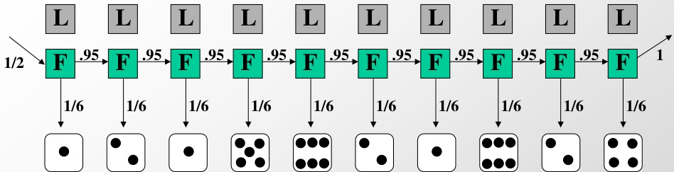

What is the joint probability of observing x and a specific path $\pi$:

$\pi =$ Fair, Fair, Fair, Fair, Fair, Fair, Fair, Fair, Fair, Fair and rolls

x = 1, 2, 1, 5, 6, 2, 1, 6, 2, 4 Joined probability P(x, $\pi$ )=P(x| $\pi$ )P( $\pi$ )=P(emissions|path)$^{*}$ P(path)

$$
\begin{array}{l} p = \frac {1}{2} \times P (1 \mid \text {F a i r}) P \left(\text {F a i r} _ {i + 1} \mid \text {F a i r} _ {i}\right) P (2 \mid \text {F a i r}) P (\text {F a i r} \mid \text {F a i r}) \dots P (4 \mid \text {F a i r}) \\ = \frac {1}{2} \times (1 / 6) ^ {1 0} \times (0. 9 5) ^ {9} \\ = 5. 2 \times 1 0 ^ {- 9} \\ \mathrm {W h y i s p s o s m a l l ?} \\ \end{array}
$$

Slide credit: Serafim Batzoglou

## Running the model: Probability of a sequence

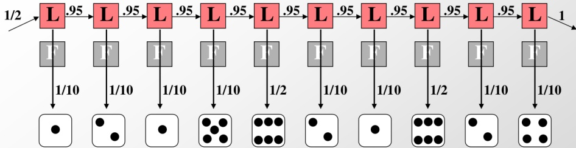

What is the likelihood of

$\pi =$ Load, Load, Load, Load, Load, Load, Load, Load, Load, Loaded and rolls

$$
x = 1, 2, 1, 5, 6, 2, 1, 6, 2, 4
$$

emission

emission

$$
p = 1 / 2 \times P (1 \mid \text {L o a d}) P \left(\text {L o a d} _ {i + 1} \mid \text {L o a d} _ {i}\right) P (2 \mid \text {L o a d}) P (\text {L o a d} | \text {L o a d}) \dots P (4 \mid \text {L o a d})
$$

$$
= \frac {1}{2} \times (1 / 1 0) ^ {8} \times (1 / 2) ^ {2} (0. 9 5) ^ {9}
$$

$$
= 7. 9 \times 1 0 ^ {- 1 0}
$$

Compare the two!

## Comparing the two paths

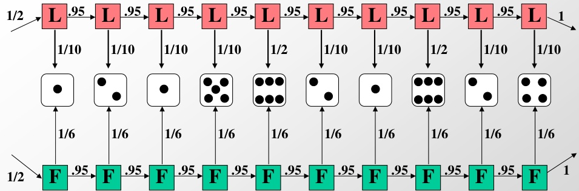

Two sequence paths:

$$
P (x, \text {a l l - F a i r}) = 5. 2 \times 1 0 ^ {- 9} \quad (\text {v e r y s m a l l})
$$

$$
P (x, \text {a l l - L o a d e d}) = 7. 9 \times 1 0 ^ {- 1 0} \quad (\text {v e r y v e r y s m a l l})
$$

Likelihood ratio:

P( x, all-Fair ) is 6.59 times more likely than P( x, all-Loaded )

It is 6.59 times more likely that the die is fair all the way, than loaded all the way.

## What about partial runs and die switching

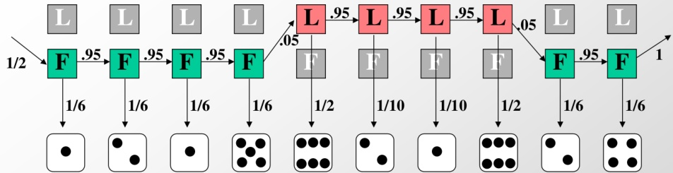

What is the likelihood of

$\pi =$ Fair, Fair, Fair, Fair, Load, Load, Load, Fair, Fair and rolls

$$
\begin{array}{l} x = 1, 2, 1, 5, 6, 2, 1, 6, 2, 4 \\ \mathrm {e m i s s i o n} \quad \mathrm {t r a n s i t i o n} \quad \mathrm {e m i s s i o n} \quad \mathrm {t r a n s i t i o n} \quad \mathrm {e m i s s i o n} \\ p = 1 \frac {1}{2} \times P (1 \mid \text {F a i r}) P \left(\text {F a i r} _ {\mathrm {i} + 1} \mid \text {F a i r} _ {\mathrm {i}}\right) P (2 \mid \text {F a i r}) P (\text {F a i r} \mid \text {F a i r}) \dots P (4 \mid \text {F a i r}) \\ = 1 \frac {1}{2} \times (1 / 1 0) ^ {2} \times (1 / 2) ^ {2} \times (1 / 6) ^ {6} \times (0. 9 5) ^ {7} \times (0. 0 5) ^ {2} \\ = 4. 7 \times 1 0 ^ {- 1 1} \\ \end{array}
$$

Much less likely, due to high cost of transitions

## Model comparison

Let the sequence of rolls be: x=1,6,6,5,6,2,6,6,3,6

Now, what is the likelihood $\pi = F$ F, ..., F? $\frac{1}{2}\times(1/6)^{10}\times(0.95)^{9}=0.5\times 10^{-9}$ , same as before

What is the likelihood $\pi = L, L, \dots, L?$ $\frac{1}{2}\times(1/10)^{4}\times(1/2)^{6}(0.95)^{9}=0.5\times 10^{-7}$

So, it is 100 times more likely the die is loaded

Model evaluation

## The six algorithmic settings for HMMs One path All paths

<table border="1"><tr><td>Learning</td><td>1. Scoring x, one pathP(x,π)Prob of a path, emissions</td><td>2. Scoring x, all pathsP(x)=∑πP(x,π)Prob of emissions, over all paths</td></tr><tr><td>Learning</td><td>3. Viterbi decoding$\pi^{*}=\operatorname{argmax}_{\pi}P(x,\pi)$Most likely path</td><td>4. Posterior decoding$\pi^{*}=\{\pi_{i}|\pi_{i}=\operatorname{argmax}_{k}\sum_{\pi}P(\pi_{i}=k|x)$Path containing the most likely state at any time point.</td></tr><tr><td>Learning</td><td>5. Supervised learning, given $\pi\Lambda^{*}=\operatorname{argmax}_{\Lambda}P(x,\pi|\Lambda)$6. Unsupervised learning.$\Lambda^{*}=\operatorname{argmax}_{\Lambda}\max_{\pi}P(x,\pi|\Lambda)$Viterbi training, best path</td><td>6. Unsupervised learning$\Lambda^{*}=\operatorname{argmax}_{\Lambda}\sum_{\pi}P(x,\pi|\Lambda)$Baum-Welch training, over all paths</td></tr></table>

## 3. DECODING: What was the sequence of hidden states?

Given: Model parameters $e_{i} (.), a_{ij}$

Given: Sequence of emissions x

Find: Sequence of hidden states $\pi$

## Finding the optimal path

- We can now evaluate any path through hidden states, given the emitted sequences

- How do we find the best path?

- Optimal substructure! Best path through a given state is:

- Best path to previous state

- Best transition from previous state to this state

- Best path to the end state

## Viterbi algorithm

- Define $V_{k} ( i ) =$ Probability of the most likely path through state $\pi_{i}=k$

- Compute $\mathrm{V}_{\mathrm{k}}(\mathrm{i}+1)$ as a function of $\max_{k^{\prime}} \{ \mathrm{V}_{\mathrm{k}}^{\prime}(\mathrm{i}) \}$

$$
- V _ {k} (i + 1) = e _ {k} \left(x _ {i + 1}\right) ^ {*} \max _ {j} a _ {j k} V _ {j} (i)
$$

Dynamic Programming

## Finding the most likely path

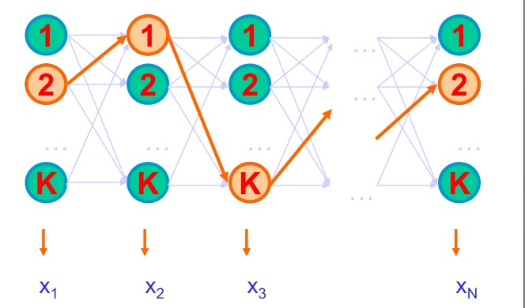

- Find path $\pi^{*}$ that maximizes total joint probability P[x, $\pi$]

$$
\cdot \mathrm {P} (\mathrm {x}, \pi) = \bigcirc_ {\mathrm {s t a r t}} a _ {0 \pi_ {1}} ^ {*} \prod_ {\mathrm {e m i s s i o n}} e _ {\pi_ {\mathrm {i}}} \left(\mathrm {x} _ {\mathrm {i}}\right) \times \bigcirc_ {\mathrm {t r a n s i t i o n}} a _ {\pi_ {\mathrm {i}} \pi_ {\mathrm {i} + 1}}
$$

## Calculate maximum P(x, $\pi$ ) recursively

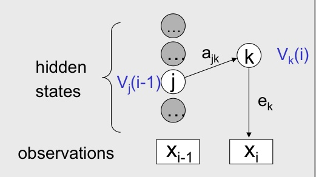

- Assume we know $V_{i}$ for the previous time step (i-1)

- Calculate

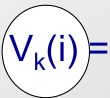

current max

this emission

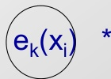

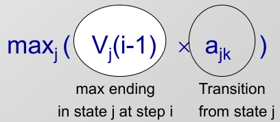

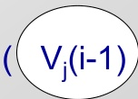

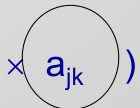

all possible previous states j

## The Viterbi Algorithm

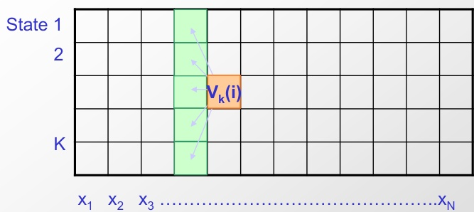

Input: x = x1...xN

## Initialization:

$V_{0}(0)=1$ $V_{k}(0)=0$ , for all k>0

## Iteration:

$$
V _ {k} (i) = e _ {K} \left(x _ {i}\right) \times \max _ {j} a _ {j k} V _ {j} (i - 1)
$$

## Termination:

$$
P \left(x, \pi^ {*}\right) = \max _ {k} V _ {k} (N)
$$

Slide credit: Serafim Batzoglou

## Traceback:

Follow max pointers back Similar to aligning states to seq

In practice Use log scores for computation

## Running time and space:

Time: O(K $^{2}$ N)

Space: O(KN)

## Viterbi: example

<table border="1"><tr><td>Step</td><td>1</td><td>2</td><td>3</td><td>4</td><td>5</td></tr><tr><td>Emission</td><td>G</td><td>C</td><td>G</td><td>A</td><td>T</td></tr><tr><td>State V=Virus</td><td>Vs(1)=0.5*0.33=0.165</td><td></td><td></td><td></td><td></td></tr><tr><td>State S=&quot;Self&quot;</td><td>Vs(1)=0.5*0.25=0.125</td><td></td><td></td><td></td><td></td></tr></table>

Assume the following initial state probabilities (from "null" to V or S):

Initialization (Step i=0):

That is, at the beginning we are in a "null" state, not in V or S!

Iterative procedure:

Step i=1: fill column 1

$$
\cdot V _ {v} (1) = e _ {V} \left(^ {\prime} G ^ {\prime}\right) \times a _ {0 V} V _ {0} (0) = 0. 3 3 \times 0. 5 * 1 = 0. 1 6 5
$$

$$
\cdot V _ {S} (1) = e _ {S} \left(^ {\prime} G ^ {\prime}\right) \times a _ {0 S} V _ {0} (0) = 0. 2 5 \times 0. 5 * 1 = 0. 1 2 5
$$

## Viterbi: example

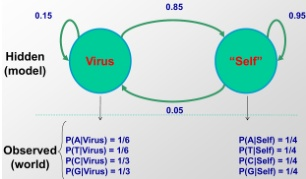

<table><tr><td>Step</td><td>1</td><td>2</td><td>3</td><td>4</td><td>5</td></tr><tr><td>Emission</td><td>G</td><td>C</td><td>G</td><td>A</td><td>T</td></tr><tr><td>State V=Virus</td><td>Vs(1)=0.5*0.33=0.165</td><td>Vs(2)=0.33*0.15*Vs(1)=8.1*103</td><td>Vs(3)=0.33*0.05*Vs(2)=5.8*104</td><td></td><td></td></tr><tr><td>State S=&quot;Self&quot;</td><td>Vs(1)=0.5*0.25=0.125</td><td>Vs(2)=0.25*0.85*Vs(1)=3.5*102</td><td>Vs(3)=0.25*0.95*Vs(2)=8.3*103</td><td></td><td></td></tr></table>

Iterative procedure:

Step i=2: fill column 2

$$
\begin{array}{l} V _ {V} (2) = e _ {V} \left(^ {\prime} C ^ {\prime}\right) \times \max \left(a _ {V V} * V _ {V} (1), a _ {S V} * V _ {S} (1)\right) \\ = 0. 3 3 \times \max \left(0. 1 5 * 0. 1 6 5, 0. 0 5 * 0. 1 2 5\right) = 8. 1 7 * 1 0 ^ {- 3} (\max : V \text {a t} i = 1!) \\ \end{array}
$$

$$
\begin{array}{l} V _ {S} (2) = e _ {S} \left(^ {\prime} C ^ {\prime}\right) \times \max \left(a _ {V S} * V _ {V} (1), a _ {S S} * V _ {S} (1)\right) \\ = 0. 2 5 \times \max \left(0. 8 5 * 0. 1 6 5, 0. 9 5 * 0. 1 2 5\right) = 3. 5 * 1 0 ^ {- 2} (\max : V \text {a t} i = 1!) \\ \end{array}
$$

Step i=3: fill column 3

$$
\begin{array}{l} V _ {v} (3) = e _ {V} \left(^ {\prime} G ^ {\prime}\right) \times \max \left(a _ {V V} * V _ {V} (2), a _ {S V} * V _ {S} (2)\right) \\ = 0. 3 3 \times \max \left(0. 1 5 * 8. 1 7 * 1 0 ^ {- 3}, 0. 0 5 * 3. 5 * 1 0 ^ {- 2}\right) = 5. 8 * 1 0 ^ {- 4} (\max : S \text {a t} i = 2!) \\ \end{array}
$$

$$
\begin{array}{l} V _ {S} (3) = e _ {S} \left(^ {\prime} G ^ {\prime}\right) \times \max \left(a _ {V S} * V _ {V} (2), a _ {S S} * V _ {S} (2)\right) \\ = 0. 2 5 \times \max \left(0. 8 5 * 8. 1 7 * 1 0 ^ {- 3}, 0. 9 5 * 3. 5 * 1 0 ^ {- 2}\right) = 8. 3 * 1 0 ^ {- 3} (\max : S \text {a t} i = 2!) \\ \end{array}
$$

## Viterbi: example

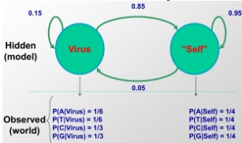

<table border="1"><tr><td>Step</td><td>1</td><td>2</td><td>3</td><td>4</td><td>5</td></tr><tr><td>Emission</td><td>G</td><td>C</td><td>G</td><td>A</td><td>T</td></tr><tr><td>StateV=Virus</td><td>V1(1)=0.5*0.33=0.165</td><td>V2(2)=0.33*0.15*V1(1)=8.1*103</td><td>V3(3)=0.33*0.05*V2(2)=5.8*104</td><td>V4(4)=0.17*0.05*V3(3)=7.1*105</td><td>V5(5)=0.17*0.05*V4(3)=1.7*105</td></tr><tr><td>StateS=&quot;Self&quot;</td><td>V1(1)=0.5*0.25=0.125</td><td>V2(2)=0.25*0.85*V1(1)=3.5*102</td><td>V3(3)=0.25*0.95*V2(2)=8.3*103</td><td>V4(4)=0.25*0.95*V3(3)=2.0*103</td><td>V5(5)=0.25*0.95*V4(3)=4.8*103</td></tr></table>

Iterative procedure:

Step i=4: fill column 4

$$
\begin{array}{l} V _ {V} (4) = e _ {V} \left(^ {\prime} A ^ {\prime}\right) \times \max \left(a _ {V V} * V _ {V} (3), a _ {S V} * V _ {S} (3)\right) \\ = 0. 1 7 \times \max \left(0. 1 5 * 5. 8 * 1 0 ^ {- 4}, 0. 0 5 * 8. 3 * 1 0 ^ {- 3}\right) = 7. 1 * 1 0 ^ {- 5} (\max : S \text {a t} i = 3!) \\ \end{array}
$$

$$
\begin{array}{l} V _ {S} (4) = e _ {S} \left(^ {\prime} A ^ {\prime}\right) \times \max \left(a _ {V S} * V _ {V} (3), a _ {S S} * V _ {S} (3)\right) \\ = 0. 2 5 \times \max \left(0. 8 5 * 5. 8 * 1 0 ^ {- 4}, 0. 9 5 * 8. 3 * 1 0 ^ {- 3}\right) = 2. 0 * 1 0 ^ {- 3} (\max : S \text {a t} i = 3!) \\ \end{array}
$$

Step i=5: fill column 5

$$
\begin{array}{l} V _ {V} (5) = e _ {V} \left(^ {\prime} T ^ {\prime}\right) \times \max \left(a _ {V V} * V _ {V} (4), a _ {S V} * V _ {S} (4)\right) \\ = 0. 1 7 \times \max \left(0. 1 5 * 7. 1 * 1 0 ^ {- 5}, 0. 0 5 * 2. 0 * 1 0 ^ {- 3}\right) = 1. 7 * 1 0 ^ {- 5} (\max : S \text {a t} i = 4!) \\ \end{array}
$$

$$
\begin{array}{l} V _ {S} (5) = e _ {S} \left(^ {\prime} T ^ {\prime}\right) \times \max \left(a _ {V S} * V _ {V} (4), a _ {S S} * V _ {S} (4)\right) \\ = 0. 2 5 \times \max \left(0. 8 5 * 7. 1 * 1 0 ^ {- 5}, 0. 9 5 * 2. 0 * 1 0 ^ {- 3}\right) = 4. 8 * 1 0 ^ {- 4} (\max : S \text {a t} i = 4!) \\ \end{array}
$$

Viterbi: example

<table border="1"><tr><td>Step</td><td>1</td><td>2</td><td>3</td><td>4</td><td>5</td></tr><tr><td>Emission</td><td>G</td><td>C</td><td>G</td><td>A</td><td>T</td></tr><tr><td>StateV=Virus</td><td>$V_{v}(1)=0.5*0.33=0.165$</td><td>$V_{v}(2)=0.33*0.15*V_{v}(1)=8.1*10^{-3}$</td><td>$V_{v}(3)=0.33*0.05*V_{s}(2)=5.8*10^{-4}$</td><td>$V_{v}(4)=0.17*0.05*V_{s}(3)=7.1*10^{-5}$</td><td>$V_{v}(5)=0.17*0.05*V_{s}(4)=1.7*10^{-5}$</td></tr><tr><td>StateS=&quot;Self&quot;</td><td>$V_{s}(1)=0.5*0.25=0.125$</td><td>$V_{s}(2)=0.25*0.85*V_{v}(1)=3.5*10^{-2}$</td><td>$V_{s}(3)=0.25*0.95*V_{s}(2)=8.3*10^{-3}$</td><td>$V_{s}(4)=0.25*0.95*V_{s}(3)=2.0*10^{-3}$</td><td>$V_{s}(5)=0.25*0.95*V_{s}(4)=4.8*10^{-4}$</td></tr></table>

The highest probability possible (= most likely path) at the last step (last column) is $4. 8 * 1 0^{-4}!$

Traceback:

- Step 5: S

- Step 4: S

- Step 3: S

Most likely path:

- Step 2: S

- Step 1: V

$$
\begin{array}{c c c c c c} V \rightarrow S \rightarrow S \rightarrow S \rightarrow S \\ \downarrow & \downarrow & \downarrow & \downarrow & \downarrow \\ G & C & G & A & T \end{array}
$$

## The six algorithmic settings for HMMs One path All paths

1. Scoring x, one path

<table border="1"><tr><td>1. Scoring x, one path
P(x,π)
Prob of a path, emissions</td><td>2. Scoring x, all paths
P(x)=∑πP(x,π)
Prob of emissions, over all paths</td></tr><tr><td>3. Viterbi decoding
$\pi^{*}=\operatorname{argmax}_{\pi}P(x,\pi)$
Most likely path</td><td>4. Posterior decoding
$\pi^{*}=\left\{\pi_{i}|\pi_{i}=\operatorname{argmax}_{k}\sum_{\pi}P(\pi_{i}=k|x)\right.$
Path containing the most likely state at any time point.</td></tr><tr><td>5. Supervised learning, given $\pi$
$\Lambda^{*}=\operatorname{argmax}_{\Lambda}P(x,\pi|\Lambda)$
6. Unsupervised learning.
$\Lambda^{*}=\operatorname{argmax}_{\Lambda}\max_{\pi}P(x,\pi|\Lambda)$
Viterbi training, best path</td><td>6. Unsupervised learning
$\Lambda^{*}=\operatorname{argmax}_{\Lambda}\sum_{\pi}P(x,\pi|\Lambda)$
Baum-Welch training, over all paths</td></tr></table>

2. Scoring x, all paths

## 2. EVALUATION (how well does our model capture the world)

Given: Model parameters $e_{i} (.), a_{ij}$

Given: Sequence of emissions x

Find: P(x|M), summed over all possible paths $\pi$

## Simple: Given the model, generate some sequence x

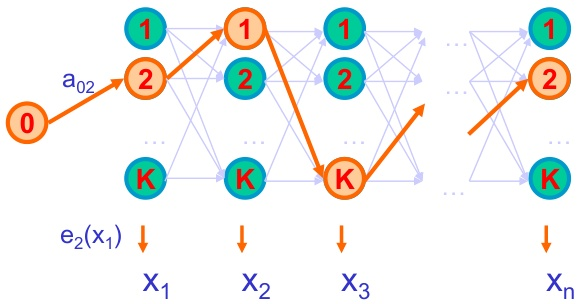

Given a HMM, we can generate a sequence of length n as follows:

1. Start at state $\pi_{1}$ according to prob a $_{0\pi1}$

2. Emit letter $x_{1}$ according to prob $e_{\pi 1} ( x_{1} )$

3. Go to state $\pi_{2}$ according to prob a $\pi_{1\pi 2}$

4. ... until emitting $x_{n}$

We have some sequence x that can be emitted by p. Can calculate its likelihood. However, in general, many different paths may emit this same sequence x. How do we find the total probability of generating a given x, over any path?

## Complex: Given x, was it generated by the model?

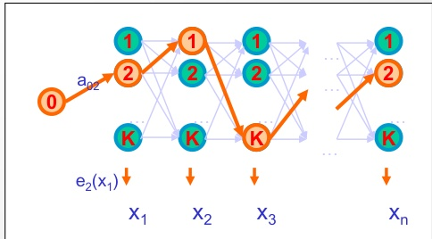

Given a sequence x,

What is the probability that x was generated by the model (using any path)?

$$
- P (x) = \sum_ {\pi} P (x, \pi) = \sum_ {\pi} P (x | \pi) P (\pi)
$$

- (weighted average of conditional probability, summed over all paths, weighted by each path's probability)

Challenge: exponential number of paths

## Calculate probability of emission over all paths

## Each path has associated probability

- Some paths are likely, others unlikely: sum them all up

- $\rightarrow$ Return total probability that emissions are observed, summed over all paths

- Viterbi path is the most likely one

- How much 'probability mass' does it contain?

## (cheap) alternative:

- Calculate probability over maximum (Viterbi) path $\pi^{*}$

- Good approximation if Viterbi has highest density

- BUT: incorrect

## (real) solution

- Calculate the exact sum iteratively

$$
\cdot P (x) = \sum_ {\pi} P (x, \pi)
$$

- Can use dynamic programming

## The Forward Algorithm - derivation

Define the forward probability:

$$
\begin{array}{l} f _ {i} (i) = P \left(x _ {1} \dots x _ {i}, \pi_ {i} = I\right) \\ = \Sigma_ {\pi 1 \dots \pi i - 1} P \left(x _ {1} \dots x _ {i - 1}, \pi_ {1}, \dots , \pi_ {i - 2}, \pi_ {i - 1}, \pi_ {i} = I\right) e _ {i} \left(x _ {i}\right) \\ = \Sigma_ {k} \boxed {\Sigma_ {\pi 1 \dots \pi i - 2} P \left(x _ {1} \dots x _ {i - 1}, \pi_ {1}, \dots , \pi_ {i - 2}, \pi_ {i - 1} = k\right)} a _ {k l} e _ {l} \left(x _ {i}\right) \\ = \Sigma_ {k} \boxed {f _ {k} (i - 1)} a _ {k l} e _ {l} \left(x _ {i}\right) \\ = e _ {l} \left(x _ {i}\right) \Sigma_ {k} \boxed {f _ {k} (i - 1)} a _ {k l} \\ \end{array}
$$

## Calculate total probability $\Sigma_{\pi} \mathrm{P}(\mathrm{x},\pi)$ recursively

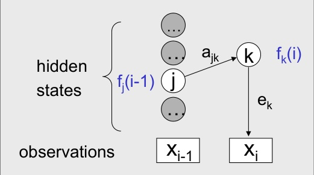

- Assume we know $f_{i}$ for the previous time step (i-1)

- Calculate

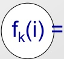

updated sum

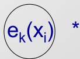

this emission

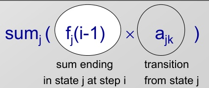

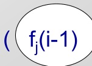

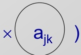

every possible previous state j

## The Forward Algorithm

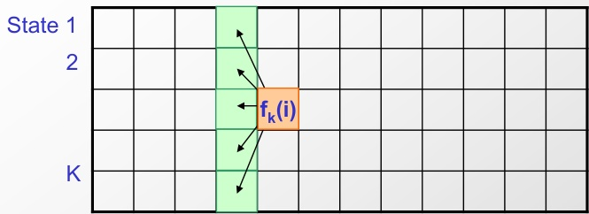

Input: x = x1...xN

## Initialization:

$f_{0}(0)=1$ $f_{k}(0)=0$ for all k>0

## Iteration:

$$
f _ {k} (i) = e _ {K} \left(x _ {i}\right) \times \sum_ {j} a _ {j k} f _ {j} (i - 1)
$$

## Termination:

$\rightarrow$ approximate $\exp(1+p+q)$

$$
P \left(x, \pi^ {*}\right) = \sum_ {k} f _ {k} (N)
$$

$\rightarrow$ scaling of probabilities

Sum of log scores is difficult

Slide credit: Serafim Batzoglou

## In practice:

## Running time and space:

Time: $\mathrm{O(K^{2}N)}$

Space: O(KN)

## The six algorithmic settings for HMMs One path All paths

<table border="1"><tr><td>1. Scoring x, one path
P(x,π)
Prob of a path, emissions</td><td>2. Scoring x, all paths
P(x)=∑πP(x,π)
Prob of emissions, over all paths</td></tr><tr><td>3. Viterbi decoding
$\pi^{*}=\operatorname{argmax}_{\pi}P(x,\pi)$
Most likely path</td><td>4. Posterior decoding
$\pi^{*}=\left\{\pi_{i}|\pi_{i}=\operatorname{argmax}_{k}\sum_{\pi}P(\pi_{i}=k|x)\right\}$
Path containing the most likely state at any time point.</td></tr><tr><td>5. Supervised learning, given $\pi$
$\Lambda^{*}=\operatorname{argmax}_{\Lambda}P(x,\pi|\Lambda)$
6. Unsupervised learning.
$\Lambda^{*}=\operatorname{argmax}_{\Lambda}\max_{\pi}P(x,\pi|\Lambda)$
Viterbi training, best path</td><td>6. Unsupervised learning
$\Lambda^{*}=\operatorname{argmax}_{\Lambda}\sum_{\pi}P(x,\pi|\Lambda)$
Baum-Welch training, over all paths</td></tr></table>

## Increasing the state space (remembering more)

HMM1: Promoters = only Cs and Gs matter HMM2: Promoters = it's actually CpGs that matter (di-nucleotides, remember previous nucleotide)

## Increasing the state of the system (looking back)

- Markov Models are memory-less

- In other words, all memory is encoded in the states

- To remember additional information, augment state

- A two-state HMM has minimal memory

  - Two states: GC-rich vs. equal probability

  - State, emissions, only depend on current state

  - Current state only encodes one previous nucleotide

- How do you count di-nucleotide frequencies?

- CpG islands: di-nucleotides

- Codon triplets: tri-nucleotides

- Di-codon frequencies: six nucleotides

Expanding the number of states

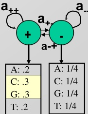

## Remember previous nucleotide: expand both states

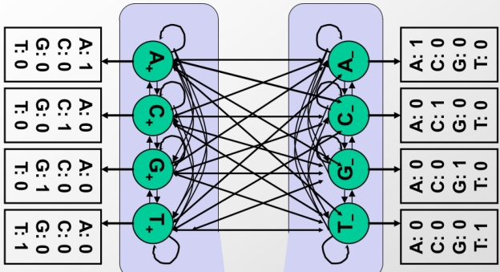

"Memory" of previous nucleotide is encoded in the current state.

GC-rich: 4 states Background: 4 states

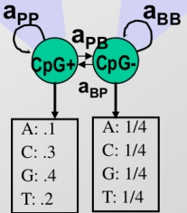

## HMM for CpG islands

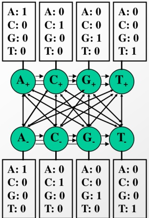

- A single model combines two Markov chains, each of four nucleotides:

- '+' states: $A_{+}, C_{+}, G_{+}, T_{+}$

- ‘-’ states: A_, C_, G_, T_

- Emit symbols: A, C, G, T in CpG islands

- Emit symbols: A, C, G, T in non-islands

mission probabilities distinct for the '+' and the '-' states

- Infer most likely set of states, giving rise to observed emissions

→ 'Paint' the sequence with + and - states

## Why we need so many states...

In our simple GC-content example, we only had 2 states (+|-)

Why do we need 8 states here: 4 CpG+ / 4 CpG- ?

Encode 'memory' of previous state: nucleotide transitions

## Training emission parameters for CpG+/CpG- states

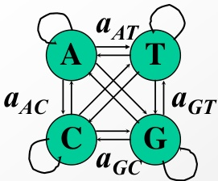

- Count di-nucleotide frequencies:

- 16 possible di-nucleotides. 16 transition parameters.

- Alternative: 16 states, each emitting di-nucleotide

- Derive two Markov chain models:

- '+' model: from the CpG islands

- ' - ' model: from the remainder of sequence

- Transition probabilities for each model:

- Encode differences in di-nucleotide frequencies

<table border="1"><tr><td>+</td><td>A</td><td>C</td><td>G</td><td>T</td></tr><tr><td>A</td><td>.180</td><td>.274</td><td>.426</td><td>.120</td></tr><tr><td>C</td><td>.171</td><td>.368</td><td>.274</td><td>.188</td></tr><tr><td>G</td><td>.161</td><td>.339</td><td>.375</td><td>.125</td></tr><tr><td>T</td><td>.079</td><td>.355</td><td>.384</td><td>.182</td></tr></table>

<table border="1"><tr><td>-</td><td>A</td><td>C</td><td>G</td><td>T</td></tr><tr><td>A</td><td>.300</td><td>.205</td><td>.285</td><td>.210</td></tr><tr><td>C</td><td>.322</td><td>.298</td><td>.078</td><td>.302</td></tr><tr><td>G</td><td>.248</td><td>.246</td><td>.298</td><td>.208</td></tr><tr><td>T</td><td>.177</td><td>.239</td><td>.292</td><td>.292</td></tr></table>

## Examples of HMMs for genome annotation

<table border="1"><tr><td>Detection of GC-rich regions</td><td>Detection of CpG-rich regions</td><td>Detection of conserved regions</td><td>Detection of protein-coding exons</td><td>Detection of protein-coding conservation</td><td>Detection of protein-coding gene structures</td><td>Detection of chromatin states</td></tr><tr><td>2 states, different nucleotide composition</td><td>8 states, 4 each +/-, different transition probabilities</td><td>2 states, different conservation levels</td><td>2 states, different tri-nucleotide composition</td><td>2 states, different evolutionary signatures</td><td>~20 states, different composition/conservation, specific structure</td><td>40 states, different chromatin mark combinations</td></tr><tr><td>GC-rich / AT-rich</td><td>CpG-rich / CpG-poor</td><td>Conserved / non-conserved</td><td>Coding exon / non-coding(intron or intergenic)</td><td>Coding exon / non-coding(intron or intergenic)</td><td>First/last/middle coding exon,UTRs,intron1/2/3,intergenic,*(+/-strand)</td><td>Enhancer/promoter/transcribed/repressed/repetitive</td></tr><tr><td>Nucleotides</td><td>Di-Nucleotides</td><td>Level of conservation</td><td>Triplets of nucleotides</td><td>64x64 matrix of codon substitution frequencies</td><td>Codons,nucleotides,splice sites,start/stop codons</td><td>Vector of chromatin mark frequencies</td></tr></table>

## HMM architecture matters: Protein-coding genes

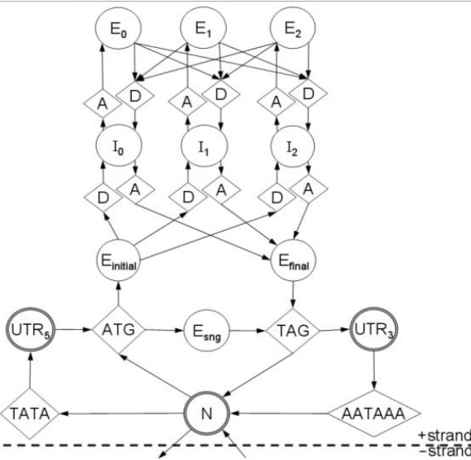

© Bill Majors / GeneZilla. All rights reserved. This content is excluded from our Creative Commons license. For more information, see http://ocw.mit.edu/help/qfa-fair-use/.

- Gene vs. Intergenic

- Start & Stop in/out

- UTR: 5' and 3' end

- Exons, Introns

- Remembering frame

- E0,E1,E2

- I0,I1,I2

- Sequence patterns to transition between states:

- ATG, TAG

Acceptor/Donor

TATA, AATAA

## One path

<table border="1"><tr><td colspan="2">One path</td><td colspan="2">All paths</td></tr><tr><td colspan="2">1. Scoring x, one pathP(x,π)Prob of a path, emissions</td><td colspan="2">2. Scoring x, all pathsP(x)=∑πP(x,π)Prob of emissions, over all paths</td></tr><tr><td colspan="2">3. Viterbi decoding$\pi^{*}=\operatorname{argmax}_{\pi}P(x,\pi)$Most likely path</td><td colspan="2">4. Posterior decoding$\pi^{*}=\{\pi_{i}|\pi_{i}=\operatorname{argmax}_{k}\sum_{\pi}P(\pi_{i}=k|x)\}$Path containing the most likely state at any time point.</td></tr><tr><td colspan="2">5. Supervised learning, given $\pi^{*}=\operatorname{argmax}_{\Lambda}P(x,\pi|\Lambda)$6. Unsupervised learning.$\Lambda^{*}=\operatorname{argmax}_{\Lambda}\max_{\pi}P(x,\pi|\Lambda)$Viterbi training, best path</td><td colspan="2">6. Unsupervised learning$\Lambda^{*}=\operatorname{argmax}_{\Lambda}\sum_{\pi}P(x,\pi|\Lambda)$Baum-Welch training, over all paths</td></tr></table>

## All paths

## 4. Decoding, all paths

Find the likelihood an emission $x_{i}$ is generated by a state

## Calculate most probable label at a single position

π:

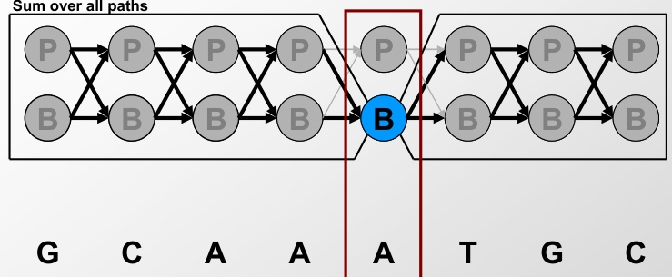

P(Label $_{i}=B|x)$

- Calculate most probable label, $L_{i}^{*}$ , at each position i

- Do this for all N positions gives us $\{L_{1}^{*},L_{2}^{*},L_{3}^{*}...L_{N}^{*} \}$

- How much information have we observed? Three settings:

- Observed nothing: Use prior information

- Observed only character at position i: Prior + emission probability

- Observed entire sequence: Posterior decoding

## Calculate P( $\pi_{7}=\mathrm{C p G}+|\mathrm{x}_{7}=\mathrm{G} )$

- With no knowledge (no characters)

- Simply time spent in markov chain states

- P( $\pi_{i}=k$ ) = most likely state (prior)

- With very little knowledge (just that character)

- Time spent, adjusted for different emission probs.

- Use Bayes rule to change inference directionality

$$
- P \left(\pi_ {i} = k \mid x _ {i} = G\right) = P \left(\pi_ {i} = k\right) ^ {*} P \left(x _ {i} = G \mid \pi_ {i} = k\right) / P \left(x _ {i} = G\right)
$$

- With knowledge of entire sequence (all characters)

$$
- P \left(\pi_ {i} = k \mid x = A G C G C G \dots G A T T A T C G T C G T A\right)
$$

- Sum over all paths that emit 'G' at position 7

Posterior decoding

## Motivation for the Backward Algorithm

We want to compute

$\mathrm{P}(\pi_{\mathrm{i}}=\mathrm{k} \mid \mathrm{x})$ , the probability distribution on the $\mathrm{i}^{\mathrm{th}}$ position, given x

We start by computing

$$
\begin{array}{l} P \left(\pi_ {i} = k, x\right) = P \left(x _ {1} \dots x _ {i}, \pi_ {i} = k, x _ {i + 1} \dots x _ {N}\right) \\ = P \left(x _ {1} \dots x _ {i}, \pi_ {i} = k\right) P \left(x _ {i + 1} \dots x _ {N} \mid x _ {1} \dots x _ {i}, \pi_ {i} = k\right) \\ = P \left(x _ {1} \dots x _ {i}, \pi_ {i} = k\right) P \left(x _ {i + 1} \dots x _ {N} \mid \pi_ {i} = k\right) \\ \end{array}
$$

Forward, $f_{k} ( \mathrm{i} )$

Backward, $b_{k} ( \mathrm{i} )$

## The Backward Algorithm - derivation

Define the backward probability:

$$
\begin{array}{l} b _ {k} (i) = P \left(x _ {i + 1} \dots x _ {N} \mid \pi_ {i} = k\right) \\ = \Sigma_ {\pi i + 1 \dots \pi N} P \left(x _ {i + 1}, x _ {i + 2}, \dots , x _ {N}, \pi_ {i + 1}, \dots , \pi_ {N} \mid \pi_ {i} = k\right) \\ = \Sigma_ {I} \Sigma_ {\pi i + 2 \dots \pi N} P \left(x _ {i + 1}, x _ {i + 2}, \dots , x _ {N}, \pi_ {i + 1} = I, \pi_ {i + 2}, \dots , \pi_ {N} \mid \pi_ {i} = k\right) \\ = \Sigma_ {I} e _ {i} \left(x _ {i + 1}\right) a _ {k l} \boxed {\Sigma_ {\pi i + 2 \dots \pi N} P \left(x _ {i + 2}, \dots , x _ {N}, \pi_ {i + 2}, \dots , \pi_ {N} \mid \pi_ {i + 1} = I\right)} \\ = \Sigma_ {I} e _ {i} \left(x _ {i + 1}\right) a _ {k l} \boxed {b _ {l} (i + 1)} \\ \end{array}
$$

## Calculate total end probability recursively

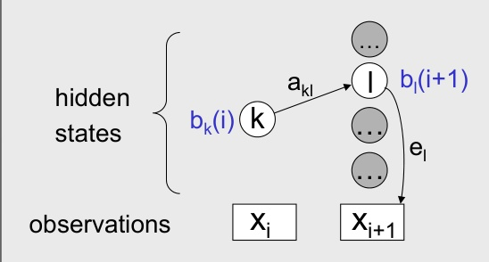

- Assume we know $b_{i}$ for the next time step (i+1)

- Calculate

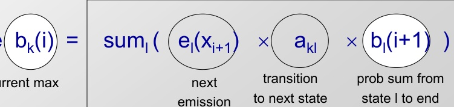

current max

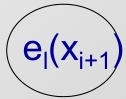

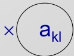

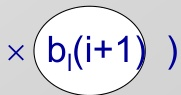

sum over all possible next states

## The Backward Algorithm

Input: x = x1...xN

## Initialization:

$b_{k} ( N )=a_{k 0}$ , for all k

## Iteration:

$$
b _ {k} (i) = \Sigma_ {l} e _ {l} \left(x _ {i + 1}\right) a _ {k l} b _ {l} (i + 1)
$$

## Termination:

$$
P (x) = \Sigma_ {1} a _ {0 1} e _ {1} \left(x _ {1}\right) b _ {1} (1)
$$

$\rightarrow$ scaling of probabilities

$\rightarrow$ approximate $\exp(1+p+q)$

Sum of log scores is difficult

## In practice:

## Running time and space:

Time: $\mathrm{O(K^{2}N)}$

Space: O(K)

## Putting it all together: Posterior decoding

- Probability that $i^{\mathrm{th}}$ state is k, given all emissions x

- Posterior decoding

- Find the most likely state at position i over all possible hidden paths given the observed sequence x

- Posterior decoding 'path' $\pi_{i}^{\wedge}$

- For classification, more informative than Viterbi path $\pi^{*}$

- More refined measure of "which hidden states" generated x

- However, it may give an invalid sequence of states

- Not all $j\rightarrow k$ transitions may be possible

## One path

<table border="1"><tr><td colspan="2">One path</td><td colspan="2">All paths</td></tr><tr><td>Scoring</td><td>1. Scoring x, one pathP(x,π)Prob of a path, emissions</td><td>2. Scoring x, all pathsP(x)=∑πP(x,π)Prob of emissions, over all paths</td><td></td></tr><tr><td>Decoding</td><td>3. Viterbi decodingπ*=argmaxπP(x,π)Most likely path</td><td>4. Posterior decodingπ^= {πi|πi=argmaxk∑πP(πi=k|x)}Path containing the most likely state at any time point.</td><td></td></tr><tr><td>Learning</td><td>5. Supervised learning, given πΛ*=argmaxΛP(x,π|Λ)6. Unsupervised learning.Λ*=argmaxλmaxπP(x,π|Λ)Viterbi training, best path</td><td>6. Unsupervised learningΛ*=argmaxλ∑πP(x,π|Λ)Baum-Welch training, over all path</td><td></td></tr></table>

## All paths

## Learning: How to train an HMM

Transition probabilities e.g. $\mathrm{P} \left( \mathrm{P}_{\mathrm{i}+1} \mid \mathrm{B}_{\mathrm{i}} \right)$ - the probability of entering a pathogenicity island from background DNA

## Emission probabilities

i. e. the nucleotide frequencies for background DNA and pathogenicity islands

## Two learning scenarios

Case 1. Estimation when the "right answer" is known

## Examples:

GIVEN: a genomic region x = x $_{1}$ . . . x $_{1,000,000}$ where we have good (experimental) annotations of the CpG islands

Case 2. Estimation when the "right answer" is unknown

## Examples:

GIVEN: the porcupine genome; we don't know how frequent are the CpG islands there, neither do we know their composition

QUESTION: Update the parameters $\theta$ of the model to maximize $P ( x | \theta )$

## Two types of learning: Supervised / Unsupervised

## 5. Supervised learning

infer model parameters given labeled training data

- GIVEN:

- a HMM M, with unspecified transition/emission probs.

- labeled sequence x,

- FIND:

- parameters $\theta =$ (Ei, Aij) that maximize $P[ x \mid \theta ]$

Simply count frequency of each emission and transition, as observed in the training data

## 6. Unsupervised learning

infer model parameters given unlabelled training data

- GIVEN:

- a HMM M, with unspecified transition/emission probs.

- unlabeled sequence x,

- FIND:

- parameters $\theta =$ (Ei, Aij) that maximize $P[x \mid \theta]$

Viterbi training:

guess parameters, find optimal Viterbi path (#2), update parameters (#5), iterate

Baum-Welch training:

guess parameters, sum over all paths (#4), update parameters (#5), iterate

5: Supervised learning

Estimate model parameters based on labeled training data

## Case 1. When the right answer is known

Given $x= x_{1} \dots x_{N}$

for which the true $\pi=\pi_{1} \dots \pi_{N}$ is known,

Define:

$$
\begin{array}{l} A _ {k l} = \# \mathrm {t i m e s} k \rightarrow l \mathrm {t r a n s i t i o n o c c u r s i n} \pi \\ E _ {k} (b) = \# \mathrm {t i m e s} \mathrm {s t a t e} k \mathrm {i n} \pi \mathrm {e m i t s} b \mathrm {i n} x \\ \end{array}
$$

We can show that the maximum likelihood parameters $\theta$ are:

$$
a _ {\mathrm {k l}} = \frac {A _ {\mathrm {k l}}}{\Sigma_ {\mathrm {i}} A _ {\mathrm {k i}}} \quad e _ {\mathrm {k}} (\mathrm {b}) = \frac {E _ {\mathrm {k}} (\mathrm {b})}{\Sigma_ {\mathrm {c}} E _ {\mathrm {k}} (\mathrm {c})}
$$

## Learning From Labelled Data Maximum Likelihood Estimation

If we have a sequence that has islands marked, we can simply count

L:

S:

P(S|B)

P(S|P)

A:

T: ETC..

G:

C:

## Learning From Labelled Data Maximum Likelihood Estimation

If we have a sequence that has islands marked, we can simply count

L:

S:

P(S|B)

A:

T: ETC..

G:

C:

## Case 1. When the right answer is known

Intuition: When we know the underlying states, Best estimate is the average frequency of transitions & emissions that occur in the training data

## Drawback:

Given little data, there may be overfitting: P(x|θ) is maximized, but $\theta$ is unreasonable 0 probabilities - VERY BAD

## Example:

Given 10 nucleotides, we observe

x = C, A, G, G, T, C, C, A, T, C

$\pi$ = P, P, P, p, p, P, P, P, P, P

Then:

$a_{\mathrm{PP}}$ = 1; $a_{\mathrm{PB}}$ = 0

$e_{\mathrm{P}}$ (A) = .2;

$e_{\mathrm{P}}$ (C) = .4;

$e_{\mathrm{P}}$ (G) = .2;

$e_{\mathrm{P}}$ (T) = .2

## Pseudocounts

Solution for small training sets:

Add pseudocounts

$$
A _ {\mathrm {k l}} = \# \text {t i m e s} \mathrm {k} \rightarrow \mathrm {I} \text {t r a n s i t i o n o c c u r s} \mathrm {i n} \pi + \mathrm {r} _ {\mathrm {k l}}
$$

$$
E _ {k} (b) = \# \text {t i m e s s t a t e k i n} \pi \text {e m i t s b i n} x + r _ {k} (b)
$$

$r_{\mathrm{kl}}$ $r_{\mathrm{k}}$ (b) are pseudocounts representing our prior belief

$$
\mathrm {L a r g e r p s e u d o c o u n t s} \Rightarrow \mathrm {S t r o n g p r i o f b e l i e f}
$$

Small pseudocounts ( $\varepsilon<1$ ): just to avoid 0 probabilities

## Example: Training Markov Chains for CpG islands

<table border="1"><tr><td>+</td><td>A</td><td>C</td><td>G</td><td>T</td></tr><tr><td>A</td><td>.180</td><td>.274</td><td>.426</td><td>.120</td></tr><tr><td>C</td><td>.171</td><td>.368</td><td>.274</td><td>.188</td></tr><tr><td>G</td><td>.161</td><td>.339</td><td>.375</td><td>.125</td></tr><tr><td>T</td><td>.079</td><td>.355</td><td>.384</td><td>.182</td></tr></table>

- Training Set:

<table border="1"><tr><td>-</td><td>A</td><td>C</td><td>G</td><td>T</td></tr><tr><td>A</td><td>.300</td><td>.205</td><td>.285</td><td>.210</td></tr><tr><td>C</td><td>.322</td><td>.298</td><td>.078</td><td>.302</td></tr><tr><td>G</td><td>.248</td><td>.246</td><td>.298</td><td>.208</td></tr><tr><td>T</td><td>.177</td><td>.239</td><td>.292</td><td>.292</td></tr></table>

- set of DNA sequences w/ known CpG islands

- Derive two Markov chain models:

- '+' model: from the CpG islands

- ' - ' model: from the remainder of sequence

- Transition probabilities for each model:

$$
\left| a _ {s t} ^ {+} = \frac {c _ {s t} ^ {+}}{\sum_ {t ^ {\prime}} c _ {s t ^ {\prime}} ^ {+}} \right| c _ {s t} ^ {+}
$$

is the number of times letter t followed letter s inside the CpG islands

$$
\left| a _ {s t} ^ {-} = \frac {c _ {s t} ^ {-}}{\sum_ {t ^ {\prime}} c _ {s t ^ {\prime}} ^ {-}} \right| c _ {s t} ^ {-}
$$

is the number of times letter t followed letter s outside the CpG islands

6: Unsupervised learning

Estimate model parameters based on unlabeled training data

## Unlabelled Data

How do we know how to count?

L:

S:

<table border="1"><tr><td></td><td>Bi+1</td><td>Pi+1</td><td>End</td></tr><tr><td>Bi</td><td></td><td></td><td></td></tr><tr><td>Pi</td><td></td><td></td><td></td></tr><tr><td>Start</td><td></td><td></td><td></td></tr></table>

P(S|B)

## Unlabeled Data

L:

## S: G C A A A T G C

An idea:

1. Imagine we start with some parameters

2. We could calculate the most likely path, $P^{*}$ , given those parameters and S

4. And iterate (to convergence)

3. We could then use $P^{*}$ to update our parameters by maximum likelihood

$\mathrm{P} \left( \mathrm{L}_{i+1} \mid \mathrm{L}_{i} \right)^{0}$ $\mathrm{P} \left( \mathrm{S} \mid \mathrm{B} \right)^{0}$ $\mathrm{P} \left( \mathrm{S} \mid \mathrm{P} \right)^{0}$

$\mathrm{P} \left( \mathrm{L}_{i+1} \mid \mathrm{L}_{i} \right)^{1}$ $\mathrm{P} \left( \mathrm{S} \mid \mathrm{B} \right)^{1}$ $\mathrm{P} \left( \mathrm{S} \mid \mathrm{P} \right)^{1}$

$\mathrm{P} \left( \mathrm{L}_{i+1} \mid \mathrm{L}_{i} \right)^{2}$ $\mathrm{P} \left( \mathrm{S} \mid \mathrm{B} \right)^{2}$ $\mathrm{P} \left( \mathrm{S} \mid \mathrm{P} \right)^{2}$

...

$\mathrm{P} \left( \mathrm{L}_{i+1} \mid \mathrm{L}_{i} \right)^{\mathrm{K}}$ $\mathrm{P} \left( \mathrm{S} \mid \mathrm{B} \right)^{\mathrm{K}}$ $\mathrm{P} \left( \mathrm{S} \mid \mathrm{P} \right)^{\mathrm{K}}$

## Learning case 2. When the right answer is unknown

We don't know the true $A_{k1}$ $E_{k} (b)$

## Idea:

We estimate our "best guess" on what $A_{k1}$ $E_{k} (b)$ are (M step, maximum-likelihood estimation)

- We update the probabilistic parse of our sequence, based on these parameters (E step, expected probability of being in each state given parameters)

- We repeat

## Two settings:

- Simple: Viterbi training (best guest = best path)

- Correct: Expectation maximization (all paths, weighted)

## One path

<table border="1"><tr><td colspan="2">One path</td><td colspan="2">All paths</td></tr><tr><td rowspan="2">Scoring</td><td>1. Scoring x, one path</td><td>2. Scoring x, all paths</td><td></td></tr><tr><td>P(x,π)Prob of a path, emissions</td><td>P(x)=∑πP(x,π)Prob of emissions, over all paths</td><td></td></tr><tr><td rowspan="2">Decoding</td><td>3. Viterbi decoding</td><td>4. Posterior decoding</td><td></td></tr><tr><td>$\pi^{*}=\operatorname{argmax}_{\pi}P(x,\pi)$Most likely path</td><td>$\pi^{\wedge}=\{\pi_{i}|\pi_{i}=\operatorname{argmax}_{k}\sum_{\pi}P(\pi_{i}=k|x)\}$Path containing the most likely state at any time point.</td><td></td></tr><tr><td rowspan="3">Learning</td><td>5. Supervised learning, given $\pi$ $\Lambda^{*}=\operatorname{argmax}_{\Lambda}P(x,\pi|\Lambda)$</td><td>7. Unsupervised learning</td><td></td></tr><tr><td>6. Unsupervised learning. $\Lambda^{*}=\operatorname{argmax}_{\Lambda}\max_{\pi}P(x,\pi|\Lambda)$Viterbi training, best path</td><td>$\Lambda^{*}=\operatorname{argmax}_{\Lambda}\sum_{\pi}P(x,\pi|\Lambda)$Baum-Welch training, over all path</td><td></td></tr></table>

## All paths

## Simple casae: Viterbi Training

## Initialization:

Pick the best-guess for model parameters (or arbitrary)

## Iteration:

1. Perform Viterbi, to find $\pi^{*}$

2. Calculate $A_{\mathrm{k l}}$ , $E_{\mathrm{k}}$ (b) according to $\pi^{*}$ + pseudocounts

3. Calculate the new parameters $a_{k l}$ , $e_{k} ( b )$ Until convergence

## Notes:

- Convergence to local maximum guaranteed. Why?

- Does not maximize P(x $\mid \theta$)

- In general, worse performance than Baum-Welch

## One path

<table border="1"><tr><td colspan="2">One path</td><td colspan="2">All paths</td></tr><tr><td>Scoring</td><td>1. Scoring x, one pathP(x,π)Prob of a path, emissions</td><td>2. Scoring x, all pathsP(x)=∑πP(x,π)Prob of emissions, over all paths</td><td></td></tr><tr><td>Decoding</td><td>3. Viterbi decoding$\pi^{*}=\operatorname{argmax}_{\pi}P(x,\pi)$Most likely path</td><td>4. Posterior decoding$\pi^{*}=\left\{\pi_{i}|\pi_{i}=\operatorname{argmax}_{k}\sum_{\pi}P(\pi_{i}=k|x)\right\}$Path containing the most likely state at any time point.</td><td></td></tr><tr><td>Learning</td><td>5. Supervised learning, given $\pi^{*}=\operatorname{argmax}_{\Lambda}P(x,\pi|\Lambda)$6. Unsupervised learning.$\Lambda^{*}=\operatorname{argmax}_{\Lambda}\max_{\pi}P(x,\pi|\Lambda)$Viterbi training, best path</td><td>6. Unsupervised learning$\Lambda^{*}=\operatorname{argmax}_{\Lambda}\sum_{\pi}P(x,\pi|\Lambda)$Baum-Welch training, over all paths</td><td></td></tr></table>

## All paths

## Expectation Maximization (EM)

The basic idea is the same:

1.Use model to estimate missing data (E step)

2.Use estimate to update model (M step)

3.Repeat until convergence

EM is a general approach for learning models (ML estimation) when there is "missing data" Widely used in computational biology

EM pervasive in computational biology

## Expectation Maximization (EM)

1. Initialize parameters randomly

2. E Step Estimate expected probability of hidden labels, Q, given current (latest) parameters and observed (unchanging) sequence

$$
Q = P \left(L a b e l s \mid S, p a r a m s t ^ {- 1}\right)
$$

3. M Step Choose new maximum likelihood parameters over probability distribution Q, given current probabilistic label assignments

$$
p a r a m s ^ {t} = \underset {p a r a m s} {\arg \max } E _ {Q} \left\lfloor \log P (S, l a b e l s \mid p a r a m s ^ {t - 1}) \right\rfloor
$$

4. Iterate

P(S|Model) guaranteed to increase each iteration

## Case 2. When the right answer is unknown

Starting with our best guess of a model M, parameters $\theta$:

Given $x= x_{1} \dots x_{N}$

for which the true $\pi=\pi_{1} \dots \pi_{N}$ is unknown,

We can get to a provably more likely parameter set $\theta$

Principle: EXPECTATION MAXIMIZATION

1. Estimate probabilistic parse based on parameters (E step)

2. Update parameters $A_{\mathrm{kl}}$ $E_{\mathrm{k}}$ based on probabilistic parse (M step)

3. Repeat 1 & 2, until convergence

## Estimating probabilistic parse given params (E step)

To estimate $A_{k i}$ :

At each position i:

Find probability transition $\mathrm{k}\rightarrow\mathrm{l}$ is used:

$$
P \left(\pi_ {i} = k, \pi_ {i + 1} = I \mid x\right) = \left[ 1 / P (x) \right] \times P \left(\pi_ {i} = k, \pi_ {i + 1} = I, x _ {1} \dots x _ {N}\right) = Q / P (x)
$$

$$
\begin{array}{l} = P \left(\pi_ {i + 1} = I, x _ {i + 1} \dots x _ {N}\right) \left| \pi_ {i} = k\right) P \left(x _ {1} \dots x _ {i}, \pi_ {i} = k\right) = \\ = P \left(\pi_ {i + 1} = I, x _ {i + 1} x _ {i + 2} \dots x _ {N} \mid \pi_ {i} = k\right) f _ {k} (i) = \\ = P \left(x _ {i + 2} \dots x _ {N} \mid \pi_ {i + 1} = I\right) P \left(x _ {i + 1} \mid \pi_ {i + 1} = I\right) P \left(\pi_ {i + 1} = I \mid \pi_ {i} = k\right) f _ {k} (i) = \\ = b _ {i} (i + 1) e _ {i} \left(x _ {i + 1}\right) a _ {k l} f _ {k} (i) \\ \end{array}
$$

So:

$$
P \left(\pi_ {i} = k, \pi_ {i + 1} = I \mid x, \theta\right) = \frac {f _ {k} (i) a _ {k l} e _ {i} \left(x _ {i + 1}\right) b _ {i} \left(i + 1\right)}{P (x \mid \theta)}
$$

(For one such transition, at time step $\mathrm{i}\rightarrow\mathrm{i}+1$)

## New parameters given probabilistic parse (M step)

(Sum over all $\mathrm{k} \rightarrow 1$ transitions, at any time step i) So,

$$
f _ {k} (i) a _ {k l} e _ {l} \left(x _ {i + 1}\right) b _ {l} (i + 1)
$$

$$
A _ {k l} = \sum_ {i} P \left(\pi_ {i} = k, \pi_ {i + 1} = I \mid x, \theta\right) = \sum_ {i} \frac {P (x \mid \theta)}{P (x \mid \theta)}
$$

Similarly,

$$
E _ {k} (b) = [ 1 / P (x) ] \sum_ {\{i \mid x i = b \}} f _ {k} (i) b _ {k} (i)
$$

## Dealing with multiple training sequences

(Sum over all training seqs, all k $\rightarrow$ I transitions, all time steps i)

If we have several training sequences, $x^{1},$ ..., $x^{M}$ , each of length N,

$$
A _ {k l} = \sum_ {x} \sum_ {i} P \left(\pi_ {i} = k, \pi_ {i + 1} = 1 \mid x, \theta\right) = \sum_ {x} \sum_ {i} \frac {f _ {k} (i) a _ {k l} e _ {l} \left(x _ {i + 1}\right) b _ {l} \left(i + 1\right)}{P (x \mid \theta)}
$$

Similarly,

$$
E _ {k} (b) = \sum_ {X} (1 / P (x)) \sum_ {\{i \mid x ^ {i} = b \}} f _ {k} (i) b _ {k} (i)
$$

# The Baum-Welch Algorithm

## Initialization:

Pick the best-guess for model parameters (or arbitrary)

## Iteration:

1. Forward

2. Backward

3. $\rightarrow$ Calculate new log-likelihood P(x | $\theta$) (E step)

4. Calculate $A_{\mathrm{k l}}$ $E_{\mathrm{k}} ( \mathrm{b} )$

5. $\rightarrow$ Calculate new model parameters $a_{k l}$ , $e_{k} ( b )$ (M step)

## GUARANTEED TO BE HIGHER BY EXPECTATION-MAXIMIZATION

Until P(x $\mid \theta$) does not change much

## The Baum-Welch Algorithm - comments

Time Complexity:

Guaranteed to increase the log likelihood of the model

$$
P (\theta \mid x) = P (x, \theta) / P (x) = P (x \mid \theta) / \left(P (x) P (\theta)\right)
$$

- Not guaranteed to find globally best parameters Converges to local optimum,depending on initial conditions

- Too many parameters / too large model: Overtraining

## One path

<table border="1"><tr><td>Learning</td><td>1. Scoring x, one pathP(x,π)Prob of a path, emissions</td><td>2. Scoring x, all pathsP(x)=∑πP(x,π)Prob of emissions, over all paths</td></tr><tr><td>Learning</td><td>3. Viterbi decoding$\pi^{*}=\operatorname{argmax}_{\pi}P(x,\pi)$Most likely path</td><td>4. Posterior decoding$\pi^{*}=\{\pi_{i}|\pi_{i}=\operatorname{argmax}_{k}\sum_{\pi}P(\pi_{i}=k|x)\}$Path containing the most likely state at any time point.</td></tr><tr><td>Learning</td><td>5. Supervised learning, given $\pi^{*}=\operatorname{argmax}_{\Lambda}P(x,\pi|\Lambda)$6. Unsupervised learning.$\Lambda^{*}=\operatorname{argmax}_{\Lambda}\max_{\pi}P(x,\pi|\Lambda)$Viterbi training, best path</td><td>6. Unsupervised learning$\Lambda^{*}=\operatorname{argmax}_{\Lambda}\sum_{\pi}P(x,\pi|\Lambda)$Baum-Welch training, over all path</td></tr></table>

## All paths

## What have we learned ?

## Generative model. Hidden states, observed emissions.

- Generate a random sequence

- Choose random transition, choose random emission (#0)

## Scoring: Finding the likelihood of a given sequence

- Calculate likelihood of annotated path and sequence

- Multiply emission and transition probabilities (#1)

- Without specifying a path, total probability of generating x

- Sum probabilities over all paths

- Forward algorithm (#3)

## Decoding: Finding the most likely path, given a sequence

- What is the most likely path generating entire sequence?

- Viterbi algorithm (#2)

- What is the most probable state at each time step?

- Forward + backward algorithms, posterior decoding (#4)

## Learning: Estimating HMM parameters from training data

- When state sequence is known

- Simply compute maximum likelihood A and E (#5a)

- When state sequence is not known

- Viterbi training: Iterative estimation of best path / frequencies (#5b)

- Baum-Welch: Iterative estimation over all paths / frequencies (#6)